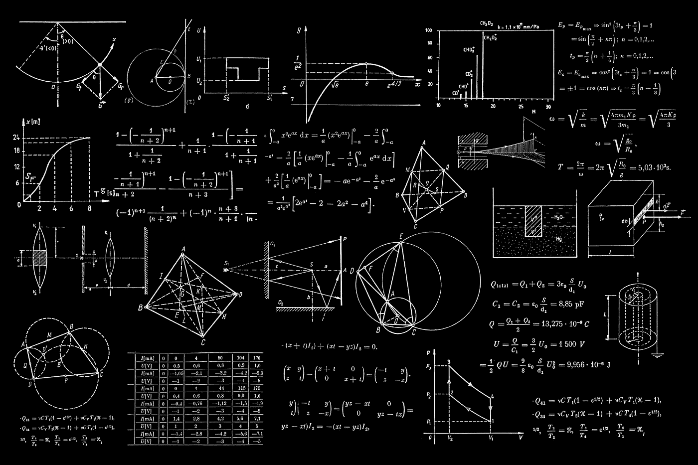
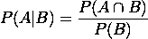
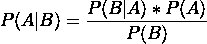
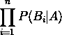
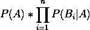

# 机器学习的数学方法

> 原文：<https://medium.com/mlearning-ai/mathematical-approaches-to-machine-learning-2da4e97e881f?source=collection_archive---------10----------------------->

Photo by [Dan-Cristian Pădureț](https://unsplash.com/@dancristianpaduret) on [Unsplash](https://unsplash.com/photos/h3kuhYUCE9A).

# 介绍

机器学习是一组应用于许多数据集的通用算法，通过利用数据、模型和学习实现的反复试验来获得意义或预测。机器学习背后的核心思想是自动化；因此，它旨在开发通用方法，在没有任何领域知识的情况下从数据中发现有意义的模式。为了实现这一点，需要使用数学概念，例如在神经网络中，使用微积分性质进行梯度下降以收敛，在朴素贝叶斯中，使用概率论进行分类，以及在数据压缩或降维中，通过基于线性代数的主成分分析。

# 基础和背景

神经网络:是受监督的机器学习算法，模拟生物大脑中神经元的运作。

梯度下降:一种依赖于衍生概念的算法，用于找到从成本函数中得出最小值的最佳参数/权重集，该成本函数必须是可微分的。

成本函数:评估算法对数据建模效果的方法；它输出的值越少，模型就越好。

θ:权重参数。η:学习率，即更新权重时我们采用的步长。

朴素贝叶斯:是一组有监督的机器学习算法，假设特征之间是条件独立的。

条件概率:是一个或多个事件在另一个事件发生时的概率:

Source [Codecogs](https://latex.codecogs.com/)

联合概率:多个事件同时发生的概率𝑃(𝐴 ∩ 𝐵).

边际概率:一个事件发生的概率，不考虑其他随机变量的结果，例如𝑃(𝐵).

# 讨论

## 结石

微积分是机器学习中使用的基本数学方法之一(Deisenroth 等人，2020 年，第 141 页)。由于其研究变化率和面积的方法，它被用于机器学习，以迭代地改进算法的行为，以便像在优化问题中一样学习和适应数据。例如，在神经网络的反向传播中，梯度下降通过找到最佳参数/权重来最小化成本函数。首先，该算法为权重分配随机值，然后使用多变量微分法；它采用函数梯度，导致最陡上升的方向，使输出最大化；因此，它采取相反的方向(负)。然后，它同时根据下降更新参数并重新计算梯度。它继续这样做，直到达到最小值。

梯度下降方程:

Source [Codecogs](https://latex.codecogs.com/)

## 线性代数

如果输入特征过多，机器学习算法的性能会下降，因此需要压缩数据。最广泛使用的降维技术是主成分分析，它使用线性代数基本原理来执行数据到低维空间的线性映射。PCA 首先通过减去平均值将数据集中在原点；然后，计算协方差矩阵，并计算矩阵的特征值和相应的特征向量，由于协方差矩阵是对称的，所以特征向量是正交的。特征向量是数据的方向，特征值是幅度；因此，具有最大相应特征值的特征向量是表示大部分数据方差的第一主分量，它表示数据中的重要模式，第二特征向量表示不太重要的模式，依此类推。因此，如果我们有一个 n 维数据集需要缩减到 k 维，我们将数据投影到代表大部分数据的前 k 个 PC 上。

## 概率论

不确定性是机器学习的一个基本概念；它既来自测量中的噪声，也来自有限大小的数据集。概率论为不确定性的量化和操纵提供了一个一致的框架(Bishop，2006，第 12 页)。此外，它是一些机器学习算法的基础，因为学习算法的设计通常依赖于数据的概率假设。例如，朴素贝叶斯是一种基于贝叶斯定理的概率模型，它在已知另一个已经发生的事件(B)的先验知识的情况下确定一个事件(A)的概率，并假设特征之间相互独立。从条件概率导出的贝叶斯定理，计算条件概率时不需要联合概率。这意味着它通过使用条件概率𝑃(𝐴 ∩ 𝐵) = 𝑃(𝐴|𝐵) * 𝑃(𝐵来使用联合概率的替代计算，并且因为联合概率是对称的；因此，联合概率可以是𝑃(𝐴 ∩ 𝐵) = 𝑃(𝐵|𝐴) *P(A)。因此，根据贝叶斯定理，条件概率变成:

Source [Codecogs](https://latex.codecogs.com/)

然而，由于朴素贝叶斯假设特征之间的独立性𝑃(𝐵|𝐴)*𝑃(𝐴𝑃(𝐵，𝑃(𝐵，即边际概率，变成常数，所以它被忽略，并且使用独立性假设𝑃(𝐵|𝐴变成所有其他给定特征的乘积:

Source [Codecogs](https://latex.codecogs.com/)

然后，它们被乘以，这被称为先验或证据，结果是:

Source [Codecogs](https://latex.codecogs.com/)

# 结论

机器学习模型都是建立在数学基础之上的；机器学习的四个核心支柱是微积分、线性代数、概率和统计。由于微积分导数工具，梯度下降能够迭代地改进模型的行为。线性代数特征分解和矩阵分解技术使得一些 ML 模型，如 PCA，能够用于维数减少。最后，利用概率论中的贝叶斯定理，朴素贝叶斯可以预测未来事件的可能性。

# 参考

Deisenroth，M. P .，Faisal，A. A .，& Ong，C. S. (2020)。*机器学习的数学*。剑桥大学出版社。

主教，C. M. (2006 年)。*模式识别和机器学习*。斯普林格。

林赛·史密斯。(2002).*主成分分析教程*。奥塔哥大学。

路易斯·塞拉诺。(2019).*主成分分析*。塞拉诺学院。

 [## Mlearning.ai 提交建议

### 如何成为 Mlearning.ai 上的作家

medium.com](/mlearning-ai/mlearning-ai-submission-suggestions-b51e2b130bfb)