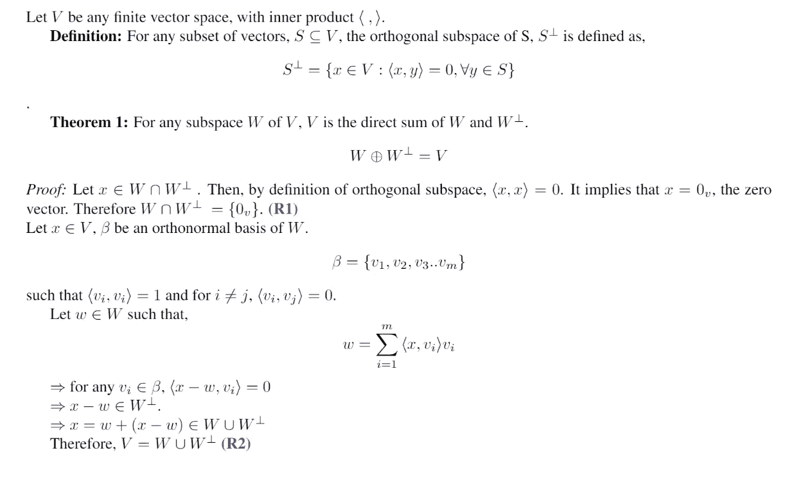
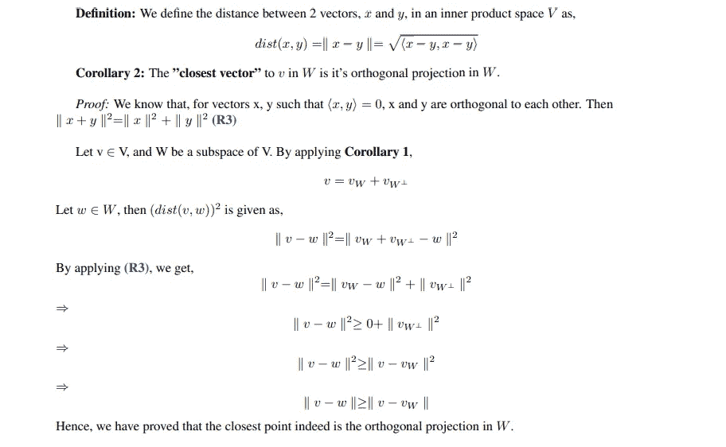
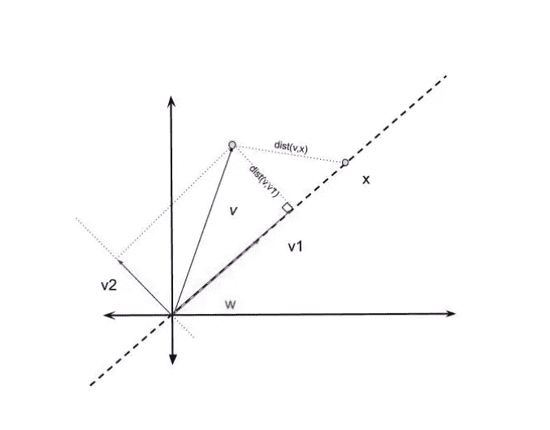
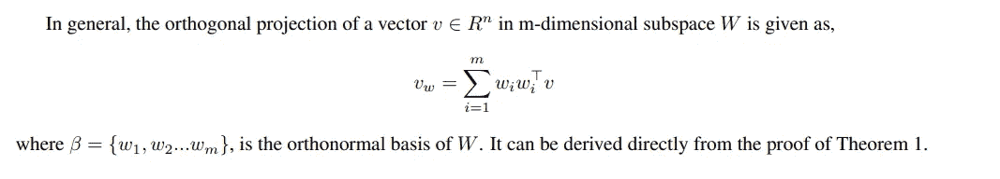
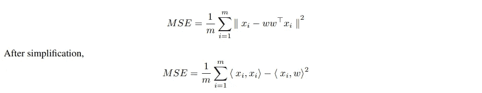
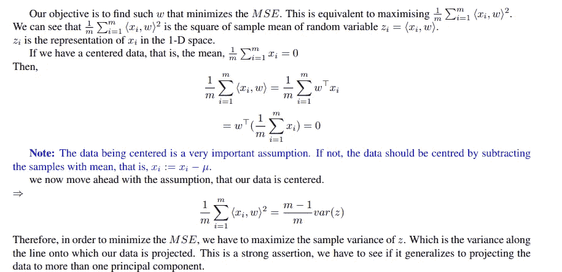
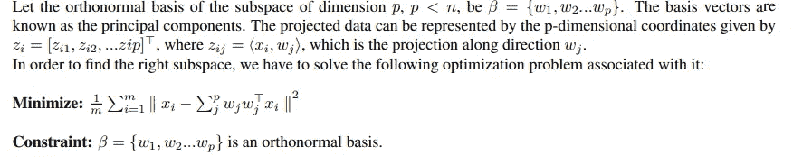
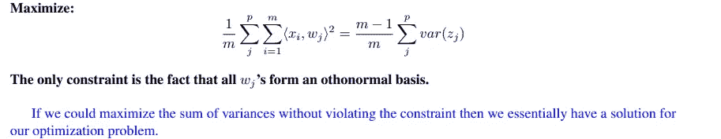
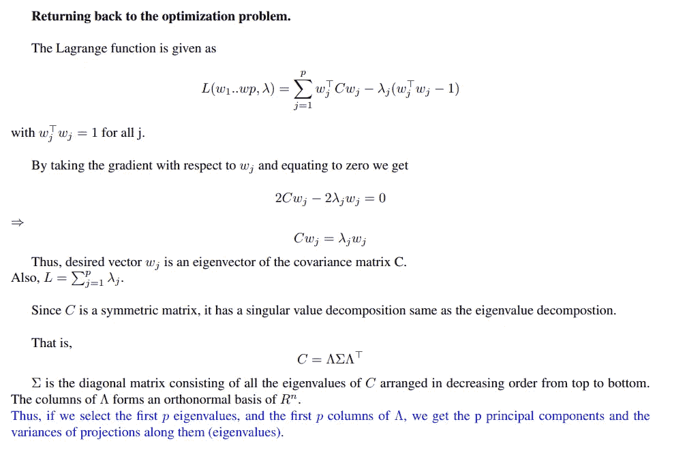

# 主成分分析的数学基础及其 python 实现。

> 原文：<https://medium.com/mlearning-ai/mathematical-foundations-of-pca-and-its-python-implementation-4c9c0282063a?source=collection_archive---------5----------------------->

# **简介**

降维是将数据从高维空间转换到低维空间，使得信息损失最小。降维可用于降噪、数据可视化、聚类分析，或作为中间步骤来促进其他分析。主成分分析(PCA)就是这样一种技术。在 PCA 中，我们通过沿着 q 个正交向量(主分量)投影数据，将 n 维数据简化为较低的 q 维表示，使得原始数据点和投影点之间的平均平方欧几里得距离(L2 范数)最小。等效地，我们将发现这与试图找到 q 维的子空间是相同的，使得沿着由主分量组成的正交基的向量的投影数据的方差被最大化。在推导过程中，我们会遇到数据居中的假设。这是一个至关重要的假设，如果不是，那么数据应该首先通过减去平均值来居中。最后我们会通过证明主分量是样本协方差矩阵的特征向量，特征值是主分量对应方向上的方差来得出结论。

注意:所有的片段都来自我创建的 pdf，这里是[pdf 的链接。](https://github.com/HardikPrabhu/Mathematical-Foundations-OF-Principal-Component-Analysis/blob/main/Mathematics_behind_Principal_Component_Analysis.pdf)

# 线性代数初步

结合**(R1)****(R2)**的结果，我们证明了这个定理。注意:我们假设有限向量空间 w 有一个标准正交基，这是正确的。我们可以应用 Gram Schmidt 过程从任意基导出一个标准正交基。

**推论 1:** 对于向量 v ∈ V，和 V 的子空间 W，向量 V 有 2 个分量，一个在子空间 W，另一个与 W 正交，W 中的分量也称为 V 在 W 中的正交投影。

**欧几里得空间中的解释**

在具有标准内积并考虑欧氏距离(L2 范数)的 n 维实空间中，上述推论成立。让我们看一个简单的例子。

Projecting 2-D point on a 1-D line

# 导出主成分

在我们考虑从较高的 n 维空间到较低的 q 维空间的归约之前，我们看一下一维投影。也就是说，我们有 n 维的特征向量，我们想把它们投影到一条通过原点的线上。我们试图找到代表所有样本数据点的最佳拟合线。设直线在单位矢量 w 的方向上。

把我们的数据看作 n 维特征空间的 m 个样本。让 xi 表示第 I 个样本。那么投影的均方误差由下式给出，

一般来说，我们试图将 n 维数据投影到 q 维的较低维子空间中，使得 MSE 最小。我们之前已经表明，对于任何数据点，数据点在较低维度的子空间中的最接近的表示是它在其上的正交投影。问题是哪个是正确的子空间？

下面是用数学术语表述的问题。

这种简化有点乏味，需要一点代数运算。我会把细节留在 pdf 里。

经过简化，我们得到如下结果。

# 最大化方差和

# Python 实现

我已经创建了一个包含 PCA 实现的笔记本。它仅使用 python 的 NumPy 库来完成。这里的链接是。感谢您阅读这篇文章。

 [## Mlearning.ai 提交建议

### 如何成为 Mlearning.ai 上的作家

medium.com](/mlearning-ai/mlearning-ai-submission-suggestions-b51e2b130bfb)