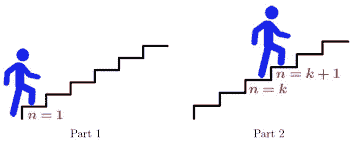

# 数据科学的数学归纳法

> 原文：<https://medium.com/mlearning-ai/mathematical-induction-for-data-science-76907d6f9398?source=collection_archive---------7----------------------->

数学方程的证明方法

Image Credit: ([https://leverageedu.com/blog/class-11-maths-syllabus/](https://leverageedu.com/blog/class-11-maths-syllabus/))

# 概述

许多数学陈述断言一个性质对所有正整数都成立。这种陈述的例子有:对于每个正整数 n: n！≤ n^n，n n 可被 3 整除；有 n 个元素的集合有 2^n 子集；并且前 n 个正整数之和为 n(n+1)/2。这个博客的一个主要目标是深入了解数学归纳法有两个部分。

Image Credit: ([https://www.cuemath.com/algebra/mathamtical-induction/](https://www.cuemath.com/algebra/mathamtical-induction/))

首先，它们表明该语句适用于正整数 1。第二，他们表明，如果该语句适用于一个正整数，那么它也必须适用于随后的更大的整数。

数学归纳法的前提是推理规则，它告诉我们，如果 P(1)和 d ∀k(P (k) → P (k + 1))对于正整数的定义域为真，那么∀nP (n)为真。

数学归纳法经常被用来证明一类奇异的结果。通过数学归纳法理解阅读和构造证明也是学习离散数学的一个重要目标。

我们可以定义集合和函数，也就是通过列出它们的元素或给出一些表征这些元素的性质来描述集合。我们可以给出函数值的公式。

有替代的至关重要的感谢定义这样的对象，支持数学归纳法。为了定义函数，需要指定一些初始项，并给出从已知值中定位后续值的规则。

如上所述，集合通常是通过列出它们的一些元素来定义的，并给出从集合中已知的元素构造元素的规则。这种定义称为递归定义，在离散数学和计算中广泛使用。一旦我们递归地定义了一个组，我们将使用一种称为结构归纳法的符号方法来证明关于这个集合的结果。

当我们规定了解决阻力的程序时，这个程序应该能正确地解决问题。仅仅通过测试来确定一组输入值获得了正确的结果，并不能说明这个过程总是正确的。

程序的正确性通常只有通过证明它总是产生正确的结果才能得到保证。随后的几篇博客将包含对程序验证技术的介绍。有正式技术来验证程序是否正确。

例如，假设我们有一个无限长的梯子，我们想知道我们是否能到达这个梯子上的每一步:

1.  我们能到达梯子的第一级。
2.  如果我们能到达梯子的某一特定梯级，那么我们就能到达下一个梯级。

我们能断定我们将到达每一个阶梯吗？到 2005 年，我们都知道我们将到达人生阶梯的第一级.此外，因为我们将到达初级梯级，到[2]我们也将到达第二梯级；它是主梯级之后的下一个梯级。

Image Credit: ([https://www.theoryofcomputation.co/proof-by-induction/](https://www.theoryofcomputation.co/proof-by-induction/))

再次应用[2]，因为我们会到达第二个梯级，我们也会到达第三个梯级。以这种方式继续，我们将展示我们将到达第四个梯级、第五个梯级，等等。举个例子，在[2]的 100 个用户之后，我们都知道我们将达到第 101 个梯级。

我们的结论是，我们已经准备好在这个无限阶梯的每一级取得成功。我们将到达阶梯的第 n 级。

数学归纳法是一种特别重要的证明技术，它经常被用来证明这类断言。数学归纳法通常用来证明算法的复杂性，某些计算机程序的正确性，关于图和树的定理，以及一系列恒等式和不等式。

这个博客将描述数学归纳法是如何被经常使用的，以及为什么它是有效的证明技术。注意到数学归纳法通常只用于证明用另一种方法得到的结果，这是非常重要的信息。它不是一个定位公式或技术的工具。

# 数学归纳步骤

数学归纳法通常用来证明断言 P(n)对所有正整数 n 都成立的陈述，其中 P(n)是命题函数。

数学归纳法的证明有两个部分，

1.  基本步骤
2.  归纳步

我们证明 P(1)为真的基本步骤，以及我们证明对于所有正整数 k，如果 P(k)为真，则 P(k+1)为真的归纳步骤。

> **基础步骤:**我们验证 P(1)为真。
> 
> **归纳步骤:**我们证明条件语句 P(k) → P(k+1)对所有正整数 k 都成立

为了使用数学归纳法的原理完成符号的归纳步骤，我们假设 P(k)对于任意正整数 k 为真，并证明在此假设下。P(k+1)甚至必须为真。P(k)为真的观点被称为归纳假说。

一旦我们在数学归纳法的证明过程中完成了这两个步骤，P(n)对所有正整数都成立，∀nP (n)对正整数集合的量化也成立。在归纳步骤，我们已经写了∀k(P (k) → P (k + 1))为真，这里，定义域是正整数的集合。

这个证明可以表示为推理规则，

(p(1)∧∀k(p(k)→p(k+1))→∀NP(n)

当定义域是正整数的集合。因为数学归纳法是一项如此重要的技术，所以用这个系统来详细阐述一个符号的步骤是值得的。我们只是假设 P(k)为真来开始解释。为了证明 P(n)对所有正整数 n 都成立，我们要做的主要事情是指出 P(n)为真。

这相当于表明当 P(n)中的 n 被 1 代替时得到的实际陈述是正确的。那么我们必须证明 P (k) → P (k + 1)对每个正整数 k 都成立。

为了证明这个条件语句对每个正整数 k 都是真的，我们想指出当 P(k)为真时，P(k+1)不能为假。这将通过假设 P(k)为真来实现，并表明在这种假设下 P(k+1)必定也为真。

# 结论

Image Credit: ([https://blog.myrank.co.in/principle-of-mathematical-induction/](https://blog.myrank.co.in/principle-of-mathematical-induction/))

我们用数学归纳法来证明一个定理，我们首先从 P(1)为真开始。那么我们都知道 P(2)是真的，因为 P(1)隐含着 P(2)。再者，我们都知道 P(3)是真的，因为 P(2)隐含着 P(3)。通过延续这些线，我们设想 P(n)对于每个正整数 n 都是真实的。

**内容正文来源出处:**

离散数学及其应用—第七版