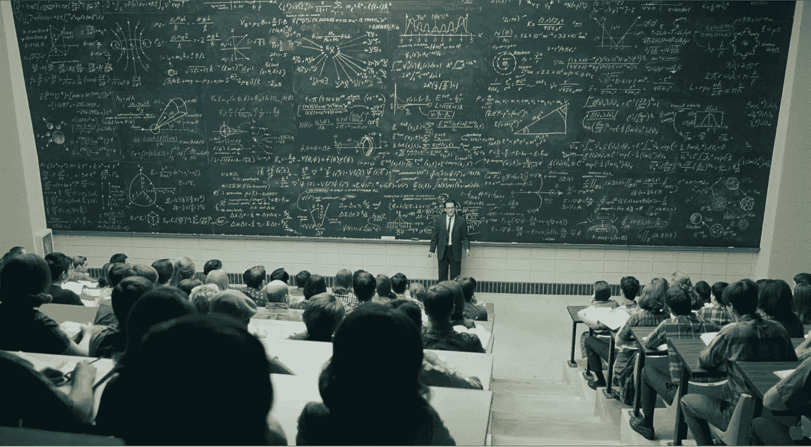
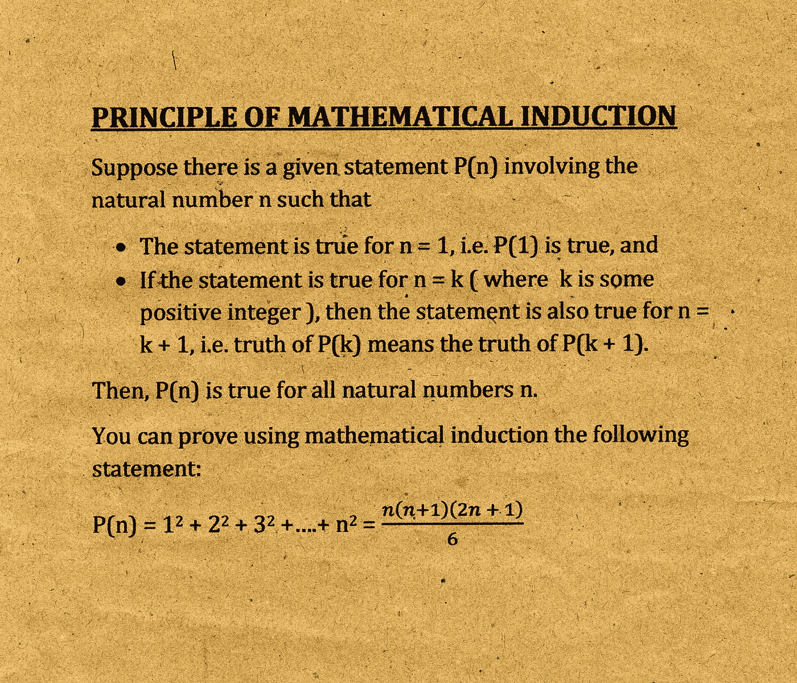
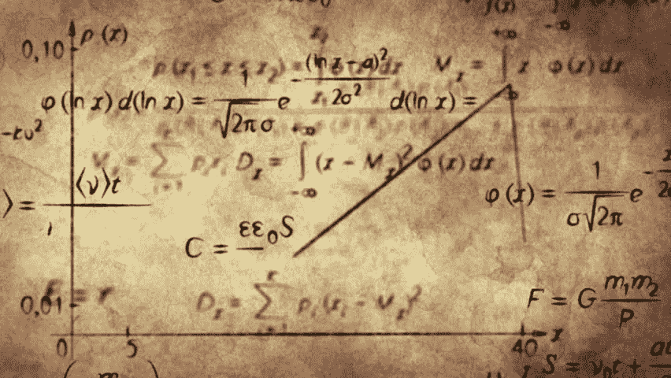
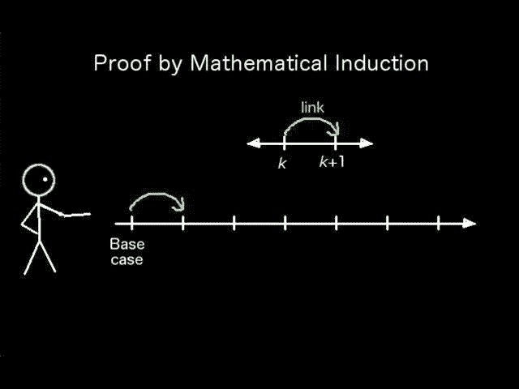

# 数学归纳法框架&历史及其工作原理

> 原文：<https://medium.com/mlearning-ai/mathematical-induction-framework-history-and-how-it-works-2afab3602b84?source=collection_archive---------1----------------------->

Image Credit: ([http://web.pdx.edu/~arhodes/](http://web.pdx.edu/~arhodes/))

# 数学归纳法框架

1.  对于一个固定的整数 b，用“对于所有 n ≥ b，P(n)”的形式表示要证明的陈述。
2.  写出“基础步骤”几个字。然后证明 P(b)为真，注意使用 b **的右**值。这就完成了**初选的一部分**的证明。
3.  写出“归纳步”四个字。
4.  在形式中陈述并明确识别归纳假设**“假设 P(k)对任意固定整数 k ≥ b 为真”。**
5.  陈述在归纳假设为真的想法下**必须**证明什么。也就是写出 P(k+1)说的内容。
6.  利用**P(k)的概念**证明陈述 P(k+1)。**确保**你的证明对所有 k ≥ b 的整数 k 有效，注意证明对 k 的小值有效**，包括 k = b。**
7.  清楚地确定归纳步骤的结论，**像**一样说“这就完成了归纳步骤。”
8.  在完成**基本**步骤**以及**归纳步骤后，陈述结论，即通过数学归纳，P(n)对所有 n ≥ b 的整数都成立

Image Credit: ([https://encyclopediamathematics.blogspot.com/2017/07/principle-of-mathematical-induction.html](https://encyclopediamathematics.blogspot.com/2017/07/principle-of-mathematical-induction.html))

# 历史

Image Credit: ([https://www.shutterstock.com/video/clip-2464937-math-physics-formulas-on-old-paper-computer](https://www.shutterstock.com/video/clip-2464937-math-physics-formulas-on-old-paper-computer))

数学归纳法的第一次使用是在十六世纪数学家弗朗西斯科·莫罗里科(1494-1575)的工作中。莫罗里科广泛撰写了经典数学著作，并对几何和光学做出了许多贡献。

在这场自由算术的热潮中，Maurolico 展示了**整数的一系列**性质以及这些性质的证明**。**

为了证明这些性质，他设计了数学归纳法的策略。在这本书中，他第一次使用数学归纳法**是为了证明**和主** n 个奇数正整数之和等于 n。**

奥古苏斯·德·摩根在 1838 年使用数学归纳法的形式证明中第一次提出了**，**也是**引入了术语“数学归纳法”。Maurolico 的证明是非正式的，他从来没有使用“归纳”这个词。归纳法这个名字是英国数学家约翰·沃利斯使用的**。****

# 还记得数学归纳法是如何工作的吗

想象无限阶梯**，因此到达阶梯的**规则可以**帮助你**理解和想象数学归纳法是如何工作的。

重要的是**注意到**下面无限阶梯的陈述【1】和【2】分别是**精确的**基础步骤和归纳步骤。P(n)对所有正整数 n 都成立的证明，其中 P(n) **是**声明**我们将**到达梯子的第 n 个梯级。因此，**我们将**调用数学归纳法得出结论，**我们将**到达每个梯级。

# 数学归纳法为什么成立？

Image Credit: ([https://www.quora.com/What-is-the-significance-of-mathematical-induction](https://www.quora.com/What-is-the-significance-of-mathematical-induction))

为什么数学归纳法**是合法的**证明技术？为什么数学家用**吨**数学归纳法来证明结果。**基本原理**来自归纳的良好有序性。**作为一个例子**，正整数集合，其陈述**正整数集合**的每个**非空子集具有一个**最小元素。因此，假设**我们都知道**P(1)为真**其中**命题 P(k) - > P(k+1)对所有正整数 k 都为真。

为了证明 P(n)对于所有正整数 n 都必须为真，假设**至少有一个正整数**为真** P(n) **为假**。那么** P(n) **为假**的正整数集合 s **非空。因此，根据良序性质，S **具有一个**最小元素**，它可以用 m 来表示****我们都知道**m**不可能是** 1，因为 P(1)为真。因为 m 是大于 1 的正整数，所以 m-1 **可能是一个**正整数。**

此外，因为 m-1 **比 m 小**，**不在 S 中，所以 P(m-1)必须为真。因为条件语句 P(m-1) - > P(m) **另外**为真，所以必须是 P(m)为真的情况。这与 m 的选择**相矛盾。因此，对于每个正整数 n，P(n)必须为真**。**

# 数学归纳法的正反两面

在我们开始研究数学归纳法的用法之前，有一个关键点必须弄清楚。

数学归纳法积极的一面是，一旦**一个猜想被提出**，它**通常会被**证明。在**相反的**方面，关于**的消极的事情是**它**不可能惯于**发现新的定理。

数学家或科学家有时发现数学归纳法的证明不令人满意，因为他们没有提供关于定理为什么成立的信息。

许多定理**经常以**的方式**被证明，比如一个方程或公式**经常通过几何学、代数观点、概率学和机器学习优化观点**被解释，包括通过数学归纳法。那些**定理的**证明，除了**数学归纳法之外的**方法往往更受青睐**，因为**定理的洞察力**会带来**结果。**

# 结论

数学思维的一个关键点是**演绎**。与演绎相反，**概括**依赖于与不同**种类的**案例一起工作，并通过观察事件发展推测，直到**我们已经**观察到每个**和每个**案例。因此，用简单明了的语言**和直接明了的语言**我们将**说“归纳”这个词意味着从特定的案例或事实中进行概括。**

数学归纳法的原理就是这样一种工具**，它可能**惯于**去**证明**一种很好的**数学陈述。每个这样的陈述被假设为 P(n) **与**正整数 n 相关，**即**检验 n=1 的情况的正确性。然后假设**P(k)的现实****对于几个**正整数 k，**P(k+1)的现实**成立。

本文中使用的内容参考和文本参考如下:

[https://ncert.nic.in/textbook/pdf/kemh104.pdf](https://ncert.nic.in/textbook/pdf/kemh104.pdf)

离散数学及其应用(第七版)