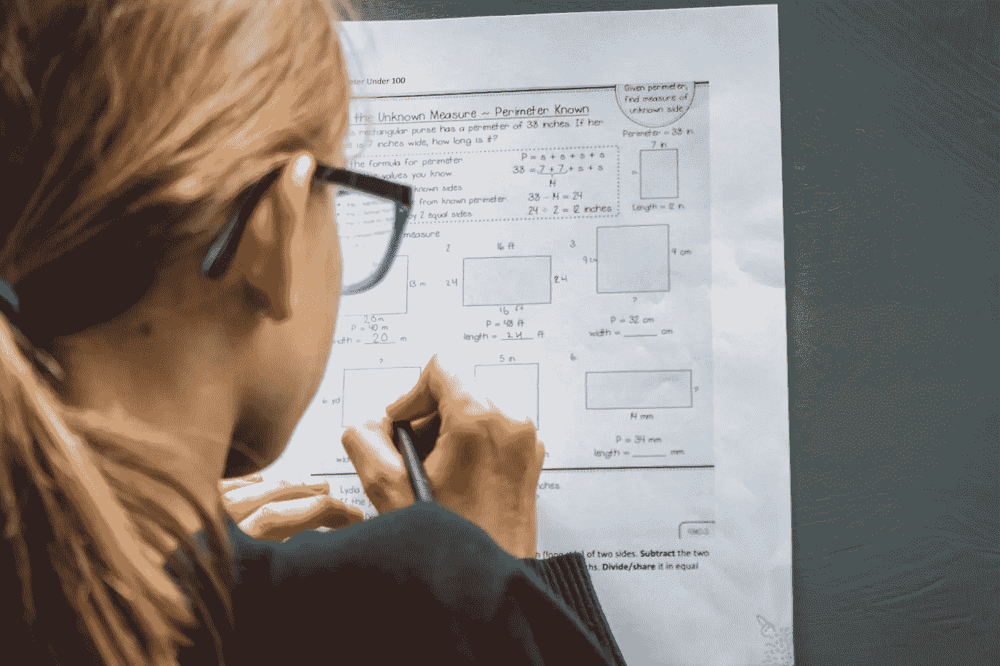

# 数据科学的数学(伦敦帝国理工学院的免费课程)

> 原文：<https://medium.com/mlearning-ai/mathematics-for-data-science-free-course-by-imperial-college-of-london-e9e31da13b31?source=collection_archive---------0----------------------->

数学无处不在，数据科学也不例外。要理解你的统计模型，你需要理解它所基于的语言，那就是数学。

Photo by [Greg Rosenke](https://unsplash.com/@greg_rosenke?utm_source=unsplash&utm_medium=referral&utm_content=creditCopyText) on [Unsplash](https://unsplash.com/s/photos/mathematics?utm_source=unsplash&utm_medium=referral&utm_content=creditCopyText)

数学，这个宇宙的语言，是一些人的克星，也是对另一些人的爱。不要担心，你不会有处理拓扑恶作剧。对于…