# 矩阵分解和算法

> 原文：<https://medium.com/mlearning-ai/matrix-decomposition-and-algorithms-675339d8f48a?source=collection_archive---------1----------------------->

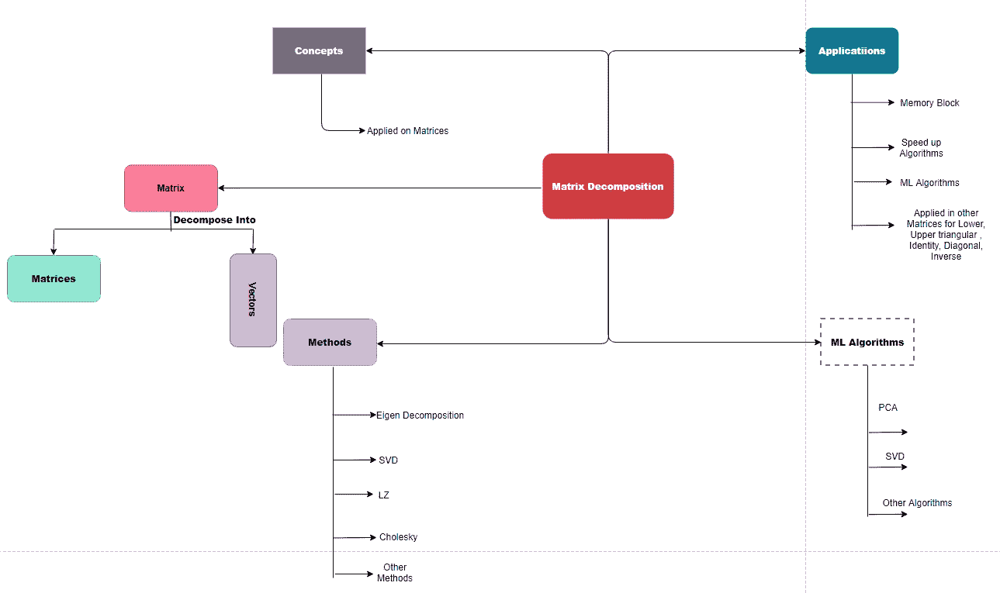

**Importance of Matrix Decomposition**

探索矩阵分解和算法

处理小部件比处理单个大部件容易得多，同样地，分解允许我们将矩阵分解成几个小块的矩阵，这叫做矩阵分解。分解允许我们以向量和矩阵的形式分解矩阵。

为了理解线性代数概念并应用于人工智能和量子计算，您可以阅读以下文章。

 [## 人工智能中的线性代数&量子计算

### 线性代数的用途介绍:线性代数是人工智能(人工智能)的主要计算工具…

medium.com](/swlh/linear-algebra-in-artificial-intelligence-quantum-computing-c61ea629367c)  [## 线性代数-如何用于人工智能？

### 了解线性代数在人工智能中的应用。

medium.com](/analytics-vidhya/linear-algebra-how-uses-in-artificial-intelligence-2e1e001c65)  [## 量子计算——必备的线性代数

### 量子计算所需的线性代数概念

medium.com](/analytics-vidhya/quantum-computing-required-linear-algebra-f11c6b2a766f) 

## 为什么我们需要研究分解？

> 从算法的角度来看，为了理解性能，分解是非常重要的。在计算中，这些都需要考虑时间和空间复杂度来评价性能。分解法用于计算行列式、上下三角矩阵、矩阵求逆、特征值和特征向量等。，处理各种类型的矩阵(对称、非对称、正方形、非正方形)。简单来说，分解帮助我们编写乐观算法，计算线性代数对象性质和各种矩阵。

大的数学对象通过分解成小的部分可以更容易理解。最好的例子整数可以分解成质因数。

线性代数中存在不同类型的分解

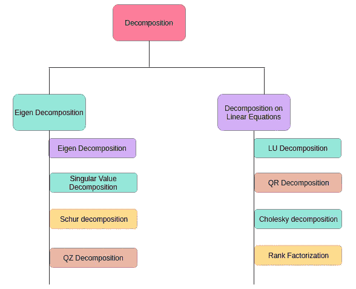

**Types of Decomposition**

请注意，线性代数中还有其他分解，本文没有涉及。

最广泛使用的分解方法之一是“特征分解”，将矩阵分解成一组特征向量和特征值。用因式分解法分解矩阵。结果矩阵是因素。特征向量是因子。

# **特征分解**

设‘M’是一个方阵，而‘v’是非零向量，因此乘以 A 仅改变 v 的比例:

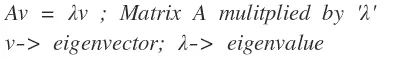

我们可以用特征向量和特征值形成矩阵‘A’。

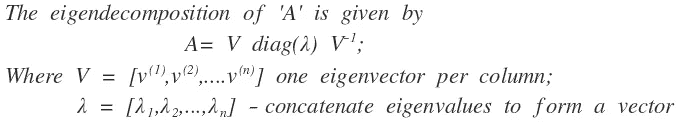

Form Matrix ‘A’ using eigenvectors and eigenvalues

在下面的方程解释了特征向量，特征值和分解的性质。

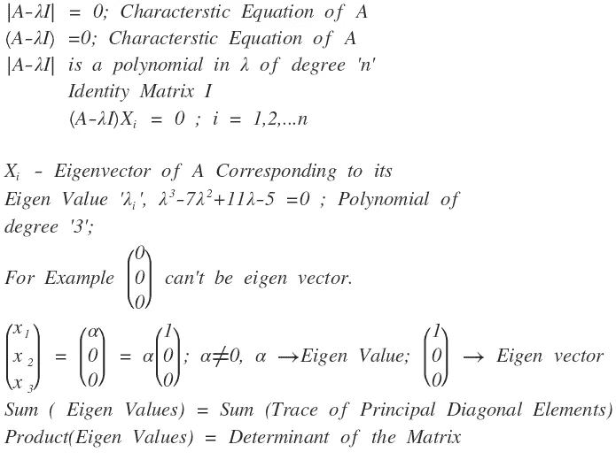

Eigen Decomposition

**特征值和特征向量的性质**:

1.  A 的迹等于其特征值之和的和。
2.  A 的行列式等于特征值的乘积。
3.  矩阵的秩等于 a 的非零特征值的个数。
4.  对角矩阵 D = diag(d1，d2，…，dn)的特征值正好是对角元素 d1，d2，…，dn

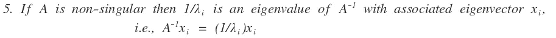

**基于特征分解的定/半定矩阵:**

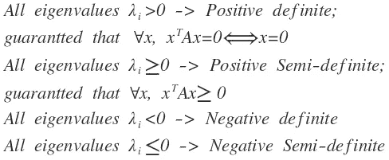

Definite, Semi-definite matrices

**特征值和特征向量示例**:

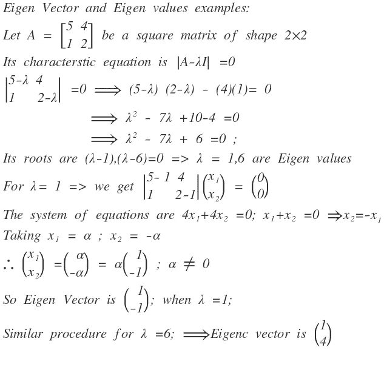

Eigen Values and Eigen Vectors Example

特征分解的优点&缺点:

一旦你对方阵进行特征分解，你将很容易得到其他的性质，比如迹、行列式、秩、对角线等。,

**缺点**:特征分解仅对方阵有效。

可以对正方形和非正方形矩阵进行分解。

方阵的特征向量，但是 SVD 是针对所有矩阵的。

**特征分解的应用:**

下面的算法使用了各种领域的特征值和特征向量。

1.  主成分分析
2.  页面等级
3.  薛定谔方程

**机器学习中的分解算法**:

许多算法中使用的分解(尤其是特征分解)。

基于分解方法的最流行和最广泛使用的算法是基于纯线性代数的 **PCA** 和 **SVD，**。

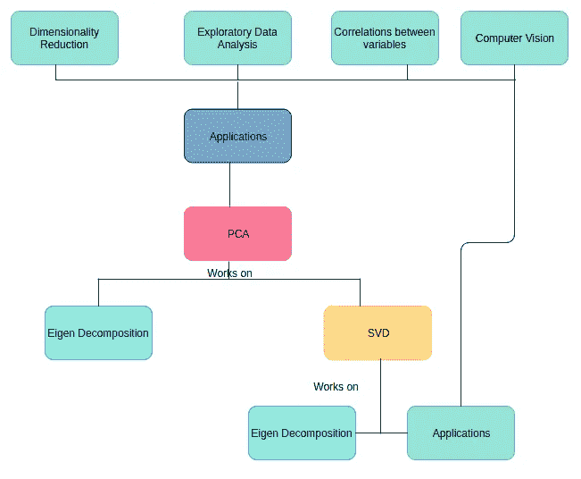

**SVD, PCA Algorithms and Applications**

> 主成分分析是探索性分析、降维和预测模型中的工具。它可以在许多算法中用作预处理步骤。

**PCA 问题陈述**给定一组点，我们如何知道它们是否可以被压缩？答案是研究点之间的相关性。做这件事的工具叫做 PCA。奇异值分解和主成分分析的最佳应用实例是计算机视觉中的图像压缩。

对于训练和测试数据集，使用特征分解的 PCA 算法工作如下:

**PCA Algorithm for Training Data**

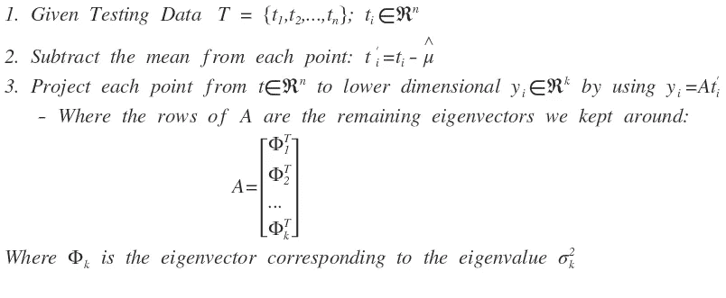

**PCA Algorithm for Testing Data**

**单值分解:**

有几种计算机算法可以“分解”一个矩阵，将其表示为一些其他矩阵的乘积。

其中最有用的是奇异值分解。**奇异值分解适用于非方阵。**

将任何矩阵 A 表示为三个矩阵的乘积:

SVD 算法如何分解原始矩阵:

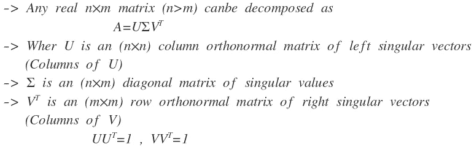

SVD Decomposition on Matrix (n*m) Dimensions

## 舒尔分解

Schur 分解是基于特征分解的，分解成原矩阵的 3 个矩阵。其定义如下:

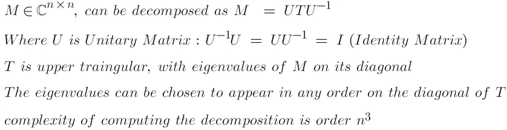

## QZ 分解

它也被称为广义舒尔分解。它适用于方阵，可以定义如下。

假设 A 和 B 是两个(N，N)非对称矩阵，可以是实数也可以是复数。QZ 分解因子为

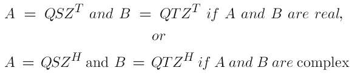

其中 Q 和 Z 是酉的，S 和 T 是上三角的。酉平均

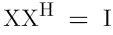

如果 X 是复数(或)

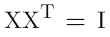

如果 X 是实数，I 是单位矩阵。

**QZ** 分解也称为广义舒尔分解，其中 **S** 和 **T** 是 **A** 和 **B** 矩阵的舒尔形式。

解决广义特征值问题的广义特征值

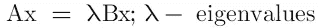

其中 x 是未知的非零向量，特征值定义为

在特殊情况下，B 是单位矩阵 I，然后简化为 Q，使得

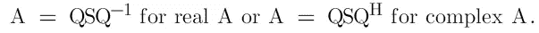

**或**

假设 B 是一个单位矩阵 I，那么问题就转化为传统的特征值问题。

# 线性方程组的分解

**QR 分解**

矩阵 A 的 QR 分解为正交矩阵 Q 和上三角矩阵 r 的乘积 A = QR。它通常用于求解线性最小二乘问题，并且是特定特征值算法(QR 算法)的基础。

它通常可以应用于各种矩阵，如方阵和矩形矩阵。实际计算 QR 分解有几种方法，如 Gram-Schmidt、Householder 变换或 Givens 旋转。

它将矩阵分解成一个正交矩阵和一个三角矩阵。实方阵 M 的 QR 分解是 M 的如下分解

M = QR 其中 Q 是正交矩阵

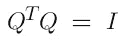

R 是上三角矩阵。如果矩阵 M 是非奇异的，那么这个因式分解或分解是唯一的。

存在几种计算 QR 分解的方法。Gram-Schmidt 就是本文中描述的一种方法。

在该方法中，向量被视为矩阵 m 的列。也就是说，

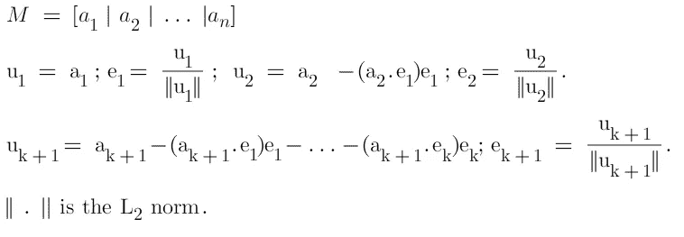

**QR 分解**

QR 分解定义为

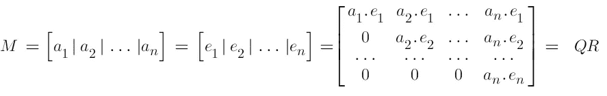

一旦我们找到，

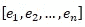

，很容易写出 QR 分解

考虑 3 行 3 列的矩阵 M

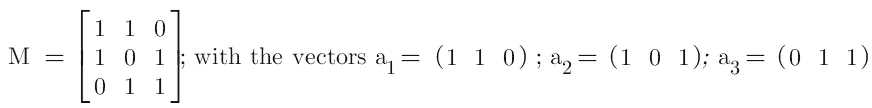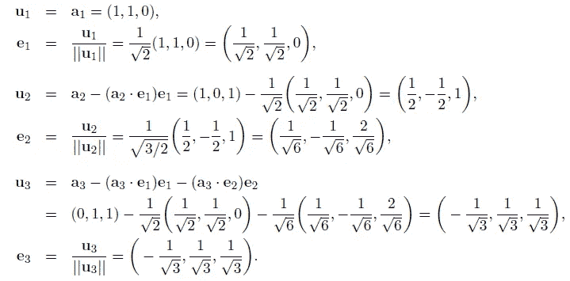

因此，

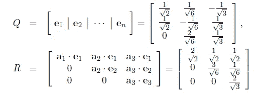

【卢分解】

LU 分解是求解一组联立线性方程组的另一种方法。LU 可以写成 M = LU 其中 L 是下三角矩阵，U 是上三角矩阵。

**LU 分解是如何工作的？**

AX=b 形式的线性方程组；而我们必须分解成鲁。

考虑矩阵 M，它具有 MX=b 的形式；By def M = LU 并在 MX=b 中代入；然后我们得到 LUX = b；

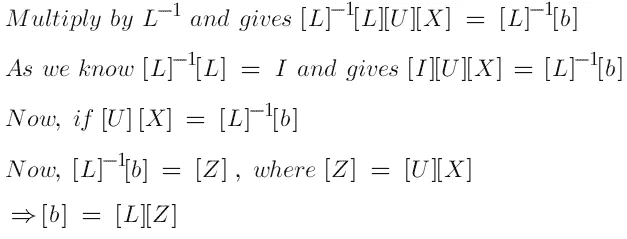

LU 分解可用作

给定 AX=b

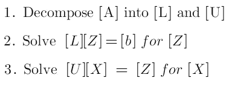

将矩阵 M 分解为上下三角矩阵，如下所示

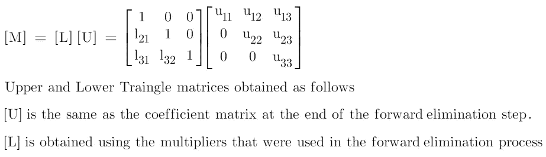

下面的例子分解了鲁。

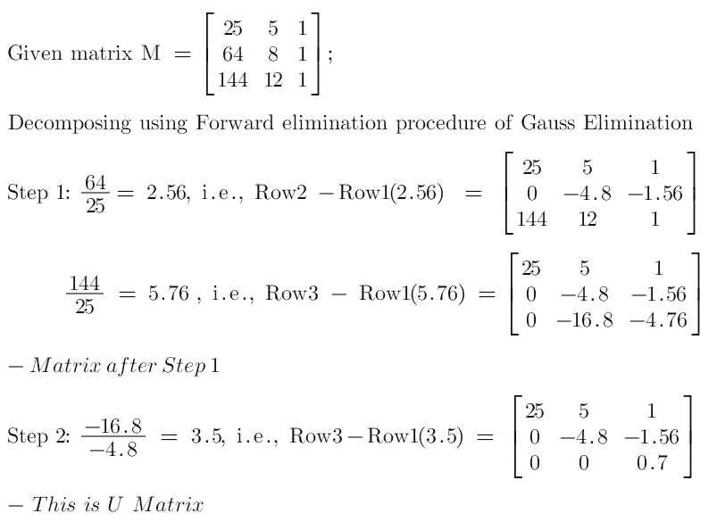

[L]矩阵可由下式求得

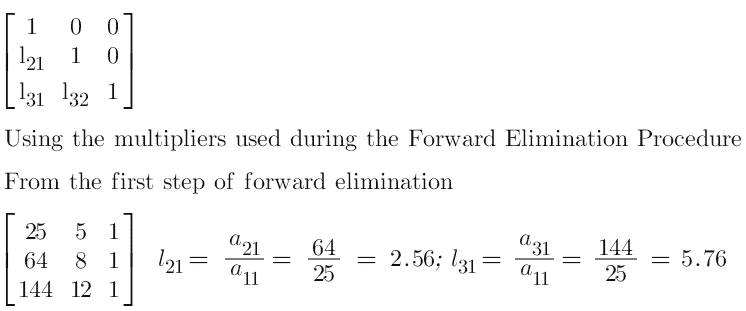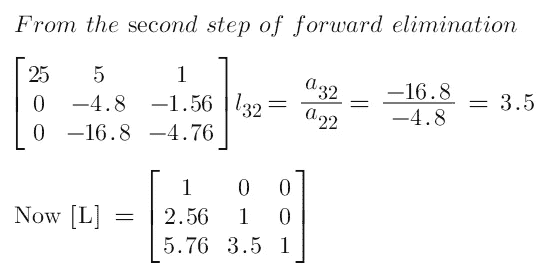

在获得 L 和 U 三角矩阵后，我们可以通过 L 和 U 矩阵的矩阵乘法形成实际矩阵。

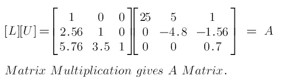

综上所述，LU 分解可以做为

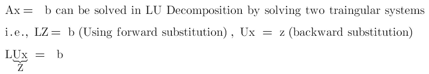

## LU 分解的应用

LU 分解的主要应用是

1.  解线性方程
2.  矩阵求逆
3.  计算行列式

**乔莱斯基分解**

正定矩阵的 Cholesky 分解。让我们修改矩阵中的正定。如果所有非零向量 x 的平方，或者等价地，如果 A 的所有特征值都是正的，则对称 n*n 矩阵 A 是正定的。即，

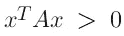

正定矩阵可以以非奇异矩阵 x 的形式表示。即，

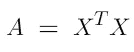

乔莱斯基分解通常用于求解表征超定线性系统 Ax=b 的最小二乘解的正规方程

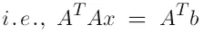

Cholesky 分解是因子分解的特殊形式，其中 X 是具有正对角元素的上三角；它被写成

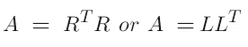

乔莱斯基分解的一个变体是下三角的因式分解，D 是对角线。这种分解是存在的，并且对于正定矩阵是唯一的。如果允许 D 有非正的对角元素，则某些不定矩阵存在因式分解。

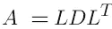

其中 L 是单位下三角形(即具有单位对角线)，D 是对角线。如果 D 允许有非正的对角元素，则某些不定矩阵存在分解。

注意，当 A 是正定的时，Cholesky 因子由下式给出

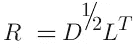

## Cholesky 分解计算

分解可以通过利用对称性和明确性的高斯消去形式来计算。等式中的(I，j)元素相等，即，

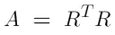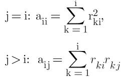

根据下面的算法，可以求解这些方程，每次得到 R 列:

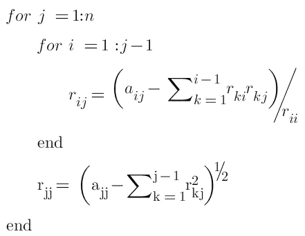

上述算法需要 flops 和 n 个平方根，其中 flops 是四种基本标量算术运算+、-、*和/中的任何一种。

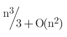

## 应用程序

在编程语言中处理块大小。例如:在 LAPACK 3 等现代库中，因式分解是以分区的形式实现的，这引入了另一个级别的循环，以便从现代计算机的内存层次结构中提取最佳性能。为了说明，我们描述一个分区 Cholesky 分解算法。对于给定的块大小 r，我们可以写为

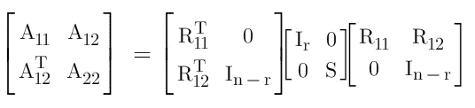

**秩因子分解(RF)**

让我们定义几个概念来学习秩因子分解。

设 M 是维数为(M，n)的矩阵。则 C(M)的列间距为

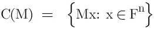

并且 M 的行间距是

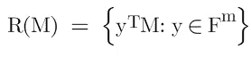

**符号行秩为 M 的 dim (R(M))和列秩为 M 的 dim(C(M))。**

对于任意矩阵 M，M 的秩等于 M 的列秩。

## 军阶

矩阵 M 的秩是 M 的行秩和 M 的列秩的公共值，并且表示为

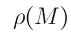

## 全行排名

如果矩阵 M 的行是线性独立的，则称矩阵 M 的维数为(M，n)的矩阵 M 具有**全行秩**。即，它的秩是 M。类似地，如果 M 的列是线性独立的，则 M 被称为**全列秩**。

让我们定义矩阵 **M** 的左逆和右逆。矩阵 **M** 的左矩阵是任意矩阵 **B** 使得 **BM = I** 。矩阵 **M** 的右逆是任意矩阵 C，使得 **MC = I** 。

一个矩阵 **B** 被称为 M 的**逆，如果它同时是 M 的**左**和**右**逆**

## 秩的性质

设 M 是 F 上维数为(M，n)的矩阵，那么 M 有右逆。XM = 0 => X =0。m 是全行秩。以类似的方式，M 有左逆。MX = 0 => X =0。m 是满列秩。

## 定义秩因子分解

设 M 是秩≥1 的维数为(M，n)的矩阵。则称(P，Q)是 M 的秩因子分解，如果 P 是 dim(m，r)，Q 是 dim(r，n)，M = PQ。

**秩因子分解的性质**

1.  每个非空矩阵都有一个秩因子分解。
2.  空矩阵不能有秩因子分解，因为不能有 0 行的矩阵。
3.  矩阵的秩因子分解不是唯一的。
4.  如果(B，C)是 M 的秩因子分解，则 B，C 的传输即，

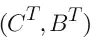

也是 m 转置的秩因子分解。

## 当因式分解是秩因式分解时

设 M = PQ，其中 P 是 a (m，k)，Q 是(k，n)维。那么 M 的秩最多是 k。

**以下等同:**

1.  m 的秩是 k，
2.  (P，Q)是 M 的秩因子分解
3.  p 是全列秩，而 Q 是全行秩
4.  P 的列构成了 C(M)的基
5.  Q 行形成 R(M)的基。

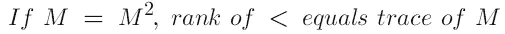

## **结论**

线性代数是算法、计算(经典和量子计算机)和计算时存储空间中最本质的学科。分解在算法中起着至关重要的作用，可以很容易地计算各种类型的矩阵，并且可以处理矩阵中的特定元素。

感谢阅读我的文章。如果有任何需要修改的地方，请告诉我。