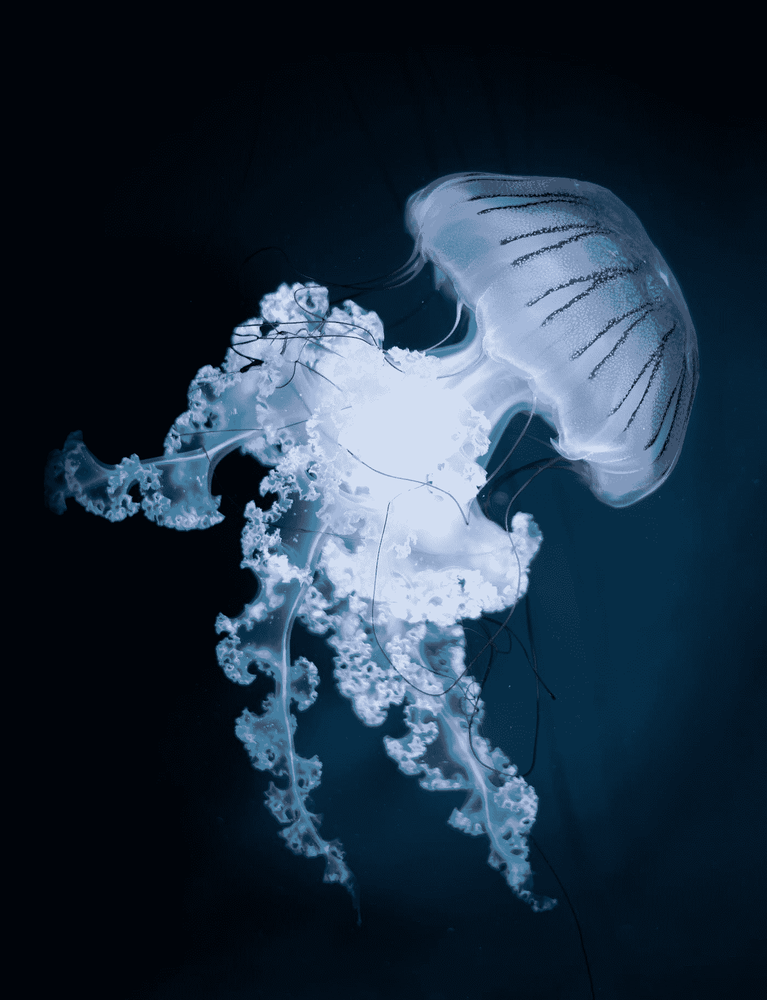
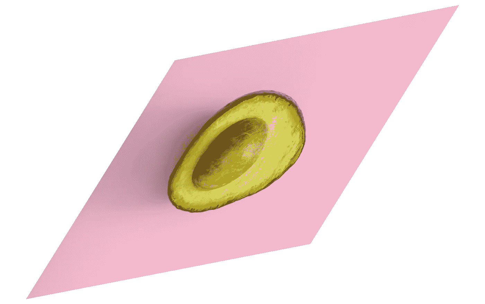
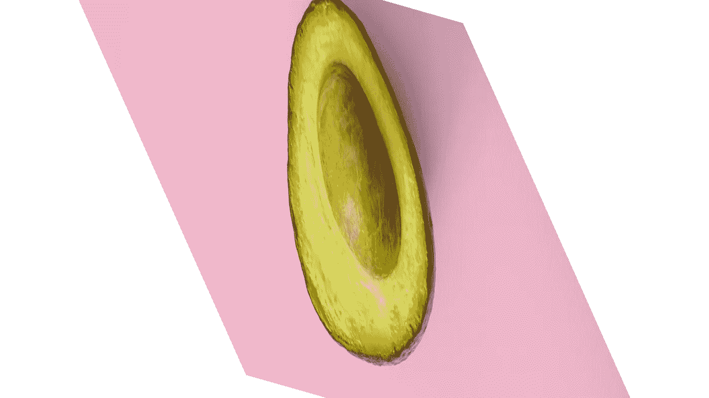
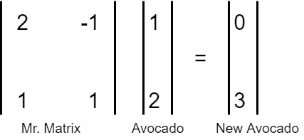
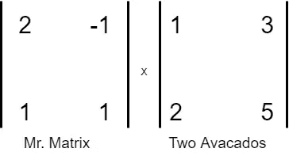

# 矩阵乘法是一个不同的世界。

> 原文：<https://medium.com/mlearning-ai/matrix-multiplication-is-a-different-world-5bfaadbbf7a6?source=collection_archive---------8----------------------->

想知道当你把一个向量乘以一个矩阵会发生什么吗？矩阵代表什么？乘法运算后我们得到了什么？让我们从数据科学的角度来看待这些问题。

Photo by [Jon Butterworth](https://unsplash.com/@jonjons?utm_source=medium&utm_medium=referral) on [Unsplash](https://unsplash.com?utm_source=medium&utm_medium=referral)

## 黑客帝国:一个转变的世界

在数据科学中，我们会遇到很多矩阵乘法，你知道矩阵只是另一个世界，在那里事情可能会以不同的方式工作吗？我的意思是，在我们的自然世界中，坐标是如此简单，任何物体都可以用 X、Y 和 Z 轴来定位，对吗？

**看看我们自然世界的这张图:**

Thought Catalog on Unsplash

这是一个美丽又健康的鳄梨。
但是，在所有与我们不共享相同坐标逻辑的世界中，鳄梨看起来并不相同。

**同一个鳄梨在一个世界里用不同的形状和大小:**

这是同一个鳄梨，有一个*转化的*结构，转化这个鳄梨的人被称为*矩阵先生*。

嗯，*Matrix 先生*是接受鳄梨并生产出鳄梨的新版本的人，这个版本取决于 Matrix 先生生活的世界。

**这是 Matrix 先生制作新版鳄梨的另一个世界。**

哇，你看到矩阵先生这次对我们的鳄梨做了什么了吗？显然，我们应该仔细选择矩阵先生的价值观。

## 有意义:

鳄梨是 Matrix 先生接受的向量，用于乘法，并返回一个可能与原始向量完全不同的新向量。

向量[1，2]是我们的原始向量，它进入矩阵先生的世界，发生乘法，然后矩阵先生吐出一个新的变换向量[0，3]。把这个事件想象成由矩阵引起的原始向量从[1，2]到新位置[0，3]的移动。

现在你已经了解了 Matrix 先生的工作，下面是一些需要注意的事情:

1.  一个矩阵可以*旋转*、*剪切*或*缩放*一个向量。一个直观的术语就是“粉碎”这个向量，哈哈。😃
2.  ***仅被矩阵缩放*** 的向量称为 ***本征向量*** ，被缩放的值称为 ***本征值*** 。
3.  你也可以把一组向量扔向*矩阵先生*你会得到一组变换后的向量。这组向量以矩阵形式排列，我们称之为*两个矩阵的乘法*。

只要确保输入向量(avocado)和矩阵先生的维数相同，这样向量就能在矩阵先生的世界中被接受。

老实说，围绕这些概念的视觉效果可以极大地帮助我们理解矩阵的力量以及机器学习和数学中的其他主题。
本文的目的是让您在数据科学之旅中走得更远。请不要被线性代数吓倒，我们都在一起。🙋

# 结论:

1.  对矩阵乘法有一个直观的理解可以增强你的信心，让机器学习变得有趣。
2.  下一次，当你看到一个矩阵的时候不要跑，因为现在你知道它只是一个方法，把一个向量转换成任何你想要的。
3.  嗯，你能留下掌声吗？😛

# 与我联系:

***邮箱***:saurav@guptasaurav.com
***领英****:*[*https://www.linkedin.com/in/sauravgupta20*](https://www.linkedin.com/in/sauravgupta20/)

 [## Mlearning.ai 提交建议

### 如何成为 Mlearning.ai 上的作家

medium.com](/mlearning-ai/mlearning-ai-submission-suggestions-b51e2b130bfb)