# 将 Orange 最大化用于数据科学教育—第 1 部分

> 原文：<https://medium.com/mlearning-ai/maximizing-orange-for-data-science-education-part-1-1be42362634a?source=collection_archive---------2----------------------->

**什么是橙色？**

[Orange data mining](https://orangedatamining.com/)platform 是一个免费的教育数据科学平台，由斯洛文尼亚卢布尔雅那大学的计算生物学家创建。后台的计算引擎是 Python，虽然用户看不到也不需要编程来执行函数。它快速、直观、全面。它基于客户端，可以在 Windows 操作系统、MacOS 和 Linux 上运行。像 KNIME 和 RapidMiner 一样，Orange 是一个可视化编程的例子，在这里你可以连接小部件，从而完成一个功能。下图显示了工作流区域中左侧的可展开菜单和右侧的已连接小部件。

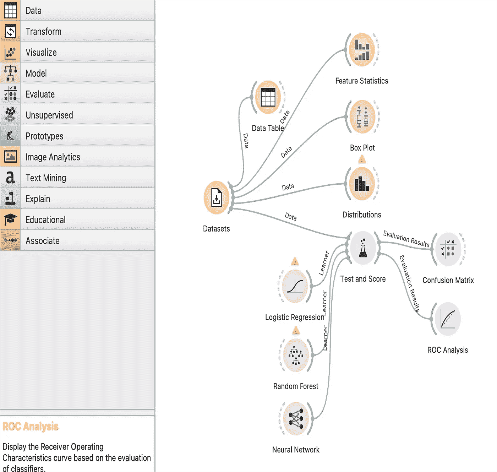

**橙色特征**

Orange 非常适合由基本描述性统计和可视化组成的探索性数据分析。它还擅长监督和非监督学习。此外，Orange 有多个用于图像分析和文本挖掘的小工具。其他附件(选项)包括光谱学、地理位置、时间序列、关联规则、细胞生物学、生物信息学和生存分析。

有 38 个与 Orange 相关的教育视频[和一个描述小部件输入、输出和优化的](https://www.youtube.com/channel/UClKKWBe2SCAEyv7ZNGhIe4g)[小部件目录](https://orangedatamining.com/widget-catalog/)，以及一个如何使用小部件的例子。已经有几篇关于 Medium.com 的文章报道了 Orange，这里有一个[链接](/geekculture/data-science-introduction-to-orange-tool-part-1-bff18bb159a)到由 [Manthan Bhikadiya](/@manthan-bhikadiya?source=post_page-----bff18bb159a--------------------------------) 撰写的两部分系列文章，非常有帮助。

Orange 被全球数百所大学用于数据科学教育，但许多人仍然不了解它。虽然有些人可能会将 Orange 视为一个介绍性的数据科学平台，但它已经在许多发表的文章中被用作计算引擎。

用户可以使用文件小部件上传自己的数据文件，从 URL 上传数据，使用 SQL 小部件从数据库连接下载数据，或者使用数据集小部件中已有的 65 个数据集。

我的重点是向医疗保健工作者教授数据科学，但本文包含的内容也与医疗保健以外的人相关。我们的目标不是让用户成为数据科学家，而是为他们提供工具和知识，让他们熟悉和了解更重要的数据科学领域，如探索性数据分析、机器学习和人工智能。

以下部分将讨论基本的 Orange 函数，第 2 部分将介绍一些不太为人所知的函数，这些函数使 Orange 优于其他数据科学程序。

**探索性数据分析**

处理新数据集的通常方法是首先准备和清理数据。这将包括识别缺失数据、异常值、不正确的标签等。此外，经常需要转换数据，在 Orange 中，有各种各样的小部件用于转换，如下表所示。数据透视表功能比 Excel 中可用的要简单得多，合并小部件合并数据集(CSV 文件)比 SQL join 命令更快更容易。

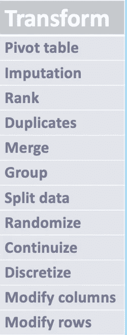

要素统计微件显示平均值、中值、离差、最小值、最大值和缺失数据，如下所示。该分析基于心脏病预测数据集，其中红色表示存在心脏病，蓝色表示不存在。

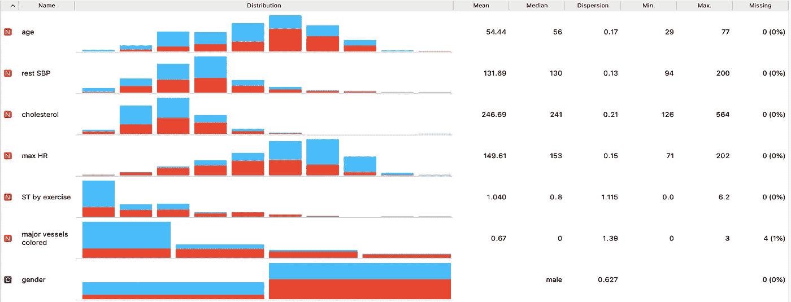

**数据可视化**

为了可视化连续数据，您可以使用分类数据的箱线图、直方图、条形图和饼图。还有小提琴图、镶嵌图、筛图、分布图和散点图。以下是箱线图和条形图的示例。请注意，箱线图提供了统计显著性的 t 检验结果，柱状图提供了卡方结果。

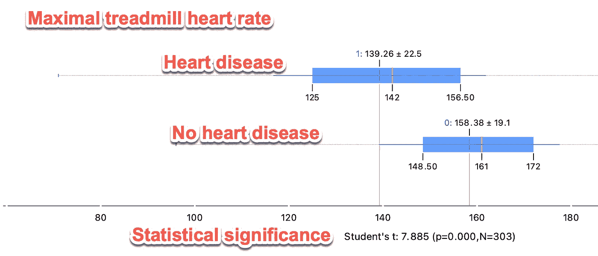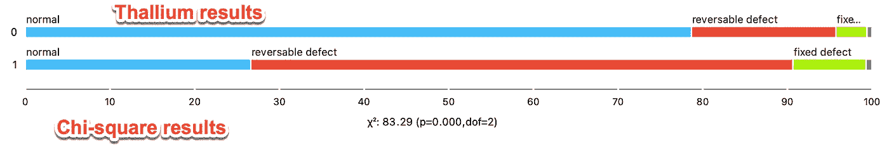

分布小部件显示数值数据的直方图和核密度，如下所示。这是血清总胆固醇的直方图，柱宽= 50。注意右边的异常值

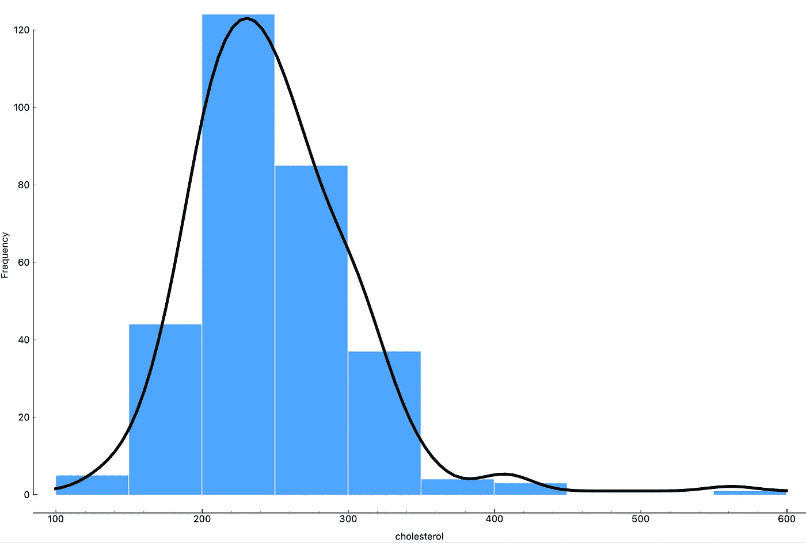

**监督学习**

监督学习分为分类和回归两种，前者的输出是分类的(例如，心脏病/无心脏病)，后者的输出是连续的/数字的(价格、每加仑英里数等)。)Orange 非常适合创建分类和回归模型。它有一个广泛的算法库，如下表所示。

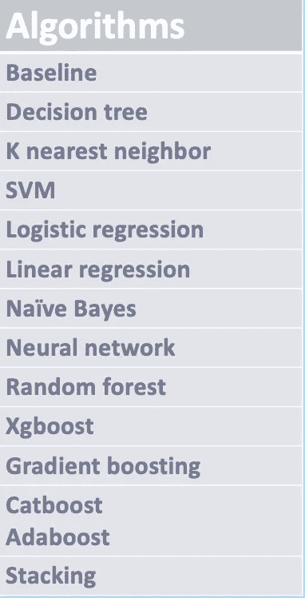

使用多种算法创建分类模型来训练和测试数据非常简单，如下所示。文件小部件中的数据被提供给数据采样器小部件，其中训练数据= 70%，测试数据= 30%。三个学习者被使用:逻辑回归，随机森林，和朴素贝叶斯。我们将测试和得分的结果显示为第二个图像，并注意到小部件连接到混淆矩阵、ROC 曲线和校准小部件。观察训练和测试时间有多快，以及评估模型的各种指标。最后，在左上方，检查训练数据的交叉验证(k =10)。要与测试结果进行比较，只需选中左下角的“测试数据测试”框这使得在训练和测试结果之间切换变得容易。大多数数据科学平台对于建模来说都不是如此用户友好。

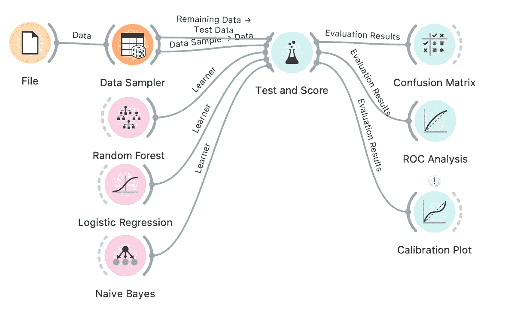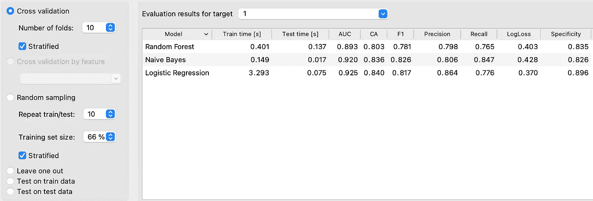

回归也很简单。我们将使用相同的心脏病预测数据集，但将我们的结果改为负荷试验期间心电图上发现的毫米级 ST 段压低。我们将文件小部件连接到测试和评分小部件，然后连接线性回归和随机森林小部件进行测试和评分。工作流程如下，后面是回归性能截图。

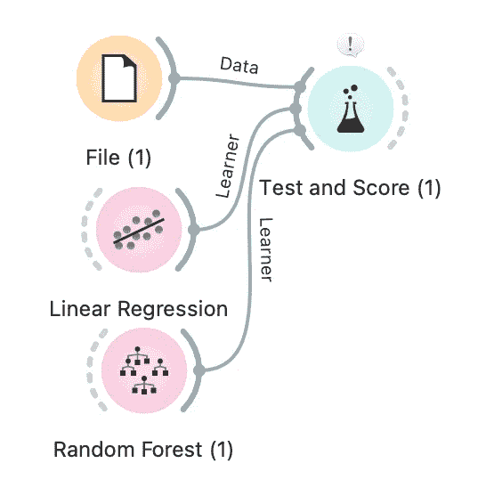

我们可以看到，线性回归具有略高的 R2 和较低的 RMSE，这表明它的表现优于随机森林。

**无监督学习**

无监督学习用于在数据集中查找聚类或新组。换句话说，你没有像在监督学习中那样试图预测的结果。这种方法在基因组学中对于发现新的组或簇特别重要。Orange 提供了多种算法，如 k-means 聚类、层次聚类、DBSCAN 和 t-SNE。下面是一个糖尿病相关数据集的层次聚类示例。确定了三组，总体上是直观的。

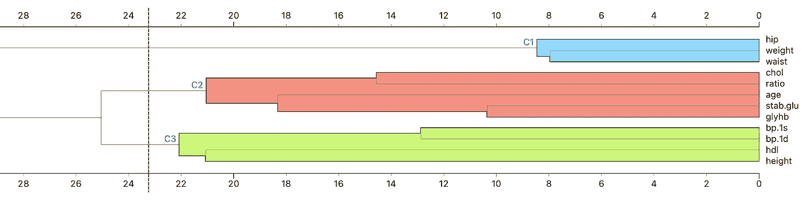

**图像分析**

Orange 提供了几个卷积神经网络(CNN ),其中最主要的是 Google Inception v3。图像分析的主要功能是图像分类。换句话说，Orange 对胸部 x 光片、皮肤病学图像、心电图等的分类有多好？例如，在对正常的胸部 x 光片和显示肺炎的 x 光片进行分类时，准确度如何？下图显示了分析恶性黑色素瘤和另一种常见皮肤癌基底细胞癌/上皮瘤图像的工作流程。在对两种皮肤癌进行准确分类方面，结果令人印象深刻。

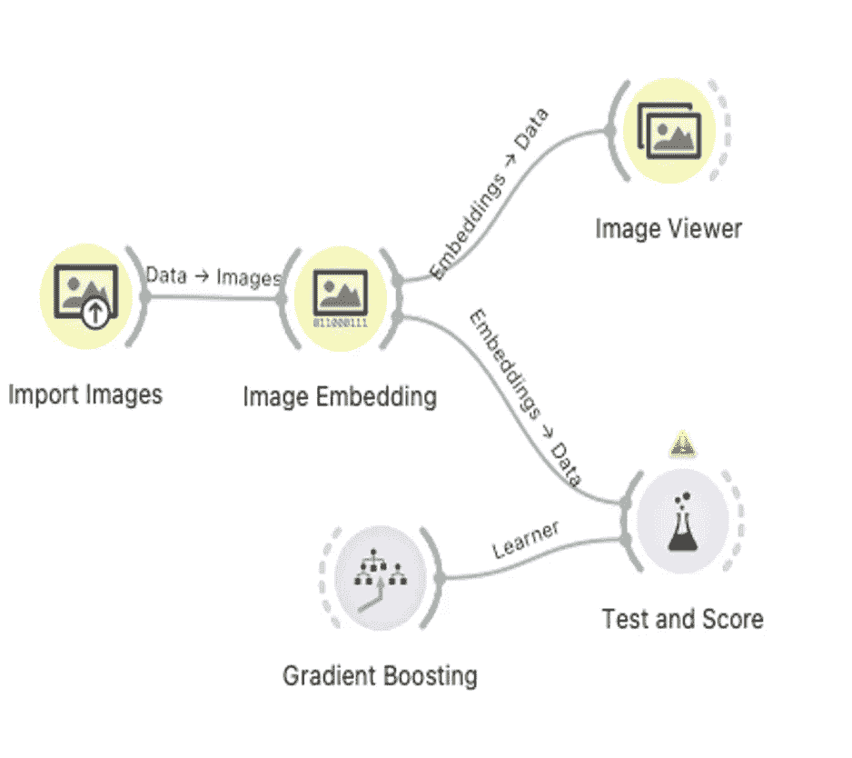

**文字挖掘**

Orange 可以执行多种文本挖掘功能，如创建词云、文本分类和情感分析。它有连接到 PubMed、Twitter、卫报、纽约时报和维基百科的小部件。下面是通过分析 PubMed 摘要创建的猴痘词云，之后显示了挖掘关于疫苗的情绪的 Tweeter feeds 的工作流程。

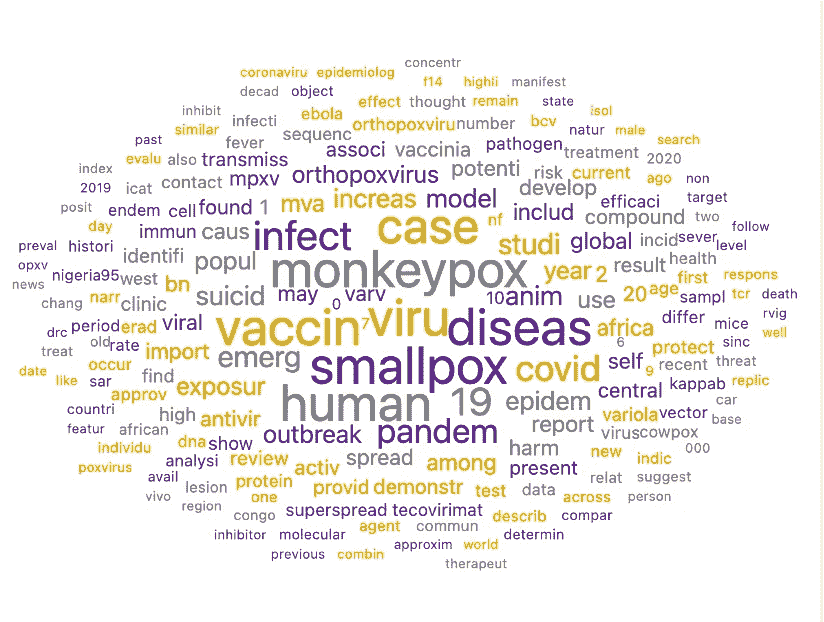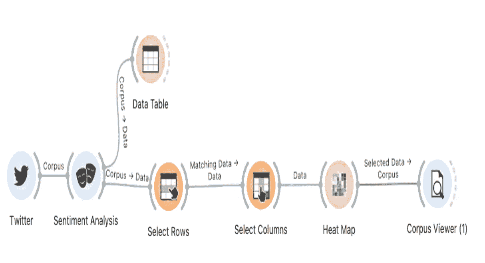

**结论**

Orange 数据挖掘平台是最直观的程序之一，可用于教授不需要编程或高等数学的数据科学。虽然学习 Python 或 R 以及线性代数和微积分对每个人来说都是理想的，但对大众来说是不现实的。Orange 是“数据科学民主化”的一个例子，它促使更多的人成为“公民数据科学家”。这些人可以通过更好地理解数据(数据素养)和进行初步分析来帮助数据科学家。

敬请关注[第 2 部分](https://rehoyt.medium.com/maximizing-orange-for-data-science-education-part-2-7d036c9d8038)，我们将展示大量独特的 Orange 特性，让数据科学变得快速、直观、有趣且高效。

 [## Mlearning.ai 提交建议

### 如何成为 Mlearning.ai 上的作家

medium.com](/mlearning-ai/mlearning-ai-submission-suggestions-b51e2b130bfb)