# 将 Orange 最大化用于数据科学教育—第 2 部分

> 原文：<https://medium.com/mlearning-ai/maximizing-orange-for-data-science-education-part-2-7d036c9d8038?source=collection_archive---------6----------------------->

在本系列的第 1 部分中，我概述了专注于数据科学教育的数据挖掘平台 Orange。在第 2 部分中，我将重点介绍 Orange 的一些独特的教育功能，用户应该会觉得这些功能很有帮助。Orange 网站和 YouTube 视频都没有讨论这些功能。

1.**扩展模型性能指标**。对于分类，在测试和评分小部件中，您可以获得 AUC、分类准确度(CA)、F1 评分、召回率(灵敏度)和精确度。右键单击“模型”，您可以添加训练和测试时间、特异性和 LogLoss(预测与实际结果的接近程度)。

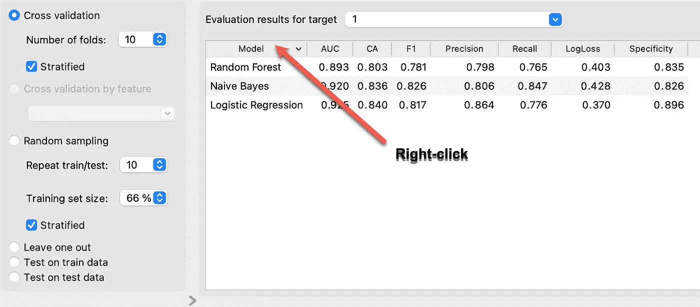

2.**分享信息**

a.您的 Orange 工作流程可以存储为。ows 文件转换为文档，以备将来使用或与其他学生或同事共享。转到文件>>保存。

b.保存数据小部件将在您做出更改后保存您的数据，因此您现在有一个新的 CSV 文件可以使用。例如，您可能已经过滤掉了所有男性患者，并希望只保留女性患者的档案。

c.要保存绘图，请转到打开的小部件的左下角，选择“保存图像”。现在可以将其保存为. png 格式。svg 或 PDF 文件。在同一区域，当选择“报告”时，您可以保存带注释的绘图，也可以打印。请参见下面显示报告选项的屏幕截图。

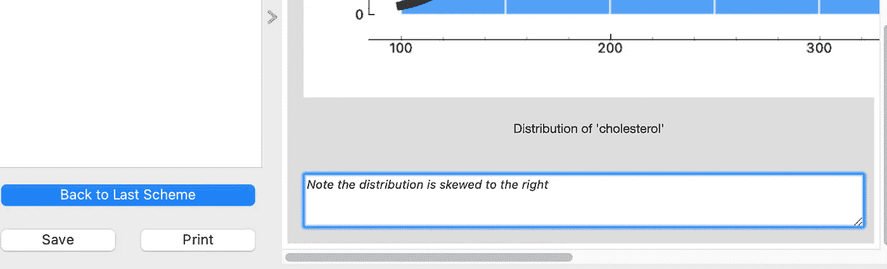

3.**最大限度地利用数据表小工具。这个小部件就像一个简单的电子表格，所以你可以看到表格格式的数据。它会告诉您列数和行数，是否有任何丢失的数据，以及是否有任何目标值。每当您修改或转换数据以确认更改发生时，添加此微件非常重要。你可以通过点击标题对数据进行排序。在下面的图片中，我点击了“年龄”,这就按升序对该列进行了排序。然后，我突出显示了第一行，并使用 shift 键选择了所有 40 岁以下的患者。现在，您可以将该数据表及其 15 个突出显示的患者连接到另一个数据表或可视化小部件，以进行进一步的分析。下面的蓝色表示已经选择了前 15 行。**

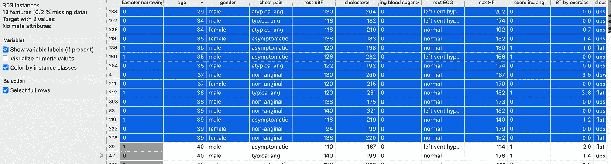

我将这个数据表小部件连接到一个方框图小部件，它也可以生成条形图，您可以看到这些患者中有 11 人的铊测试正常，而 4 人有可逆缺陷。

4.**选择并连接。**在上一节中，我指出您可以突出显示数据表中的数据，以便进行进一步的重点审查。您可以对多个其他小部件做同样的事情——突出显示一个部分或数据点，并将它连接到一个只包含您选择的数据的数据表。您可以选择决策树中的节点、混淆矩阵中的任何类别、散点图中的数据点、箱形图或直方图中的类别，或者马赛克图的一部分。在下面的截图中，我突出显示了混淆矩阵中的 23 名假阴性患者，这样我可以分别对他们进行分析。我将它连接到一个只显示 23 名患者的数据表。

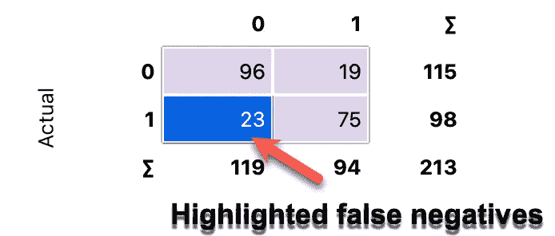

5.**选择行控件**。如果您可以选择数据集的某些行，这意味着您可以过滤数据。在下面的例子中，我选择了在铊压力测试中有可逆缺陷但心导管插入术正常的女性。只有两个病人被确认。当性别改变时，23 名男性被确认。选择行微件现在可以连接到数据表或可视化微件，以进行进一步分析。此外，您可以将这个小部件连接到两个数据表，右键单击连接器以确保一个表示匹配数据，另一个表示不匹配数据。因此，一个数据表将包含这两位女性，而另一个数据表将包含其他所有人。

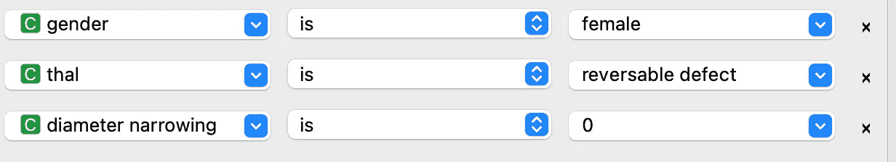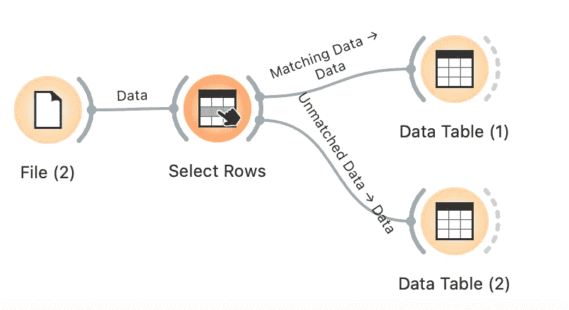

6.**丰富的算法库**。在第 1 部分中，我用橙色展示了一个包含可用算法的表格。大多数是不言自明的，但让我强调两个不太为人所知的。常量小部件是一种基线算法，其预测完全基于频率。假设我们有 5%的癌症患者和 95%的非癌症患者。常量小部件将显示基于多数类的 95%的准确性。这是一个阶层失衡的例子，与癌症患者相比，非癌症患者要多得多。这产生了许多问题，我们不会在本系列中讨论，但可以说，您测试的任何算法都必须比这个 95%的基线结果更好。正在发生的是，机器学习算法正在对大多数“没有癌症”的患者进行学习。

堆叠算法结合了多种算法来提高性能，这就形成了一个整体。集合的其他例子是随机森林和梯度增强树，其中多个树被组合以提高性能。在下面的屏幕截图中，堆叠小部件用于结合逻辑回归、随机森林和朴素贝叶斯的优势来提高性能。事实上，与单独使用逻辑回归相比，AUC 和 F1 评分确实有所改善。

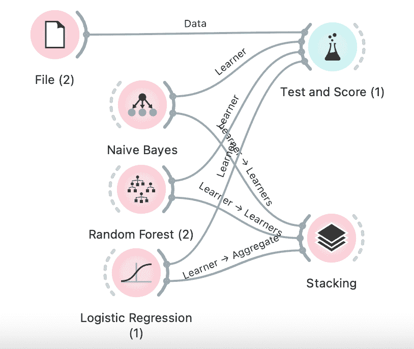

7.**给小众类加权重**。如前一节所述，不平衡数据集是常见的，当少数利益类别(如欺诈)在数量上远远超过多数类别(无欺诈)时，不平衡数据集会带来挑战。Orange 的一个简单的解决方案是给少数群体更多的权重。这可以在逻辑回归和随机森林微件中完成，方法是打开微件并选中“平衡类分布”复选框这将提高分类模型的性能

8.让 Orange 帮助您可视化数据。散点图小部件有一个按钮“查找信息投影”,因此您不必手动输入 x 轴和 y 轴的多个组合，该功能将调出重要的关联。下面是一个例子，搜索结果显示了年龄与收缩压的散点图。注意随着年龄的增长和相关的 r 值。

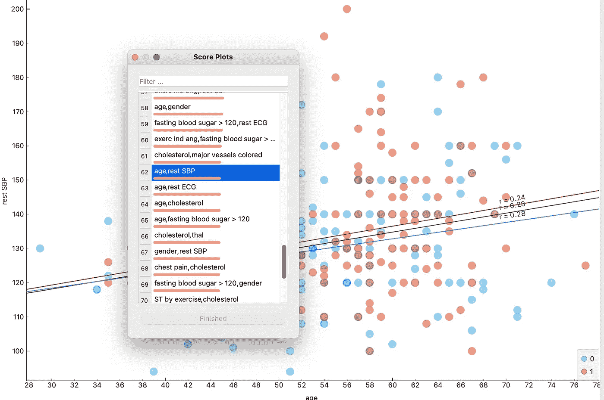

9.**添加一个列线图**。Orange 提供了一个可定制的交互式诺模图，您可以将它与逻辑回归和朴素贝叶斯一起使用，以查看在更改预测因子后预测概率是如何变化的。将文件小部件连接到逻辑回归，并将后者连接到诺模图小部件。选择目标= 1。彩色(钙化的冠状动脉)的默认基线概率是 40%，但当您将蓝色图标向右滑动到 3(表示 3 条钙化的动脉)时，该概率达到 91%。首先是最重要的预测值，所有预测值都是可定制的。

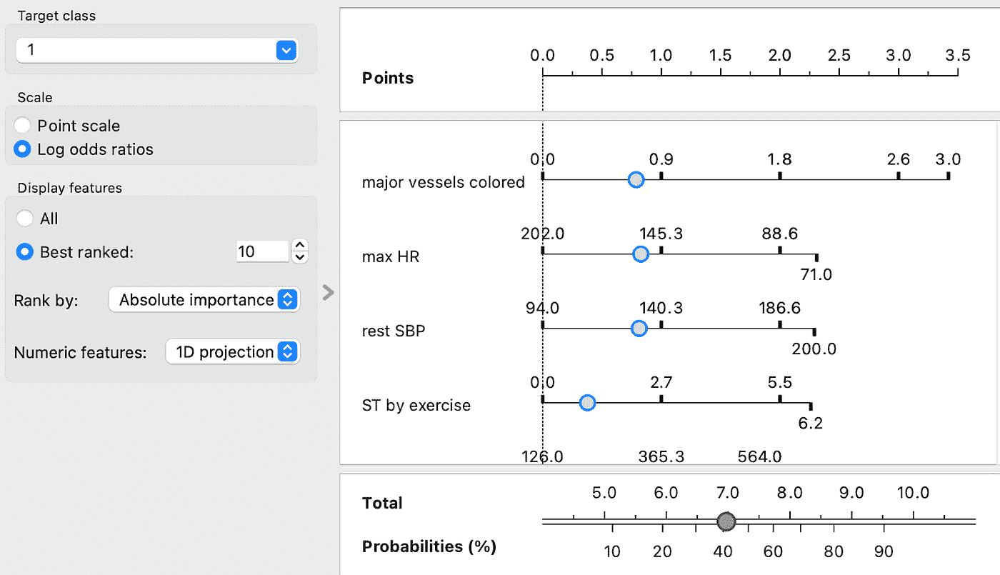

10.**教育情节。**

a.受试者操作曲线。当您将鼠标悬停在数据点上时，橙色会告诉您该点的阈值。请记住，ROC 曲线是通过绘制多个阈值下的真阳性率与假阳性率来创建的。默认阈值为 0.5，但如果需要提高灵敏度或特异性，可以提高或降低阈值。下面的屏幕截图显示了不同阈值的结果。在较高的阈值，召回(灵敏度)和假阳性减少，特异性增加。在较低的阈值下，情况正好相反。

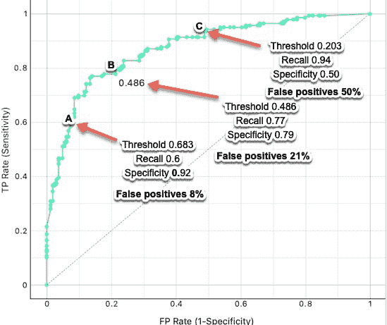

b.在校准图中还有其他图的选择，可以说最重要的两个是比较灵敏度和特异性以及精确度和召回率(灵敏度)的图。可以移动垂直滑块来查看不同阈值的情况。下面的截图显示了灵敏度与特异性，下面的截图显示了精确度与召回率。移动滑块会改变结果，是一个很好的交互工具。

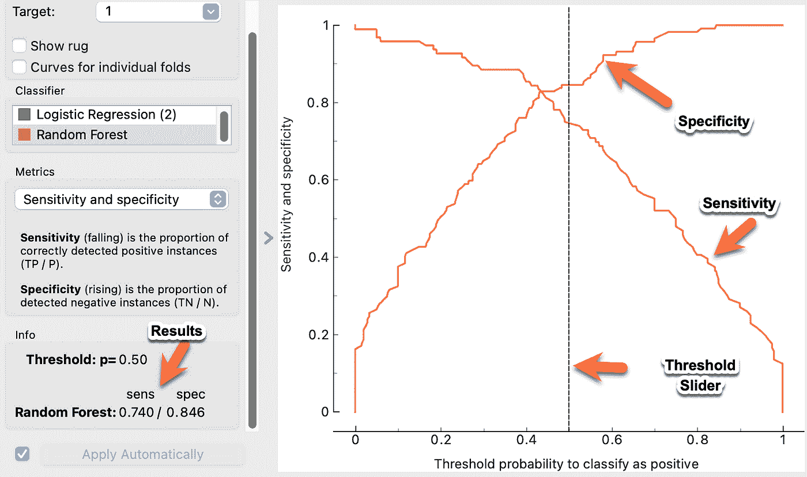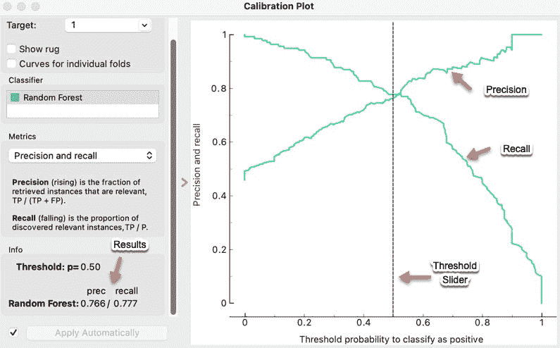

**结论**

这是一些橙色铃铛和哨子的简要列表，它们将使您的数据科学之旅更加高效和愉快。以后我会用 Orange 解决具体问题，不需要编程，也不需要高等数学。

 [## Mlearning.ai 提交建议

### 如何成为 Mlearning.ai 上的作家

medium.com](/mlearning-ai/mlearning-ai-submission-suggestions-b51e2b130bfb)