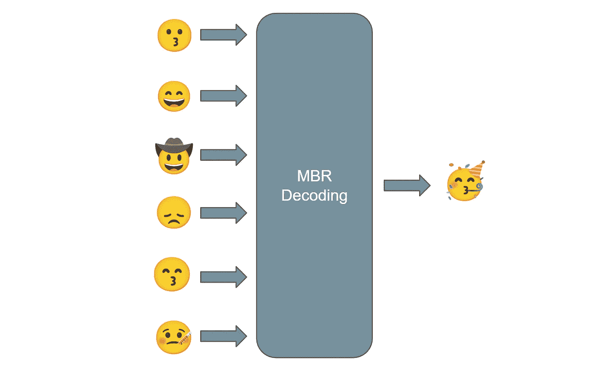

# MBR 解码:从多个系统获得更好的结果

> 原文：<https://medium.com/mlearning-ai/mbr-decoding-get-better-results-from-many-systems-d558a8977d2d?source=collection_archive---------1----------------------->

## 即使你最先进的系统也有别人没有的缺陷

Illustration by the author. Made with [Noto Color Emoji](https://fonts.google.com/noto/specimen/Noto+Color+Emoji/about).

几乎每个月都会发布新的大型语言模型(BLOOM、OPT、GPT-3、NLLB……)。由于在提高推理效率方面的努力，它们变得越来越容易理解，例如[加速](https://huggingface.co/docs/accelerate/index)和[深度速度](https://www.deepspeed.ai/)。现在可以运行…