# MDSD4Health:医疗保健和公共卫生领域的机器学习模型和数据集披露(MDSD)课程

> 原文：<https://medium.com/mlearning-ai/mdsd4health-a-machine-learning-model-dataset-disclosure-mdsd-curriculum-for-healthcare-7b10caa594e7?source=collection_archive---------7----------------------->

## 详细介绍了免费获取课程的开发，以促进医疗环境中的算法透明度

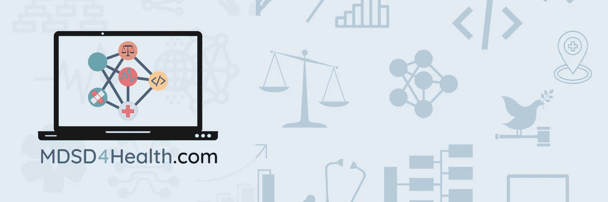

MDSD4Health Logo & Banner

## **摘要**

近年来，机器学习(ML)方法在复杂性和实用性方面取得了进步，导致在跨学科的研究和开发环境中的采用增加。然而，虽然 ML 是有用的，但人们越来越关注这些方法在模型算法的结构和训练数据方面的脆弱性。虽然在健康环境中不存在记录训练的 ML 模型的性能特征的行业标准，也不存在在 ML 数据集的管理和预处理中使用的限制或方法，但是已经提出了几种公开方法和介质，并努力使它们标准化。然而，这些标准化工作的一个主要障碍是缺乏关于在卫生背景下使用模型和数据集披露方法(MDSDs)的目的和价值的教育资源，以及促进其使用的培训有限。为了填补这一空白，我们提出了 MDSD4Health，这是一种低门槛、免费的 MDSD 健康课程。

# **背景&动机**

## *医疗保健和公共卫生领域的机器学习偏见*

M [机器学习(ML)](https://cloud.google.com/learn/what-is-machine-learning) 是指并包含各种方法，这些方法使计算系统能够从大量数据中自主“学习”以执行任务(例如，做出预测或决策)，而无需显式编程。近年来，ML 方法在复杂性和实用性方面取得了进步，导致[在跨学科的研究和开发环境中](https://www.science.org/doi/10.1126/science.aaa8415?cookieSet=1)的采用增加。然而，虽然 ML 显然是有用的，但人们越来越关注这些方法的[脆弱性，即通过模型算法的结构和对它们进行训练的数据来产生偏差](https://dl.acm.org/doi/10.1145/3457607)。ML 模型延续或加剧偏见的倾向[在医疗保健和公共卫生背景下](https://www.nature.com/articles/s42256-021-00373-4)尤其重要，其中[主要关注点](https://www.nature.com/articles/s42256-021-00373-4)包括减少健康差异和促进健康公平。

近年来，医疗保健领域的 ML 模型及其实施者记录了偏见永久化的几个[后果](https://www.ncbi.nlm.nih.gov/pmc/articles/PMC6347576/)，包括阿肯色州人类服务部使用的人力资源优化算法，该算法在 2016 年无意中[削减了以前符合条件的患者的医疗覆盖范围和服务时间](https://www.theverge.com/2018/3/21/17144260/healthcare-medicaid-algorithm-arkansas-cerebral-palsy)，但没有明确解释原因。其他例子包括使用根据历史医疗服务利用数据训练的模型，这可能[在他们的评估和建议中延续现有的医疗差异模式](https://pubmed.ncbi.nlm.nih.gov/30508424/)。其中一个案例是一个复杂的护理需求评估模型，该模型[将](https://www.science.org/doi/10.1126/science.aax2342?cookieSet=1)符合条件的黑人患者与符合条件的白人患者相比，不成比例地错误归类为不符合高风险护理管理计划的患者。这一错误部分归因于使用历史护理支出作为护理需求的指标，而[未能说明由于历史上不平等的护理机会而导致的代表性不足](https://www.ncbi.nlm.nih.gov/pmc/articles/PMC7442146/)。

提议的偏差缓解策略包括审查数据集，以[评估跨上下文相关类别(如人口统计或护理连续性模式)的数据](https://jamanetwork.com/journals/jamainternalmedicine/article-abstract/2697394)表示；[针对不平衡数据集的优化模型](https://jamanetwork.com/journals/jamainternalmedicine/article-abstract/2697394)；[在开发的所有阶段测试模型](https://jamanetwork.com/journals/jamainternalmedicine/article-abstract/2697394)；关注[临床或实践相关的](https://jamanetwork.com/journals/jamainternalmedicine/article-abstract/2697394)结果，而不仅仅是绩效指标；[使代码和数据集可用于](https://jamanetwork.com/journals/jama/article-abstract/2758612)复制和再生产；以及[与跨学科团队](https://jamanetwork.com/journals/jamainternalmedicine/article-abstract/2697394)合作进行特征工程，为 ML 使用选择适当的设置，解释发现，并进行后续评估。

由于这些策略中有几个需要[对模型的开发过程或训练数据集进行深入审查](https://dl.acm.org/doi/10.1145/3287560.3287596)，因此它们可以通过模型来源的可靠披露来实现，包括已知的开发限制、性能指标、预期用途以及训练、测试和验证数据集组成。鉴于此，在追求实现医疗保健和公共卫生背景下的算法透明性的过程中，[稳健的披露方法](https://dl.acm.org/doi/10.1145/3287560.3287596)和媒介的开发已被提议作为[核心战略](https://dl.acm.org/doi/10.1145/3458723)。

## *机器学习偏差缓解的公开*

虽然没有记录[训练的 ML 模型](https://dl.acm.org/doi/10.1145/3287560.3287596)的性能特征的行业标准，也没有在 [ML 数据集](https://dl.acm.org/doi/10.1145/3458723)的管理和预处理中使用的限制或方法，但是已经提出了几种披露方法和媒介【参见[此处](https://dl.acm.org/doi/10.1145/3287560.3287596)、[此处](https://dl.acm.org/doi/10.1145/3458723)、[此处](https://arxiv.org/abs/1808.07261v2)、[此处](https://arxiv.org/abs/1805.03677)和[此处](https://direct.mit.edu/tacl/article/doi/10.1162/tacl_a_00041/43452/Data-Statements-for-Natural-Language-Processing)】。在这项工作中，我们提供了一个术语来指代大量建议的方法和媒介，这些方法和媒介能够对 ML 模型的来源(限制、性能指标、预期用途)以及用于模型训练、测试和验证的数据集的来源和组成进行有目的的交流和报告: ***模型和数据集披露* (MDSDs)** 。

MDSDs 可以大致分为两个子类别:

1.  数据集披露
2.  标准披露。

## *数据集披露*

根据我们的工作定义，数据集披露是 MDSDs，它特别关注用于训练、测试和验证 ML 模型的数据集的来源、特征、组成和推荐用途。文献中提出的选择数据集公开方法和媒介包括数据集的[数据表、](https://dl.acm.org/doi/10.1145/3458723)[数据集卡片](https://huggingface.co/docs/datasets/dataset_card)、数据集营养标签[第一代](https://arxiv.org/abs/1805.03677)和[第二代](https://arxiv.org/abs/2201.03954)、自然语言处理的[数据语句](https://direct.mit.edu/tacl/article/doi/10.1162/tacl_a_00041/43452/Data-Statements-for-Natural-Language-Processing)。

## *模型披露*

根据我们的工作定义，模型披露是 MDSDs，其特别关注来源、限制、性能指标和训练 ML 模型的推荐使用。文献中提出的选择模型公开方法和媒介包括[模型卡](https://dl.acm.org/doi/10.1145/3287560.3287596)、[数据表](https://arxiv.org/abs/1808.07261v2)和[三脚架声明](https://pubmed.ncbi.nlm.nih.gov/25560714/) *(虽然不是专门为 ML 模型开发的，但是三脚架声明格式可以应用于相关的监督学习模型。)*

## *之前的工作&做出贡献的机会*

认识到模型披露在健康相关的机器学习模型部署中的价值，我的朋友和同事[谷歌云](https://medium.com/u/a393b3043091?source=post_page-----7b10caa594e7--------------------------------)[医疗保健&生命科学的](https://medium.com/u/4f3f4ee0f977?source=post_page-----7b10caa594e7--------------------------------)Vivian Neilley概念化了[快速医疗保健互操作性资源(FHIR)](https://www.fhir.org/) 标准，以追求[医疗保健环境中模型卡使用的更有意义的集成和标准化](https://www.statnews.com/2022/03/31/what-health-care-must-learn-from-meteorology-about-the-importance-of-r2o/)。她在 2021 年完成塔夫茨大学医学院的健康信息学和分析(HIA)理学硕士学位时准备并展示了这项工作。

然而，薇薇安的工作中提出的标准化理想的一个实质性障碍是缺乏关于在健康背景下使用模型卡的目的和价值的教育资源，以及促进其使用的有限培训。缺乏无障碍教育是实践标准化的一个障碍[证据充分](https://pubmed.ncbi.nlm.nih.gov/22735068/)【另见[这里](https://pubmed.ncbi.nlm.nih.gov/27417624/)和[这里](https://pubmed.ncbi.nlm.nih.gov/25032306/)】。因此，扩展这项工作的一个机会是开发一个教育资源来帮助填补空白。

建立在 Vivian 工作基础上的第二个机会是将工作的视角从单纯的模型披露扩展到包括数据集披露。假设数据决定了 ML 模型的性能，那么数据集的收集、管理和组成[会极大地影响](https://dl.acm.org/doi/10.1145/3458723)可以构建的模型类型以及如何使用它们。将焦点转向数据集报告的[角色](https://dl.acm.org/doi/10.1145/3458723)在模型透明度工作中可能[启用更稳健的报告策略](https://direct.mit.edu/tacl/article/doi/10.1162/tacl_a_00041/43452/Data-Statements-for-Natural-Language-Processing)并推进在卫生背景下标准化模型透明度实践的理想。

# **项目目标**

该项目的主要目标是为公共卫生和医疗保健环境开发一个工作 ML 模型和数据集披露(MDSD)课程，其中包括学习指南、内容模块和编码练习，以强化概念。该项目旨在通过集中两个改进机会，在先前模型卡使用标准化工作的基础上进行:

1.  有限的教育是实践标准化的障碍
2.  缺乏对数据集披露的关注

该项目代表了使用和开发免费访问和开源教育材料的努力，以促进医疗保健和公共卫生背景下 MDSD 方法的公平使用、采用和最终标准化(如 Vivian 最初提出的方法)。

该项目的第二个目标是确定项目连续性的机会。由于该项目建立在一名[前研究生](https://www.statnews.com/2022/03/31/what-health-care-must-learn-from-meteorology-about-the-importance-of-r2o/)的工作基础上，这项工作的一个额外组成部分是为那些对医疗保健或公共卫生 ML 模型透明度感兴趣的人确定未来项目迭代的途径。

# **方法**

## *网站开发*

健康情境的模型和数据集披露课程( [MDSD4Health](https://www.mdsd4health.com/) )通过[谷歌网站](https://sites.google.com/new)在线发布，这是谷歌提供的结构化网页创建工具。在为要遵循的课程开发了一个初始结构之后，内容被构建为一系列网页。到目前为止，课程包含 28 个网页和子页面，包括一个[主页](https://www.mdsd4health.com/)，一个[“关于课程”页面](https://www.mdsd4health.com/about-the-curriculum)，[资源页面和子页面](https://www.mdsd4health.com/resources)，一个[确认页面](https://www.mdsd4health.com/acknowledgements)，以及几个专用于[mdsd 4 健康课程内容](https://www.mdsd4health.com/modules)的页面。

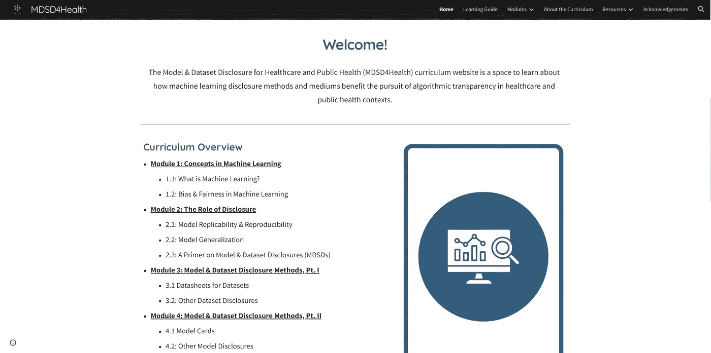

**Fig 1:** Snippet from MDSD4Health [home page](https://www.mdsd4health.com/home#h.tneglum51vxj)

## *内容策展&开发*

MDSD4Health 网站上提供的信息包括原始内容和外部策划的内容。策划的内容是从可信的来源精心挑选的，包括学术期刊和著名的在线教育组织。内容的选择也基于免费访问的可用性，以符合课程对免费访问的承诺(即，不需要文章付费墙或机构从属关系)。经过策划的 MDSD4Health 内容包括来自美国医学协会(JAMA)杂志(T17)等期刊的开放式学术出版物，来自 Complexly 速成班(T18)等创作者的教育视频，来自麻省理工学院技术评论(T21)等知名出版商的在线文章，以及来自谷歌开发者(T23)等平台的网页。所有策划的内容都附有原创或外部来源的图片，以及明确将内容与课程目标联系起来的关键点。所有策划的内容还附有推荐的引文，以便原始创作者因其工作而非 MDSD4Health 而受到表彰。

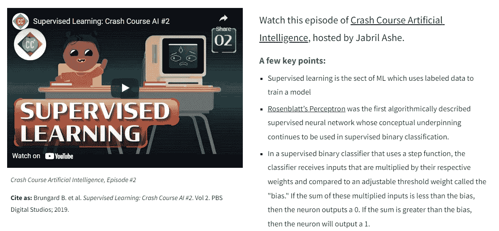

**Fig 2:** Snippet from MDSD4Health, [Submodule 1.1](https://www.mdsd4health.com/modules/module-1-concepts-in-machine-learning-health/what-is-machine-learning#h.pkmb3pzbn1fu), featuring content from [Crash Course Artificial Intelligence](https://thecrashcourse.com/topic/ai/), which includes a “cite as” statement

原创内容是对策划内容的补充或扩展。原始视频是使用[微软 PowerPoint](https://www.microsoft.com/en-us/microsoft-365/powerpoint) 制作和录制的，并在嵌入 MDSD4Health 网站之前上传到 [YouTube](https://www.youtube.com/) 。原始图形是用 [Canva](https://medium.com/u/46cb8d4ce352?source=post_page-----7b10caa594e7--------------------------------) 制作的。最初的 Python 练习是在[谷歌合作实验室](https://colab.research.google.com/)(“Colab”)开发的。两项练习改编自现有练习，并针对相应子模块的目标进行了调整，在每项练习的介绍中都有明确说明，并概述了所做的更改。

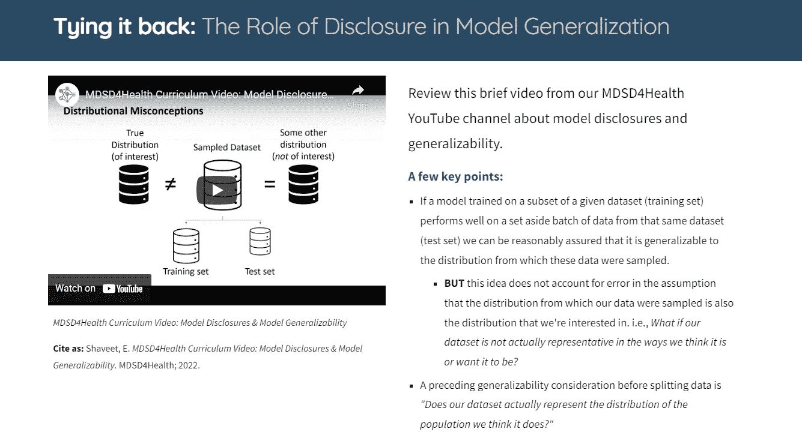

**Fig 3:** Snippet from MDSD4Health, [Submodule 2.2](https://www.mdsd4health.com/modules/module-2-the-role-of-disclosure/ml-generalization#h.31saj1tuyqdd), featuring original content developed by [Eden Shaveet](https://medium.com/u/4cdfa85822e6?source=post_page-----7b10caa594e7--------------------------------)

## *课程组织*

mdsd 4 健康内容分为模块、子模块和部分。课程由五个模块组成，每个模块包含一至三个子模块。两个子模块包含进一步的“迷你”子模块，具有删节的内容。在每个子模块内存在几个包含与子模块相关的内容的部分。有关课程组织的详细概述，请参见[mdsd 4 健康学习指南](https://www.mdsd4health.com/learning-guide)。

## *模块&子模块*

MDSD4Health 课程中提供的模块和子模块组织如下:

*   [**模块 1:** 机器学习中的概念](https://www.mdsd4health.com/modules/module-1-concepts-in-machine-learning-health)
*   [*子模块 1.1:* 什么是机器学习？](https://www.mdsd4health.com/modules/module-1-concepts-in-machine-learning-health/what-is-machine-learning)
*   [*子模块 1.2:* 偏向&机器学习中的公平性](https://www.mdsd4health.com/modules/module-1-concepts-in-machine-learning-health/bias-fairness-in-ml)
*   [**模块二:**披露](https://www.mdsd4health.com/modules/module-2-the-role-of-disclosure)的作用
*   [*子模块 2.1:* 机器学习可复制性&再现性](https://www.mdsd4health.com/modules/module-2-the-role-of-disclosure/replicability-reproducibility-in-ml)
*   [*子模块 2.2:* 机器学习泛化](https://www.mdsd4health.com/modules/module-2-the-role-of-disclosure/ml-generalization)
*   [*子模块 2.3:* 模型基础&数据集披露(MDSDs)](https://www.mdsd4health.com/modules/module-2-the-role-of-disclosure/primer-on-mdsds)
*   [**模块 3:** 模块&数据集披露，Pt。I(数据集披露)](https://www.mdsd4health.com/modules/module-3-mdsd-methods-mediums-pt-i)
*   [*子模块 3.1:* 数据集数据表](https://www.mdsd4health.com/modules/module-3-mdsd-methods-mediums-pt-i/datasheets-for-datasets)
*   [*子模块 3.2:* 其他数据集披露](https://www.mdsd4health.com/modules/module-3-mdsd-methods-mediums-pt-i/other-data-set-disclosures)
*   [*子模块 3.2.1:* 数据集卡片](https://www.mdsd4health.com/modules/module-3-mdsd-methods-mediums-pt-i/other-data-set-disclosures/dataset-cards)
*   [*子模块 3.2.2:* 数据集营养标签](https://www.mdsd4health.com/modules/module-3-mdsd-methods-mediums-pt-i/other-data-set-disclosures/dataset-nutrition-label)
*   [*子模块 3.2.3:* 自然语言处理的数据报表](https://www.mdsd4health.com/modules/module-3-mdsd-methods-mediums-pt-i/other-data-set-disclosures/data-statements-for-nlp)
*   [**模块 4:** 模块&数据集披露，Pt。二(数据集披露)](https://www.mdsd4health.com/modules/module-4-mdsd-methods-mediums-pt-ii)
*   [*子模块 4.1:* 型号卡](https://www.mdsd4health.com/modules/module-4-mdsd-methods-mediums-pt-ii/model-cards)
*   [*子模块 4.2:* 其他车型披露](https://www.mdsd4health.com/modules/module-4-mdsd-methods-mediums-pt-ii/other-model-disclosures)
*   [*子模块 4.2.1:* IBM 数据表](https://www.mdsd4health.com/modules/module-4-mdsd-methods-mediums-pt-ii/other-model-disclosures/factsheets)
*   [*子模块 4.4.2:* 三脚架声明](https://www.mdsd4health.com/modules/module-4-mdsd-methods-mediums-pt-ii/other-model-disclosures/tripod-statement)
*   [**模块 5:** 我们错过了什么？](https://www.mdsd4health.com/modules/module-5-what-did-we-miss)

## *章节*

为了保持一致性，每个子模块的内容都被划分为统一的部分，从面向操作的指令开始，如“阅读”、“探索”或“练习”在课程附带的[学习指南](https://www.mdsd4health.com/learning-guide)中，所有章节都补充了相应的超链接图标。

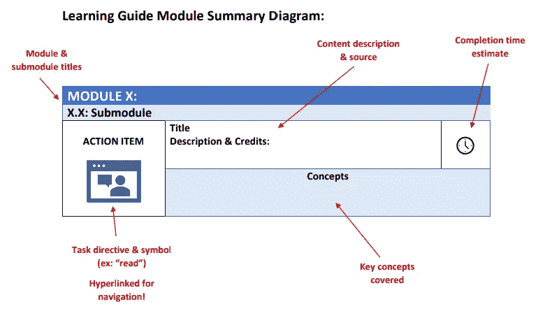

**Figure 4:** MDSD4Health [Learning Guide](https://www.mdsd4health.com/learning-guide) Module Summary Diagram

## *练习*

MDSD4Health 课程包括五个演示式的 [Python](https://www.python.org/) 练习，设计用于在 [Google Colab](https://colab.research.google.com/) 或其他 [Jupyter notebook](https://jupyter.org/) 环境中运行。每个模块包含一到两个练习，旨在进一步演示在相应子模块中引入的概念。

前两个练习分别在子模块 [1.1](https://www.mdsd4health.com/modules/module-1-concepts-in-machine-learning-health/what-is-machine-learning) 和 [1.2](https://www.mdsd4health.com/modules/module-1-concepts-in-machine-learning-health/bias-fairness-in-ml) 中提供，属于机器学习中的基础概念。

在第一个[练习](https://www.mdsd4health.com/modules/module-1-concepts-in-machine-learning-health/what-is-machine-learning#h.7ui1yd60szc7)中，学习者使用著名的[威斯康星州乳腺癌(诊断)数据集](https://archive.ics.uci.edu/ml/datasets/Breast+Cancer+Wisconsin+(Diagnostic))创建了一个简单的 k-最近邻(KNN)分类器模型。本练习演示了导入和分割带有目标变量的数据集，使用 Python 中的 [scikit-learn](https://scikit-learn.org/stable/index.html) 包创建 KNN 分类器，以及使用基于混淆矩阵的性能指标评估性能。

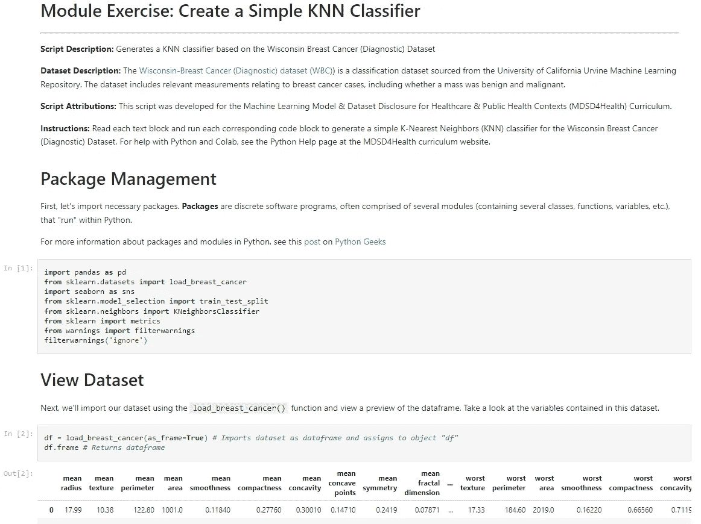

**Fig 5:** Snippet from [Exercise 1](https://www.mdsd4health.com/modules/module-1-concepts-in-machine-learning-health/what-is-machine-learning#h.7ui1yd60szc7)

在[的第二个练习](https://www.mdsd4health.com/modules/module-1-concepts-in-machine-learning-health/bias-fairness-in-ml#h.1i7zeupt55fz)中，学习者使用无意中引入偏差的合成调查数据构建一个简单的人工神经网络。该练习基于现有的基于笔记本电脑的[实验室](https://colab.research.google.com/drive/1N5IdMTmiNbwEOD8dqammN8GAfpk41arw)，由[人工智能速成班](https://www.youtube.com/watch?v=_DZJV9ey1nE&list=PL8dPuuaLjXtO65LeD2p4_Sb5XQ51par_b&index=21)提供，并为医疗保健背景量身定制。该练习演示了合成调查数据生成、拆分数据集、构建简单的神经网络以及审查绩效指标。但是，除了构建和测试模型之外，本练习还通过将注意力转向有偏差的模型对医疗保健相关资金决策的影响，向学员介绍了绩效指标之外的模型审计概念。学习者发现他们的综合调查数据受到抽样偏差和未检测到的特征相关性的影响。虽然基于混淆矩阵的性能指标显示了良好的模型性能，但未能考虑到其数据集的上下文细微差别导致了分布的误述，从而被其模型误解。

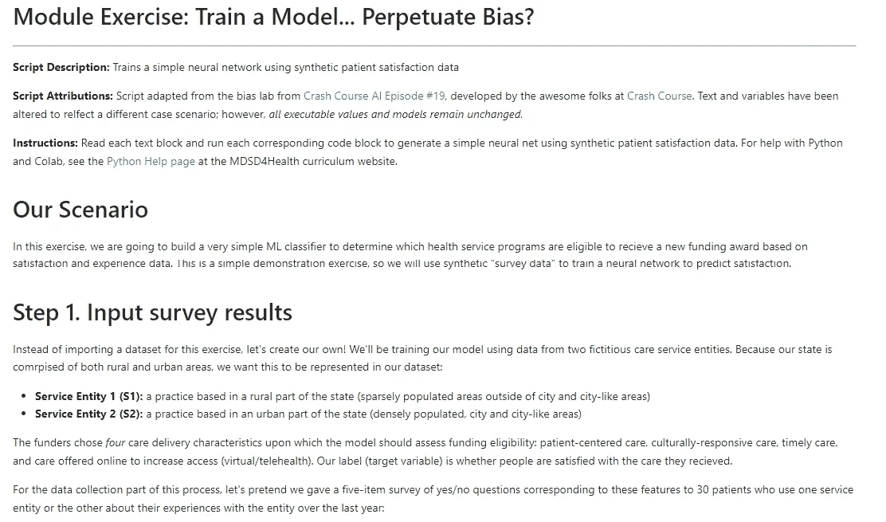

**Fig 6:** Snippet from [Exercise 2](https://www.mdsd4health.com/modules/module-1-concepts-in-machine-learning-health/bias-fairness-in-ml#h.1i7zeupt55fz)

子模块 [2.1](https://www.mdsd4health.com/modules/module-2-the-role-of-disclosure/replicability-reproducibility-in-ml) 中提供的[第三个练习](https://www.mdsd4health.com/modules/module-2-the-role-of-disclosure/replicability-reproducibility-in-ml#h.l7zz36z54pv2)，向学员介绍数据预处理方法的公开，以实现方法复制和再现。学习者导入、合并和子集二前疫情(2017–2020)[NHANES](https://www.cdc.gov/nchs/nhanes/index.htm)数据集，以满足给定的纳入标准，然后为该子集提供披露方法语言，以便其他人在需要时可以轻松复制他们的方法。该练习的相应子模块旨在培养对研究透明度的兴趣和对可靠科学的承诺。本练习简要介绍了披露数据获取和预处理措施如何以鼓励透明的方式为这一总体工作做出贡献。

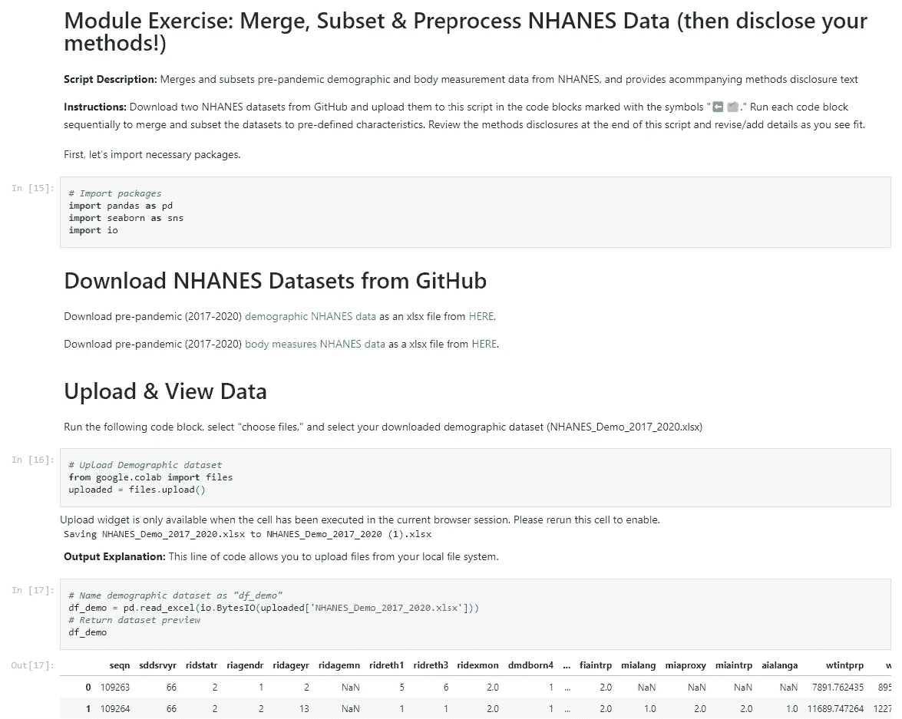

**Fig 7:** Snippet from [Exercise 3](https://www.mdsd4health.com/modules/module-2-the-role-of-disclosure/replicability-reproducibility-in-ml#h.l7zz36z54pv2)

最后两个练习分别在子模块 [3.1](https://www.mdsd4health.com/modules/module-3-mdsd-methods-mediums-pt-i/datasheets-for-datasets) 和 [4.1](https://www.mdsd4health.com/modules/module-4-mdsd-methods-mediums-pt-ii/model-cards) 中提供，涉及文献中提出的两个 MDSDs:数据集和[模型卡](https://dl.acm.org/doi/10.1145/3287560.3287596)的[数据表。子模块 3.1 中的](https://dl.acm.org/doi/10.1145/3458723)[练习](https://www.mdsd4health.com/modules/module-3-mdsd-methods-mediums-pt-i/datasheets-for-datasets#h.gnagkgt2n16n)提供了一个脚本，该脚本为前一模块中创建的 NHANES 数据子集生成数据表。学习者上传他们的子集，以获取关于数据集特征(形状和数据类型频率)的自动披露，并根据他们在之前练习中进行的获取和预处理活动，在脚本中指明的地方提供手动披露。该脚本利用 [PyFPDF](https://pyfpdf.readthedocs.io/en/latest/) 包来生成数据表并将其导出为 PDF。

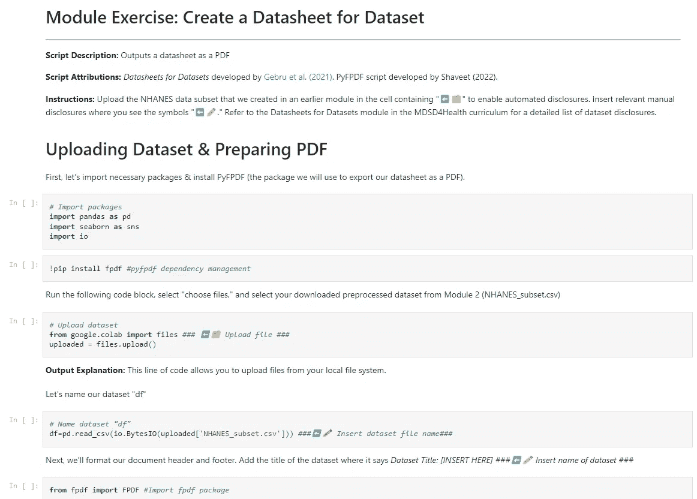

**Fig 8:** Snippet from [Exercise 4](https://www.mdsd4health.com/modules/module-3-mdsd-methods-mediums-pt-i/datasheets-for-datasets#h.gnagkgt2n16n)

在课程的[期末练习](https://www.mdsd4health.com/modules/module-4-mdsd-methods-mediums-pt-ii/model-cards#h.p2md6mqehewc)的子模块 4.1 中，学员为使用[威斯康辛州](https://archive.ics.uci.edu/ml/datasets/Breast+Cancer+Wisconsin+(Diagnostic))乳腺癌 [(诊断)数据集](https://archive.ics.uci.edu/ml/datasets/Breast+Cancer+Wisconsin+(Diagnostic))作为 HTML 页面开发的分类器创建并导出模型卡。该练习基于谷歌云团队提供的现有笔记本电脑，作为他们模型卡工具包的一部分。对原始笔记本所做的更改包括添加注释、注解、代码块解释的扩展/重新措辞以及模型评估步骤的重新安排；但是，所有可执行代码都保持不变。

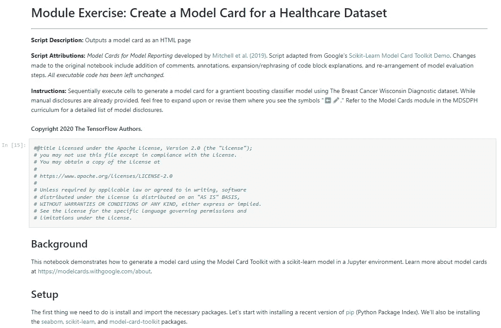

**Fig 9:** Snippet from [Exercise 5](https://www.mdsd4health.com/modules/module-4-mdsd-methods-mediums-pt-ii/model-cards#h.p2md6mqehewc)

## *其他特性*

除了组织成模块、子模块和部分的主要课程之外，还可以通过其他网站功能获得 MDSD4Health 内容。

*   [主页:](https://www.mdsd4health.com/home)mdsd 4 health 主页欢迎来到 MDSD4Health.com，并引导用户了解该课程的目的和指导思想，包括“全民机器学习教育”、“卫生相关自动化的透明度”和“信息作为公共产品”该页面最后有一个标题为“开始探索”的部分，带有超链接图标，方便用户了解课程内容。

**Fig 10:** Snippet from MDSD4Health [home page](https://www.mdsd4health.com/home)

*   [学习指南:](https://www.mdsd4health.com/learning-guide)《MDSD4Health 学习指南》是一份附带的课程文档，通过简短的章节描述、关键概念和预计完成时间，对 mdsd 4 health 内容进行了高度概括。它旨在供那些自己复习 MDSD4Health 课程或将内容整合到现有课程中的个人使用，以更有效地确定感兴趣的部分。

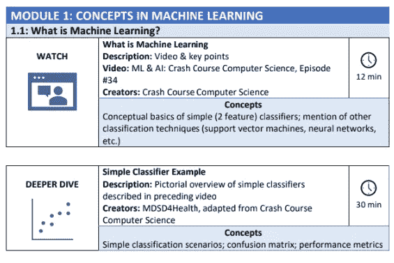

**Fig 11:** Snippet from MDSD4Health [Learning Guide](https://www.mdsd4health.com/learning-guide)

*   [“关于课程”页面:](https://www.mdsd4health.com/about-the-curriculum)“关于课程”页面提供了关于 MDSD4Health 的常见问题和预期问题的答案，包括“什么是 MDSD4Health.com？”“谁创建了这个课程？”"为什么关注模型和数据集的披露？""我可以在哪里提出修改课程的建议？"和其他人。

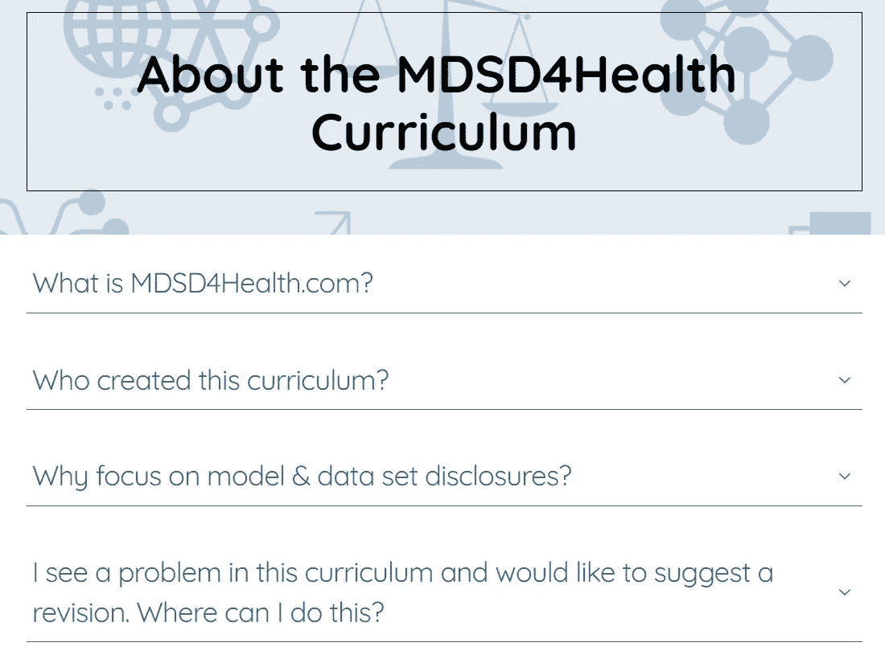

**Fig 12:** Snippet from MDSD4Health [“About the Curriculum”](https://www.mdsd4health.com/about-the-curriculum) page

*   [资源:](https://www.mdsd4health.com/resources)mdsd 4 health 课程提供了一个资源页面，提供以下各个领域的相关信息:

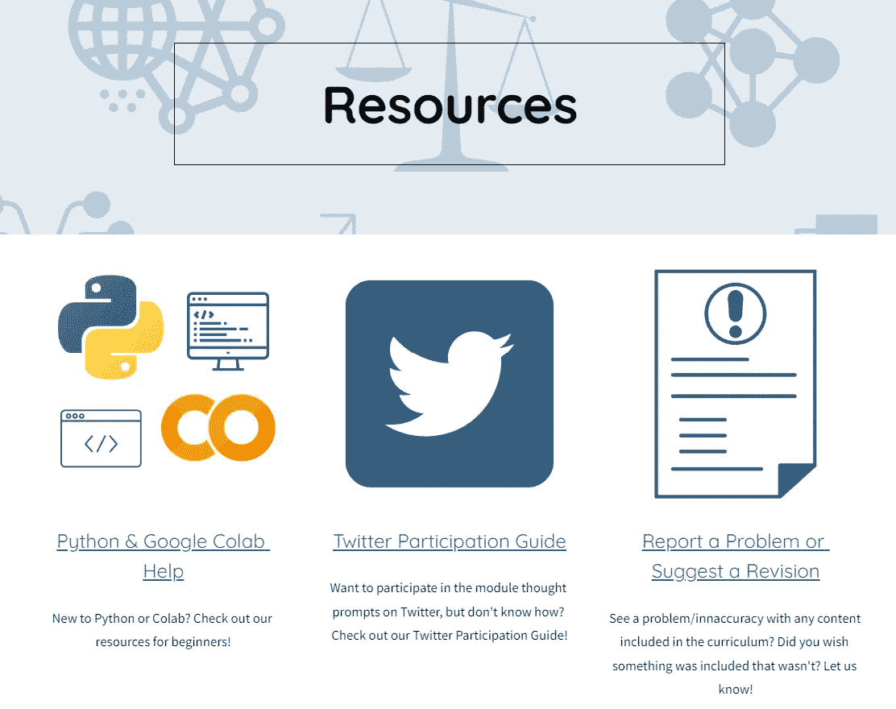

**Fig 13:** Snippet from MDSD4Health [Resources](https://www.mdsd4health.com/resources) page

1.  [Python & Colab Help:](https://www.mdsd4health.com/resources/python-colab-help) 因为所有的 MDSD4Health 练习都是通过 Colab 笔记本用 Python 提供的，所以 MDSD4Health 提供了一个专门支持学习者使用 Python 和 Colab 的页面。在这个页面中有对 Python(一种高级通用编程语言)和 Colab(一种免费访问的、基于云的、浏览器内 Jupyter 笔记本环境)的解释，以及到各种支持资源的链接，包括 Python 初学者指南、Python 备忘单、Colab 教程和用于故障排除的堆栈溢出的直接链接。
2.  [报告问题或建议修改:](https://www.mdsd4health.com/resources/report-a-problem-or-suggest-a-revision)为了实现持续改进，MDSD4Health 通过对内容的建议修改来利用其学习者的集体见解。鼓励学习者通过反馈表报告问题和可疑的内容不准确之处(通过反馈表，他们还可以建议或要求增加内容)。具有 Python 编程经验的学习者，如果认为有更好或更优雅的方法来组织练习，也可以通过直接链接到 MDSD4Health GitHub 存储库提出修改建议。
3.  [Twitter 参与指南:](https://www.mdsd4health.com/resources/twitter-participation-guide) MDSD4Health 使用社交媒体平台 Twitter，通过几个子模块末尾的一系列“思想提示”来促进讨论。我们鼓励学员通过使用提供的标签和标记 MDSD4Health Twitter 帐户，有选择地参与子模块相关的讨论。为了确保想要参与 Twitter 的学习者做好准备，MDSD4Health 提供了一个“Twitter 参与指南”,提供了关于如何标记我们以及如何使用标签的信息。对于 Twitter 的新用户，这个页面链接到 Twitter 平台开发和提供的“Twitter 入门”指南。最后，本指南包含两个精选 Twitter 列表的链接，其中包含学员可能有兴趣关注的人的推文:

*   [MDSD 开发者:](https://twitter.com/i/lists/1545046715773751296)开发或发布了 MDSD4Health 中推荐的模型或数据集公开(MDSD)方法的 Twitter 用户列表
*   [MDSD4Health 内容来源:](https://twitter.com/i/lists/1545070044283109377)mdsd 4 health 中引用的创建者和平台的 Twitter 帐户列表

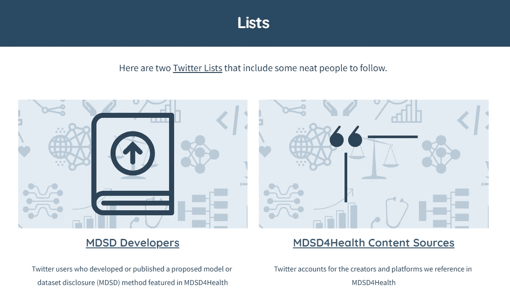

**Fig 14:** Snippet from MDSD4Health [Twitter Participation Guide](https://www.mdsd4health.com/resources/twitter-participation-guide), featuring [Twitter Lists](https://www.mdsd4health.com/resources/twitter-participation-guide#h.o1s20ffi6qd8)

## *课程复习&修改*

mdsd 4 健康课程网站的开发和改进是基于多位 ML-literated 同事和导师的审查和反馈，包括:

*   Vivian Neilley，硕士(MDSD4Health 项目导师兼谷歌云产品经理)
*   Ramya Palacholla，医学博士，公共卫生硕士(塔夫茨大学医学院卫生信息学和分析硕士项目主任)
*   Vahab Vahdatzad，博士，硕士(塔夫茨大学医学院人工智能和大数据在医疗保健中的介绍课程联合主任)

根据他们的反馈对 MDSD4Health 进行的改进包括:

*   在学习指南中增加了完成时间估计，以帮助用户更容易地收集每个部分所需的大致时间
*   增加了有关中等或高等教育教师如何教授与 ML 方法透明性相关的类似或邻近材料的信息，可以将 mdsd 4 健康材料纳入他们自己的课程
*   创建由与 MDSD4Health 相关的用户组成的 Twitter 列表，供学习者跟踪
*   设计并纳入一个与健康相关的分类用例，以配合子模块 1.1 中突出显示的用例
*   从子模块 1.1 的主要课程内容中删除人工神经网络计算，因为它们很复杂，并被替换为“额外材料”

# **讨论**

## 预期结果

这项工作的主要目标是开发一个教育资源，可用于在卫生背景下教授和学习 MDSDs。这项工作的预期成果是增加对 MDSD 及其在健康环境中的相关性的接触，从而促进 MDSD 方法在健康环境中的公平使用、采用和最终标准化(如 Vivian Neilley 的工作最初提出的方法，该项目正是基于该方法)。

## 后续步骤

这项工作的第二个目标是为其他对医疗保健或公共卫生 ML 模型透明度感兴趣的人确定机会，以建立这项工作，正如我对 Vivian 的最初贡献所做的那样。因此，这项工作的下一步是收集网站用户的反馈，以确定网站和课程的改进。反馈将通过网站的反馈表进行编辑，并通过 GitHub 上的 pull requests 保存在建议出处中。

# 结论

虽然在医疗保健领域或其他领域没有记录已训练的 [ML 模型](https://dl.acm.org/doi/10.1145/3287560.3287596)的性能特征的行业标准，也没有在 [ML 数据集](https://dl.acm.org/doi/10.1145/3458723)的管理和预处理中使用的限制或方法，但是已经提出了几种披露方法和媒介，并努力将其标准化【参见[此处](https://dl.acm.org/doi/10.1145/3287560.3287596)、[此处](https://dl.acm.org/doi/10.1145/3458723)、[此处](https://arxiv.org/abs/1808.07261v2)、[此处](https://arxiv.org/abs/1805.03677)和[此处](https://direct.mit.edu/tacl/article/doi/10.1162/tacl_a_00041/43452/Data-Statements-for-Natural-Language-Processing)】。然而，这些标准化工作的一个主要障碍是缺乏关于在卫生领域使用 MDSDs 的目的和价值的教育资源，以及推广其使用的培训有限。通过开发和提供低门槛、免费的 MDSD 健康课程 MDSD4Health，我们旨在填补这一空白。MDSD4Health 网站现已上线，可在[https://www.mdsd4health.com/.](https://www.mdsd4health.com/.)使用

## 你可以参与的方式

欢迎所有人对 mdsd 4 健康课程进行回顾和评论。

如果您想提出修改建议、报告内容错误或请求新的内容主题，请通过我们的[反馈表提出。](https://docs.google.com/forms/d/e/1FAIpQLSdkQHMIZIAb85X17GF15vE7NBRmfGYPSuhH8vl2C41CkP6QLA/viewform)

如果你想修改我们的练习，请在 [GitHub 上提出请求。](https://github.com/EdenShaveet/Disclosure-Curriculum)

如果你想成为 MDSD4Health 的志愿者，请给我们发一封[电子邮件](mailto:mdsdpublichealth@gmail.com)。

# 承认

这项工作是在我于 2022 年 7 月在塔夫茨大学医学院完成健康信息学和分析理学硕士学位的过程中进行的。这个项目是在 [Google Cloud](https://medium.com/u/4f3f4ee0f977?source=post_page-----7b10caa594e7--------------------------------) 的 [Vivian Neilley](https://medium.com/u/a393b3043091?source=post_page-----7b10caa594e7--------------------------------) 硕士和塔夫茨大学医学院的 Ramya Palacholla 医学博士和公共卫生硕士的指导下进行的。

我非常感谢 Vivian 和 Ramya 在整个项目中的支持，以及 Vahab Vahdatzad 博士对课程内容和组织的周到反馈。

我还要感谢我的研究生院同事和塔夫茨大学卫生信息学和分析理学硕士(MS-HIA)和公共卫生硕士(MPH)项目的同学，感谢他们在这个项目的所有阶段给予的持续支持和反馈。

# **参考文献**

谷歌云。什么是机器学习？谷歌云。2022 年 6 月 5 日接入。[https://cloud.google.com/learn/what-is-machine-learning](https://cloud.google.com/learn/what-is-machine-learning)

乔丹米，米切尔 TM。机器学习:趋势、观点和前景。*科学*。2015;349(6245):255–260.doi:10.1126/science.aaa8415

关于机器学习中的偏见和公平的调查。 *ACM 计算机监测*。2021;54(6):1–35.doi:10.1145/3457607

Mhasawade V，Zhao Y，Chunara R .公共和人口健康中的机器学习和算法公平。*自然机器智能*2021;3(8):659–666.doi:[10.1038/s 42256–021–00373–4](https://doi.org/10.1038/s42256-021-00373-4)

Gianfrancesco MA，Tamang S，Yazdany J，Schmajuk G .使用电子健康记录数据的机器学习算法中的潜在偏差。美国医学会杂志实习生医学。2018;178(11):1544.doi:10.1001/jamainenmed . 2018.3763

当一个算法削减你的医疗保健时会发生什么？*濒临*。2018 年 3 月 21 日在线发布。[https://www . the verge . com/2018/3/21/17144260/医疗保健-医疗补助-算法-阿肯色州-脑瘫](https://www.theverge.com/2018/3/21/17144260/healthcare-medicaid-algorithm-arkansas-cerebral-palsy)

Rajkomar A，Hardt M，Howell MD，Corrado G，Chin MH。确保机器学习的公平性以促进健康公平。安实习医生。2018;169(12):866.doi:10.7326/M18–1990

在用于管理人口健康的算法中剖析种族偏见。*科学*。2019;366(6464):447–453.doi:10.1126/science.aax2342

O'Reilly-Shah VN，Gentry KR，Walters AM，Zivot J，Anderson CT，Tighe PJ。机器学习和围手术期风险评估自动化中的偏见和伦理考虑。 *Br J Anaesth* 。2020;125(6):843–846.doi:10.1016

医疗保健中机器学习模型再现性的挑战。 *JAMA* 。2020;323(4):305.doi:10.1001/2019.20866

米契尔，吴，萨尔迪瓦，等。模型报告的模型卡。载于:*公平、问责和透明会议记录*。ACM2019:220–229.土井指数:10.1145/328758638687

Gebru T，Morgenstern J，Vecchione B，等。数据集数据表。 *Commun ACM* 。2021;64(12):86–92.doi:10.1145/3458723

阿诺德 M，贝拉米 RKE，欣德 M，等。资料表:通过供应商的符合性声明增加对人工智能服务的信任。2018 在线发布。doi:10.48550/ARXIV

《数据集营养标签:推动更高数据质量标准的框架》。2018 在线发布。doi:10.48550/ARXIV.1805.03677

自然语言处理的数据陈述:减少系统偏差和实现更好的科学。 *TACL* 。2018;6:587–604.doi:10.1162/tacl_a_00041

拥抱脸。创建数据集卡片。拥抱脸。[https://huggingface.co/docs/datasets/dataset_card](https://huggingface.co/docs/datasets/dataset_card)

数据集营养标签(第二代):利用上下文减轻人工智能中的危害。在线发布 2022。doi:10.48550/ARXIV.2201.03954

科林斯 GS，赖茨马 JB，奥特曼 DG，月亮 KGM。个体预后或诊断多变量预测模型的透明报告(TRIPOD):TRIPOD 声明。*安实习医师*。2015;162(1):55–63.doi:10.7326/M14–0697

HL7 FHIR 基金会。【https://www.fhir.org/ 号

内利诉*关于 R2O* 的重要性，卫生保健必须从气象学中学到什么。；2022.[https://www . stat news . com/2022/03/31/what-health-care-must-learn-from-meteorology-about-the-importance-of-r2o/](https://www.statnews.com/2022/03/31/what-health-care-must-learn-from-meteorology-about-the-importance-of-r2o/)

确定门诊护理从业者在电子健康记录中使用标准化护理语言的障碍。*美国执业护士学会杂志*。2012;24(7):443–451.doi:10.1111/j . 1745–7599.2012.00705 . x

Fischer F，Lange K，Klose K，Greiner W，Kraemer A,《指南实施中的障碍和策略——范围审查》。*医疗保健*。2016;4(3):36.doi:10.3390/医疗保健 4030036

公共卫生的未来。国家科学院出版社；1988:1091.doi:10.17226/1091

Shaveet E. MDSD4Health。MDSD4Health。2022 年 7 月出版。[https://www.mdsd4health.com/](https://www.mdsd4health.com/)

谷歌。谷歌网站。[https://sites.google.com/new](https://sites.google.com/new)

美国医学协会杂志。JAMA 网络。[https://jamanetwork.com/journals/jama](https://jamanetwork.com/journals/jama)

绿色 H 绿色 j 速成班。速成班。[https://thecrashcourse.com/](https://thecrashcourse.com/)

麻省理工科技评论。麻省理工科技评论。[https://www.technologyreview.com/](https://www.technologyreview.com/)

谷歌开发者。谷歌开发者。[https://developers.google.com/](https://developers.google.com/)

*微软 PowerPoint* 微软。[https://www.microsoft.com/en-us/microsoft-365/powerpoint](https://www.microsoft.com/en-us/microsoft-365/powerpoint)

YouTube。谷歌。[https://www.youtube.com/](https://www.youtube.com/)

*合作实验室*。谷歌。【https://colab.research.google.com/ 号

Python。Python 基金会。【https://www.python.org/ 

朱庇特。朱庇特计划。[https://jupyter.org/](https://jupyter.org/)

布伦加德 B. *猫 vs 狗？让我们制造一个人工智能来解决这个问题:速成人工智能 19 号。第十九卷。PBS 数字工作室；2019.[https://www.youtube.com/watch?v=_DZJV9ey1nE&list = pl 8 dpuualjxto 65 led 2 p 4 _ sb 5 xq 51 par _ b&index = 21](https://www.youtube.com/watch?v=_DZJV9ey1nE&list=PL8dPuuaLjXtO65LeD2p4_Sb5XQ51par_b&index=21)*

 [## Mlearning.ai 提交建议

### 如何成为 Mlearning.ai 上的作家

medium.com](/mlearning-ai/mlearning-ai-submission-suggestions-b51e2b130bfb)