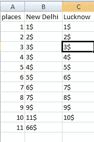

# 均值、中值和众数—数据科学

> 原文：<https://medium.com/mlearning-ai/mean-median-and-mode-data-science-3be1f6cffa18?source=collection_archive---------1----------------------->

在这个博客中，我们将学习均值，中位数，众数。

我们会通过这个数据来了解这三个话题。
披萨价格数据

Mean-Mean 表示平均值。您可以找到上述数据集(新德里和勒克瑙)的平均价格，则公式为—

> 平均值=所有价格的总和/价格数量

新德里的平均值是-10.63

> (1+2+3+3+4+5+6+7+9+11+66)/11=10.63

勒克瑙价格的平均值是-5.5

> (1+2+3+4+5+6+7+8+9+10)/10=5.5

平均值有一个问题，让我们看看新德里的平均值如此之高，因为只有最后的 66$值。新德里的整个数据集并不太高，但由于最后一个值，我们的平均值变得更高，所以这并不好。

对于这个问题，有一个中间值—

中位数是有序数据集中位于(n+1)/2 位置的数，其中 n 是数据数的个数。

幸运的是，我们的数据是有序的。

新德里价格的中位数——第六位价格——5 美元

> (11+1)/2=6

勒克瑙价格的中位数—第 6 位价格— 5.5 美元

> (10+1)/2=5.5，它是 5.5，所以我们取 5 和 6 位置价格的平均值。

正如你所看到的，新德里价格的平均值是 10.63，现在的中位数是 5 美元，所以这种技术提供了一点点新德里价格的有价值的信息。

现在又多了一个，Mode。

模式由频率决定。在数据集列中出现频率较高的值是 mode。

因此，在我们的数据集中，新德里价格模式是 3 美元，勒克瑙价格模式是零，因为没有任何值重复。你可以说有 10 种模式，但这毫无意义。

所以我希望你能理解。

谢了。

 [## Mlearning.ai 提交建议

### 如何成为 Mlearning.ai 上的作家

medium.com](/mlearning-ai/mlearning-ai-submission-suggestions-b51e2b130bfb)