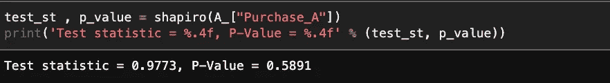
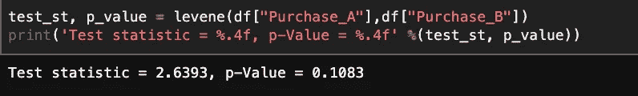

# 测量问题第一集:假设检验(A/B 检验)

> 原文：<https://medium.com/mlearning-ai/measurement-problems-episode-i-hypothesis-testing-a-b-testing-cad3b17c78b1?source=collection_archive---------9----------------------->

大家好，炎炎夏日，今天我们将和大家一起探讨测量问题，在本系列的第一篇文章中，我们将关注 AB 测试，这是假设测试之一。AB 检验是假设检验中的一种，是我们用来解释两组之间是否存在统计上的显著差异的方法。作为一种用法，AB 测试可以揭示在测试科学领域的新发展和在商业领域做出可以指导公司支出的决策方面的重要影响。因此，可以在坚实的基础上做出决定，在科学事实的基础上开展研究。AB 测试，如果使用的话，可以显示有益的效果，是一种可以推荐使用的方法，而不是原始的方法，如在成长型公司中投资和行动的试错法。

现在让我们一步一步地检查这个方法是如何工作的。

## 1.假设的建立

在建立假设的阶段，即 AB 检验的第一阶段，建立关于应用于数据的效果的假设。例如，移动应用程序的界面发生了变化。这种情况的假设:

H0:开发之后，使用该应用程序的用户数量没有变化。
H1(替代假设):在开发之后，使用该应用程序的用户数量发生了变化。

会在形式上。用数学的方式表达这些假设是:
H0 : M1 = M2
H1:它的形式是 M1 ≠ M2。这里的用户数量在某些环境中也可能以倍数的形式出现。M1 在这些数学表达式中表达的是效果前的用户数，平均值，而 M2 表达的是效果后的用户数，平均值。

关于建立假设的另一点是，在形成假设时有单向或双向方法。例如，对于一个网站，“用户在网站上花费的时间，在主页上的时间是 18 秒。”可以使用单边方法。我们也可以双向陈述同一命题。在这种情况下，我们的假设是，“在我们的网站上花费时间的用户，在 95%的置信区间内，在我们的网站上停留 72 秒到 88 秒。”会在形式上。

让我们澄清一个我们在最后一段用粗体和斜体突出显示的概念。置信区间是用户在研究中预先确定的值。置信区间，在文献中也称为α，是对研究敏感性的一种度量。我们进行研究的部门知识和经验是决定这一重要性水平的重要因素，而信心水平是根据这两个重要因素确定的。此外，置信区间还告诉我们，如果我们拒绝或拒绝一个情况或决定，我们将面临的风险水平。

重要性水平是研究中的重要里程碑之一。由于这种情况，在进行研究时，应该向决策者清楚透明地传达这些情况。否则，研究的结果将远远达不到预期，其危害将大于潜在的利益。

## 2.控制假设

假设建立后，我们进行假设控制，以确定研究中使用的测试。我们将检查两个假设。

1.  正态假设

****注:在检验正态性假设之前，如果必要的话，进行不影响数据一般结构的调整可能是有用的，例如月值分析、缺失值分析和数据操作。***

2.方差齐性假设。

正态性假设假设相关变量对于我们在数据集上测试的效果是正态分布的。而它的命题是“数据分布与理论正态分布没有显著差异”。为了检查正态性假设，shapiro-wilks 测试是用 python 进行的。如果我们通过这个测试得到的 P 值小于 0.05，我们将拒绝这个假设，我们将看到数据不是正态分布的。

An example of controlling to normality assumption

第二个假设是方差齐性假设。在方差分析中，一个结果出现在效果之后。这个结果是在影响前后取样的感兴趣变量的变化。使用方差齐性控制，我们检查影响后感兴趣变量的分布和影响前数据的分布是否相似。Levene 检验用于检验方差齐性假设。

An example of controlling to variance homogenity assumption

## 3.假设的应用

在这个阶段，在执行假设检查之后，我们根据已经获得的假设结果来确定我们将应用的测试。

在确定要应用的测试时，我们会考虑一些情况:

1.当检验正态性和方差齐性假设时，如果两个假设都满足，则进行两个独立的样本 T 检验。

**** *注:对照后，提供正态性假设；如果没有提供方差齐性，则再次使用 T 检验，但在检验过程中输入“equal_vars = False”参数。***

2.假设检验后，如果没有提供正态假设，则执行“ **Manwhitneyu** ”检验，这是非参数检验之一。

## 4.结果

在研究的最后阶段，在执行假设检查后，我们应用适合我们数据的检验(T 检验、manwhitneyu 检验)

然后，根据测试结果，我们对我们在研究开始时确定的 H0 和 H1 假设进行评论。在这个阶段，如果我们作为假设控制的结果确定的测试结果低于值 0.05，这是α值(P-val)，我们拒绝在研究开始时确定的 H0 假设。让我们记住我们在研究开始时确定的 H0 假设:

H0:开发之后，使用该应用程序的用户数量没有变化。
H1(替代假设):在开发之后，使用该应用程序的用户数量发生了变化。

我们系列的第一篇文章到此结束。我希望这对你来说是一次愉快的阅读课。下一篇文章再见:)

你可以访问[链接](https://github.com/ccemozclk/AB_testing)中的[我的 github 简介](https://github.com/ccemozclk)，以获得关于这篇文章的更详细的应用研究。

 [## Mlearning.ai 提交建议

### 如何成为 Mlearning.ai 上的作家

medium.com](/mlearning-ai/mlearning-ai-submission-suggestions-b51e2b130bfb)