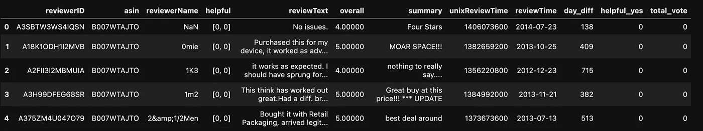
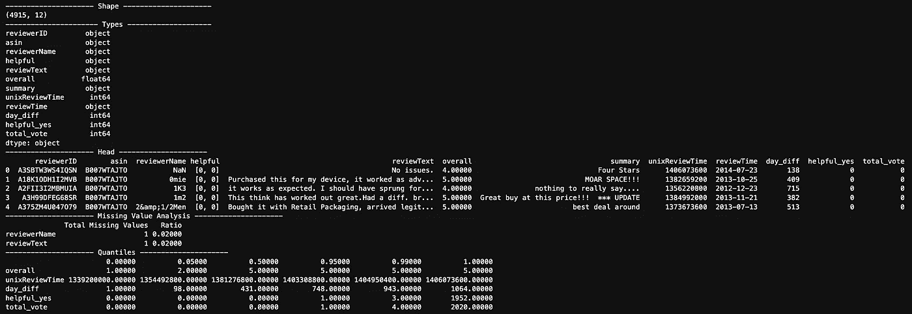
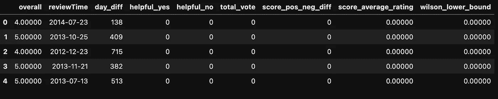
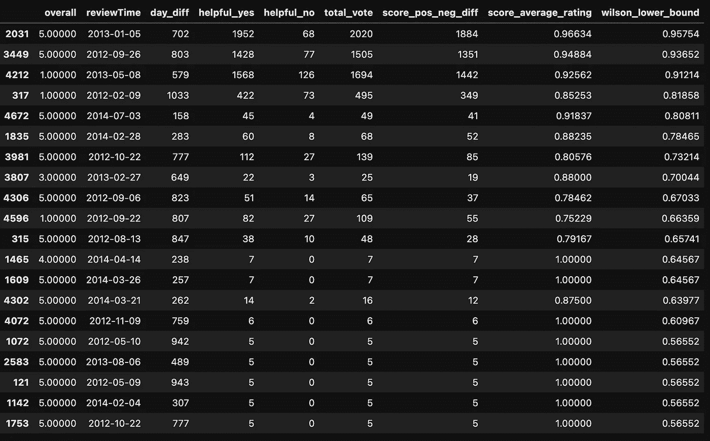

# 测量问题第二集:产品评级和分类——评论

> 原文：<https://medium.com/mlearning-ai/measurement-problems-episode-ii-rating-sorting-products-reviews-510d3dc72e3d?source=collection_archive---------6----------------------->

再次向您问好，这是我们测量问题系列的第二集。在我们之前的研究中，我们侧重于假设检验，研究了 AB 检验。在本文中，我们将解决电子商务行业中经常遇到的评级和排序问题。

在我们之前的研究中，我们侧重于假设检验，研究了 AB 检验。在本文中，我们将解决在电子购物领域经常遇到的评级和排序问题。

排序和评级是我们在电子商务世界中遇到的两个重要因素，在疫情时期更多地涉及到我们的生活，是我们可以在电子商务网站上执行购物过程时指导用户购买活动的概念，如果使用正确，这将提供巨大的利润并增加销售额。

更具体地说，假设你想通过互联网购买一台电脑。你进入你想买电脑的网站，搜索你想买的电脑。在你搜索的计算机上有几十种来自不同厂商的产品。那么，在几十个选项中，如何选择自己想买的产品呢？产品评分？通过看产品的评论？或者你两者都在考虑。那么，你感兴趣的产品被多少人购买和评论，甚至对它做出评价，这对你意味着什么？

我想提醒你注意一个问题。我想让你认为你遇到了一种情况，就像我们在上一段中举的例子一样。分数最高的产品是你搜索时出现的第一个，评论和评论最多的产品在顶部，甚至当你做出选择时，对你影响最大的评论也在顶部，甚至在产品的评论中，这绝不是巧合。所有这些都是有意识的应用，通过提供社会证明概念进行计算，并用于指导您的购买过程。

> 群体智慧对人们的日常行为有着巨大的影响。从政治到购物，人们被一种叫做群体智慧的超级巫术所引导。下面是如何准备它:
> 
> 3 克心理学
> 
> 2 克神经科学
> 
> 5 克统计数据
> 
> 1 台合适的计算机和一些计算技能

既然我们已经谈了足够多的关于什么是社会证明的问题，让我们进入实际的部分。

我们的数据集包含 Amazon.com 数据库中的产品信息、产品评级、产品评价以及其他用户是否发现这些评价有用。为了更好地了解数据集，可以在研究中多加强调。

第一步，让我们导入必要的库

我们还导入了数据集，在下一步中，让我们看看数据集的结构。

Overlook of the Amazon dataset

**reviewID** :购物者用户 ID

**asin** :产品 ID

**查看用户名**:进行购买的用户名

**有用**:对产品有用的评价程度

**审查文本**:审查、评论产品

**总体**:产品平均得分

**总结**:回顾总结

**unixReviewTime** :评论时间

**评论时间**:以 raw 格式评论的时间

**day_diff** :评估后的天数

**有用 _ 是**:对产品有用的评审次数

**total_vote** :产品评论总数

在更好地检查数据集之后，我们来看看数据集的结构和大小。

对数据集应用这两个函数后的数据集图像:

The Image of the dataset

*   ***注意:由于数据集仅包含产品的评论和评级，因此在数据集摘要中未使用 value_counts 方法。***

产品的第一个评价方法是获得产品的平均分。因此，我们获得了“**总变量**的平均值。

根据一些商业问题，获得产品的平均评估分数对于产品的评估可能被认为是足够的。然而，它并没有完全反映总体的现实。

作为评估中的第二阶段，我们将考虑时间因素，并分解从购买产品的用户购买产品到现在的时间段，我们将重点关注时间段。这样，我们就会把过去购买我们产品的用户的评论，和我们认为刚刚购买产品，没有机会做出正确评价的用户评论分开。

从时间段来看，没有太大的差异。但是随着天数的增加，总体变量会减少。如果我们只对天数进行评论，那么产品的价值会随着时间的增加而减少。产品的原始分数可以从 600 天(Q3 >)的平均值开始计算。

我们用时间加权法求出了产品的净点值。但在不同的商业问题中，根据商业问题对用户进行加权，就有可能在更坚实的基础上找到产品的得分水平。

找到产品的评分后，我们来列出对产品的评论和评价。通过使用社会证明因素，我们可以影响在网站上查看产品的用户的购买决策。

作为第一步，让我们得到无用评论的数量。为此，所有评论中有用评论的数量

第二步，我们删除数据集中不会用到的变量。我们正在使我们的数据集更有用。

在这一部分，我将向你介绍威尔逊下限分数。那么威尔逊下限分数是多少呢？总而言之，*它是一个用来给包含二元交互的产品、评论或物品打分的工具。

****注:条件产品或对象简称双交互，喜欢-不喜欢；上升速率—下降速率；有帮助——没有帮助。***

作为工作原理，威尔逊下限计算* *伯努利参数 p 的置信区间。它接受置信区间的下限作为威尔逊下限分数(WLB 分数)。

**** *注:伯努利被用作统计分布来计算二元状态的概率。***

让我们用一个例子来解释 WLB 评分的工作原理，首先，让我们假设对一个产品所做评论的* * *平均分是 0.6，在这种情况下我们由用户为这个产品设置一个置信区间<the confidence="" interval="" we="" set="" here="" is="">，“这个产品 95%的置信度解释将在 0.5–0.7 的范围内”。之后，我们将这个置信区间的下限 0.5 作为威尔逊下限分数。</the>

**** * *注:我们将产品的平均得分值计算为 Up 率(有帮助率)/ All 率。***

让我们定义在对产品的评论进行评级时使用的另外两个评估指标，并对这两个值分别进行评分。这样，我们将有机会从不同的角度解释对产品做出的评级，并对其进行正确排序。

首先，让我们定义上下差异得分函数。上下差异分数是通过从产品的正比率中减去负比率得到的。两者之间的差异被认为是上下差异分数。

另一个度量标准是平均得分标准。根据这一标准，我们对所有比率值的上升比率值进行评级，我们将其视为正比率。即上行速率/(上行速率+下行速率)。但是，此计算指标中存在潜在的错误。所以让我们检查两种情况:

在第一种情况下，对产品的评论进行了 2 次正面评价 0 次负面评价。在这种情况下，乘积的平均值将是 2/(2+0) = 1.0。在第二种情况下，应对产品进行 100 次阳性率和 1 次阴性率评估。在这种情况下，平均比率将为:100/(100+1) = 0.99。当根据评论平均评分值进行排名时，评分值为 1.0 但评论评分较低的产品将被置于平均评分为 0.99 的产品之上。所以不提供社会证明因素。

数据集的最终图像如下:

Final shape of the dataset

现在，让我们来评估我们的结果，根据威尔逊下限分数对前 20 条评论进行排名。

Sorting the comments made about the product

要总结排序表:

*   当我们查看顶部的观察结果时，我们可以看到它们具有最高的总投票值。我们也可以解释为被评价的产品提供了社会证明，导致其在排名中靠前。
*   当我们注意顶部的观察值时，当我们看 helpful _ yes 和 helpful _ no 分布时，我们看到 yes 值很高。
*   此外，当我们查看 day_diff 变量时，我们看到具有某些值<158, such as 283>的产品出现在顶部，这向我们显示了具有潜力的产品。换句话说，看到未来销量最大的产品也不会是什么惊喜。
*   最后，在考察整体变量时，虽然有些产品的平均值为 1.00，但却在排名的前列。这是由于社会证明因素。换句话说，大量受众对一款产品的评价，影响了该产品在这份榜单中的排名逻辑。

我们已经到了对我们的一系列测量问题的第二次也是最后一次研究的尾声。下期文章再见:)

你可以从[链接](https://github.com/ccemozclk/Amazon_product_Sorting)到达这个作品的 github 库，你可以通过访问[我的 github 个人资料](https://github.com/ccemozclk)看到我的其他作品。

## **参考文献:**

 [## 作为社会证明的分类&统计世界的分类向导:E.B .威尔逊

### 是的，我知道分院帽不是威尔逊的下界测试，而是一个分类器，但是我真的很喜欢哈利波特，所以，抱歉…

ardabaysallar.medium.com](https://ardabaysallar.medium.com/sorting-as-a-social-proof-the-sorting-wizard-of-statistics-world-e-b-wilson-3cb10e44401b)  [## Mlearning.ai 提交建议

### 如何成为 Mlearning.ai 上的作家

medium.com](/mlearning-ai/mlearning-ai-submission-suggestions-b51e2b130bfb)