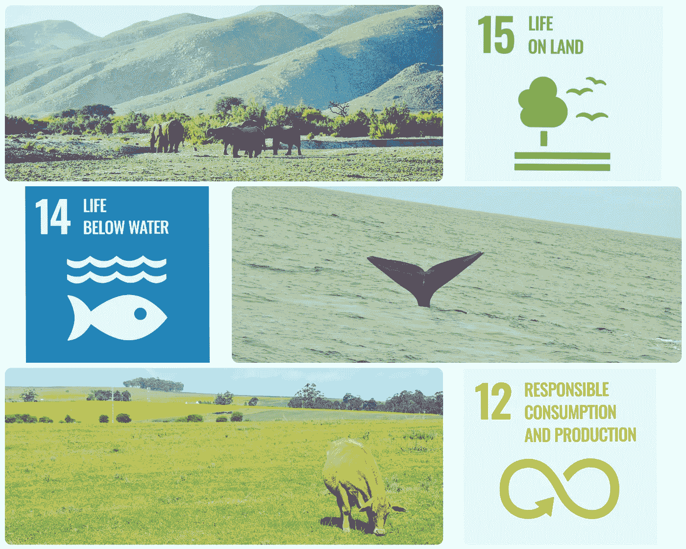

# 测量生物多样性——机器学习如何帮助实现影响目标

> 原文：<https://medium.com/mlearning-ai/measuring-biodiversity-how-machine-learning-can-help-achieve-impact-goals-7ceb38e5aba?source=collection_archive---------5----------------------->

## 人工智能被用于测量生物多样性损失和帮助保护努力恢复和重建的 3 种方式

SDGs linked to conservation and biodiversity (Photos © Sayuri Moodliar)

几十年前，一个由科学家和学生组成的小团体会测量生物多样性，方法是在敏感或脆弱地区划定一块有代表性的土地，计算物种的数量和丰度，并使用统计方法从数据中推断结论和预测。这在地方或区域一级运作良好。

自那时以来，不断增长的人口对食物和资源的需求导致了大范围的土地退化和森林砍伐，以前所未有的全球规模破坏了我们星球的生物多样性。地球上的整个生态系统已经变得脆弱和危险。

联合国将几个与生物多样性相关的目标纳入了人类力争在 2030 年前实现的可持续发展目标。政府、非政府组织、公司、社区和个人发起了数以千计的倡议，试图实现这些目标。难题在于如何衡量这些计划的影响以评估我们是否正在实现 SDG。

正在进行的大量数据的收集和分析需要比参与这些研究的一小组科学家更大的计算能力。这就是人工智能可以提供解决方案的地方。机器学习模型可以处理复杂的信息，也可以被训练来预测结果和趋势，使我们能够主动管理未来可能出现的风险。

以下是技术创新帮助实现可持续发展目标所包含的宏伟目标的三种方式…

## **1。口袋里的植物学家**

> SDG15(与陆地生物有关)包括保护和恢复生态系统，阻止生物多样性的丧失。像开普植物区这样高度生物多样化的地区在 100 万公顷的范围内有 9000 多种植物。即使我们有几个植物学家小组夜以继日地工作，也很难正确识别、计数和监控所有物种。

基于人工智能的平台和应用程序使任何拥有手机的人都能上传植物照片和 GPS 信息，并从其他用户那里获得关于物种识别及其纳入数据库的反馈。深度学习的进步也意味着可以训练模型从照片中识别物种，而无需不断的人类交互。

因此，农民、徒步旅行者、房主、游客、学生和其他社区成员可以大规模收集植物数据。机器学习使科学家能够分析这些大量的数据，预测它们的可持续性，并采取措施来减轻它们的灭绝。

## **2。游戏游侠 24/7 巡逻**

> 可持续发展目标包括保护和防止受威胁物种灭绝的目标，以及采取紧急行动制止偷猎和贩运受保护物种的目标。保护公园努力防止偷猎犀牛、大象和其他受保护物种。偷猎通常在事后被发现，那时动物的死亡或转移只能被记录而不能被阻止。

基于人工智能的安全摄像机系统能够检测保护区内的运动，并使用图像分类来识别运动是由动物还是人引起的。因此，偷猎者在攻击动物之前就能被发现，信息会实时发送给护林员，以便他们能立即做出反应。

捕捉偷猎者的图像，以便能够识别在特定区域活动的团伙，并保存有关个人的记录。还可以辨别行为模式，并对偷猎活动做出预测。

## **3。教人捕鱼…可持续发展**

> 几十年的过度捕捞导致海洋和河流中的鱼类数量减少。据估计，全球近四分之一的捕鱼是非法和不受监管的。SDG14(与水下生物有关)包括通过规范可持续捕捞做法和管理计划来恢复鱼类种群的目标。

利用技术管理鱼类资源是目前最具创新性的可持续发展领域之一。机器学习越来越多地被用来补充已经到位的声纳和电子监控系统，以提供端到端的可追溯性。

声纳技术已经被用来在鱼被捕获之前，即当它们还在水下时，监测它们的数量。正在进行使用机器学习来识别和分类不同物种的实验。该系统跟踪鱼类分布，并能够向渔民提出建议，说明在哪里可以找到最有利可图和可持续的捕鱼区。

对渔船的电子监控和全球定位系统技术也可用于监控它们的坐标，检测它们何时在限制区域或脆弱区域捕鱼，并标出特定区域的船只密度，以警示可能的过度捕捞。

安装在渔船上的摄像机通过视频监控被捕获的东西。机器学习分类模型可以用来识别正在捕获的物种，并将图像传输到中央数据库。

过度捕捞的后果之一是损失数百万吨的副渔获物(在捕捞过程中无意捕获的其他海洋生物)。像乒声器这样的标准声音威慑物已经被证明在防止这种情况上是无效的，因为它们实际上吸引了像海豹这样的动物，这些动物已经开始将声音与大量的鱼联系起来。正在测试的新模型通过声纳技术检测海洋动物，并使用机器学习分类按物种识别它们。然后，根据哪些动物靠近网，声音威慑被激活以发出特定的频率或不发出声音。对该模型的持续监测和训练有望提高减少海洋生物副渔获物损失的效率。

## 结论

保护生物多样性的传统方法不足以让我们在 2030 年前实现 SDG 目标。技术创新，特别是人工智能方面的创新，有助于自动化进程，以促进恢复和重建生物多样性的保护工作。