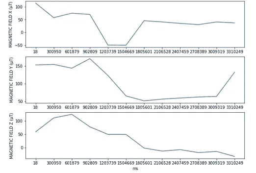
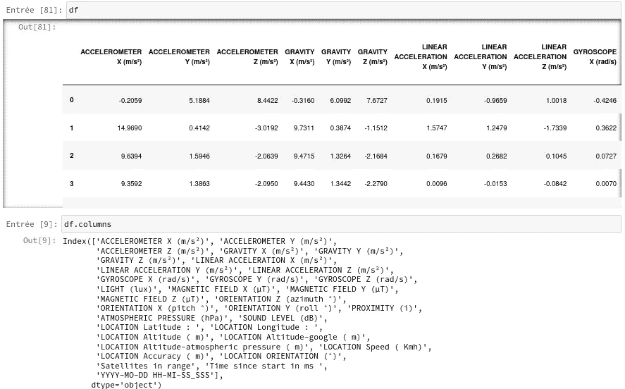
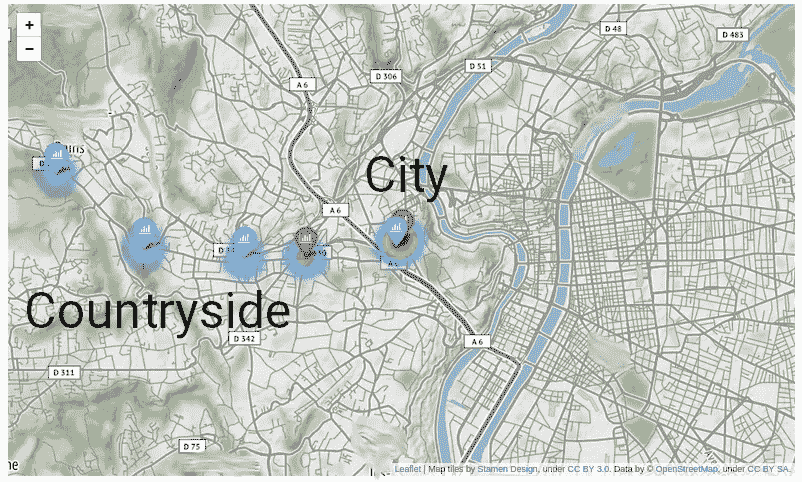

# 用“叶子”测量电磁场:城市与乡村

> 原文：<https://medium.com/mlearning-ai/measuring-electromagnetic-fields-with-folium-city-vs-countryside-c60280b8df46?source=collection_archive---------13----------------------->

有几个月的时间，我不得不从城市通勤到乡下去上班。我想做一点数据科学，测量城市内外电磁场强度的差异可能会很有趣😃。我使用了 AndroSensor 谷歌 Play 商店应用程序和我内置的电磁场手机传感器，在我上下班的时候收集数据。

## 子功能

## 加载数据

AndroSensor 应用程序测量 X、Y 和 Z 磁场强度方向。支线图显示，当我从城市旅行到农村时，平均电磁场强度下降。

AndroSensor 应用程序非常棒，因为它可以记录其他信息，包括加速度、陀螺仪、纬度、经度等等。

## 用叶子绘制数据

利用叶，我绘制了从城市到农村的平均电磁场强度。平均而言，城市和农村之间的电磁场强度存在显著差异，但显然城市中的这些水平是安全的。

练习愉快！👋

 [## Mlearning.ai 提交建议

### 如何成为 Mlearning.ai 上的作家

medium.com](/mlearning-ai/mlearning-ai-submission-suggestions-b51e2b130bfb)