# 用计算机视觉和三维重建测量物体。

> 原文：<https://medium.com/mlearning-ai/measuring-objects-with-computer-vision-and-3d-reconstruction-fb91600cb237?source=collection_archive---------1----------------------->

## *在这篇文章中，你将学习如何使用 Meshroom 从一组图像中生成 3D 重建，并使用它进行真实世界的测量*

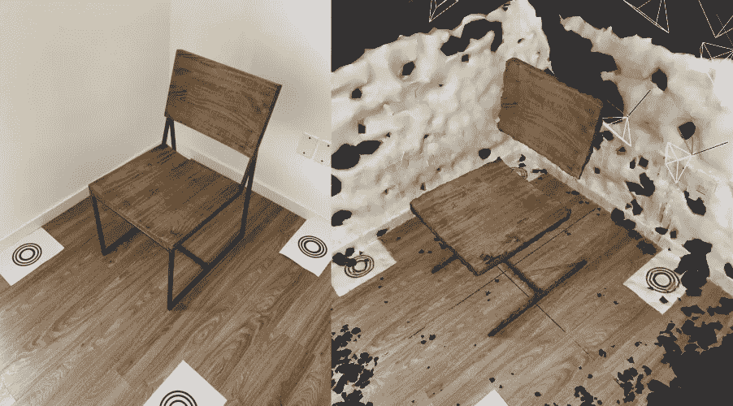

Real-world picture vs 3D reconstructed chair scene

在开发基于计算机视觉的系统或应用时，测量距离是一个常见的挑战。您可能想要测量检测到的对象的大小、场景中某些元素之间的距离，甚至是跟踪的对象移动的速度。

解决这个问题的一个简单而常用的方法是选择一个大小已知的参考对象，然后通过它与该对象的关系计算场景中的任何距离。这是一个简单快捷的解决方案，你可以跟随[这篇](https://www.pyimagesearch.com/2016/03/28/measuring-size-of-objects-in-an-image-with-opencv/) PyImageSearch 教程来学习如何用 OpenCV 来做这件事。但是这种简单的方法有一个很大的缺点，那就是这种方法只适用于被测物体和它们的参照物在同一个视角、同一个平面和同摄像机的距离上的受限情况。如果参照物离你要测量的物体很远，引入的失真会导致错误的测量。这很直观，你不能用手指去测量埃菲尔铁塔。

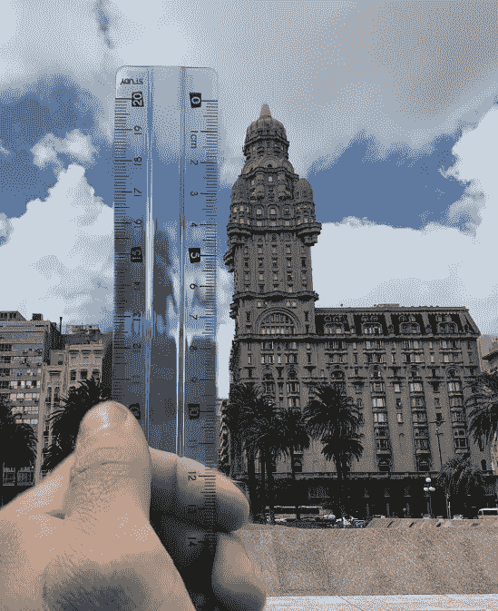

Measuring iconic Montevideo’s Palacio Salvo by a unfortunated choice of reference object can led to a lot of distortion.

在必须对固定场景进行多次测量的情况下，可以使用 3D 重建。从多个角度和位置扫描您的环境，并使用适当的软件，可以重建具有足够细节的 3D 重建，以非常精确地测量场景中任何点之间的距离。

三维重建是捕捉真实形状和尺寸的过程，在这种情况下，是从一组 2D 图像中捕捉的，这些图像取自普通的 RGB 手机摄像头。计算机视觉算法能够通过执行由两个主要步骤组成的流水线来构建解释图像的 3D 似是而非的几何图形:

*   来自运动的结构:用特征提取方法(SIFT/ ORB / KAZE)分析这组图像，并且这些特征用于匹配不同图像上的点。估计每个图像的相机参数、照片位置和方向，并且检测图像中可见的一组 3D 点。
*   多视图立体:获取该位置和方向信息，并生成 3D 密集点云。

这篇文章解释了在没有任何图像处理知识的情况下从 2D 图像构建 3D 模型的过程。我们测试了现有的 3D 重建工具，以了解其当前的质量，并检查对象测量的准确性。要了解更多关于管道背后的理论以及每个过程是如何工作的，可以从阅读[爱丽丝视觉网站](https://alicevision.org/#photogrammetry/)开始，它做了很好的总结，并链接了关于每个步骤的文献。图像处理很难理解，但幸运的是，合适的软件已经开发并发布，3D 重建的整个过程不再需要复杂的代码，而只需要点击按钮。

# 动手操作

有像 Meshroom 和 COLMAP 这样的 3D 场景重建开源选项，也有像 Photomodeler 和 RealityCapture 这样的付费选项。Meshroom 之所以被选来发表这篇文章，是因为它是开源的，有一个直观的界面，它足够快，不需要修改就可以得到一个好的初始结果，而不需要实际的尺寸测量。

因为场景本身是无量纲的，所以用真实测量值重建 3D 场景需要一些额外的步骤。这是由工作空间缩放设置的。获得绝对精确缩放的方法是在我们的场景照片中有已知距离的目标标记，并缩放 3D 模型，直到它与这些距离匹配。缩放过程可以在 Meshroom 上完成，也可以使用外部软件，如 Blender。

# 设置场景

在开始从场景中拍照之前，有一些注意事项需要考虑:

对于 amera:

1.  分辨率高，越高越好。
2.  将白平衡设定为固定值，不要使用自动白平衡。
3.  大镜头光圈，你希望整个场景都在焦点上，以提高特征匹配。
4.  低 ISO 消除噪音。
5.  快速快门速度，以避免运动模糊。

对于场景:

1.  漫射照明:你不希望你的场景被其中的物体投射出很大的阴影。自然光照通常效果很好。
2.  移动空间:你将在场景中四处走动，从尽可能多的角度和距离获取图像，所以要确保有足够的空间来这样做。
3.  CCTAG3 标记:缩放过程中最重要的部分是为目标标记使用正确的大小、位置和模式。更多信息请参见 CCTAG3 标记部分。

CCTAG 代表同心圆目标。顾名思义，它由不同半径的同心圆组成的目标。这些圆圈形成一个由三个黑色圆环组成的图像，圆环的大小模式将决定标记的 ID。

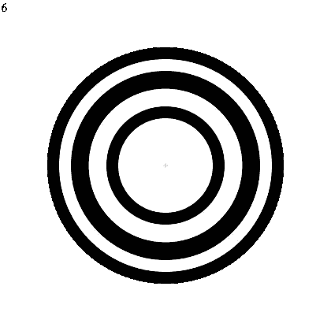

CCTAG3

Alice Vision 提供了一个带有代码的 [repo](https://github.com/alicevision/CCTag) 来生成您自己的标记以及一些预制的样本(关于如何生成标记的更多信息可以在[这里](https://cctag.readthedocs.io/en/latest/markers/markers.html)找到)。这是相关的，因为您希望标记足够大，能够被相机正确捕捉，而不会占据如此大的表面部分。标记应该打印出来并放置在场景中的平面上。

至于标记的实际放置，它们应该以场景包含在其中的方式排列。最后，了解放置在场景中的标记的正确 ID 及其位置非常重要(标记生成脚本提供了在标记中心打印 ID 和十字准线的选项)。在这种情况下，我将它们放在边长为 1 米的正方形中。

The scene and its measurements

一旦相机和场景设置完成，是时候捕捉我们的图像了！在这个过程中，建议在场景中走动，从不同的角度拍摄照片，以获得尽可能多的细节。没有一个推荐的照片数量，因为这取决于场景，但如果你的照片少于 40 张，你可能不会得到一个很好的结果。

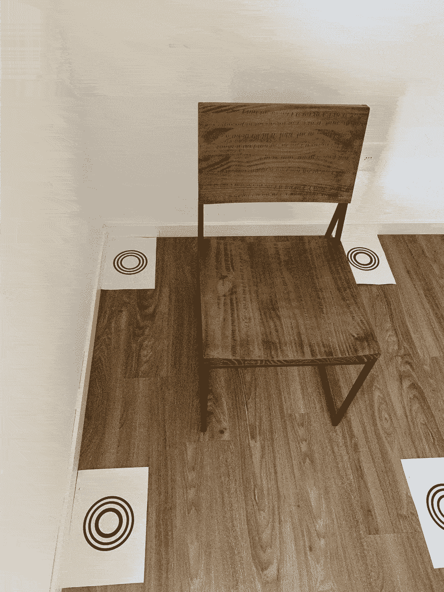

Images we took from the scene

拍摄完照片后，在不破坏文件元数据的情况下将文件移动到电脑是非常重要的。Meshroom 使用图片的元数据来获取有关相机的重要信息(如焦距)，这对正确的输出至关重要。

# 从网络空间开始

当启动程序时，您将会看到以下界面:

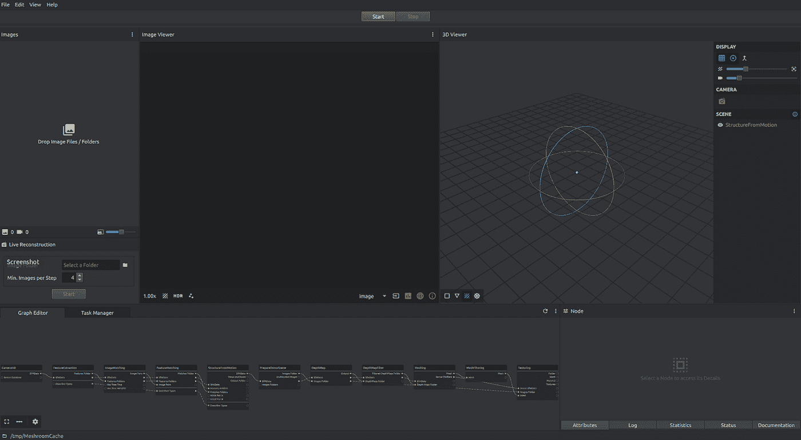

在界面的左侧是放置场景照片的地方，在底部是一系列由白线连接的矩形，代表 3D 重建的管道。导入图像后，它看起来会像这样:

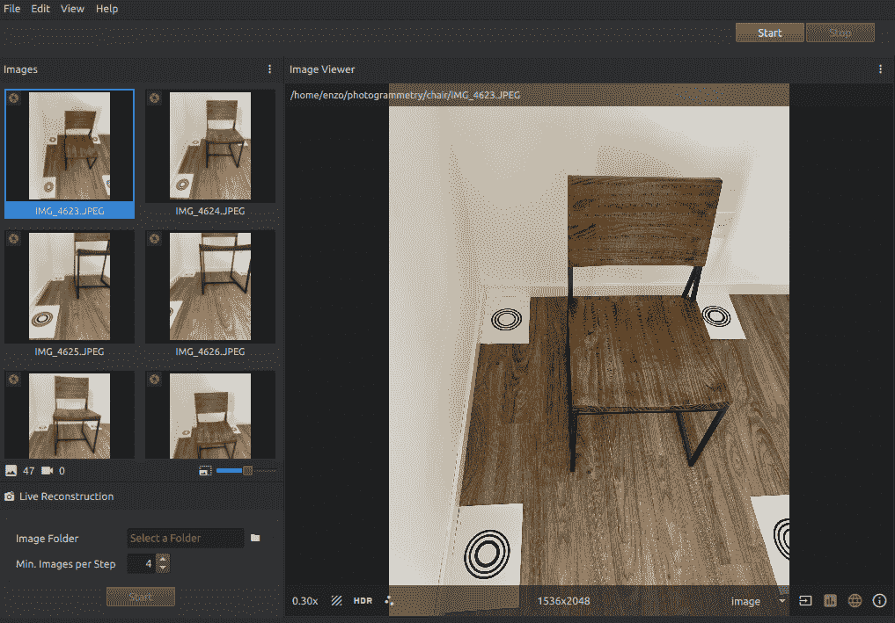

注意到每个微缩图像左上角的绿色圆圈了吗？这意味着图像的元数据足以从相机(在这种情况下是 iPhone XS)获得重建所需的所有信息。根据相机和它的元数据，圆圈的颜色也可以是黄色(可能还不错)或红色(不好，会有误差。在这种情况下，你应该尝试其他相机或使用 [AnalogExif](http://analogexif.sourceforge.net/help/) 来编辑照片的元数据)

添加照片并保存项目后，您应该能够通过单击绿色的“开始”按钮运行 3D 重建管道，并获得一个良好的 3D 模型，该模型不会有现实生活中的措施。我建议这样做，并在继续改变管道之前确保它能够工作。如果出现错误，您可以使用[官方样本数据集](https://github.com/alicevision/dataset_monstree/tree/master/full)，并且您需要知道问题是在图像中还是在其他地方。

# 变大

默认的图像处理管道输出可能没有真实大小，但它肯定与真实场景具有相同的距离关系。这意味着我们需要做的就是对模型进行比例变换，以匹配一组已知的距离。这是通过检测图像中的 CCTAGs，将“SfMTransform”节点添加到管道中，并手动设置该节点中每个标记的位置来实现的。

要检测 CCTAG3 标记，我们需要修改“FeatureExtracion”、“FeatureMatching”和“StructureFromMotion”节点中的“Descryber Types”字段，方法是选择“cctag3”和默认的“sift ”,如下所示:

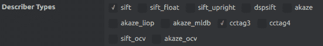

此外，添加“akaze”描述符以及“sift”和“cctag3”可以改善 3D 重建。

既然 CCTAG 标记检测是管道的一部分，我们需要添加一个节点，该节点将使用该信息来应用转换，该转换将使我们的模型达到真实大小。这是通过添加名为“SfMTransform”的节点来完成的(要添加一个节点，右键单击空白区域并写下其名称)，方法如下:

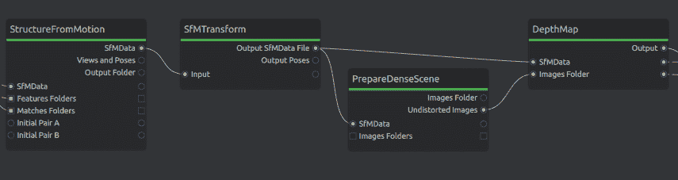

现在只需要修改“SfMTransform”节点，使其看起来像这样:

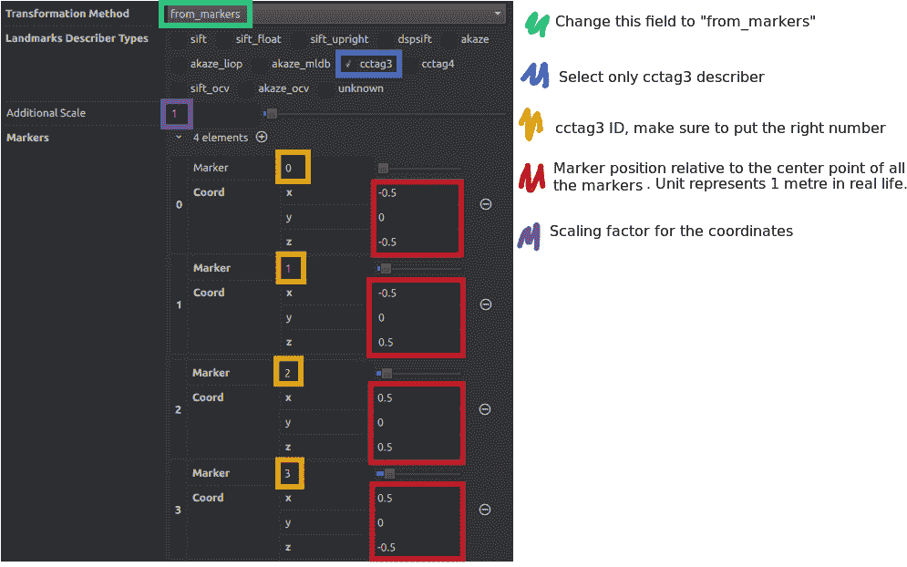

现在一切都准备好了，只需要点击绿色的“开始”按钮，这个过程就开始了。

# 验证 3D 模型

完成管道的所有节点后，您可以通过双击“纹理”节点在 Meshroom 中浏览带有纹理的模型:

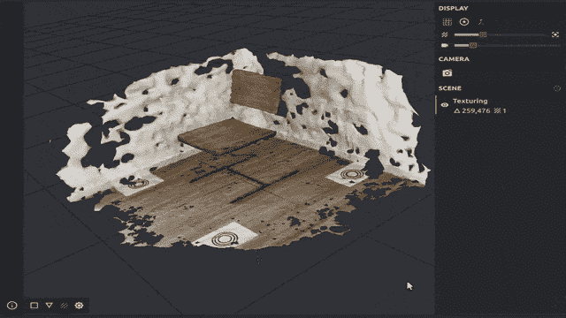

如果这个阶段的结果不够好，你可以在“特征提取”节点中增加“描述符质量”和“描述符密度”。如果仍然不够好，添加更多/更好的照片可能会有所帮助。

在这种特殊情况下，可以看到椅子的腿不能重建，这是因为材料的油漆涂层的无模式特性以及腿的复杂几何形状。表面缺乏特色，这也是为什么地板、椅背和椅座可以重建得很体面，但周围的白墙却不行的原因。

# 在 3D 场景中测量

现在，对于最后一部分，我们需要验证的措施是正确的，为此我们将打开我们的 OBJ 模型(可以在项目的保存目录中找到“纹理”文件夹)在 Blender 中，并使用测量工具:

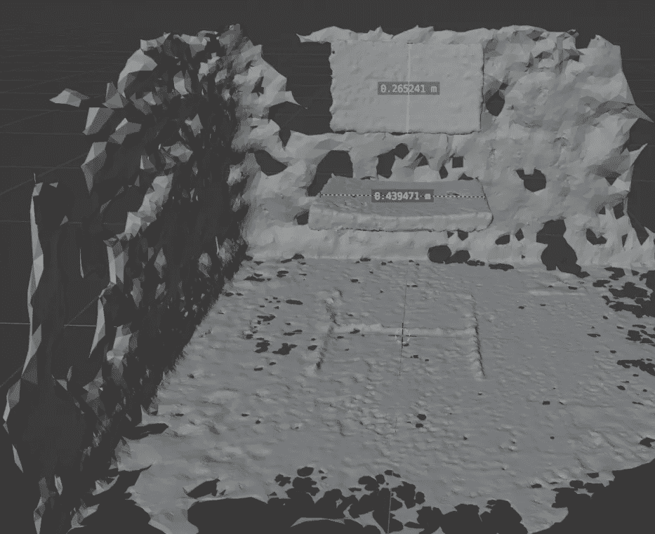

根据 Blender 的测量，椅子的靠背高 26.5 厘米，座位宽 43.9 厘米。

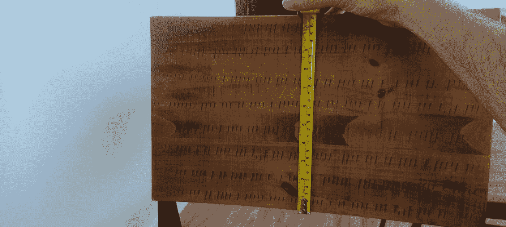

实际尺寸分别为 27 厘米和 45 厘米。这是相当准确的！

基于 SfM 结果，我们可以使用“摄像机定位”节点执行摄像机定位并检索 3D 重建场景中动画摄像机的运动。这对于在其他软件中作为纹理清理管道的一部分进行纹理重投影非常有用。也可用于利用 Meshroom 作为 3D 摄像机跟踪器。

如果我想找到一个不属于原始场景的物体的位置，该怎么办？已知相机在 3D 场景中的位置和方向及其固有参数，3D 世界坐标可以与该相机拍摄的图像的每个像素相关联。通过设置一些约束，如对象大小(与场景相比较小)和位置(对象停留在表面上，而不是漂浮在场景中间)，可以利用现代 2D 对象检测管道来实现 3D 真实世界比例的对象检测系统。通过这样做，像检测汽车和测量它们之间的距离甚至速度这样的应用程序就可以开发出来。

**三维重建能有多精确？**我们想看看这种技术能恢复多少细节。我们从一个小物体上拍摄了 70 张照片，结果令人印象深刻。表面上的每个细节都在 3D 模型上被正确地重建，证明了 3D 数字化的真正敌人是像墙壁一样颜色一致的平面，而不是充满细节的小毛利雕刻图腾。

**你可以在**[**totem . eidos . ai**](https://totem.eidos.ai)**查看生成的 3D 模型。**我们将它加载到 Three.js 上，以便您可以在浏览器上移动它，欣赏细节捕捉。

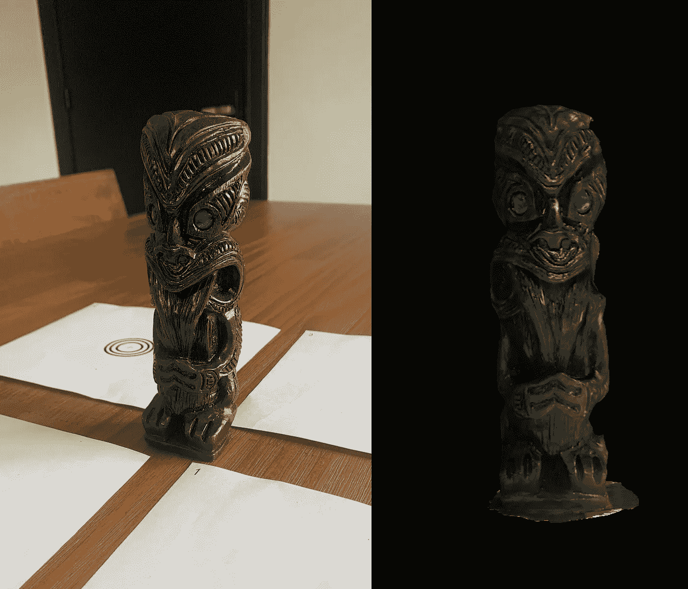

Real Vs Digitalized Totem. Check it out at [totem.eidos.ai](https://totem.eidos.ai) !

**我们是 eidos.ai，这是一个与创业公司和前瞻性公司合作的人工智能开发实验室。**

**更多了解我们的服务请访问**[**https://eidos . ai**](https://eidos.ai/)

 [## Mlearning.ai 提交建议

### 如何成为 Mlearning.ai 上的作家

medium.com](/mlearning-ai/mlearning-ai-submission-suggestions-b51e2b130bfb)