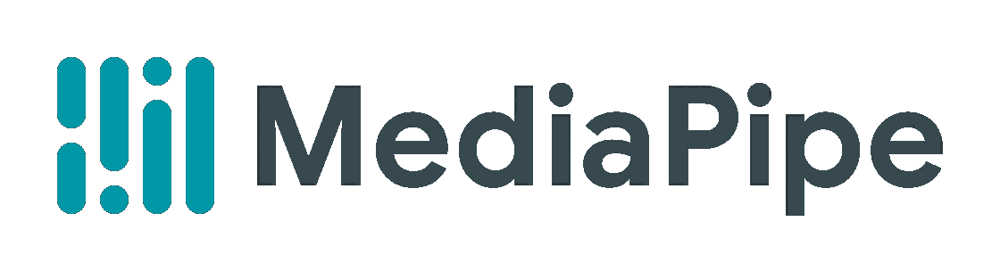
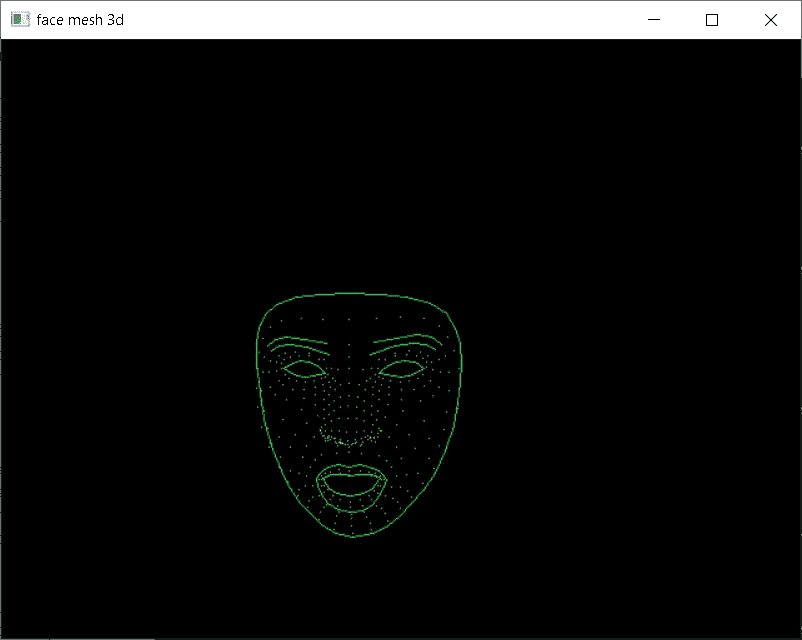
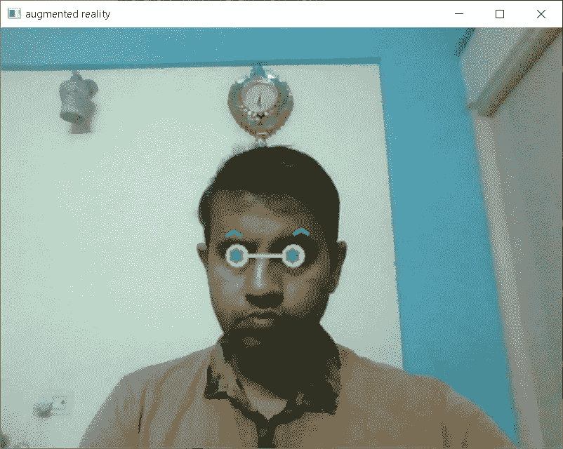

# 假人用 Python 制作的 MediaPipe

> 原文：<https://medium.com/mlearning-ai/mediapipe-with-python-for-dummies-3d3021da6705?source=collection_archive---------3----------------------->



MediaPipe 是 Google 的一个项目，它为直播和流媒体提供“开源、跨平台、可定制的 ML 解决方案”。换句话说，MediaPipe 提供了对各种强大的机器学习模型的访问，这些模型是在考虑到移动设备的硬件限制的情况下构建的。

MediaPipe 适用于 C++、Android 等；但是，在本教程中，我们将只使用 Python。基本思路可以看参考文献[1]。这里，我们将用简单的代码展示几个例子。请注意，我们使用的是 **MediaPipe 版本 0.8.3** 。

示例 1:三维面网格

> 这里我们将捕捉面网格(3D)；在空白画布上重新绘制，得到如下输出:



```
**#Code** with comments
import cv2 as cv
import mediapipe as mp
import numpy as npmpfacemesh = mp.solutions.face_mesh
FaceMesh = mpfacemesh.FaceMesh(max_num_faces=1)
mpdraw = mp.solutions.drawing_utils
drawspec1 = mpdraw.DrawingSpec(color = (255,255,0), circle_radius = 0, thickness = 1)
drawspec2 = mpdraw.DrawingSpec(color = (0,255,0), circle_radius = 0, thickness = 1)
webcam = cv.VideoCapture(0)while True:

 scc,img = webcam.read()
 img = cv.flip(img,1)
 h,w,c = img.shape
 blank_img = np.zeros((h,w,c), np.uint8)
 results = FaceMesh.process(img)

 if results.multi_face_landmarks:
  for face_lm in results.multi_face_landmarks:
   img = blank_img
   mpdraw.draw_landmarks(img,face_lm,
         mpfacemesh.FACE_CONNECTIONS,
         drawspec1,drawspec2)
 k = cv.waitKey(1)
 if k == ord('q'):
  break
 cv.imshow('face mesh 3d', img)webcam.release()  
cv.destroyAllWindows()
```

示例 2:简单的增强现实

> 在这里，我们首先将检测眼睛和眉毛；然后最后画一个虚拟眼镜(2D)得到如下输出:



```
**#Code** with comments
import cv2 as cv
import mediapipe as mp
import numpy as npmpfacemesh = mp.solutions.face_mesh
FaceMesh = mpfacemesh.FaceMesh(max_num_faces=1)
mpdraw = mp.solutions.drawing_utils
drawspec1 = mpdraw.DrawingSpec(color = (255,255,0), circle_radius = 0, thickness = 1)
drawspec2 = mpdraw.DrawingSpec(color = (0,255,0), circle_radius = 0, thickness = 1)
webcam = cv.VideoCapture(0)#following indices are available in mediapipe dev site
EYE_LEFT_CONTOUR = [
    249, 263, 362, 373, 374,
    380, 381, 382, 384, 385,
    386, 387, 388, 390, 398, 466]
EYE_RIGHT_CONTOUR = [
    7, 33, 133, 144, 145,
    153, 154, 155, 157, 158,
    159, 160, 161, 163, 173, 246]
LEFT_EYEBROW = [
    276, 282, 283, 285, 293, 295, 296, 300, 334, 336]

RIGHT_EYEBROW = [
    46, 52, 53, 55, 63, 65, 66, 70, 105, 107]while True:

 scc,img = webcam.read()
 img = cv.flip(img,1)
 h,w,c = img.shape
 results = FaceMesh.process(img)

 if results.multi_face_landmarks:
  for face_lm in results.multi_face_landmarks:
   X=[]
   Y=[]
   for lm in face_lm.landmark:
    X.append(int(lm.x*w))
    Y.append(int(lm.y*h))
   #left eye center
   xl = int(np.mean([X[i] for i in EYE_LEFT_CONTOUR]))
   yl = int(np.mean([Y[i] for i in EYE_LEFT_CONTOUR]))
   cv.circle(img,(xl,yl),9,(255,0,255),7)
   #right eye center
   xr = int(np.mean([X[i] for i in EYE_RIGHT_CONTOUR]))
   yr = int(np.mean([Y[i] for i in EYE_RIGHT_CONTOUR]))
   cv.circle(img,(xr,yr),9,(255,0,255),7)
   cv.line(img,(xl,yl),(xr,yr),(255,0,255),3)
   #eyebrows
   xlb = int(np.mean([X[i] for i in LEFT_EYEBROW]))
   ylb = int(np.mean([Y[i] for i in LEFT_EYEBROW]))
   xrb = int(np.mean([X[i] for i in RIGHT_EYEBROW]))
   yrb = int(np.mean([Y[i] for i in RIGHT_EYEBROW]))
   #final drawing
   cv.putText(img,'*',(xl-9,yl+9),cv.FONT_HERSHEY_SIMPLEX,1,(0,255,0),3)
   cv.putText(img,'*',(xr-9,yr+9),cv.FONT_HERSHEY_SIMPLEX,1,(0,255,0),3)
   cv.putText(img,'^',(xlb-9,ylb),cv.FONT_HERSHEY_SIMPLEX,1,(0,255,0),3)
   cv.putText(img,'^',(xrb-9,yrb),cv.FONT_HERSHEY_SIMPLEX,1,(0,255,0),3)

 k = cv.waitKey(1)
 if k == ord('q'):
  break
 cv.imshow('augmented reality', img)webcam.release()  
cv.destroyAllWindows()
```

注意，示例 1 给出 3D 输出，而示例 2 给出 2D 输出。如果你喜欢这个帖子，请鼓掌。保持联系，获取更多关于 Vision 的帖子。谢了。

```
References:[1] [https://google.github.io/mediapipe/](https://google.github.io/mediapipe/)
```

[](/mlearning-ai/mlearning-ai-submission-suggestions-b51e2b130bfb) [## Mlearning.ai 提交建议

### 如何成为 Mlearning.ai 上的作家

medium.com](/mlearning-ai/mlearning-ai-submission-suggestions-b51e2b130bfb)