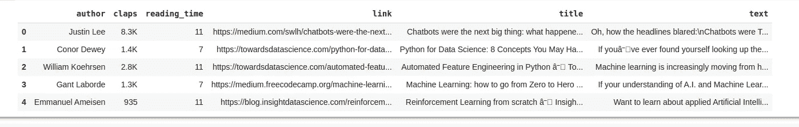
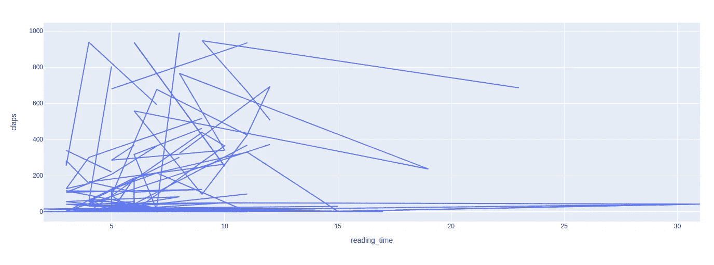
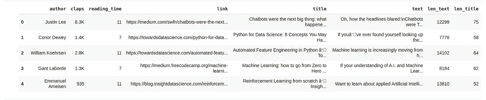
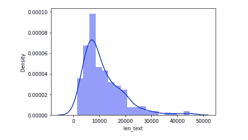
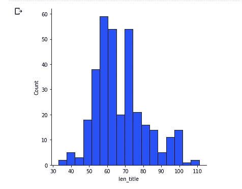
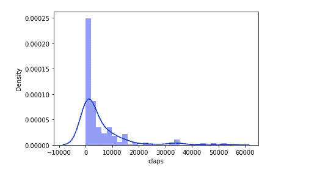
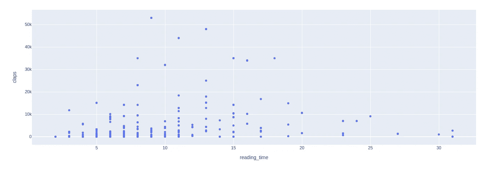
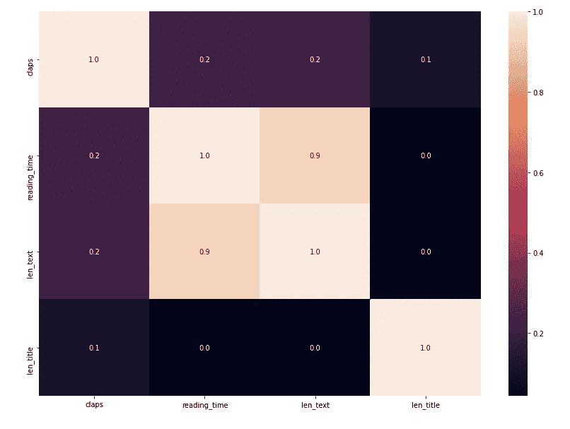
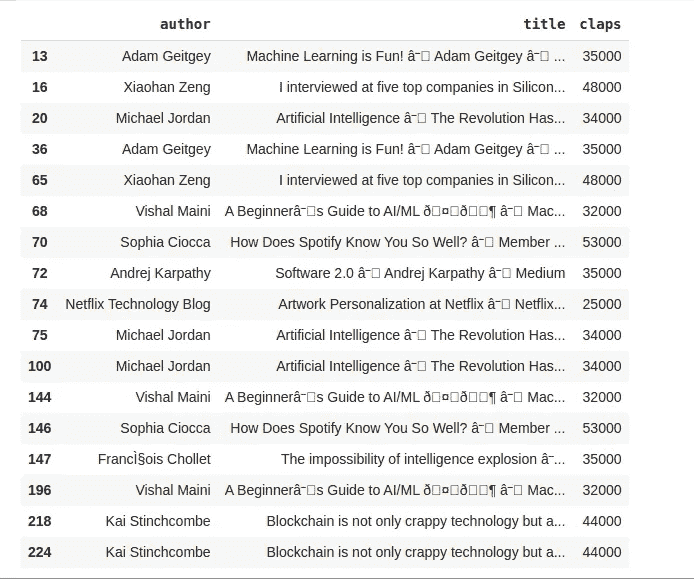
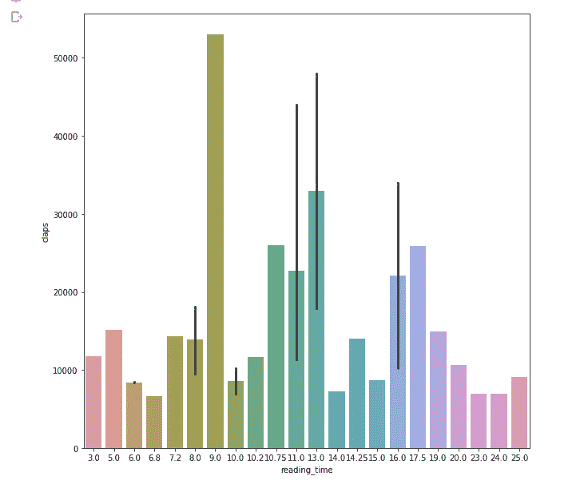

# 使用 Python 的中型文章数据可视化和分析

> 原文：<https://medium.com/mlearning-ai/medium-articles-data-visualization-and-analysis-using-python-730a538207ab?source=collection_archive---------0----------------------->

## 初学者和中间用户的数据分析项目


Photo by [Myriam Jessier](https://unsplash.com/@mjessier?utm_source=medium&utm_medium=referral) on [Unsplash](https://unsplash.com?utm_source=medium&utm_medium=referral)

你好，学习者..！！

我认为媒体现在是所有极客日常生活的一部分。众所周知，数据是信息时代的重要组成部分，目前我们正处于信息时代。拥有数据的人拥有一切。

让我们在中等数据集上做一些分析。我从 Kaggle 得到了一个培养基的数据集。该数据集包含有关数据科学、机器学习、神经网络等领域的媒体文章信息。我们稍后将深入探讨这个问题。所以，让我们从一杯咖啡开始这个项目。

# 带分析的代码

**数据集和 Github** 链接在本文末尾。

*   导入下列库

```
#for mathematical computationimport numpy as np
import pandas as pd
import scipy.stats as stats#for data visualizationimport seaborn as sns
import matplotlib.pyplot as plt
from matplotlib.pyplot import figure
import plotly 
import plotly.express as px% matplotlib inline
```

*   让我们加载数据，先睹为快。下载数据集并添加如下所示的路径。之后，渲染数据集的前 5 个数据。

```
df = pd.read_csv("/content/articles.csv", encoding='latin-1')
df.head()
```

现在运行这个单元，你会在屏幕上看到这样的东西。



medium data analysis

*   获取更多关于数据的信息

```
#data info
df.info()#Check missing values
df.isnull().sum()
```

检查每一列中的空值。幸运的是，我们的数据集中没有空值。
之后，用每个列的类型属性获得更多关于我们数据集的信息。

*   阅读次数与掌声的关系。

```
fig1 = px.line(df, x='reading_time', y='claps')
fig1.show()
```

运行单元后，您会在屏幕上看到类似这样的内容。



medium data visualization

嗯...这有点奇怪，但是我们以后会处理的。但我们可以看到，阅读时间在 5 到 9 分钟之间的文章获得了更多的掌声。读者不喜欢短文，因为他们不希望任何特定主题的信息更少。而且他们也不喜欢太长的文章。我认为这种情况对于其他类型的文章也是一样的。大多数读者希望文章的阅读时间在 5 到 10 分钟之间。

*   添加两列。正文列的长度和标题列的长度。看看新的数据集

```
df['len_text'] = df['text'].str.len()
df['len_title'] = df['title'].str.len()
df.head()
```

这里没有火箭科学。从数据集中获取文本和标题的长度，并将它们添加到新列中。我们的新数据集现在看起来会像这样。



medium data analysis

*   正文观察

```
sns.distplot(df['len_text'], color='b')
plt.show()
```



Medium data analysis using python

对于数据集中的大多数文章，我们有 5000 到 15000 个字符。

如果您运行上面的单元格，那么您可能会看到一个警告。将来，您可以将 distplot 重命名为 displot。它会工作得很好。

*   标题长度观察

```
sns.displot(df['len_title'], color="b")
plt.show()
```



medium data analysis

上面的曲线包含两个局部最大值，一个在大约 60 个字符处，另一个在 100 个字符处，这非常有趣，因为它暗示了特定的作家群体更喜欢写更长的标题。

*   拍手观察

首先，清理数据。拍手栏还没打扫干净。之后，我们会做一个观察。我们有两个选择。要么我们从 clap 列中删除“K ”,并在单独的列中添加新数据(没有 K ),要么我们只从 clap 中删除 K。我们采用第二种选择。

```
df['claps'] = df['claps'].apply(lambda s: int(float(s[:-1]) * 1000) if s[-1] == 'K' else int(s))sns.distplot(df['claps'], color="b")
plt.show()
```



medium data analysis

我们可以清楚地看到，图表的右侧高度倾斜，这清楚地表明，一小部分作者获得了大量的掌声。

*   阅读时间和掌声散点图

```
fig5 = px.scatter(df, y='claps', x='reading_time')
fig5.show()
```



medium data analysis

我们已经看到了阅读时间和鼓掌关系的分析。但是这个图更精确，看起来还过得去。

*   标题长度与掌声的关系

```
fig6 = px.scatter(df, y='claps', x='len_title')
fig6.show()
```


medium data visualization

嗯，真令人印象深刻。掌声取决于标题文本。如果你打算在媒体上写点什么，那么一定要为你的文章写一个像样的标题。

*   列之间的相关性

让我们看看各列之间的相关性，并检查我们是否能找到任何有趣的东西。

```
%matplotlib inlinef,ax = plt.subplots(figsize=(14,10))
sns.heatmap(df.corr(),annot = True,fmt = ".1f",ax = ax)
plt.show()
```



medium data visualization

你可以观察到文本的长度与阅读时间高度相关。有道理，文字越长，阅读时间越多。阅读时间并不取决于题目的长度。掌声更多地与阅读时间和文本长度有关，而不是标题的长度。这里有很多可观察到的信息。

*   热门文章

```
df[df['claps'] >= df['claps'].quantile(0.95)][['author', 'title', 'claps']]
```



medium data analysis

这是我们给定的数据集中，medium 上的热门文章列表。

*   最高鼓掌 getters 做什么不同

```
df_author = df.groupby(['author']).mean().reset_index()df_top30 = df_author.sort_values(ascending=False, by='claps')[:30]imageSize = (10, 10)
fig, ax = plt.subplots(figsize=imageSize)
sns.barplot('reading_time', 'claps', data=df_top30)
plt.show()
```



Medium Data Analysis

我们正在对排名前 30 位的作者进行分析。他们的做法有什么不同？

正如我们所看到的，大多数获得最高掌声的作者，在阅读时间长度为 10 到 15 分钟之间写文章。

如果你想在正文中看到这个分析。然后用下面的代码运行单元格。

```
a4_dims = (10, 10)
fig, ax = plt.subplots(figsize=a4_dims)
sns.distplot(df_top30['len_text'])
plt.show()
```

运行该单元格后，您会在图表中注意到，这些作者的大多数文章的文本字符位于 5000 到 15000 之间。如果你将 5000 个字符转换成单词，那么它将介于 700 到 1200 个单词之间。

嗯，就是这样。恭喜你，你分析了 Spotify 数据集。你可以自己多挖掘。因为你可以用数据做很多事情。你得到的信息是有价值的。

**完整的 Github 代码和数据集访问都是** [**这里**](https://github.com/imrohit007/Medium-Data-Visualization-and-Analysis) **。**

感谢您的阅读。如果这篇文章内容丰富，那么一定要鼓掌，与你的社区分享，并关注更多。