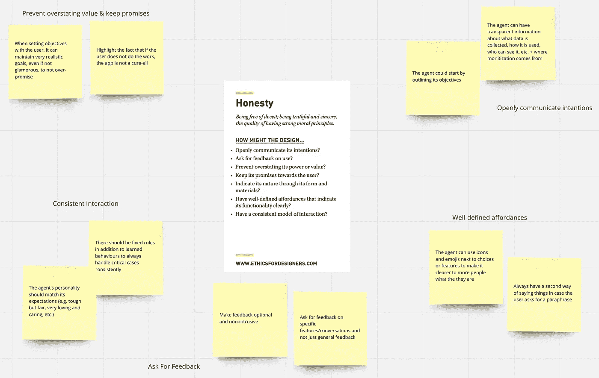
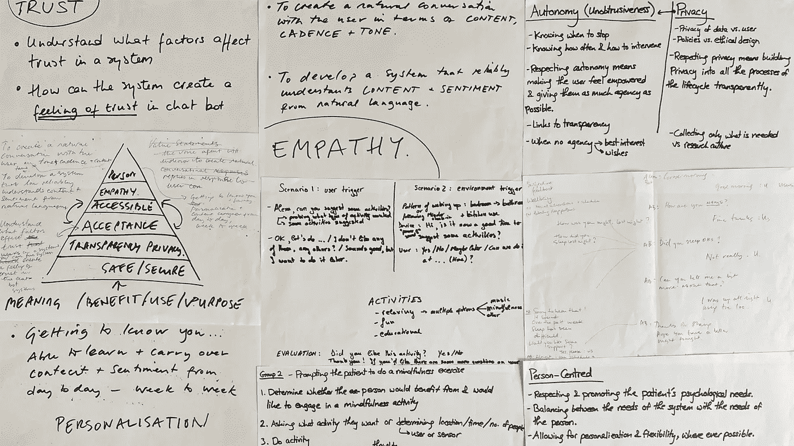

# 通过设计研讨会使人工智能民主化

> 原文：<https://medium.com/mlearning-ai/merging-design-and-artificial-intelligence-design-workshops-for-ai-based-systems-1933afba18dd?source=collection_archive---------7----------------------->

## 反思和收获

Approaches from design fields can be leveraged to facilitate interdisciplinary collaborations on AI systems. Photo by [Hannah Busing](https://unsplash.com/@hannahbusing) on [Unsplash](https://unsplash.com/).

如果你试图想象开发人工智能系统的背景，你可能会想到一个有着蜂鸣灯和成排计算机的无菌实验室，或者你可能会想象谷歌等科技巨头的彩色办公室，嬉皮士开发人员在笔记本电脑上打字。虽然这两种情况在世界的某个地方可能都是真实的，但这并不一定意味着它们是创建这些系统的理想环境。

由非常相似类型的人孤立地创建基于人工智能的系统能够并且已经导致了有害的结果。由于一群同质的人试图基于一系列(通常是二元的)分类进行广泛的归纳，这些分类由[全景分类风格](https://oxford.universitypressscholarship.com/view/10.1093/oso/9780197579411.001.0001/oso-9780197579411)的视角支持，即关于组成世界的类别，什么构成“正常”，不符合创造者类别的人和元素经常被这些系统置于不利地位，将他们强大的独特性变成了[偏见和不幸的来源](https://vimeo.com/618306283)。技术专家需要概括和简化复杂的问题空间，这抹去了人们的经历和历史，因为专家们不愿意解决这些问题，或者他们一开始就没有意识到这些问题的存在(被称为[“特权风险】](https://mitpress.mit.edu/books/data-feminism))。

More diverse voices are needed within the field of AI. Photo by [Luke Peters](https://unsplash.com/@lukepeters) on [Unsplash](https://unsplash.com/).

# 设计工作坊是让人工智能创作民主化的一种方式

基于人工智能的系统的最终用户和其他外部利益相关者的参与度比其他类型的技术低的原因之一是因为构建它们需要高水平的技术专长。然而，最近，设计领域一直在推动那些没有技术背景的人参与进来，要么[教育他们](https://dl.acm.org/doi/10.1145/2347504.2347559)，[简化他们的系统表示](https://dl.acm.org/doi/10.1145/3274566)，要么允许他们[为非技术方面做出贡献](/@albmllt/introducing-the-human-centered-ai-canvas-a4c9d2fc127e)。这些技术已被证明非常成功地弥合了学科之间的差距，并允许更多的人参与这些系统的决策。一些已经成功使用的方法包括[角色扮演](https://dl.acm.org/doi/10.1145/3512898)，使用[副牌](https://www.ideo.com/blog/ai-needs-an-ethical-compass-this-tool-can-help)，以及制作[原型](https://dl.acm.org/doi/abs/10.1145/3311927.3325336)。他们对于与[儿童](https://www.researchgate.net/publication/357648098_Robot_Co-design_Can_Help_Us_Engage_Child_Stakeholders_in_Ethical_Reflection)、[老人](https://www.tandfonline.com/doi/full/10.1080/24735132.2021.1885592)以及[残疾人](https://dl.acm.org/doi/10.1145/3434073.3444646)互动也非常有用。

下面，我分享了我在两个研讨会上的一些见解，这些研讨会旨在为医疗保健应用设计基于人工智能的对话代理(又名聊天机器人或虚拟助手)。

## 研讨会 1 —从价值观到设计特征

Screenshot of the workshop Miro board showing participants’ suggestions for design features that respect the value of honesty. Property of Malak Sadek and cannot be re-used without permission.

第一个工作室使用了一副由 Jet Gipsen 设计的卡片，名为道德代理人 T1。每张卡显示了一个价值和它的定义，以及一些我们怎么可能？激发人们思考如何在设计中尊重这一价值的问题。参与者被随机分配数值，并有时间提出一些设计特征。然后，他们被要求盖住卡片，并向小组的其他成员展示他们的特征，然后他们必须猜出他们被分配的值是多少。**这次研讨会的主要收获是一些价值观有多少重叠，比如诚实和透明，或者自主和控制，以及定义不同价值观对不同人的意义有多重要。**

## 研讨会 2 —从价值到用例

A collage of the value statements participants came up with during the workshop. Property of Malak Sadek and cannot be re-used without permission.

第二个研讨会让参与者根据他们认为对与痴呆症患者打交道的对话代理人来说最重要的是什么，提出他们自己的价值陈述。之后，他们被要求想出一些用例，在这些用例中，代理人的反应、特征、动作或选择体现了他们所选择的价值观。**看到设计师、工程师和痴呆症患者护理人员开发的用例在质量和特异性上的差异真的很有趣，这真正凸显了让领域专家和最终用户参与到该过程中的价值。**

在这两种情况下，从参与者的价值开始，可以说是非常抽象和无形的，导致了在实现阶段非常实用和有用的结果。这表明，从用户的价值观和体验出发，在产生可操作的结果方面并不是浪费时间。不同类型的人的参与在所进行的讨论、所提出的各种观点和关切以及所优先考虑的特点中证明是非常有价值的。它还显示了人们的经验和价值观是多么主观，以及如何在没有任何假设的情况下定义价值观的意义和范围。

简而言之，多样化的参与可以帮助改善基于人工智能的系统提供的体验，而设计方法是一个非常强大的工具，可以使多样化的参与成为可能和可行。

# 我适合的地方

当前的现实是，人工智能系统悬而未决，有可能变得更加孤立、排外和复杂；或者开放，变得更容易接近和包容，这是我博士项目的灵感来源。我正致力于创建一个参与性的过程，以及一个支持它的工具包，在人工智能的整个生命周期中系统地让人们参与进来——重点是价值敏感性。

你可以在伦敦帝国理工学院网站上查看我的项目的官方页面。你也可以看看我写的另一篇解释我博士项目的[细节的文章。](/@malaksadekIC/introducing-my-phd-project-to-make-ai-design-more-inclusive-80d0edf70378)

我建立了这个媒体账户来发布我在博士项目中的有趣发现，希望以一种任何人都可以理解的方式传播关于人工智能系统的新闻和信息。如果你喜欢这篇文章，那么请考虑跟随我发布新的东西，并请喜欢和分享！

 [## Mlearning.ai 提交建议

### 如何成为 Mlearning.ai 上的作家

medium.com](/mlearning-ai/mlearning-ai-submission-suggestions-b51e2b130bfb)