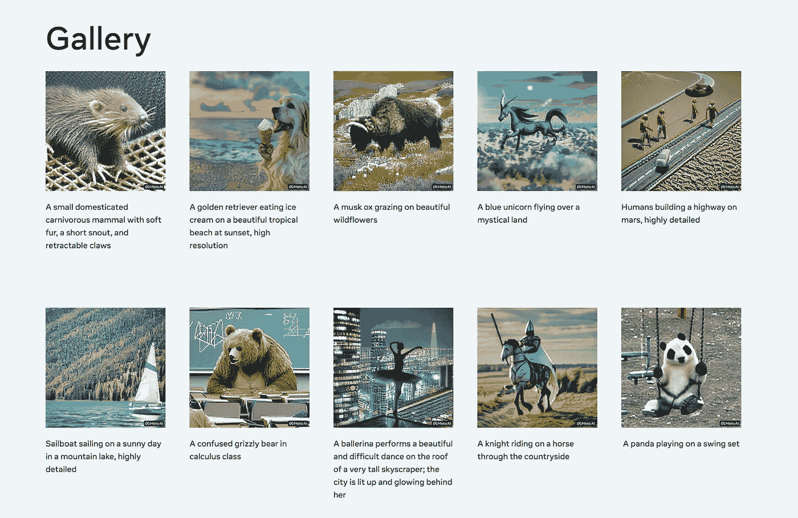
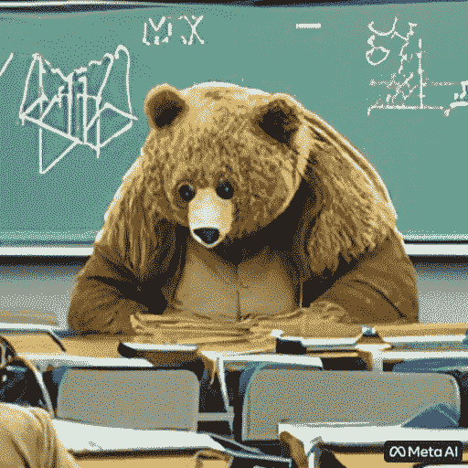
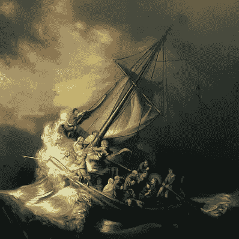
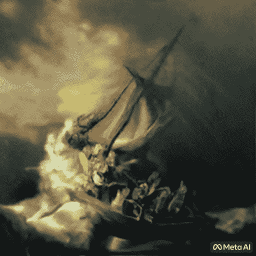

# Meta AI: AI 生成的视频即将到来

> 原文：<https://medium.com/mlearning-ai/meta-ai-ai-generated-video-is-coming-ed5a5c429cf1?source=collection_archive---------5----------------------->

**Meta AI** 是一个 [AI](https://en.wikipedia.org/wiki/Artificial_intelligence) 实验室，属于 [Meta Platforms](https://en.wikipedia.org/wiki/Meta_Platforms) Inc .宣布了一个名为 [Make-A-Video](https://makeavideo.studio/) 的新 AI 系统，让人们将文本提示生成简短的视频剪辑。

Make-A-Video gallery screenshot.

A brief video generated by [Make A Video](https://makeavideo.studio/) with “A confused grizzly bear in calculus class” prompt.

[制作视频](https://makeavideo.studio/)建立在 Meta AI 最近在[生成技术研究](https://www.shakiroslann.com/meta-ai-generated-video/generative%20technology%20research)上的进展。该系统从配对的文本图像数据中学习世界是什么样子的，并从无监督的视频片段中学习世界是如何运动的。

该系统能够做的另一件事是从单个图像或一对图像概念化视频，甚至更多，你可以通过在原始视频的基础上创建视频的变体来给你的视频添加额外的创造力。你可以在他们的画廊里看到更多。

An example of a classic piece of art from [Make A Video](https://makeavideo.studio/) that is going to be generated.

A brief video that has been generated from a single image.

这有点类似于其他文本到视频的模型，但这一次他们用一种稍微不同的方式处理未标记的视频数据。

*原载于 2022 年 10 月 18 日 https://www.shakiroslann.com***。**

* [## Mlearning.ai 提交建议

### 如何成为 Mlearning.ai 上的作家

medium.com](/mlearning-ai/mlearning-ai-submission-suggestions-b51e2b130bfb)*