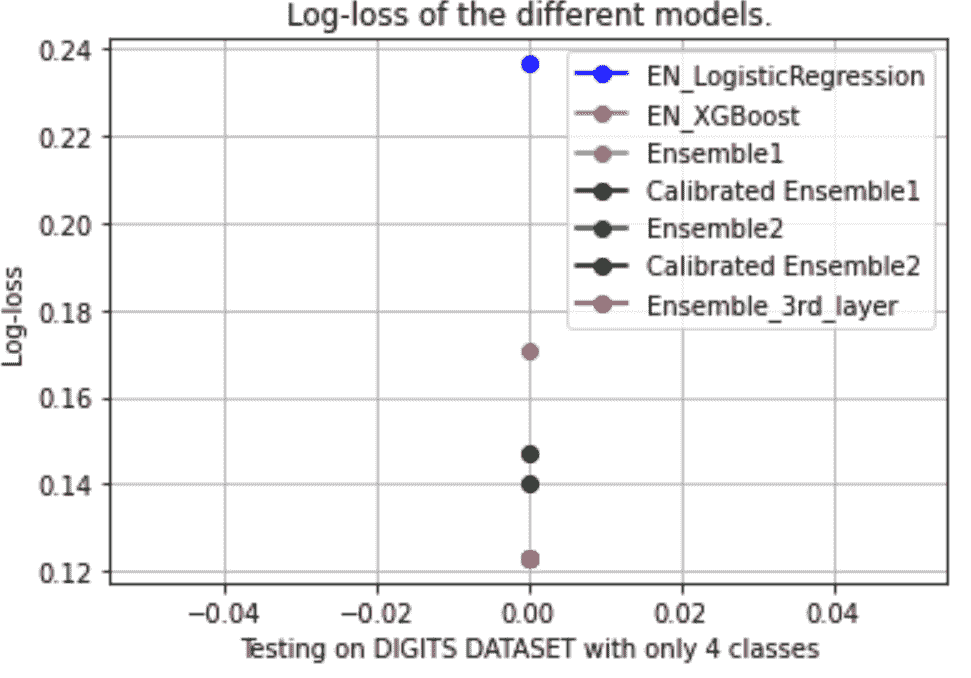
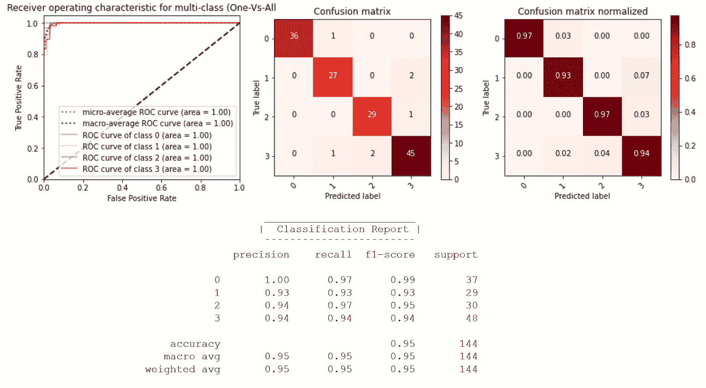

# 优化的元集成自学习模型

> 原文：<https://medium.com/mlearning-ai/meta-ensemble-self-learning-model-with-optimization-9fa17d8764fa?source=collection_archive---------1----------------------->

元自我集成学习器包(pip 安装元自我学习器)——[https://github.com/ajayarunachalam/meta-self-learner](https://github.com/ajayarunachalam/meta-self-learner)

你好，朋友们。在这篇博文中，提出了一个元学习者集合设计。元集成学习模型旨在更好地拟合任何复杂的数据，降低估计的不确定性。这两种自学习算法旨在找到最小化目标函数的最优权重。

本设计集成为包 [**元自学者**](https://pypi.org/project/meta-self-learner/) 的一部分。更多细节可以在 GitHub 页面[这里](https://github.com/ajayarunachalam/meta-self-learner)找到。这篇博文的所有代码都可以在这里找到

**该包装的 USP:-**

"**元自学习**"为快速预测建模原型提供了几个集成学习器功能。通常，当输入样本超出训练分布、偏向于数据分布或易于出现噪声等错误时，预测会变得不可靠。当前的方法总的来说需要改变网络架构、模型微调、平衡数据的需要、增加模型大小等。此外，主要是算法的选择起着至关重要的作用，而可扩展性和学习能力随着复杂数据集而下降。在这个包中，我开发了一个集成框架，用于最小化学习算法中的泛化错误，而不管数据分布、类的数量、算法的选择、模型的数量、数据集的复杂性等。因此，总而言之，有了这个框架，人们可以更好地推断和概括。该软件包的另一个关键点是直观的管道，它以更稳定的方式构建模型，同时最大限度地减少对整体结果非常关键的欠拟合/过拟合。

**快速安装包:-**

**从** [**这里**](https://github.com/ajayarunachalam/meta-self-learner/blob/main/setup.sh) 下载自动化脚本

> 在终端上运行以下命令

sudo bash setup.sh

**安装:-**

> 使用画中画:

pip 安装元自学者

> 使用笔记本:

！pip 安装元自学者

**元自学者工作流程:-**

设计的框架流水线工作流程如图所示。

Meta-Self-Learner Ensemble Pipeline

第一层包括几个单独的分类器。我们使用了基本分类器，即逻辑回归(LR)、K-最近邻(KNN)、随机森林(RF)、支持向量机(SVM)、额外树分类器(ETC)和梯度推进机(GBM)。两个自学者(即，集成 1 和集成 2)旨在找到最小化目标函数(即，对数损失函数)的最佳系数。利用在前一层中获得的一组给定的预测，两个元学习器定义两个不同的线性问题，并且旨在优化目标函数以找到降低损失的最佳系数。

预处理的数据被输入到模型的第 1 层。“t”和“P”分别代表训练数据和预测。在第 1 层中，使用了许多独立的基础学习。第二层的输入包括先前第一层的预测。

使用了两种元自学习器集成方案。第三层将第二层预测的结果组合成一个简单的加权平均值(WA)。模型评估和结果解释最终在流水线的最后阶段完成。

元自学习架构的细节如下

# 第一层:-

使用了六个分类器(LR、SVM、RF、ETC、GBM 和 KNN)。在这里，人们可以使用他们选择的任何机器学习算法。并且，建立任意数量的模型。所有分类器被应用两次:1)分类器在(X_train，y_train)上被训练，并被用于预测(X_valid)的类概率。2)在(X = (X_train + X_valid)，y= (y_train + y_valid)上训练分类器，并用于预测(X_test)的类概率。

# 第二层:-

来自 X_valid 上的前一层的预测被连接，并用于创建新的训练集(XV，y_valid)。X_test 上的预测被连接以创建新的测试集(XT，y_test)。所提出的两种集成方法及其校准版本在(XV，y_valid)上训练，并用于预测(XT)的类概率。

# 第三层:-

然后使用加权平均线性组合来自先前第 2 层的预测。

以这种方式，设计和部署了混合架构，其中独立分类器的预测通过元自学习器方法来组合，从而降低欠拟合/过拟合的风险。

让我们通过一个例子来动手操作一下。

*入门*

1.  导入并加载已安装的软件包元自学者

2.加载数据集

3.在训练、验证和测试集中拆分数据

4.设置元自集成器的类配置。这里，我们从 total digits 数据集类中选取了四个类作为快速示例。

5.在流水线中逐层构建元自学习架构

a.创建第一层

b.创建第二层

c.创建第三层/最终层

6.性能评估&为测井损失指标创建图表

Log-loss evaluation metrics for different ensemble algorithms with meta-self-learner model

7.绘制 ROC、混淆矩阵和显示分类报告

ROC, Confusion Matrix, and classification report

# 重要链接

## 完整的演示笔记本:-

[https://github . com/ajayarunachalam/meta-self-learner/blob/main/Full _ Demo _ tested . ipynb](https://github.com/ajayarunachalam/meta-self-learner/blob/main/Full_Demo_Tested.ipynb)

## 终端启动:

下载[文件](https://github.com/ajayarunachalam/meta-self-learner/blob/main/tested_example.py) &在终端上运行以下命令

**python tested_example.py**

# 连接

你可以打[ajay.arunachalam08@gmail.com](mailto:ajay.arunachalam08@gmail.com)找到我

感谢阅读。希望这篇文章有用:)

# 参考资料:-

[https://www . spot intelligence . com/blog/how-to-implementation-self-learning-systems/](https://www.spotintelligence.com/blog/how-to-implement-self-learning-systems/)

[https://en.wikipedia.org/wiki/Ensemble_learning](https://en.wikipedia.org/wiki/Ensemble_learning)

[https://sci kit-learn . org/stable/modules/generated/sk learn . metrics . log _ loss . html](https://scikit-learn.org/stable/modules/generated/sklearn.metrics.log_loss.html)