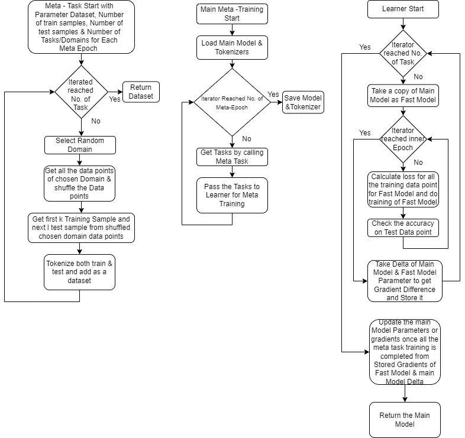
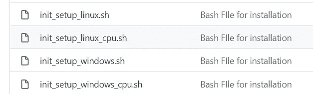
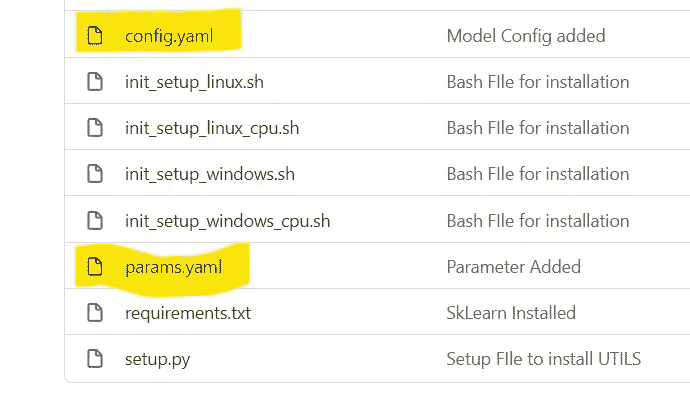

# 元学习拥抱脸的方式

> 原文：<https://medium.com/mlearning-ai/meta-learning-the-huggingface-way-9422a08188ce?source=collection_archive---------1----------------------->

# 作者

纳巴伦·巴鲁阿

[Git](https://github.com/nabarunbaruaAIML)/[LinkedIn](https://www.linkedin.com/in/nabarun-barua-aiml-engineer/)/[towards data science](/@nabarun.barua)

阿尔琼·库姆巴卡拉

[Git](https://github.com/arjunKumbakkara)/[LinkedIn](https://www.linkedin.com/in/arjunkumbakkara/)/[towards data science](/@arjunkumbakkara)

元学习是一个令人兴奋的研究趋势，在我们进入项目实施之前，我们认为我们应该首先了解元学习的基础。

在传统的 ML/DL 方法中，我们遵循的是我们获得一个巨大的数据集，并开始在该数据集上进行训练，最终，我们获得了一个良好的准确度分数。

现在，元学习方法就像人类学习的方式，它首先在一个领域学习&在获得足够的知识后，它试图在下一个领域学习，在过去获得的知识的基础上用少量的例子。这样，通过多次重复这一步骤，我们可以在有限的训练数据下提高模型的准确性。现在，元学习比传统的对大型数据集进行微调的方法效果更好，因为该数据集有许多领域。然而，在传统的方法中，一个模型一次尝试在不同的随机域上学习，这增加了总的训练时间，而在元学习模型中，学习具有 k 个样本训练数据的域，并且无论正在学习什么，都在每个时期之后被传递到主模型(这里对于每个主/元时期，有多个被称为内部时期的更精简时期)

元学习有多种类型:

1.  基于度量的元学习

*   暹罗网络
*   匹配网络
*   原型网络
*   关系网络

2.基于优化的元学习

*   MAML(模型不可知元学习)
*   一阶 MAML
*   爬行动物

上述元学习技术的细节将在这篇[论文](https://arxiv.org/pdf/2007.09604.pdf)中提供

在我们的项目中，我们使用了基于优化的元学习的 MAML(模型不可知元学习)的变体爬虫。在根 Meta_Learning.py 中我们得到了一个完整的元学习训练过程。

现在，在我们的项目 Meta_Learning.py 中，我们有两个重要的函数

*   元任务:该函数创建 n 个随机任务，即 n 个域用于训练，给定 K 个样本用于训练集，L 个样本用于测试集。
*   Leaner:该函数为元任务给出的每个任务训练 i epoch，并在所有任务的训练结束时更新主模型的梯度。

如需详细的流程，请遵循以下整体元学习流程图:



Meta-Flow Diagram

现在是技术堆栈:

*   拥抱变形金刚
*   拥抱面部数据集
*   拥抱脸加速
*   Pytorch

对于以上技术栈，需要有一个基本的了解。我们使用 Huggingface 数据集而不是 Pytorch 数据集，因为 Huggingface 数据集使用 apache arrow 格式，数据处理速度快。为了更好地理解，请浏览我们以前的博客[第一部分](/mlearning-ai/forget-complex-traditional-approaches-to-handle-nlp-datasets-huggingface-dataset-library-is-your-1f975ce5689f) & [第二部分](/mlearning-ai/forget-complex-traditional-approaches-to-handle-nlp-datasets-huggingface-dataset-library-is-your-fe5de16d88c8)。我们使用 Huggingface [Accelerate](https://huggingface.co/docs/accelerate/index) 库，因为我们想要一个生产就绪的多 GPU/CPU 代码，可以毫不费力地部署。简单配置处理单个 GPU/CPU 或多个 GPU 的方法，而无需更改代码。

现在让我们来讨论这个项目( [Github 链接](https://github.com/nabarunbaruaAIML/Meta_Learning))

第一步从设置环境开始，我们有不同的 bash 文件来创建本地环境。请根据您的需要选择 bash 文件。



Bash Files Images

在设置好本地环境之后，我们就可以开始元学习了，但是在我们开始元学习 python 文件之前。我们应该了解我们正在使用的数据集，下面是每个域的记录数:

'服装':1717 年，

'宝贝':1107，

'美丽':993，

'书籍':921，

camera_&_photo': 1086，

'手机服务':698，

' dvd': 893，

'电子':1277 年，

'杂货店':1100，

health_&_personal_care': 1429，

珠宝 _ & _ 手表':1086，

厨房用品:1390 年，

“杂志”:1133 年，

'音乐':1007，

'户外 _ 生活':980，

'软件':1029，

体育 _ & _ 户外':1336，

玩具 _ 游戏':1363 年，

'视频':1010，

'汽车':100，

电脑 _ 视频 _ 游戏':100，

' office_products': 100

我们可以看到最后三个领域，即汽车、计算机&视频游戏和办公产品只有 100 条记录，因此，我们将它们作为测试集，而其余的则在训练集中。

元训练的所有配置和参数都集中在 Config.yaml 文件& Params.yaml 文件中，可以对其进行更改以影响训练。



Config & Params Yaml File

现在，要在多 GPU 或单 GPU 或 CPU 中执行培训，我们需要配置 Accelerate，这样我们只需执行一个命令

```
accelerate config
```

一旦上述命令执行，然后回答简单的问卷，它将为 Accelerate Library 生成一个配置文件，该文件将在培训期间自动选取(执行一次以创建一个配置文件)。这个过程是可选的，如果我们想以传统方式执行我们的 python 文件，那么 Accelerate Library 将使用适合单个 GPU 训练的默认参数来执行。

执行 python 文件的传统方式

```
python my_script.py
```

现在，如果我们有一个多 GPU 设置，我们想训练，完成配置后。只需要执行下面的命令。

```
accelerate launch my_script.py
```

在我们的示例中，my_script.py 是 Meta_Learning.py 文件。一旦执行上述命令，训练将开始。

您可以在 running_logs.log 文件中名为 Logs 的文件夹中看到结果。至此，我们的博文到此结束。

我们工作的灵感来自这个完全在 PyTorch 中实现的 [Github](https://github.com/mailong25/meta-learning-bert) (龙脉)，如果你想完全用 PyTorch 的方式实现你的实现，请访问并检查。

如果你喜欢这个博客，请表达你的爱，给我们一个大拇指，给我们加星，如果不喜欢，请在评论区给我们一个反馈。这里希望你会喜欢这个实现！

为了合作，帮助和一起学习-

## 加入我们的不和谐服务器:【https://discord.gg/Z7Kx96CYGJ】T2

一路平安！

[](/mlearning-ai/mlearning-ai-submission-suggestions-b51e2b130bfb) [## Mlearning.ai 提交建议

### 如何成为 Mlearning.ai 上的作家

medium.com](/mlearning-ai/mlearning-ai-submission-suggestions-b51e2b130bfb)