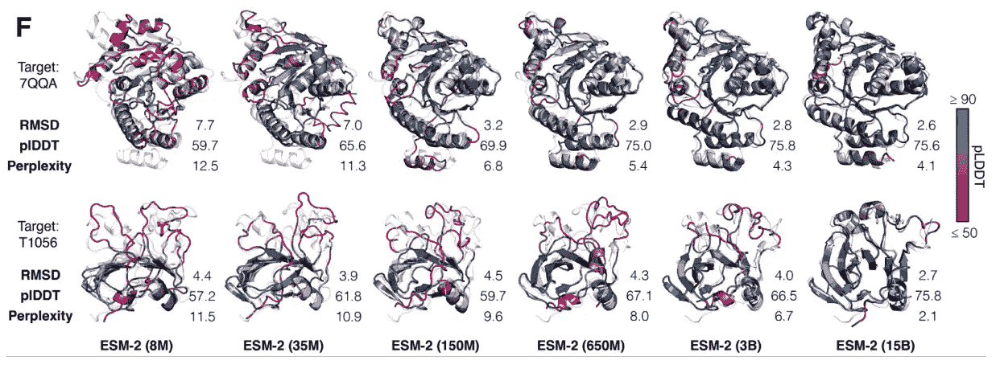
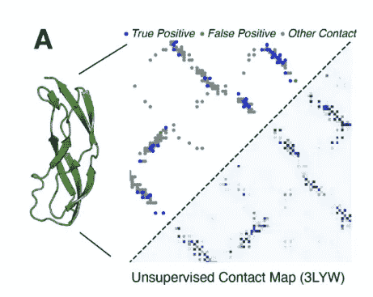
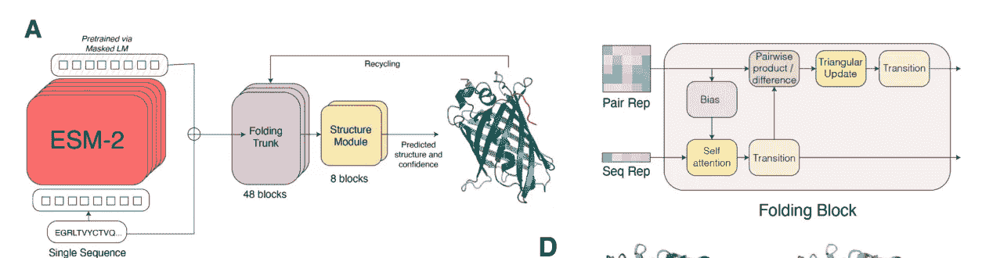
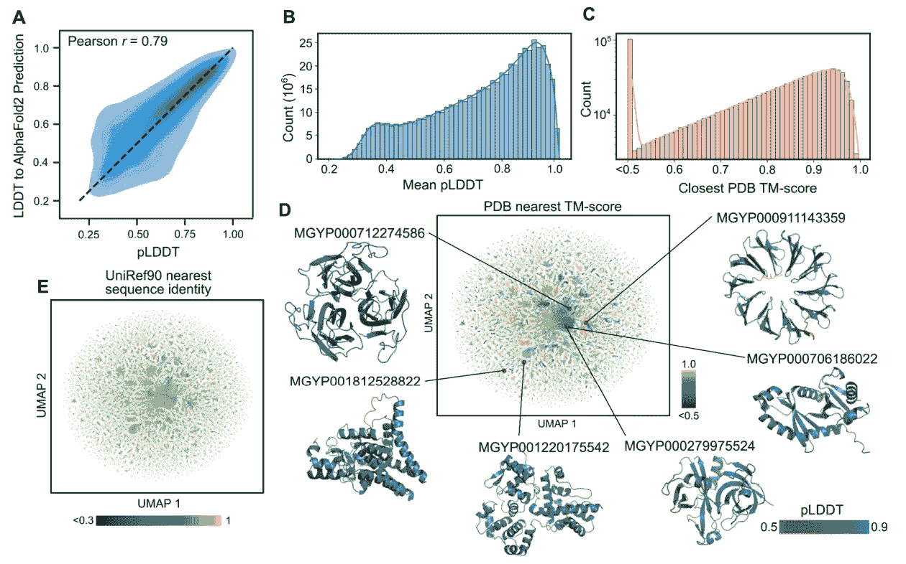

# Meta 的 ESM fold:alpahfold 2 的对手

> 原文：<https://medium.com/mlearning-ai/metas-esmfold-the-rival-of-alpahfold2-2223b67f6021?source=collection_archive---------1----------------------->

## Meta 使用一种新方法来预测超过 6 亿个蛋白质结构

Image by [Mohamed Nohassi](https://unsplash.com/@coopery) at [unsplash.com](https://unsplash.com/)

去年 AlphaFold2 发布，对许多人来说，它代表了一场革命。不久前，META 还宣布了一个能够从序列中预测蛋白质结构的模型。什么变化？为什么重要？本文试图回答这些问题。

# **生命的小引擎**

简而言之，为什么知道蛋白质的结构很重要？[蛋白质](https://en.wikipedia.org/wiki/Protein)可以被认为是生命的引擎。事实上，它们调节细胞和有机体的所有功能。**在经典并行理论中，DNA 被视为物理内存，RNA 被视为内存，蛋白质被视为软件。**

**蛋白质结构决定蛋白质的功能，其三维结构由它的序列决定**(一个蛋白质可以看做一个序列，它的氨基酸看做一个字母表的字母)。预测结构是一个极其复杂的问题，因为我们并不完全知道指导组装成最终结构的物理法则，也因为一个由 [100 个氨基酸组成的序列有大量潜在的理论构象](https://www.ncbi.nlm.nih.gov/pmc/articles/PMC2443096/)。

去年，DeepMind 的 AlphaFold2 通过展示其预测与实验获得的结果几乎相同而赢得了 CASP14。在这里，我解释了更多关于蛋白质折叠问题以及 AlphaFold 如何工作的内容:

 [## 说生命的语言:AlphaFold2 和公司如何改变生物学

### 人工智能正在重塑生物学研究，并开辟治疗的新领域

towardsdatascience.com](https://towardsdatascience.com/speaking-the-language-of-life-how-alphafold2-and-co-are-changing-biology-97cff7496221) 

无论如何，尽管 AlphaFold2 没有任何限制，但它开启了许多有趣的视角，我在这里已经描述过了:

 [## AlphaFold2 第一年:它改变了世界吗？

### DeepMind 向我们承诺了一场革命，它发生了吗？

towardsdatascience.com](https://towardsdatascience.com/alphafold2-year-1-did-it-change-the-world-499a5a38130a) 

# **META 加入竞争**

Meta 最近宣布了一种新的模型，能够从蛋白质的序列开始预测蛋白质的折叠。**我们习惯了 AlphaFold2？有什么新鲜事？**

正如我之前在另一篇文章中描述的[，语言和生活语言之间有许多相似之处。事实上，蛋白质序列包含了信息(折叠)并且有精确的语法规则。序列中的突变破坏了蛋白质的装配和功能。此外，蛋白质家族的功能可以从序列的模式中推断出来(同一家族的蛋白质如](https://towardsdatascience.com/speaking-the-language-of-life-how-alphafold2-and-co-are-changing-biology-97cff7496221)[激酶](https://en.wikipedia.org/wiki/Kinase)在序列中具有相似的功能和相似的模式)。

此外，近年来出现了大量的[大型语言模型](https://www.nvidia.com/en-us/deep-learning-ai/solutions/large-language-models/)。基于[转换器](https://en.wikipedia.org/wiki/Transformer_(machine_learning_model))和实现[自我关注](https://en.wikipedia.org/wiki/Attention_(machine_learning))的模型已经被证明在广泛的任务(NLP、图像分析、文本到图像、[数学问题解决](https://towardsdatascience.com/googles-minerva-solving-math-problems-with-ai-4f0a6aaabaf1)等等)中是高效和成功的。相比之下，AlphaFold2 具有类似于 transformer 的多块结构，但仍然以不同的方式解决问题(将蛋白质视为图形并使用多比对序列)。此外，AlphaFold2 的训练比一个变形金刚要复杂得多。

> 简而言之，Meta 的作者提出了一个问题:我们到处都在使用变形金刚，我们是否也可以用它们来预测蛋白质结构？

首先，研究人员对训练进行了结构化，以便它可以用于预期的任务。事实上，他们认为如果模型想要预测蛋白质序列中缺失的氨基酸，它应该知道潜在的结构。根据作者的说法，通过展示足够多的蛋白质序列的正确模型，这种理解会增加:

> 随着语言模型的表示能力和在其训练中看到的蛋白质序列的多样性的增加，我们期望关于蛋白质序列的生物学特性的深层信息能够出现，因为那些特性产生了在序列中观察到的模式。— [原文章](https://www.biorxiv.org/content/10.1101/2022.07.20.500902v2.full.pdf)

事实上，作者使用了一个 150 亿参数的模型，并注意到缩放参数改善了预测(减少了困惑)。

The scaled-up model version is obtaining a lower perplexity. image source ([original article](https://www.biorxiv.org/content/10.1101/2022.07.20.500902v2.full.pdf))

ESM-2 使用[屏蔽语言建模](https://analyticsindiamag.com/an-illustrative-guide-to-masked-image-modelling/)目标进行训练(基本上，一个随机氨基酸被一个屏蔽覆盖，模型必须预测它使用的是哪一个上下文)。正如作者所述，尽管这个目标很简单，但它允许它学习有关蛋白质的信息(功能、结构等):

> 学习氨基酸之间依赖关系的模型。尽管训练目标本身是简单且无人监管的，但要在数百万进化上不同的蛋白质序列上很好地执行这项任务，需要模型在进化中内在化序列模式。我们希望这种训练也能使结构具体化，因为它与序列模式相联系。

该模型使用来自 [UniRef](https://www.uniprot.org/help/uniref) 的数百万个序列进行训练。优雅地说，随着模型的训练，它发展出代表序列中氨基酸之间相互作用的注意模式。通过提取这些注意力图谱，他们发现它们对应于蛋白质的三级结构。

然后，研究人员使用等变转换器将这些地图转换为蛋白质原子的空间地图。换句话说，使用模型的内部表示，人们可以重建蛋白质的原子分辨率结构预测。

Attention contact map, compared to tertiary structure. image source ([original article](https://www.biorxiv.org/content/10.1101/2022.07.20.500902v2.full.pdf))

作者开发了 ESMfold:蛋白质的序列是 ESM-2(前面看到的模型)的输入，其内部表示提供给一系列折叠块(这些使用序列表示和成对表示)。接下来，输出被提供给等变变换器，该变换器将产生最终的原子级结构和预测的置信度

Model structure and example of a folding block. image source ([original article](https://www.biorxiv.org/content/10.1101/2022.07.20.500902v2.full.pdf))

> Rives 的团队在今年夏天早些时候报告说，Meta 的网络称为 ESMFold，不如 AlphaFold 准确，但它在预测结构方面快了大约 60 倍。"这意味着我们可以将结构预测扩展到更大的数据库."——([来源](https://www.nature.com/articles/d41586-022-03539-1))

该模型比 AlphaFold2 快得多(预测可能需要几分钟)。这使得作者能够预测 6 亿个蛋白质的结构。事实上，作者使用了[宏基因组](https://en.wikipedia.org/wiki/Metagenomics)数据库(从土壤、人类肠道、其他微生物环境等获得的 DNA 测序)。

Prediction of the metagenome: “(E) Additional UMAP plot in which the 1 million sequences are plotted according to the same coordinates as in (D) but colored by the sequence identity to the most similar entry in UniRef90 according to a blastp search”. image source ([original article](https://www.biorxiv.org/content/10.1101/2022.07.20.500902v2.full.pdf))

Meta 宣布宏基因组预测现在可以在社区中使用了。他还表示，ESM-2 和 ESMfold 模型将很快在 HuggingFace 上推出，以便每个人都可以进行实验。

# **离别的思念**

image by [Amine rock hoovr](https://unsplash.com/@hoovr01) at unsplash.com

2016 年的变形金刚在许多任务中都是最先进的，但 DeepMind 采取了不同的方法。Meta 展示了我们如何使用语言模型来预测蛋白质结构。

这一点很重要，因为该模型速度更快(因此即使不如 [AlphaFold2](https://www.nature.com/articles/s41586-021-03819-2) 准确，也能进行更快的预测)。更快的模型使他们能够用不同的解决方案进行实验，他们还表明模型的容量随着参数的数量而增加。另外，AlphaFold2 有几个限制；能够试验不同类型的模型将允许社区开发新的解决方案和新的应用程序。

此外， [ESMfold](https://ai.facebook.com/blog/protein-folding-esmfold-metagenomics/) 仅使用蛋白质序列作为输入，而 AlphaFold2 使用多序列分析(MSA ),这改善了预测，但也使其计算成本更高。

作者还预测了宏基因组的结构，这是大量属于细菌的序列，我们无法培养它们，它们的蛋白质可能有重要的实际应用。获得结构是了解其功能和研究其可能用途(清洁能源、对抗污染、帮助寻找新疗法)的第一步。

作者已经将预测和代码公之于众( [GitHub 库](https://github.com/facebookresearch/esm))。无论如何，还有其他不同的预测模型( [RoseTTAFold](https://github.com/RosettaCommons/RoseTTAFold) 、 [IntFOLD](https://academic.oup.com/nar/article/47/W1/W408/5482507) 、 [RaptorX](https://www.nature.com/articles/nprot.2012.085) 等等)，并且该领域正在快速发展，因此我们很快就会看到新的模型和应用。

# 如果你觉得有趣:

你可以寻找我的其他文章，你也可以 [**订阅**](https://salvatore-raieli.medium.com/subscribe) 在我发表文章时得到通知，你也可以在**[**LinkedIn**](https://www.linkedin.com/in/salvatore-raieli/)**上连接或联系我。**感谢您的支持！**

**这是我的 GitHub 知识库的链接，我计划在这里收集代码和许多与机器学习、人工智能等相关的资源。**

** [## GitHub - SalvatoreRa/tutorial:关于机器学习、人工智能、数据科学的教程…

### 关于机器学习、人工智能、数据科学的教程，包括数学解释和可重复使用的代码(python…

github.com](https://github.com/SalvatoreRa/tutorial) 

或者随意查看我在 Medium 上的其他文章:

 [## 人工智能如何帮助保存艺术品

### 艺术杰作随时都是风险；人工智能和新技术可以助一臂之力

towardsdatascience.com](https://towardsdatascience.com/how-ai-could-help-preserve-art-f40c8376781d)  [## 人工智能如何拯救亚马逊雨林

### 亚马逊正处于危险之中，人工智能可以帮助保护它

towardsdatascience.com](https://towardsdatascience.com/how-artificial-intelligence-could-save-the-amazon-rainforest-688fa505c455)  [## 科学和人工智能中的代码再现性危机

### 萨维艾和科学研究要求我们分享更多

pub.towardsai.net](https://pub.towardsai.net/code-reproducibility-crisis-in-science-and-ai-fa2f2ec955b4)  [## 诺贝尔奖赛博朋克

### 科学发现中人工智能最重要奖项的计算视角

medium.com](/mlearning-ai/nobel-prize-cyberpunk-e1803aa0e087)  [## Mlearning.ai 提交建议

### 如何成为 Mlearning.ai 上的作家

medium.com](/mlearning-ai/mlearning-ai-submission-suggestions-b51e2b130bfb)**