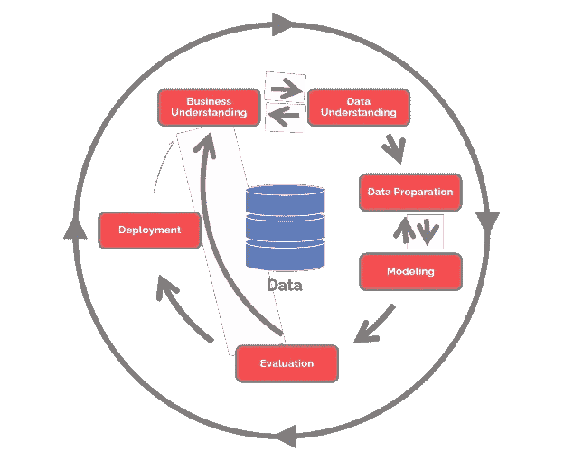

# 数据科学项目的方法论

> 原文：<https://medium.com/mlearning-ai/methodology-for-data-science-projects-af52ac0c457a?source=collection_archive---------2----------------------->

数据科学是一个复杂的研究领域。然而，像任何复杂的科学领域一样，必须有一种科学方法。科学方法遵循以下流程:

1.进行观察

2.发现问题

3.关于这个问题的研究

4.阐明一个假设

5.实验

6.检验假设

7.得出结论

8.分享您的结果

数据科学的方法遵循类似的模式；然而，不同的方法一直是数据科学项目的首要关注点。在本文中，我们将重点关注一个常用的，跨行业的数据挖掘标准过程(CRISP-DM)。

**CRISP-DM**

CRISP-DM Diagram. Inspired by [Wikipedia](https://en.wikipedia.org/wiki/Cross-industry_standard_process_for_data_mining)

CRISP-DM 方法制定于 1999 年，分为以下六个业务流程:

商业理解

数据理解

数据准备

建模

估价

部署

这个过程的独特之处在于，它采用了数据科学过程是迭代的概念，或者我们根据需要在这些过程中来回流动。还需要注意的是，建模并不总是必要的。如果我们正在处理一个描述性的问题，没有什么可以建模和部署的，但是，如果我们建立一个预测性的模型，部署这个模型可能是理想的。

**业务理解**

在流程的这一步，我们需要从涉众那里收集事实和需求。数据科学家通常了解数据，但可能不了解企业使用数据的特定方式。从主题专家和/或利益相关者那里收集这种理解非常重要。在这一阶段，数据科学家和利益相关者应该对调查结果的期望和目标保持一致。在收集这些信息时，让所有相关方参与进来是非常重要的。

**数据理解**

一旦我们收集了理解数据所需的业务理解。这将主要由数据科学家来完成。首先，我们需要了解我们是如何收集数据的，例如，它是在关系数据库中，数据的格式，从网站上搜集的，等等。数据科学家需要理解变量，并理解我们希望从变量中预测什么(如果有必要的话)。此外，需要对数据进行常见的描述性统计测试。这些统计数据可以是平均值、范围、分布(即正态、左偏、右偏)、缺失数据计数、数据类型(即字符串、整数等)。)，变量之间的相关性，这里的列表还可以继续。散点图、直方图和箱线图等数据可视化在流程的这一步非常关键。最终，数据科学家希望数据能够帮助实现业务理解中确定的目标。

**数据准备**

这一步的重点是准备数据建模或清理我们的数据理解。数据科学家有责任找出在这一步的各种需求中什么最有效。数据科学家需要专注于处理缺失数据(如果存在)的方法，这些方法可以是从数据集中移除线、放置标记和/或采用描述性统计数据进行填充(即平均值、最大值、最小值)。变量之间可能存在相关性问题(称为共线性)，数据科学家必须确定该问题是否普遍到足以移除其中一个变量。如果给定变量的数据分布不正常，可能需要对变量进行归一化。最后，数据科学家必须确定是否需要转换数据类型，也就是说，字符串类型应该是数字，反之亦然。如果确定不需要建模，数据科学家可以整理我们对数据的理解，并向涉众提供我们对数据发现的反馈。

**建模**

第一项任务是确定可以使用的模型类型。虽然本文不会关注各种类型的预测模型，但是这些模型包括回归、分类、聚类、预测、异常值模型、时间序列模型等等。然后，数据科学家必须确定如何将数据集分为训练和测试(通常使用 70%训练和 30%测试)。训练子集采用数据子集来提出算法，然后将其应用于测试集，以查看这些算法是否提供准确的预测。数据科学家还必须努力理解他们将如何处理欠拟合或过拟合的模型。欠拟合是指我们从训练数据中获得的性能很差，但我们的算法在测试数据中工作得很好。过度拟合是指我们的训练数据具有良好的性能，但我们的算法在测试数据中表现不佳。通常，数据科学家希望模型在我们的训练和测试数据中具有相似的预测准确性。取决于模型，适当的估计器(即，模型准确度/精度的评估)来评估一个或多个模型。请注意，在流程的业务理解步骤中，利益相关方设定了预期，如果一个或多个模型不符合这些预期，数据科学家必须重新评估。

**评价**

流程的这一部分评估所选模型是否满足我们希望达到的目标。注意，这里的关键不是评估模型，因为这应该在前面的步骤中完成。利益相关者应该参与进来，提供亮点并获得结果反馈。对于数据科学家来说，指出外部变量是否导致问题并获得这些异常值的反馈以改进模型是非常重要的。如果确定是这种情况，因为 CRISP-DM 是迭代的，所以我们必须返回到过程中的先前步骤来改进。这里的主要目标是数据科学家和利益相关者同意模型符合预期和目标。

**部署**

在流程的这一步中，数据科学家应与利益相关方合作，看看如何放置模型，以便根据实时数据进行评估。此外，数据科学家希望找到一种方法来监控结果。CRISP-DM 是迭代的，如果一个模型被识别为不能根据实时数据的预期产生结果，则数据科学家必须返回到流程中的先前步骤。数据并不总是友好的，因此根据需要监控和修正模型始终是关键。

 [## Mlearning.ai 提交建议

### 如何成为 Mlearning.ai 上的作家

medium.com](/mlearning-ai/mlearning-ai-submission-suggestions-b51e2b130bfb)