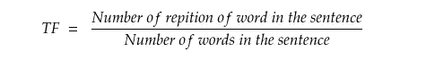
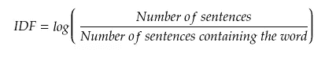

# 自然语言处理中的单词评分方法

> 原文：<https://medium.com/mlearning-ai/methods-for-scoring-words-in-nlp-8a1f0b55605a?source=collection_archive---------3----------------------->

自然语言处理被定义为计算机和人类语言之间的交互。

众所周知，人类的语言是混乱的，同样的事情有很多不同的表达方式。

人类可以通过许多方式相互交流，但是人类和计算机的交流怎么样呢？？

这就是自然语言处理的用武之地。


Photo by [Jason Weingardt](https://unsplash.com/@jasonw?utm_source=medium&utm_medium=referral) on [Unsplash](https://unsplash.com?utm_source=medium&utm_medium=referral)

在解决与 NLP 相关的问题时，文本数据被转换成机器能够理解的数字数据。这种转换对 NLP 模型的结果至关重要。有很多不同的方法可以将文本数据转换成数值(大多数情况下是向量)。

单词的评分是相对于明确定义的词汇表来完成的。

评分有不同的方式，即:

*   二元计分
*   计数计分
*   频率评分
*   Tf-IDF 评分

我们将简要了解这些不同类型的评分方法。

## 二元计分

这是给文档中的单词打分的一种非常简单的方法。在这种方法中，当一个特定的单词出现在文档中时，我们简单地标记 1，当该单词不存在时，标记 0。

为了理解这一点，我们可以举一个例子

```
Let us assume that our vocabulary is:
no, man, is, an, island, entire, of, itself, every, a, piece, the, continent, part, main So for Document **No man is an island**, the scoring would look like this:No: 1, man: 1, is: 1, an: 1, island: 1, entire: 0, of: 0, itself: 0, every: 0, a: 0, piece: 0, the: 0, continent: 0, part: 0, main: 0Converting this to a vector, it would look like this
[1,1,1,1,1,0,0,0,0,0,0,0,0,0,0]
```

正如我们所看到的，我们将出现在词汇表中的单词标记为 1，将其他单词标记为 0。这种评分方法中的向量只包含 0 或 1，因此得名。

这种评分方法的另一个观察结果是，向量的长度等于词汇表中的单词数。

## 计数计分

这种评分方法对文档中的字数起作用。

这将创建一个向量，其中的值对应于特定单词在文档中出现的次数。

如果我们考虑上面的例子(二进制评分)，我们将得到相同的向量，因为没有单词在文档中重复。

## 频率评分

这种计分方法经常与计数计分相混淆。这两种方法是相似的，唯一的区别是频率评分计算文档中单词的频率(在文档中所有单词中出现的单词的次数)。

我们将通过一个例子看到这种类型的评分

```
Let us assume that our vocabulary is:
no, man, is, an, island, entire, of, itself, every, a, piece, the, continent, part, mainSo for Document **No man is an island**, the scoring would look like this:No: 1, man: 1, is: 1, an: 1, island: 1, entire: 0, of: 0, itself: 0, every: 0, a: 0, piece: 0, the: 0, continent: 0, part: 0, main: 0Converting this to a vector, it would look like this
[0.2,0.2,0.2,0.2,0.2,0,0,0,0,0,0,0,0,0,0]
```

## TF-IDF 评分

这可能是 NLP 中最重要的评分方法。

```
Term Frequency - Inverse Term Frequency is a measure of how relevant a word is to a document in a collection of documents. For example, in the document **No man is an island, `is` `an`** might not be as relevant as `**man` `no` `island`** to the document. 
```

TF-IDF 是通过将单词在文档中出现的次数与该单词在文档集中的频率的倒数相乘来计算的。

正如我们看到的，TF-IDF 是通过将两个指标相乘计算出来的。

*   **词频:**一个词在文档中出现的次数
*   **逆文档频率:**该词在文档集中出现的频率的倒数。



Term frequency formula (Created using [https://www.mathcha.io/](https://www.mathcha.io/))



Inverse Document frequency formula (Created using [https://www.mathcha.io/](https://www.mathcha.io/))

在这篇博客中，我们了解了 NLP 中使用的不同类型的单词评分方法以及每种方法的工作原理。

参考

[](https://monkeylearn.com/blog/what-is-tf-idf/) [## 什么是 TF-IDF？

### TF-IDF 是一种统计度量，用于评估单词与文档集合中的文档的相关程度。这个…

monkeylearn.com](https://monkeylearn.com/blog/what-is-tf-idf/)  [## TF . keras . preprocessing . text . tokenizer | tensor flow Core v 2 . 5 . 0

### 文本标记化实用程序类。

www.tensorflow.org](https://www.tensorflow.org/api_docs/python/tf/keras/preprocessing/text/Tokenizer#texts_to_matrix)