# 用于地标图像识别的度量学习

> 原文：<https://medium.com/mlearning-ai/metric-learning-for-landmark-image-recognition-6c1b8e0902bd?source=collection_archive---------10----------------------->

## 具有局部特征重排序的全局描述符相似性搜索的完整 TensorFlow 实现

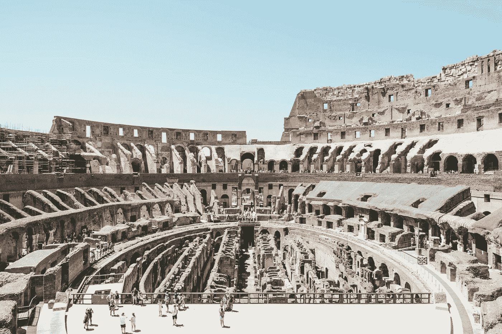

**Figure 1.** Colosseum — Photo by [Hank Paul](https://unsplash.com/@henrypaulphotography?utm_source=unsplash&utm_medium=referral&utm_content=creditCopyText) on [Unsplash](https://unsplash.com/@henrypaulphotography?utm_source=unsplash&utm_medium=referral&utm_content=creditCopyText">Hank Paul</a> on <a href="https://unsplash.com/?utm_source=unsplash&utm_medium=referral&utm_content=creditCopyText).

用于实例识别和信息检索的度量学习是一种已经在多个领域广泛实施的技术。这是一个与研究中的新应用高度相关的概念，如 DeepMind 的[alpha fold](https://www.nature.com/articles/s41586-021-03819-2)【11】在生物学中的最新人工智能突破[2]，也是一个成熟和成熟的概念，可以在行业中看到大量的实施，从谷歌搜索的上下文信息检索[12]，到人脸识别的图像相似性[7]，你可能每天都用它来解锁你的手机。在本文中，我将介绍一个完整的图像查询架构示例，它是当今计算机视觉挑战之一——**地标识别**的现代解决方案的基础。

## 目录

*   [本文的目标](#2846)
*   [谷歌地标数据集 v2](#a21d)
*   [基线架构](#eedb)
*   [库和依赖关系](#b2c9)
*   [入门](#cb4b)
*   [培训、测试和验证分割](#1973)
*   [增强层](#7285)
*   [全球描述符](#0313)
*   [余弦相似度](#9826)
*   [根据局部特征重新分级](#5b8e)
*   [重新排序示例](#elf8)
*   [弧面损失](#de56)
*   [谷歌的统一 DELG 模式](#9053)

## 本文的目标是

在这篇文章的引言中，我列出了一些例子，这些例子应该可以让你了解相似性搜索的相关度量学习与现代机器学习的关系。在接下来的部分中，我将通过一个用于**地标识别任务的基线解决方案来指导您完成该技术的一个示例实现。**我们将使用 Google Landmarks 数据集 v2 [8]的一个子集，从现在开始，我将其称为 GLDv2。

这个问题的解决可以分为两个任务:*图像检索*和*实例识别*。检索的任务是根据图像与查询图像的相关性对索引集中的图像进行排序。识别任务是识别在查询图像[8]中显示了对象类的哪个特定实例(例如*对象类“绘画”的实例“蒙娜丽莎”)。如 [GLDv2 数据集论文](https://arxiv.org/abs/2004.01804)中的基准所示，最先进的方法在一定程度上使用了**全局特征相似性搜索**与**局部特征匹配重新排序**。在这里，我旨在解释、说明和实现这些概念，并希望让您更清楚地了解如何将它们扩展到自己的应用程序中。*

## 谷歌地标数据集 v2

该数据集是由谷歌在 2020 年推出的，其动机是深度学习方法在地标识别任务中的快速发展。以前的基准数据集，如 [Oxford5k](https://www.robots.ox.ac.uk/~vgg/publications/papers/philbin07.pdf) 和 [Paris6k](https://www.robots.ox.ac.uk/~vgg/publications/papers/philbin08.pdf) ，正在努力跟上新的解决方案[8]，并且不是确保可伸缩性和泛化的良好资源，因为它们只包含来自单个城市的少量实例的少量查询图像。

为了定义一个新的具有挑战性的基准，GLDv2 被提议为迄今为止最大的数据集，具有超过 5，000，000 幅图像和 200，000 个不同的实例标签(类别或地标)。测试集包含大约 118，000 个带有基本事实注释的查询图像，最重要的是，只有 1%的图像实际上在地标的目标域内。其他 99%是域外的、不相关的图像[8]。除此之外，它还有两个旨在测试模型稳健性的核心特征:

1.  **极度偏斜的阶级分布**。虽然著名的地标可能有成千上万的图像样本，但是 57%的类最多有十个图像，38%的类最多有五个图像。
2.  **类内变异性**。地标有来自不同有利位置和不同细节的视图，以及建筑物的室内和室外视图。

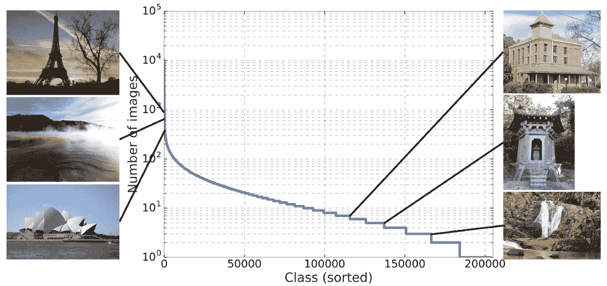

**Figure 2.** Google Landmarks Dataset v2 long-tailed class distribution [8].

虽然本文出于说明的目的，将使用来自原始 GLDv2 训练集的具有 75 个类和 11，438 个地标图片的**子集，但是我们仍然必须处理上面的一些挑战。**

随着 GLDv2(以及之前的 GLDv1)的发布，谷歌赞助了一系列 Kaggle 竞赛，包括[2020 年版](https://www.kaggle.com/c/landmark-recognition-2020)【9】，其中排名靠前的解决方案激发了这里所示的架构。如果你想了解更多关于 GLDv2 的信息，我推荐你去浏览一下[数据集库](https://github.com/cvdfoundation/google-landmark)和[论文](https://arxiv.org/abs/2004.01804)。您还可以在这里直观地探索数据集[。](https://storage.googleapis.com/gld-v2/web/index.html)

## 基线架构

我们的模型架构改编自 [2020 年识别挑战赛冠军](https://arxiv.org/abs/2010.01650)【10】和 [2019 年识别挑战赛第二名](https://arxiv.org/abs/1906.03990)【5】的论文，可以视为地标识别任务的基准解决方案。下图说明了使用全局特征搜索和利用局部特征杠杆进行重新排序的训练和检索例程，我们将在下面的部分中详细介绍。

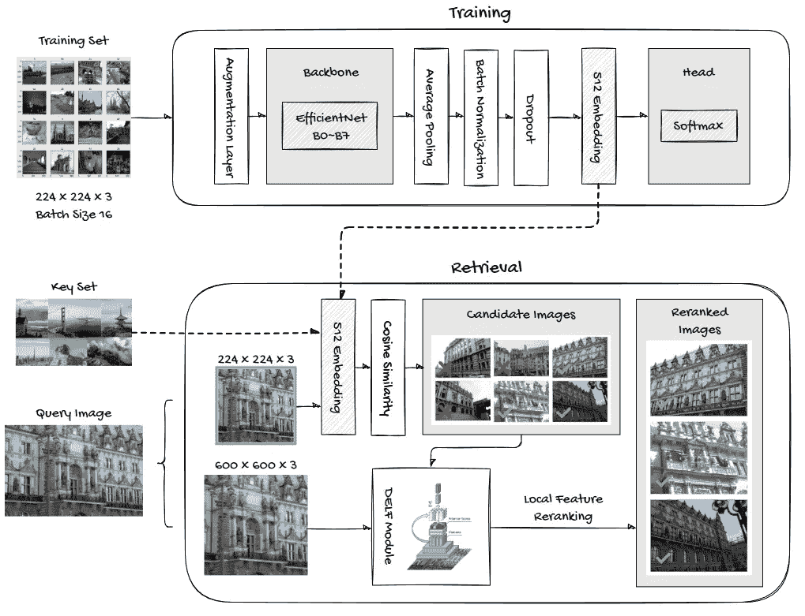

**Figure 3.** Landmark recognition baseline architecture. Diagram by the author.

Google 也优化了一个类似的架构到统一的模型中(DELG 的深度局部和全局特性)[4]。我专门写了一小段，以后你可以在这里读到更多。

我的完整 Kaggle 笔记本以及本文中的所有代码可以在这里找到。如果你觉得有用的话，可以考虑留一张赞成票。

## 库和依赖项

我们的实现将使用 TensorFlow 2 和 OpenCV 作为核心库。围绕这一点，我们将使用 NumPy 和 Pandas 进行数据辩论，使用 SciPy 进行距离度量，使用 matplotlib 和 seaborn 进行可视化。

Google Collab 和 Kaggle 笔记本上的托管笔记本实例预装了所有需要的库。然而，对于这个迷你项目，我建议在 [Kaggle 笔记本](https://www.kaggle.com/code)上工作，因为无需下载就可以轻松访问完整的 GLDv2 数据集(特别是如果您想要在完整的数据集上进行实验，该数据集的大小为 105 GB)。

## 入门指南

为了开始，我们可以确认我们的工作环境设置为使用 GPU 加速运行。您可以使用 bash 命令`nvida-smi`验证它是否启用了 GPU，并检查当前的 CUDA 版本。完成后，我们可以开始导入我们的库。

我们现在可以定义数据集目录和。csv 路径。如果您在 Kaggle 环境中为比赛工作，数据将分布在一个 train 和 test 文件夹中，其中每个图像根据图像`id`的前三个字符放置在三个子文件夹中(即图像`abcdef.jpg`放置在`a/b/c/abcdef.jpg`)。该目录还包含一个带有培训标签的 train.csv 文件。

**Figure 4.** Kaggle GLDv2 folder structure.

我们将继续读取 train.csv 文件，并使用从各自的`id`导出的训练图像路径定义一列。

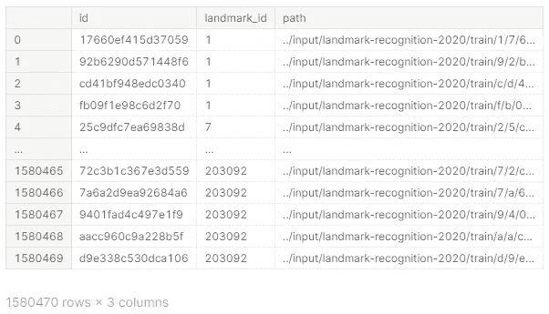

**Figure 5.** Train DataFrame with image paths.

然后，我们将定义要使用的子集。我们将研究数据的一个小子集，以保持实验在可行的时间内是可管理的，包括训练和余弦相似性搜索的检索。该子集由每类具有至少 150 个且不超过 155 个图像的界标来定义。我们还将为每个职业分配一个新的、更易理解的地标 id。

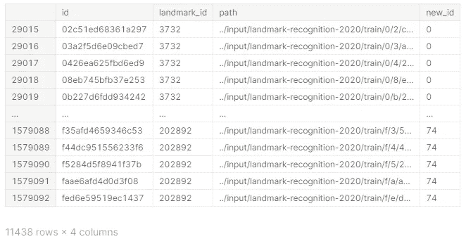

**Figure 6.** Subset with 11438 rows and 75 landmark classes.

我们从 1，580，470 张图片减少到 11，438 张，分布在 75 个不同的地标类别中。如果您想正面迎接挑战，并在完整的数据集上工作，我会推荐一些优化实现，特别是在余弦相似性搜索中，但我们将在后面的部分中讨论这一点。现在，让我们关注基线模型的理论和核心实现。

## 培训、测试和验证分离

我们将进行分层划分来定义我们的训练、验证和测试集。为此，我们将使用 sciki-learn `train_test_split`方法，同时将我们的标签传递给`stratify`参数。这将确保我们的子集中的 75 个类中的每一个都将在分割后出现在训练集、验证集和测试集中。

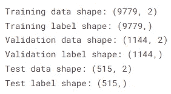

**Figure 7.** Training, validation, and test shapes.

我们现在可以确认，它是均匀分布的，每个子集上有一些直方图。

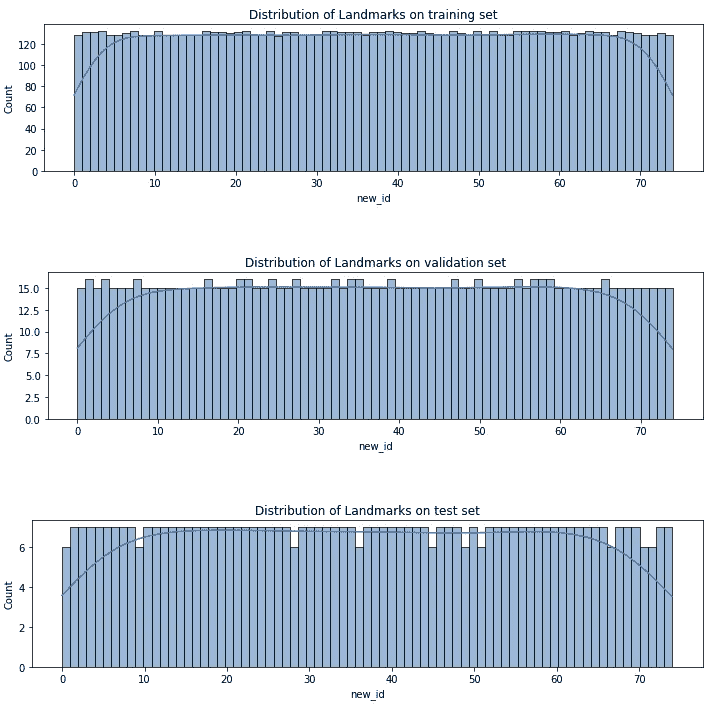

**Figure 8.** Stratified training, validation, and test split distribution.

到目前为止，我们一直在处理从 train.csv 文件生成的数据帧。现在我们必须处理来自数据集的实际图像。我们将首先定义一个新的文件夹结构，将我们的每个子集图像放入一个以地标 id 命名的目录中。这是允许我们使用 TensorFlow `image_dataset_from_directory`函数创建`tf.data.Dataset`对象的重要一步。

我们现在可以检查我们的新文件夹结构是否就位。

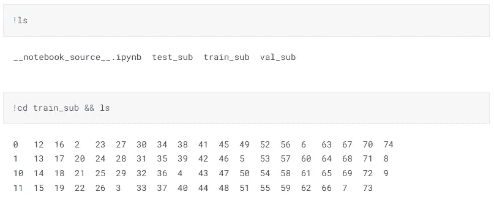

**Figure 9.** New image directories.

最后，从我们的训练、测试和验证集创建 TensorFlow `tf.data.Dataset`。这些对象使我们整个管道中的数据流非常高效，并且肯定会有助于性能向前发展。

函数`image_dataset_from_directory`可以通过使用`image_size`参数调整图像大小来预处理我们的图像，并为训练和验证预设我们的批量大小。所以我们也要定义这些参数。

现在我们的数据已经可以使用了。您可以通过`dataset`对象中的`.take()`方法查看其中一个训练批次。记住，我们的子集在最初的分割中被打乱了。

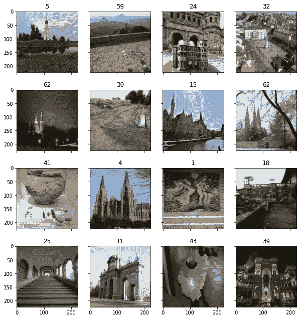

**Figure 10.** Sample batch from the training dataset.

从这里，您可以看到 GLDv2 数据集的一些理想化挑战仍然存在于我们的子集中。由于类内可变性较高，我们可以看到从室内和室外视图拍摄的同一地标的图片。也有与其类别间接相关的照片，例如上图中来自*地标 41* 的照片，代表一件可能位于数据集中所描绘的实际地标内部的博物馆藏品。

## 增强层

我们将使用图像增强来帮助泛化，并防止模型过度拟合训练数据。有了问题本质的知识，我们就可以在这一步定义什么可行，什么不可行。理想的地标识别和检索模型应该能够从不同角度拍摄的非专业图片中识别实例级的地点。以下代码片段将定义一个基本的增强层，该层对训练图像应用随机平移、随机旋转和随机缩放。值得注意的是，在推断过程中会绕过增强层，这意味着它只会在训练步骤中对图像进行预处理。记住这一点，我们可以通过将`training = True`传递给我们的增强层来看一个增强示例。

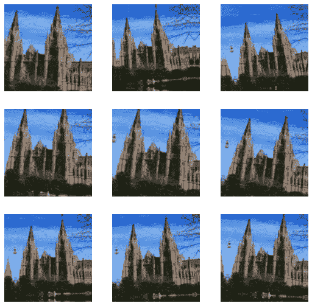

**Figure 11.** Sample augmentation step.

我们在这里避免使用的一种常见的增强方法是在垂直轴上随机镜像或翻转图像。虽然我们知道我们的模型应该是平移和视点不变的(它应该能够识别图片中不同位置和不同视点下的地标实例)，但是它不应该对垂直对称不变。虽然一些地标可能确实是关于它们的垂直轴对称的，但是大多数都不是。

另一方面，一种被证明可以提高模型性能的增强技术[10]是随机剪切。它随机模糊原始图像的小区域，正如上面使用的例子一样，它也是一种有效的正则化方法。你可以在这里找到一篇关于它的简洁而信息丰富的媒体文章，作者是 [Ombeline Lagé](https://medium.com/u/922346f406cd?source=post_page-----6c1b8e0902bd--------------------------------) 。

有了我们的增强层，我们现在可以定义我们的分类模型。

## 全局描述符

如果你回头看看我们的模型架构，你会注意到一个关于度量学习的相似性搜索的工具性事实——我们并不是直接从我们的分类模型中推断出被查询图像的地标标签。在本节中，我们将建立一个预训练的 EfficientNet，并使用它来训练我们的**嵌入层**，稍后我们将使用它来将我们的查询和关键图像编码到一个 512 维的特征向量中。

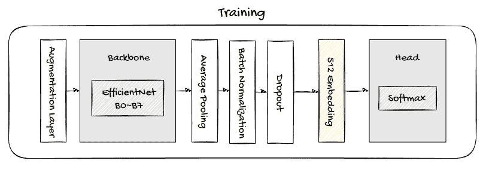

**Figure 12.** Global descriptor training architecture.

嵌入层将负责我们的**全局描述符**，上图显示了我们的**全局检索模型**的训练架构。

但是什么是全局图像描述符呢？简而言之，它是一个 n 维向量，作为我们的图像的编码版本，适合特定的用例。在我们的例子中的一个具有 512 个维度，具有优化的辨别能力来区分一个地标和另一个地标。它不仅从地标的一般视觉特征中学习，还从上下文信息中学习，例如背景和前景对象、照明条件和有利位置。

虽然下面的模型不用于推理，但是我们的全局描述符的质量与分类模型的性能直接相关。对于识别和检索竞赛中排名最高的解决方案，这些嵌入层通常在多个 ResNet CNNs 的集合上训练。在下面的示例中，我们将使用预训练的 EfficientNetB0(也称为*主干模块*)实现一个简单的解决方案。然后，我们的分类头在一个平均池、一个批量规范化和一个用于规范化的删除层的基础上重新构建。

嵌入图层正好构建在 Sotfmax 分类图层之前。它也被命名为`embedding_512`以备后用。请注意，我们是如何冻结 EfficientNet 块来保持预训练的权重的。为了提高性能，您还可以微调主干中的顶层(Keras 文档中的[迁移学习指南](https://keras.io/guides/transfer_learning/)中有一节是关于微调的)。我们将保持简单，继续用 ADAM 优化器和学习率调度器进行训练。

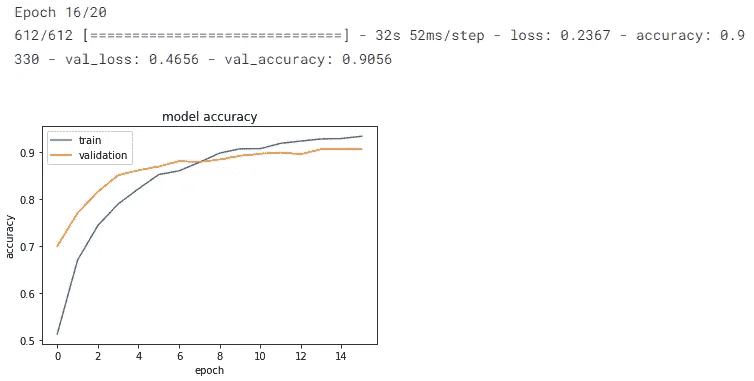

**Figure 13.** Train and validation loss.

并评价最佳模型性能。

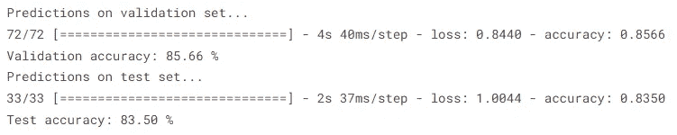

**Figure 14.** Best model performance in the validation and test set.

这样，我们就有了一个经过训练的嵌入层，现在可以用它来生成全局描述符。这将我们引向我们的检索步骤。

## 余弦相似性

度量学习的核心概念围绕着一个*参数距离*或*相似性函数*在一个或多个**相似性(或不相似性)判断**上的优化。根据这个词的最佳定义，判断是关于手头任务的深思熟虑的决定，并且通常被编码为目标变量——在我们的例子中，是 landmark 类。

但是这个概念并不总是简单明了的。下面的例子来自*“相似性和距离度量学习及其在计算机视觉中的应用”* (Bellet，A. et al. 2015) [1]说明了一种定性判断，这种判断通常不可直接量化。这些是监督度量学习可以发挥最大作用的情况。

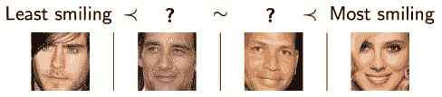

**Figure 15.** Example of a qualitative judgement fitting to a metric learning task. [1]

有了定义的判断，我们就可以实现一个能够解决这个优化问题的模型架构。在我们的例子中，我们将使用一个**余弦相似度**作为我们的距离度量，如前所述，优化发生在我们的全局描述符的训练期间。我们的嵌入层越好(最具描述性)，我们就越接近问题的最佳解决方案。

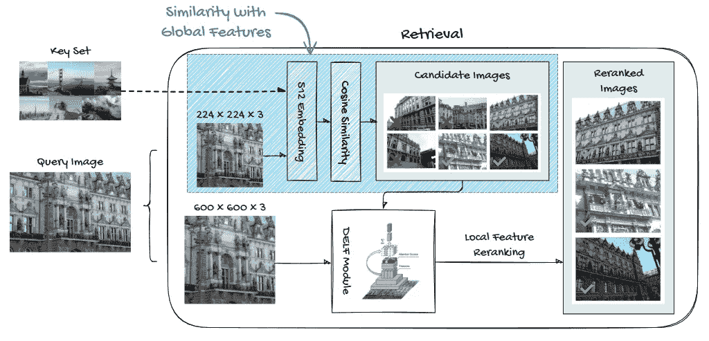

**Figure 16.** Similarity search with global features in the architecture diagram.

余弦相似性(或角余弦距离)是两个向量之间角度的余弦度量，可以用数学方法描述为向量的点积与其长度的乘积(或其欧几里德范数的乘积)之比[3]。

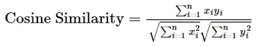

**Figure 17.** Cosine Similarity mathematic representation [3].

上式中， *x* 和 *y* 是两个独立矢量的分量， *n* 是它们的维数。

在下面的代码片段中，我们实现了一系列辅助函数来加载和预处理单个图像，检索给定模型的图像嵌入(稍后我们将把我们的`embedding_512`层传递给它)，计算查询和键集之间的成对相似性，以及一些可视化函数来绘制我们最相似的候选图像。

> **关于性能的注意事项**:上面的余弦相似性实现基于简单的 SciPy 顺序 CPU 运行，旨在针对所有矢量化关键样本在单个矢量化查询图像之间单独执行。
> 
> 当处理大规模场景(例如完整的数据集)时，您希望高效地计算查询向量矩阵和关键样本矩阵之间的余弦距离。为此，您可以使用 TensorFlow tensors 实现批处理 GPU 运行，以实现高度并行化的执行。您可以查看 [keras 余弦相似性损失](https://www.tensorflow.org/api_docs/python/tf/keras/losses/CosineSimilarity)源代码，了解如何使用张量执行此操作。

对于接下来的例子，我们将使用我们的训练集作为我们的关键图像，并从我们的验证集中获取一些查询样本。下面的代码将通过函数`get_embeddings()`将两个子集传递到`embedding_layer`。它将为每个图像生成 512 维的全局描述符。

所以让我们使用我们的`query_top()`函数来查询一些图像并可视化结果。

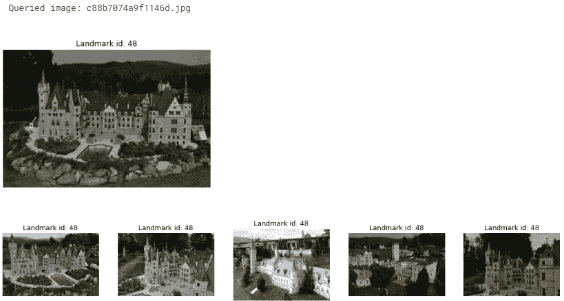

**Figure 18.** Queried image and highest similarity candidates.

我们可以从查询集中的第一幅图像看出，我们的全局描述符是有效的，并且结果与我们的查询图像高度相关。他们不仅返回了所有前五名候选人的正确地标，还返回了具有相似有利位置和照明条件的图像。

下面的函数执行类似的搜索，但返回的结果是熊猫数据帧。

我们可以用它来查看我们的余弦相似性分数。

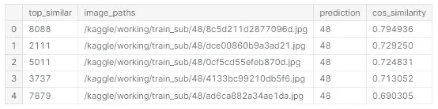

**Figure 19.** Highest similarity candidates scores.

我们可以对其他查询图像示例重复这个过程。

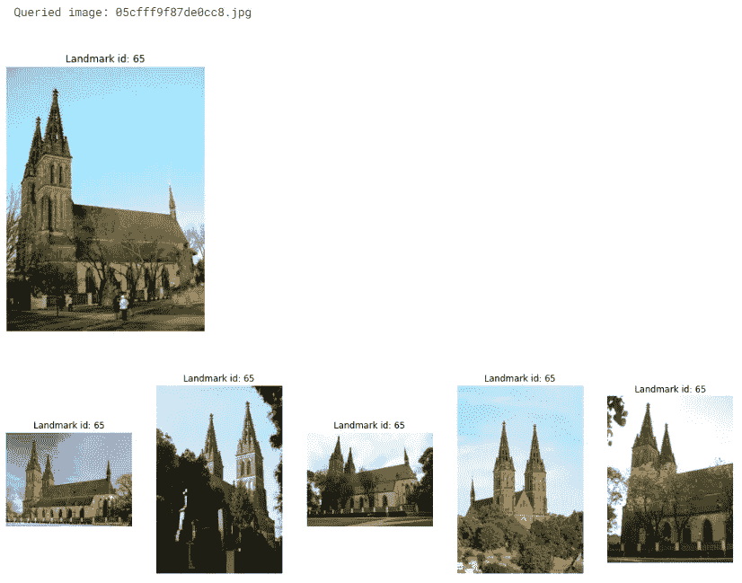

**Figure 20.** Queried image and highest similarity candidates example.

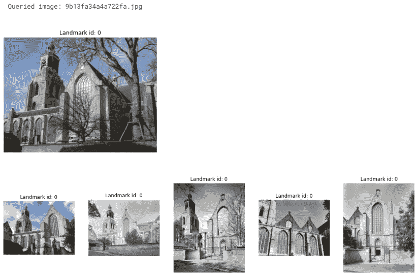

**Figure 21.** Queried image and highest similarity candidates example.

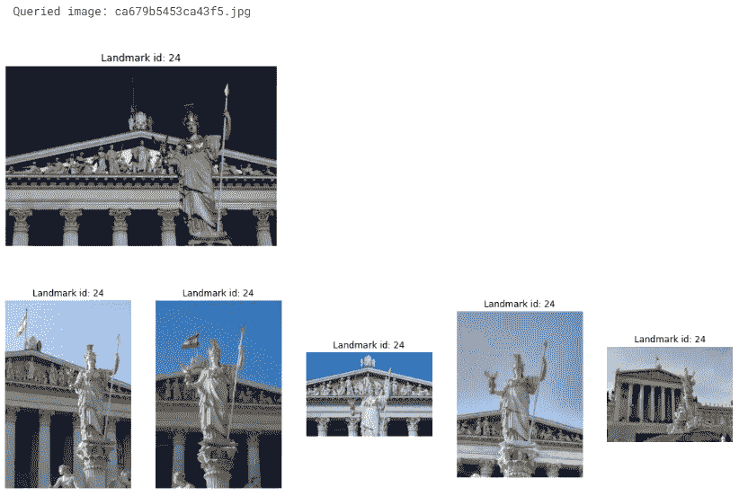

**Figure 22.** Queried image and highest similarity candidates example.

这样，我们就结束了具有全局特征的相似性搜索。到目前为止，我们已经取得了很好的结果，但是让我们看一个例子，在这个例子中，全局描述符在性能上有所欠缺。

## 使用局部特征重新排序

让我们看一个物体遮挡的例子。

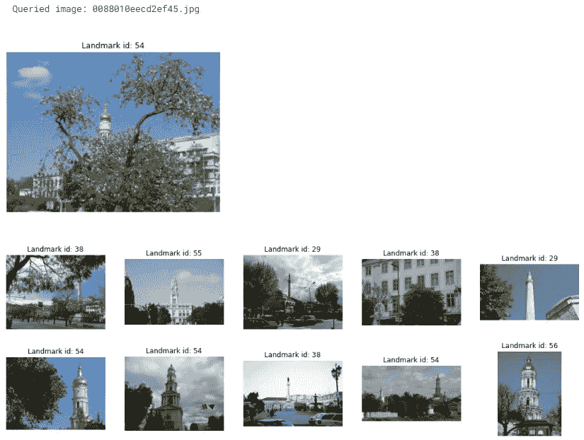

**Figure 23.** Landmark occlusion example.

该地标不仅被遮挡，而且还占据了图片中相当小的区域，该区域由前景中的树主导。我们可以从结果中看到，它在相似性搜索中发挥了主要作用，并且在大多数顶部结果中，我们还可以在图像中看到一棵大树。

这是一个例子，在这个例子中，我们的地方特色将发挥重要作用。

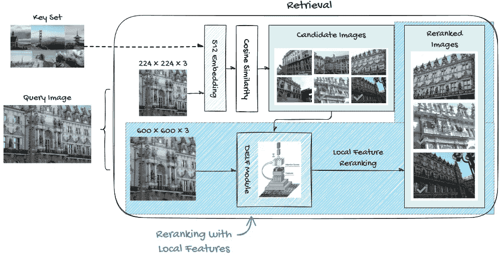

**Figure 24.** Reranking with local features in the architecture diagram.

我们将使用**深度局部特征(DELF)**【13】**模块从我们的查询图像中提取关注的局部特征描述符，并将其与之前选择的排名最高的候选图像进行比较。**

**DELF 是一种卷积神经网络模型，在地标图像上进行训练。它实现了精确的特征匹配和几何验证，通过模型论文，谷歌宣布了第一个谷歌地标数据集(GLDv1) [13]。可以在[论文](https://arxiv.org/abs/1612.06321)中了解更多。**

**以下实现改编自 DELF 模块的 [TensorFlow hub 教程。由于这是一个优化步骤，我们将设置我们的图像大小为 600 x 600。以下代码将从 TensorFlow hub 加载预训练的 DELF 模型，并定义一些函数来查找图像对之间的内联体(特征匹配)。](https://www.tensorflow.org/hub/tutorials/tf_hub_delf_module)**

**现在，我们可以遍历之前的结果来寻找内联体。**

**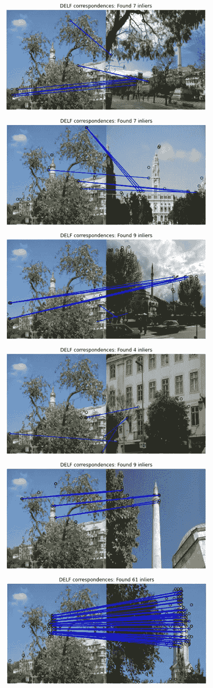**

****Figure 25.** DELF correspondences on candidate images.**

**DELF 架构提出的局部注意特征是基于几何属性的相似性匹配的强大描述符。从上面的结果可以看出，尽管在比例和分辨率上存在差异，但它能够在正确的图像对之间识别建筑结构的相关特征。**

**这就是我们的最后一步。我们将使用找到的 DELF 对应的数量从全局相似性搜索中重新排列我们的候选图像。以下函数将通过将当前值乘以使用局部特征找到的内联体数量的平方根来重新计算置信度指数(之前为余弦相似度)。**

**最后，我们可以看看上面例子的重新排序结果。**

**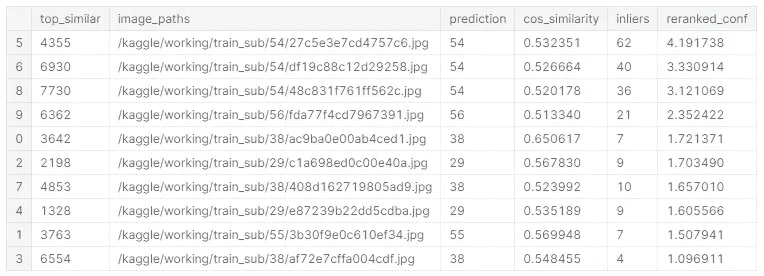**

****Figure 26.** Reranked confidence index.**

**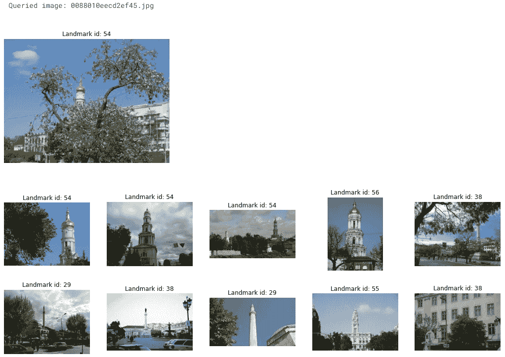**

****Figure 27.** Reranked candidate landmarks.**

**至此，我们已经介绍了利用全局相似性搜索和局部特征重新排序进行地标识别的完整度量学习架构。**

**我将在下面的章节中留下额外的重新排序的例子和相关的补充阅读材料。**

## **重新排序示例**

**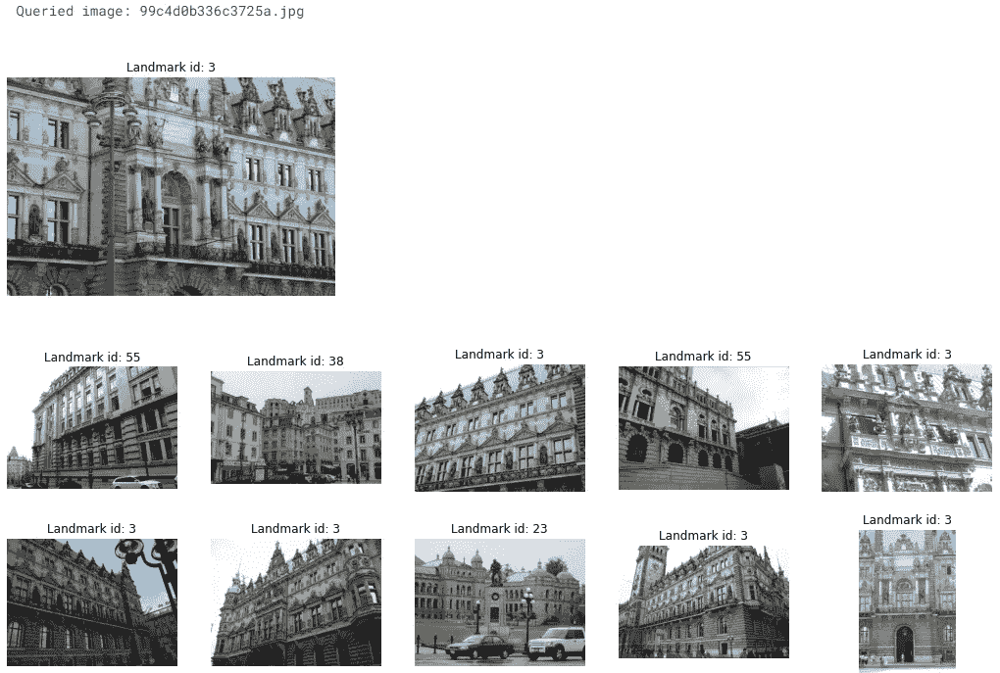**

****Figure 28.** Queried image and highest similarity candidates without reranking.**

**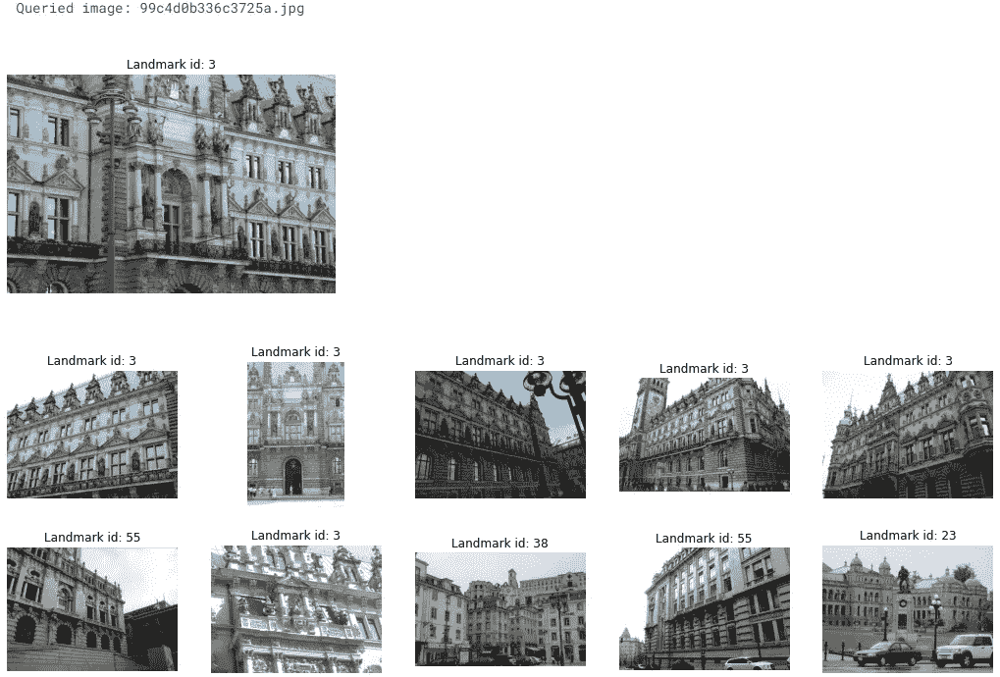**

****Figure 29.** Reranked results with local features.**

**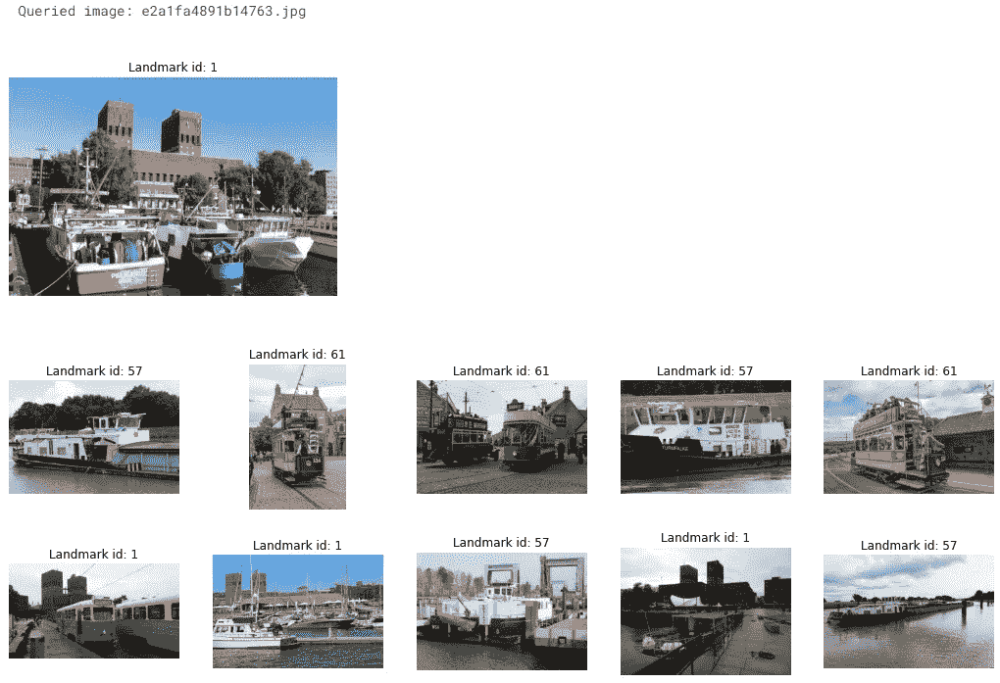**

****Figure 30.** Queried image and highest similarity candidates without reranking.**

**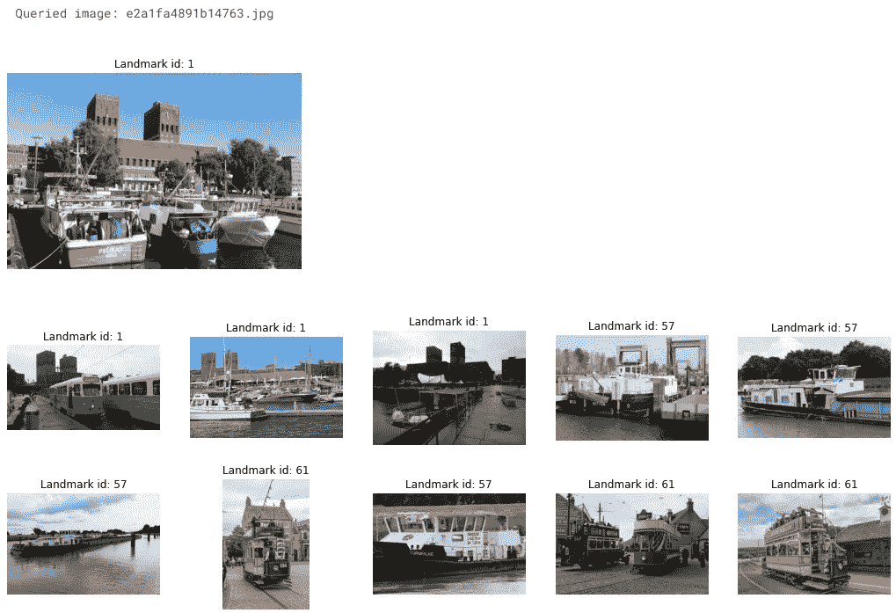**

****Figure 31.** Reranked results with local features.**

**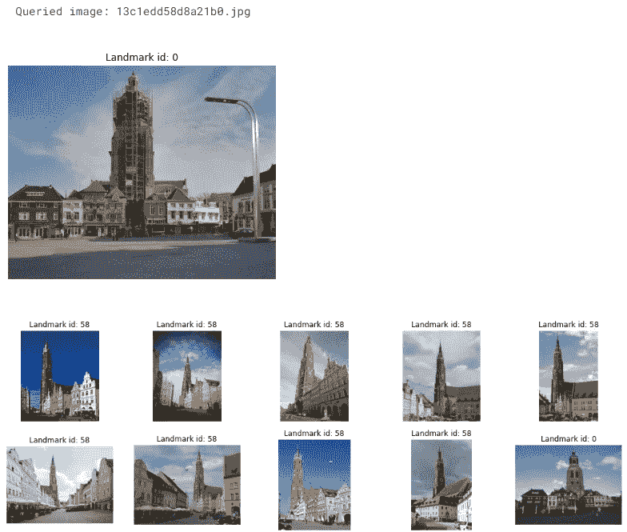**

****Figure 32.** Queried image and highest similarity candidates without reranking.**

**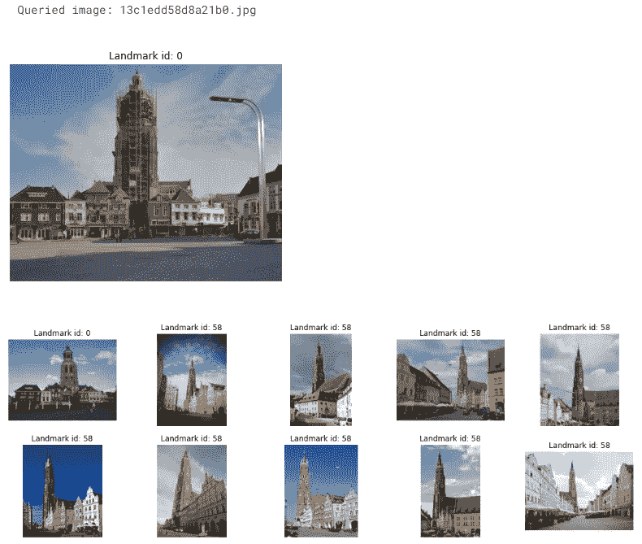**

****Figure 33.** Reranked results with local features.**

## **弧面损失**

**处理大规模分类问题(如 GLDv2 数据集中的问题)的挑战之一是，大量的类(在现实世界中可能会随着时间的推移而增加)会导致常规的 softmax 损失函数缺乏类间可分性。为了解决人脸识别算法的类似问题，ArcFace Loss 于 2018 年提出，今天在地标识别算法中被高度采用。**

**ArcFace margin [6]是一个附加的角裕度损失函数，它强制执行较小的类内方差。与这里使用的 softmax 损失函数相反，由于其增强的辨别能力，已经证明它产生更好的全局特征描述符。**

**如果你想了解更多，我强烈推荐阅读[的论文](https://arxiv.org/pdf/1801.07698.pdf) (Deng，J. et al. 2018) [6]和 Slawek Biel 的优秀的[内核](https://www.kaggle.com/code/slawekbiel/arcface-explained)，与通常的 softmax 损失相比，它提供了 ArcFace 学习嵌入的视觉直观。**

## **谷歌的统一 DELG 模式**

**深度局部和全局特征(，Cao，b .等人，2020) [4]是谷歌提出的统一模型，该模型将 DELF 的注意力模块与更简单的训练管道相结合，该训练管道与同一架构下的全局特征检索相集成。它本质上是本文中举例说明的架构的单一模型实现。**

## **喜欢这个故事吗？**

**你可以在 Medium 上关注我，获取更多关于数据科学、机器学习、可视化和数据分析的文章。**

**你也可以在 [*LinkedIn*](https://www.linkedin.com/in/erich-henrique/) *上找到我，我在那里分享这些内容的简短版本。***

## **参考**

**[1] Bellet，Aurélien 和 Matthieu Cord"相似性和距离度量学习及其在计算机视觉中的应用."里尔大学研究，2015 年 9 月 7 日。[http://researchers . lille . inria . fr/abellet/talks/metric _ learning _ tutorial _ cil . pdf](http://researchers.lille.inria.fr/abellet/talks/metric_learning_tutorial_CIL.pdf.)**

**[2] Callaway，Ewen。“‘它将改变一切’:deep mind 的人工智能在解决蛋白质结构方面取得巨大飞跃。”自然新闻。自然出版集团，2020 年 11 月 30 日。[https://www.nature.com/articles/d41586-020-03348-4.](https://www.nature.com/articles/d41586-020-03348-4.)**

**[3]“余弦距离余弦相似度角余弦距离角余弦相似度。”余弦距离，余弦相似性，角余弦距离，角余弦相似性。2022 年 10 月 29 日接入。[https://www . ITL . NIST . gov/div 898/software/data plot/ref man 2/auxillar/cos dist . htm](https://www.itl.nist.gov/div898/software/dataplot/refman2/auxillar/cosdist.htm.)**

**[4]曹、、阿劳若、安德烈和杰克·西姆。"统一图像搜索的深度局部和全局特征."arXiv ，(2020)。[https://doi.org/10.48550/arXiv.2001.05027.](https://doi.org/10.48550/arXiv.2001.05027.)**

**[5]陈、凯冰、崔、程、杜、余宁、孟、向龙、惠仁。“2019 年 Kaggle 地标识别和检索竞赛的第二名和第二名解决方案。” *arXiv* ，(2019)。[https://doi.org/10.48550/arXiv.1906.03990.](https://doi.org/10.48550/arXiv.1906.03990.)**

**[6]邓建康、郭、贾、杨、景、薛、年南、科奇亚、艾琳和斯特凡诺斯·扎菲里乌。" ArcFace:深度人脸识别的附加角裕度损失." *arXiv* ，(2018)。[https://doi.org/10.1109/TPAMI.2021.3087709.](https://doi.org/10.1109/TPAMI.2021.3087709.)**

**[7]“面部识别无处不在。这是我们能做的。”纽约时报。《纽约时报》，2020 年 7 月 15 日。https://www . nytimes . com/wire cutter/blog/how-face-recognition-works/。**

**[8]“谷歌地标数据集 v2——实例级识别和检索的大规模基准”，T. Weyand，A. Araujo，B. Cao 和 J. Sim，Proc .CVPR 20 年**

**[9]“谷歌地标识别 2020。”卡格尔。谷歌。2022 年 10 月 28 日访问。[https://www.kaggle.com/c/landmark-recognition-2020.](https://www.kaggle.com/c/landmark-recognition-2020.)**

**[10]汉高、克里斯托夫和菲利普·辛格。“支持域外样本的大规模图像识别。” *arXiv* ，(2020)。【https://doi.org/10.48550/arXiv.2010.01650\. **

**[11] Jumper，j .，Evans，r .，Pritzel，A. *等*“用 AlphaFold 进行高度精确的蛋白质结构预测”*性质* **596** ，583–589(2021)。[https://doi.org/10.1038/s41586-021-03819-2](https://doi.org/10.1038/s41586-021-03819-2)**

**[12]纳亚克，潘杜。“比以往任何时候都更好地理解搜索。”谷歌。谷歌，2019 年 10 月 25 日。[https://blog . Google/products/search/search-language-understanding-Bert/。](https://blog.google/products/search/search-language-understanding-bert/.)**

**[13] Noh、Hyeonwoo、Araujo、Andre、Sim、Jack、Weyand、Tobias 和 Bohyung Han。"关注深层局部特征的大规模图像检索." *arXiv* ，(2016)。[https://doi.org/10.48550/arXiv.1612.06321.](https://doi.org/10.48550/arXiv.1612.06321.)**

** [## Mlearning.ai 提交建议

### 如何成为 Mlearning.ai 上的作家

medium.com](/mlearning-ai/mlearning-ai-submission-suggestions-b51e2b130bfb)**