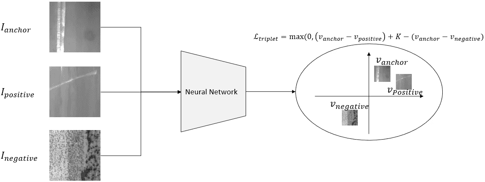
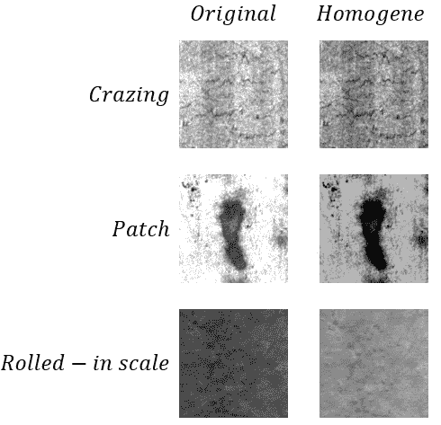
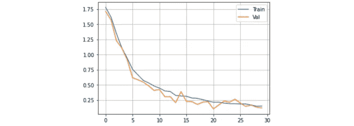
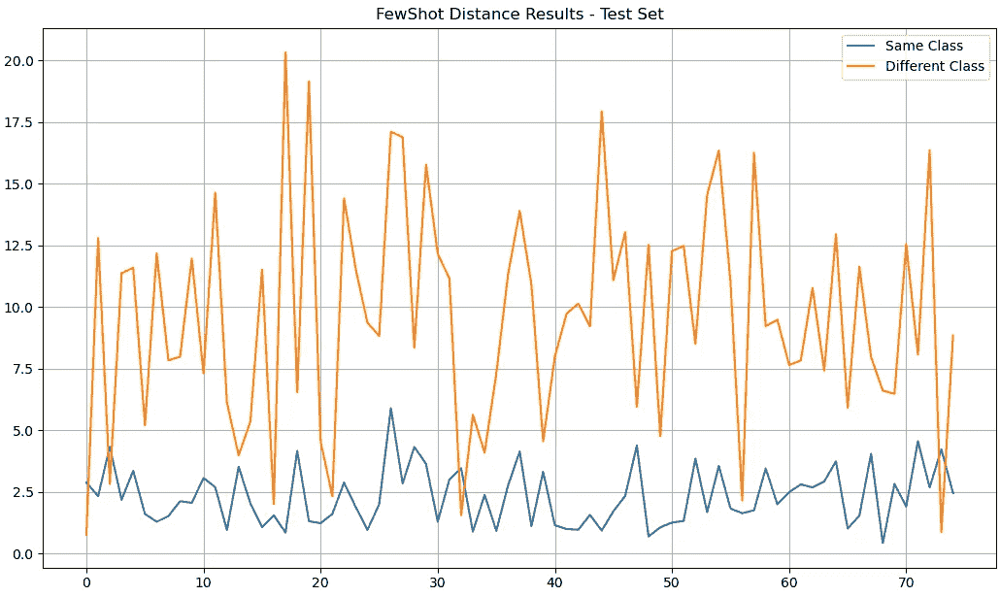

# 钢表面分类的度量学习—第 2 部分

> 原文：<https://medium.com/mlearning-ai/metric-learning-for-steel-surface-classification-part-2-43afd860123d?source=collection_archive---------9----------------------->

# 介绍

在上一篇文章中，我们简要介绍了像热轧钢表面控制问题和深度度量学习这样的概念。在这里，我们将使用 Pytorch 实现少数镜头分类问题的解决方案，用于编码神经网络图、数据集准备和训练管道。

每一段代码都将被展示和解释，这样你就可以跟着编写代码了。我们开始实现暹罗神经网络，然后在 Dataset 类中定义数据集预处理步骤，最后设计网络训练管道。

# 暹罗网络

暹罗网络是少数镜头分类网络的通用名称，因为相同的网络层用于处理查询和支持图像。

Figure 1: Deep Metric Learning with Triplet Loss

这里，我们实现了具有全连接报头的卷积架构。使用卷积核的想法是，它们能够从输入的小块中提取区域特征，从这些小块而不是单个像素中学习有意义的表示。这种基于区域的方法允许网络对随机噪声变得更加鲁棒，同时，与全连接或关注层相比，卷积层能够在多维度上工作，以更有效的方式分析稀疏输入。它通常是处理图像时的“首选”图层类。在这里，我们利用一种叫做迁移学习的常见做法来加快训练速度，并取得更好的成绩。我不会深入研究迁移学习，因为有成千上万的文章解释它[ [3](https://machinelearningmastery.com/transfer-learning-for-deep-learning/) ][ [4](https://towardsdatascience.com/a-comprehensive-hands-on-guide-to-transfer-learning-with-real-world-applications-in-deep-learning-212bf3b2f27a) ]，但这个想法是用相同的权重和偏差开始你的网络，就像在 ImageNet 和 COCO 这样的大数据集上训练的神经网络一样。因为它们是在数百万张图像上优化的，所以它们的特征提取能力比我们在几千张图像的数据集上所能实现的要高得多，因此我们借用了暹罗网的权重偏差图，冻结所有层直到最后一层，这是生成用于距离计算的嵌入式特征向量的全连接头部。

我们在这里为暹罗网络使用一个 ResNet18 体系结构。我们从 TorchHub 加载预先在 ImageNet 上训练好的模型，你可以在类构造函数中看到。我们选择这个网络是因为它能够平衡生产的泛化能力和延迟。虽然神经网络有 18 层深，但使用 GPU 驱动的硬件，如 NVIDIA Jetson Nano，向前传递的处理时间仍然可以达到毫秒级。

在训练会话中，网络的每次前向传递由 3 个阶段组成:我们通过网络前向传递查询图像，然后通过网络前向传递支持图像，最后，我们计算两个特征向量之间的欧几里德距离。暹罗网络的实现如下所示。

在网络部分，我还添加了本教程第 1 部分描述的三重损耗函数。作为输入，我们给出同类例子( *D_pos* )和不同类例子( *D_neg* )之间的距离。

现在，我们继续对数据集准备工作进行编码…

# 数据集准备

正如在第 1 部分中提到的，我们预先调整数据集，以均匀化整个数据集的亮度。我们首先通过计算类别描述符，即平均灰度像素强度来实现。为此，我们读取该类的每个图像并计算每个图像的平均像素值，然后我们对特定类的所有平均值进行平均，生成一个类平均像素值。

拥有了类平均像素值，我们可以通过计算全局平均像素值并从数据集所有图像的原始像素值中减去该全局平均值来近似数据集的均匀化。

将其应用于我们的原始数据集，结果如下:

Figure 2: Brightness Difference between classes (column 1) and Image Homogenization (column 2)

这并不完美，但在应用均匀化后，类之间的平均值偏移显著减少，如下图所示。我们将从这里继续前进。

Figure 3: Bar-Plot presenting the mean pixel value before homogenization (blue) and after (red)

现在我们用 Python 编写数据集类，我们将在培训管道中应用它。在运行时，调用 *__getitem__()* 方法，给定数据集示例总数的索引。它返回一个有两个例子和一个标签的字典:如果索引是偶数，则两个例子属于同一个类，标签为 1；否则，当索引为奇数时，两个示例属于不同的类，标签为 0。要训练的锚类(Cr，In，Pa，…)是在 create_example()方法中随机挖掘的，偶数/奇数只是一种保证网络中 50%的更新来自相同的类分布而另 50%来自不同的类分布的方法，只是为了平衡学习。

就是这样。我们将在训练管道中实例化 FewShotClassifierDataset 的一个对象。说到这个…

# 培训和验证渠道

培训管道是暹罗网络进行优化的地方。在每个时期，我们计算每批图像的三元组损失，并根据反向传播过程中产生的梯度更新网络的权重。作为一个快速回调，请记住我们已经冻结了预训练网络的所有 ConvLayers，并将只更新最后一个完全连接的 ConvLayers，因此网络主干将生成该 FC 层的特征映射，并学习将该信息嵌入特征向量。

这里，我们将小批量定义为 32，初始学习率为 5e-5，Adam 优化器引擎(beta1 = 0.9，beta2 = 0.99)。在每个训练时段完成后，我们运行验证时段来跟踪性能，并检查我们的网络是否过拟合。

包含所有这些规范的代码如下所示。

现在我们开始训练并检查结果…

# 结果、评论和结论

下面给出了 30 个时期运行的训练和验证数据集的损失曲线。

Figure 3: Loss Curve for Training Session described in the code

我们可以从曲线的外观中得出两个有趣的见解。首先，神经网络似乎正在学习，因为损耗下降到初始值的大约 1/8，这是通过计算三重态损耗产生的。这意味着我们的网络在区分积极和消极阶层方面变得越来越好，这正是我们想要的。使用迁移学习的优势在这里很容易发现，因为我们看到仅仅 30 个时期就足以教授该系统。你可以尝试在没有预训练权重的情况下训练自己的网络来比较结果。

我们的网络正在有效学习的另一个迹象是，验证损失遵循训练损失的趋势，我们可以看到验证曲线大部分时间位于训练曲线下方。我的假设是，在每个时期结束时，我们有一个平均训练损失，在这个时期的迭代中，已经变得越来越小。然后，当在更新权重之后评估验证数据集的损失时，神经网络已经模拟了比训练步骤期间更合适的数据集分布。因此，更新期间和更新之后的平均值有一点差异，其中更新之后的网络以较低的损耗运行。

同样重要的是要注意到，我们只运行了 30 个时期的模型，验证损失似乎跟上了下降趋势。这意味着我们可以为更多的时期训练模型，以获得更好的结果，直到我们看到过度拟合的信号。

为了检查模型的实际输出并比较类之间的距离，我们可以迭代一个测试数据集，将每个图像评估为一个正面和一个负面的例子，并绘制距离，以图形方式查看模型是否将同类和不同类的例子分开。我的结果如下。从图中，我们看到趋势是来自不同类别的特征向量之间的距离比来自相同类别的特征向量之间的距离具有更高的平均值。然而，我们可以在测试数据集上看到一些例子，其中两个不同类别的例子已经计算了相同类别对数量级的距离，导致分类错误。

现在，如果我们将这个模型部署到生产中来监控缺陷的存在，我们训练的模型将作为改进的基线。在这里，我们只使用了 1800 张图像，这可能不包含足够的方差来使网络正确地映射每个缺陷类别的分布。下一步是将其部署到生产环境中，作为计划时间窗口内的 beta 测试，并得出指示改进方式的性能统计数据。如果网络混淆了 A 类和 B 类，我们收集更多的图像并训练新的模型。这种迭代方法是过程的一部分，有助于增强应用程序的性能。

如果你觉得这篇文章很有用，并且想阅读更多关于深度学习、机器人、工程、生产等方面的内容，请订阅我的个人资料，因为我会继续发布更多关于这些主题的内容，试图展示实际的例子。

[**钢材表面分类的公制学习—第一部分**](/@thiago.viek/metric-learning-for-steel-surface-classification-part-1-77502ed60235) **。**

# 参考

[1] Deshpande 等人**钢表面制造缺陷的一次性识别**，2020。

[2]李等.**再论度量学习用于少镜头图像分类，** 2020 .

[3][https://machine learning mastery . com/transfer-learning-for-deep-learning/](https://machinelearningmastery.com/transfer-learning-for-deep-learning/)

[4][https://towardsdatascience . com/a-comprehensive-hands-on-guide-transfer-learning-with-real-world-applications-in-deep-learning-212 BF3 B2 f27a](https://towardsdatascience.com/a-comprehensive-hands-on-guide-to-transfer-learning-with-real-world-applications-in-deep-learning-212bf3b2f27a)

 [## Mlearning.ai 提交建议

### 如何成为 Mlearning.ai 上的作家

medium.com](/mlearning-ai/mlearning-ai-submission-suggestions-b51e2b130bfb)