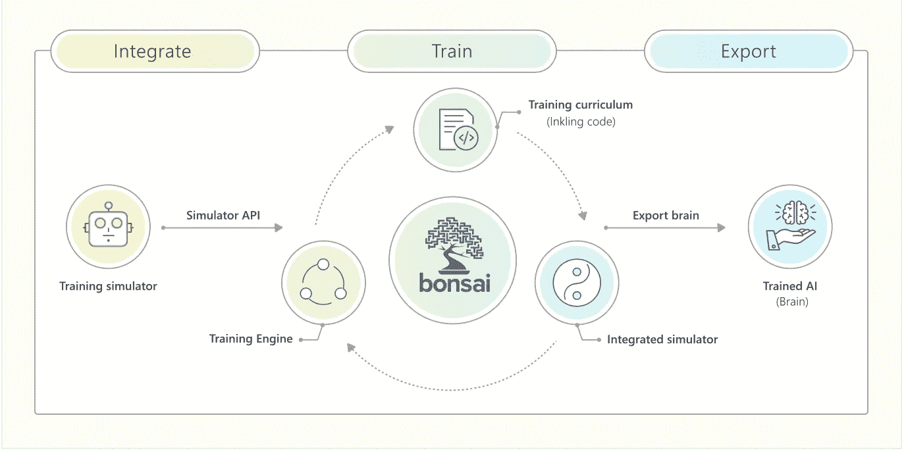
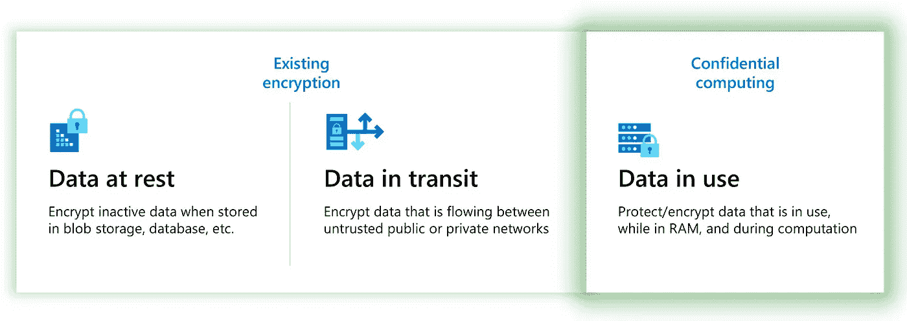
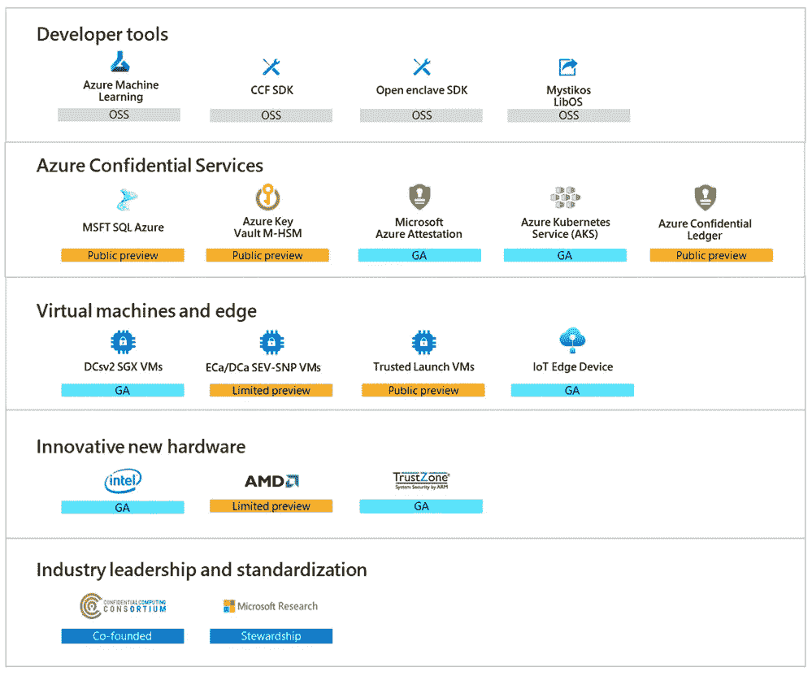
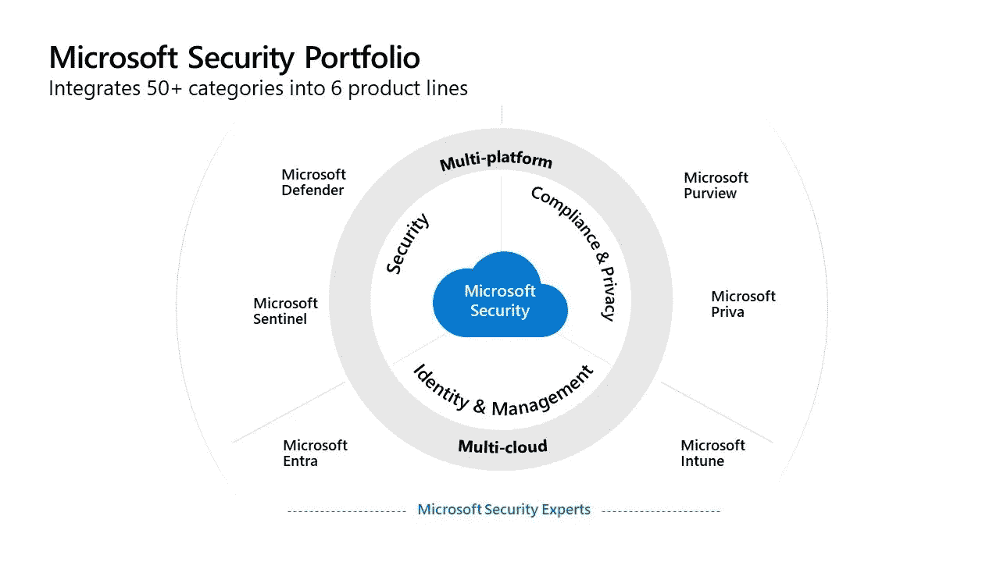
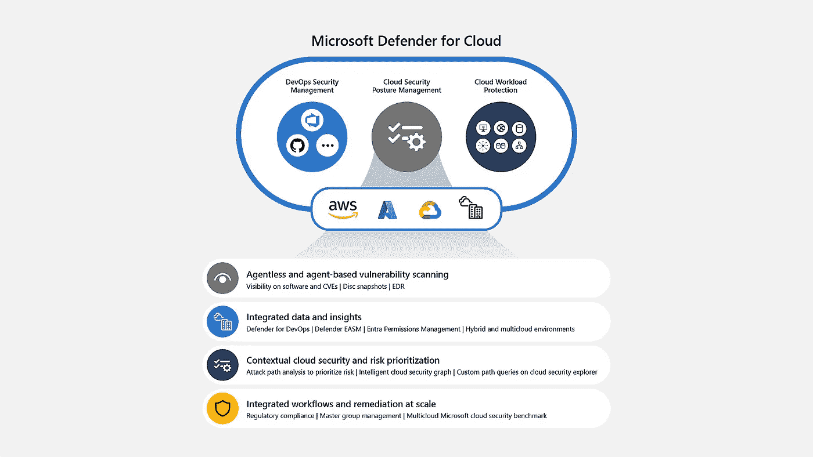

# 微软 Ignite 2022 年 10 月摘要

> 原文：<https://medium.com/mlearning-ai/microsoft-ignite-oct-2022-digest-31d70c9b81c7?source=collection_archive---------3----------------------->

## 关键公告摘要

微软 Ignite 发生在 12–14 年 10 月。让我们看看从 [Ignite 2022 Book of news](https://news.microsoft.com/ignite-2022-book-of-news/) 开始，Azure、AI、安全领域都发生了什么。

# 人工智能

## Azure 认知服务:现成的人工智能服务

[Azure OpenAI 服务](https://learn.microsoft.com/en-us/azure/cognitive-services/openai/overview)，是 [Azure 认知服务](https://learn.microsoft.com/en-us/azure/cognitive-services/)的一部分，与其他 Azure 认知服务如[视觉](https://learn.microsoft.com/en-us/azure/cognitive-services/computer-vision/)、[语言](https://learn.microsoft.com/en-us/azure/cognitive-services/language-service/)、[语音](https://learn.microsoft.com/en-us/azure/cognitive-services/speech-service/)一样，通过 API 提供 read-made 高级语言模型供你消费，如 [GPT-3](https://learn.microsoft.com/en-us/azure/cognitive-services/openai/concepts/models#gpt-3-models) 用于一般理解和生成自然语言， [Codex](https://learn.microsoft.com/en-us/azure/cognitive-services/openai/concepts/models#codex-models) 用于理解和生成代码。现在它增加了 [Dall-E 2](https://jrodthoughts.medium.com/the-sequence-scope-dall-e-2-is-coming-to-azure-and-other-exciting-microsofts-ml-announcements-a384e7ab45a) 来生成带有文本的图像

[Azure 语言认知服务](https://techcommunity.microsoft.com/t5/ai-cognitive-services-blog/what-s-new-in-azure-cognitive-services-for-language-ignite-2022/ba-p/3643388)增强摘要、扩展语言支持并增强联络中心人工智能功能

Azure Cognitive Service for Computer Vision 增加了 [Image Analysis 4.0](https://techcommunity.microsoft.com/t5/ai-cognitive-services-blog/image-analysis-4-0-now-in-public-preview-with-a-unified-api/ba-p/3652106) ，改进了 OCR 功能，边缘上的[空间分析](https://learn.microsoft.com/en-us/azure/cognitive-services/computer-vision/intro-to-spatial-analysis-public-preview)提供了人员计数、入口计数、社交距离和边缘上的面罩检测等功能([Azure Stack Edge](https://azure.microsoft.com/en-gb/products/azure-stack/edge/#features)/[Azure loT Edge](https://learn.microsoft.com/en-us/azure/iot-edge/about-iot-edge))

[Azure Applied AI Services](https://dev.to/azure/all-you-need-to-know-about-azure-applied-ai-services-3711) ，面向任务的 AI services (Azure Form Recognizer、Azure Metrics Advisor、Azure Cognitive Search、Azure Bot Service 和 Azure Immersive Reader)，基于 [Azure Cognitive services](https://learn.microsoft.com/en-us/azure/applied-ai-services/why-applied-ai-services#what-is-the-difference-between-applied-ai-services-and--cognitive-services) ，在[Azure Form Recognizer Studio](https://formrecognizer.appliedai.azure.com/studio)中为合同添加了新的预建模型，以提取当事人和支付条款等实体供下游处理

## Azure 机器学习:构建定制模型

[Azure Machine Learning registries](https://techcommunity.microsoft.com/t5/ai-machine-learning-blog/announcing-registries-in-azure-machine-learning-to/ba-p/3649242)帮助促进、共享和发现机器学习工件，如跨组织中多个工作区的模型、管道和环境，使企业中的多环境 MLOps 更容易。

[用于 PyTorch 的 Azure 容器](https://techcommunity.microsoft.com/t5/ai-machine-learning-blog/enabling-deep-learning-with-azure-container-for-pytorch-in-azure/ba-p/3650489)通过提供用于训练和优化的各种微软技术来扩展 PyTorch 环境，例如 [ONNX 运行时](https://onnxruntime.ai/docs/get-started/training-pytorch.html)和 [DeepSpeed](https://www.deepspeed.ai/training/) 。 [Azure 数据科学虚拟机](https://azure.microsoft.com/en-us/products/virtual-machines/data-science-virtual-machines/#product-overview)(在云中预先配置的虚拟机，用于数据科学和人工智能开发)在 Linux/Ubuntu 20.04 支持上添加 PyTorch

[负责任的人工智能仪表板](https://learn.microsoft.com/en-us/azure/machine-learning/concept-responsible-ai-dashboard)提供仪表板/记分卡，根据[微软负责任的人工智能原则](https://www.microsoft.com/en-us/ai/our-approach)评估人工智能系统，例如公平性、可靠性和安全性、透明度/可解释性

[Apache Spark pools 集成](https://learn.microsoft.com/en-us/azure/machine-learning/v1/how-to-use-synapsesparkstep)使机器学习专家能够在 Azure 机器学习平台内的 Spark 集群上快速迭代大规模数据准备。[Azure 上的拥抱脸](https://azure.microsoft.com/en-us/solutions/hugging-face-on-azure)可以使用拥抱脸端点在 Azure 机器学习中部署数万个预训练的拥抱脸变形金刚模型

[微软项目 Bonsai](https://www.microsoft.com/en-US/ai/autonomous-systems-project-bonsai-how-it-works) 是一个低代码工业 ai 开发平台，供工程师构建自主系统。组成部分包括:训练模拟复制现实世界的系统，为盆景大脑提供一个真实的训练环境；基于培训课程生成模型的培训引擎；生成的经过训练的人工智能模型被称为盆景大脑，可以控制和优化现实世界的系统

# 蔚蓝的

## 数据

微软智能数据平台增加了[集成的 ISV 合作伙伴生态系统](https://techcommunity.microsoft.com/t5/azure-data-blog/introducing-the-microsoft-intelligent-data-platform-partner/ba-p/3640279?ocid=AID3051534)，包括:

*   数据库:MongoDB(领先的 NoSQL 数据库)和 YugabyteDB(云原生 NoSQL 和分布式 SQL 数据库)
*   分析:Informatica(企业系统的数据集成)、Confluent (Apache Kafka 和生态系统)、dbt Labs (SQL 友好的现代数据转换管道)、Fivetran (SaaS 数据集成服务)、Qlik(商业分析/商业智能/数据可视化平台)和 Striim(持续、流数据集成到分析)
*   数据治理:Profisee 和 CluedIn 用于主数据管理，Delphix 数据屏蔽用于管道数据合规，OneTrust 用于隐私和安全

[Azure Cosmos DB 增加分布式 PostgreSQL 支持](https://devblogs.microsoft.com/cosmosdb/bigger-and-more-secure-new-features-for-azure-cosmos-db-for-mongodb/?ocid=AID3051534)，基于 Citus 超大规模支持。随着 Azure Database for PostgreSQL 也有了 has [超大规模(Citus)](https://azure.microsoft.com/en-us/pricing/details/postgresql/hyperscale-citus/) 支持，Azure Cosmos DB 似乎进入了非 NoSQL 世界。我期待着一些关于什么时候选择什么的指导

Azure Database for MySQL 是一个完全托管和可扩展的 MySQL 数据库服务，现在可以按需扩展输入/输出(IO ),而不必预先提供每秒一定量的 IO。无服务器数据是一种趋势，它试图消除底层服务器或显式容量供应的想法。到目前为止，只有 Azure SQL 数据库提供了[无服务器](https://learn.microsoft.com/en-us/azure/azure-sql/database/serverless-tier-overview)层。其他选项，如 Azure Database for MySQL 或 Azure Database for MySQL for PostgreSQL 也应该朝着这个方向发展

Azure 数据工厂和 Synapse 分析管道与[Microsoft Graph Data connect](https://learn.microsoft.com/en-us/graph/data-connect-concept-overview)集成，允许您在您的 Microsoft 365 (Office 365)租户中带来丰富的组织数据，包括[功能](https://devblogs.microsoft.com/microsoft365dev/scale-access-to-microsoft-365-data-with-microsoft-graph-data-connect/)，如 Microsoft 365 Synapse 模板、映射数据流、清理的 Outlook/Exchange 数据集

Azure Synapse 通过 R 语言支持和[新版 SynapseML 库](https://aka.ms/spark)(包括。NET 支持、OpenAI 语言模型、MLflow 集成)

Azure Data Explorer 增加了更多的数据源，如 [S3](https://techcommunity.microsoft.com/t5/azure-data-explorer-blog/azure-data-explorer-supports-native-ingestion-from-amazon-s3/ba-p/3606746) 、 [OpenTelemetry Metrics、日志和跟踪](https://learn.microsoft.com/en-us/azure/data-explorer/open-telemetry-connector)、 [Azure Stream Analytics 输出](https://learn.microsoft.com/en-us/azure/data-explorer/stream-analytics-connector?tabs=portal)，对[电报代理输出的流接收支持](https://learn.microsoft.com/en-us/azure/data-explorer/ingest-data-telegraf)

变更数据捕获是另一个热门领域， [SAP CDC](https://learn.microsoft.com/en-IN/azure/data-factory/connector-sap-change-data-capture) 连接器被添加到 Azure Data Factory 映射数据流，其他支持的源在这里[列出](https://learn.microsoft.com/en-IN/azure/data-factory/concepts-change-data-capture)

微软的权限是数据治理解决方案，改进了[根本原因分析和影响分析](https://techcommunity.microsoft.com/t5/azure-data-factory-blog/analyze-root-cause-and-impact-using-adf-etl-lineage-in-azure/ba-p/2128396)(通过数据沿袭)，可以使用[元模型](https://techcommunity.microsoft.com/t5/security-compliance-and-identity/add-business-context-to-your-hybrid-data-estate-with-microsoft/ba-p/3651989)添加业务上下文(组织、部门、数据域和业务流程)，并使用[机器学习对数据](https://techcommunity.microsoft.com/t5/security-compliance-and-identity/announcing-machine-learning-features-in-microsoft-purview-data/ba-p/3583916)进行智能分类

## 混合/多云/边缘

[支持 Azure Arc 的 SQL Server](https://learn.microsoft.com/en-us/sql/sql-server/azure-arc/overview?view=sql-server-ver16) 允许客户通过集成的 Azure 体验来管理和保护 SQL 环境

Azure Arc 支持的 Azure Kubernetes 服务支持[更多部署选项](https://techcommunity.microsoft.com/t5/azure-stack-blog/what-s-new-for-azure-stack-hci-at-microsoft-ignite-2022/ba-p/3650949) : Windows 设备、Windows IoT、Windows Server 2019/2022 和 Azure Stack HCI

## 基础设施

[Azure Automanage](https://learn.microsoft.com/en-us/azure/automanage/overview-about) 应用最佳实践(例如备份、安全、更新、监控)来自动化服务器配置和管理

Azure 虚拟机规模集 Flex 支持[混合标准和现场虚拟机](https://techcommunity.microsoft.com/t5/azure-compute-blog/now-in-preview-spot-priority-mix-for-azure-virtual-machine-scale/ba-p/3650300)并实现成本节约(例如，除了指定当规模超过最小标准虚拟机数量时必须保持的现场和标准虚拟机之间的百分比分割之外，还指定您希望在规模集中运行的标准虚拟机的最小数量。)

[Azure Premium SSD v2](https://azure.microsoft.com/en-us/blog/azure-premium-ssd-v2-disk-storage-in-preview/) 比 [Premium SSD](https://learn.microsoft.com/en-us/azure/virtual-machines/disks-types) 支持更高的吞吐量、IOPS 和容量。 [Azure Elastic SAN](https://aka.ms/ElasticSANPreviewBlog) 支持云中的 SAN 功能

Azure Monitor 功能更新:[针对 Prometheus 的 Azure Monitor 托管服务](https://learn.microsoft.com/en-us/azure/azure-monitor/essentials/prometheus-metrics-overview)，基于机器学习的[预测自动缩放](https://learn.microsoft.com/en-us/azure/azure-monitor/autoscale/autoscale-predictive)，[推荐的警报规则](https://learn.microsoft.com/en-us/azure/azure-monitor/alerts/alerts-manage-alert-rules#enable-recommended-alert-rules-in-the-azure-portal-preview)支持更快的警报设置

Nutanix 支持混合云产品(支持不同的虚拟机管理程序，例如 ESX、Hyper-V 和他们自己的 Acropolis Hyper Visor (AHV))。Nutanix 云集群运行 Nutanix Acropolis 操作系统(AOS)和 Nutanix Acropolis Hypervisor (AHV)。现在 Azure 也支持它

Azure 网络更新: [Azure 域名系统(DNS)专用解析器](https://learn.microsoft.com/en-us/azure/architecture/example-scenario/networking/azure-dns-private-resolver)提供零维护、可靠且安全的 DNS 服务，以解析和有条件地转发来自虚拟网络、内部和其他目标 DNS 服务器的 DNS 查询，而无需创建和管理自定义 DNS 解决方案；[Azure public multi-access edge compute(MEC)](https://techcommunity.microsoft.com/t5/azure-for-operators-blog/azure-multi-access-edge-compute-mec-solutions-solving-enterprise/ba-p/3649804)允许企业和开发人员使用运营商的公共 5G 网络(AT & T 在亚特兰大和达拉斯提供)交付高性能、低延迟的应用

[Azure VMWare 解决方案更新](https://techcommunity.microsoft.com/t5/azure-migration-and/what-s-new-in-azure-vmware-solution-october-2022/ba-p/3645077) : 99.99%私有云正常运行时间；客户管理的密钥

# 开发者工具/DevOps

## 库伯内特斯

Azure Kubernetes 车队管理器，如 [Google Cloud](https://medium.com/u/4f3f4ee0f977?source=post_page-----31d70c9b81c7--------------------------------) [车队管理功能](https://cloud.google.com/anthos/fleet-management/docs)可用于不同的用例，例如生产/筹备/开发车队的分离，不同团队的车队

Kubernetes apps 是一个 Azure Marketplace 产品，专门面向来自微软独立软件供应商(ISV)合作伙伴的 Kubernetes 解决方案。市场的 ISV 成员现在可以在 Azure Marketplace 中创建、发布和管理带有计费模型的商业 Kubernetes 产品

## 发展

[Microsoft Dev Box](https://techcommunity.microsoft.com/t5/azure-developer-community-blog/introducing-microsoft-dev-box/ba-p/3412063) 是一项托管服务，支持开发人员在云中创建按需、高性能、安全、现成代码、特定于项目的工作站

[Azure Deployment Environments](https://techcommunity.microsoft.com/t5/apps-on-azure-blog/announcing-azure-deployment-environments-preview/ba-p/3650223)，现在处于预览阶段，将支持开发团队使用基于项目的模板快速构建应用基础设施

[GitHub 高级安全](https://devblogs.microsoft.com/devops/integrate-security-into-your-developer-workflow-with-github-advanced-security-for-azure-devops/?ocid=AID3051534)提供秘密扫描、依赖扫描、代码扫描

Azure API Management 和 Postman (API 测试平台)之间的合作简化了 API 测试。它支持 Postman 发起的从 Azure API 管理的导入，能够从 Azure API 管理导入 OpenAPI 定义；Azure API 管理-使用“在邮递员中运行”将 API 导出到邮递员

[Azure Communication Services](https://learn.microsoft.com/en-us/azure/communication-services/overview)是基于云的服务，具有 REST APIs 和客户端库 SDK，可用于将通信(语音、视频、聊天、短信和电子邮件)集成到应用程序中。更新包括[在应用](https://techcommunity.microsoft.com/t5/azure-communication-services/ignite-2022-developer-capabilities-and-tools-to-drive-better/ba-p/3650343)中控制公共交换电话网(PSTN)或 VoIP 呼叫。

Azure App Service 支持大型 SKU (64 GB/128 GB/256 GB)和应用服务环境(ASE) v3、最新版本的语言运行时和 [Go 语言](https://azure.github.io/AppService/2022/10/12/Go-on-AppService.html)

[原始形式的机密计算](https://confidentialcomputing.io/)通过在基于硬件的可信执行环境中执行计算来保护使用中的数据(零信任，因此即使是云提供商也无法获得访问权限)。许多现代 CPU 上可用的 Enclaves 可以提供隔离(与系统的其余部分分离)、运行时内存加密、远程证明

然而，在这篇[博客](https://aws.amazon.com/blogs/security/confidential-computing-an-aws-perspective/)中，有第二种观点:客户将自己的工作负载划分为更可信和更不可信组件的能力，或者设计一种系统，允许不完全信任或不能完全信任彼此的各方构建紧密合作的系统，同时保持各方代码和数据的机密性。这就是区块链正在做的事情。所以在下图中可以看到“ [Azure 机密账本](https://azure.microsoft.com/en-us/products/azure-confidential-ledger/)”和“ [CCF SDK](https://www.microsoft.com/en-us/research/blog/ccf-bringing-efficiency-and-usability-to-a-decentralized-trust-model/) ”(之前称为 [coco 框架](https://github.com/Azure/coco-framework)与区块链财团关系密切)。理想情况下，您希望基于区块链的应用程序运行在区块链的机密计算基础设施上。这就是 Azure 管理机密联盟框架的用武之地。现在，开发人员可以专注于构建应用程序，而不是管理基础架构。

# 安全性

微软安全产品组合

## 微软防御者

[Microsoft Defender for devo PS](http://www.microsoft.com/security/business/cloud-security/microsoft-defender-devops)帮助管理互联环境，并为安全团队提供已发现问题的高级概述(例如代码扫描漏洞、暴露的秘密、操作系统/供应链漏洞)。支持 GitHub 和 Azure devo PS[以及更多](https://learn.microsoft.com/en-us/azure/defender-for-cloud/quickstart-onboard-devops)

[Microsoft Defender 云安全态势管理](http://www.microsoft.com/security/business/cloud-security/microsoft-defender-cloud-security-posture-management)专注于对运行在 Azure、AWS 和 Google Cloud 上的云资源的安全性进行深入和持续的评估

[云工作负载保护计划](https://learn.microsoft.com/en-us/azure/defender-for-cloud/quickstart-enable-database-protections)包括 Azure 托管服务，如存储、SQL、应用服务、密钥库、DNS、Cosmos DB

Microsoft 365 Defender(可在 Microsoft 365 E5 许可证中获得)可以关联身份、端点、电子邮件、文档、云应用等方面的信号，以检测勒索软件和金融欺诈等正在进行的攻击

## 微软 Intune

[微软 Intune](https://techcommunity.microsoft.com/t5/endpoint-management-blog/introducing-the-microsoft-intune-product-family/ba-p/3650769) 是新的(还是旧的？)端点管理的名称

## 微软 Entra

[微软 Entra](https://www.microsoft.com/en-us/security/business/microsoft-entra) 为内部和基于云的用户目录提供全面的身份治理和访问管理产品

## 微软哨兵

[Microsoft Sentinel](https://learn.microsoft.com/en-us/azure/sentinel/overview) 是一个可扩展的云原生解决方案，提供安全信息和事件管理(SIEM)(添加基本日志等功能(将大量、详细的日志摄取到您的日志分析工作区的低成本选项)，长期存储的低成本选项；在一个平台内针对 IT 和 OT 环境以及安全运营的本地 SOC 经验；[将传统 SIEM 工具](https://learn.microsoft.com/en-us/azure/sentinel/migration)迁移到 Microsoft Sentinel)、安全协调、自动化和响应(SOAR)

## 微软权限

[微软权限](https://learn.microsoft.com/en-us/purview/purview)结合了以前的 [Azure 权限](https://learn.microsoft.com/en-us/azure/purview)和[微软 365 合规](https://learn.microsoft.com/en-us/microsoft-365/compliance/)(数据治理，但 Azure 权限中的数据(如果你仍然将“权限”与数据目录关联)与微软 365 数据(文件、附件、文档、记录、图形 API)不同)。[产品系列](https://www.microsoft.com/en-us/security/business/microsoft-purview)是:审计、通信合规性、合规性管理器、
数据生命周期管理、数据丢失预防、数据映射和数据目录(传统 Azure 权限)、eDiscovery、信息保护、内部风险管理

[微软 Priva](https://learn.microsoft.com/en-us/privacy/priva/priva-overview) 管理数据隐私。Priva 可在[微软权限合规门户](https://compliance.microsoft.com/)中获得，这与微软 365 更相关

 [## Mlearning.ai 提交建议

### 如何成为 Mlearning.ai 上的作家

medium.com](/mlearning-ai/mlearning-ai-submission-suggestions-b51e2b130bfb)