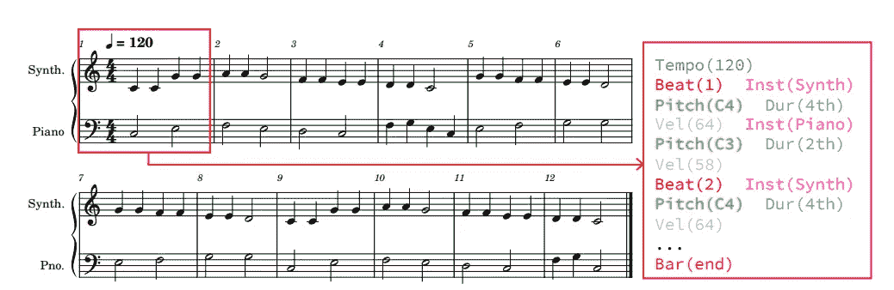
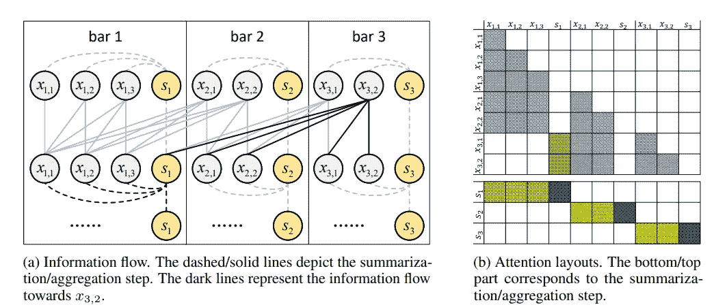
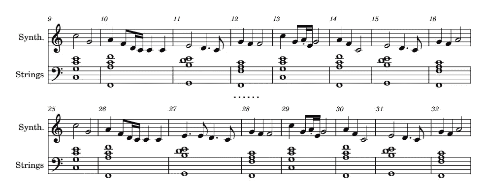
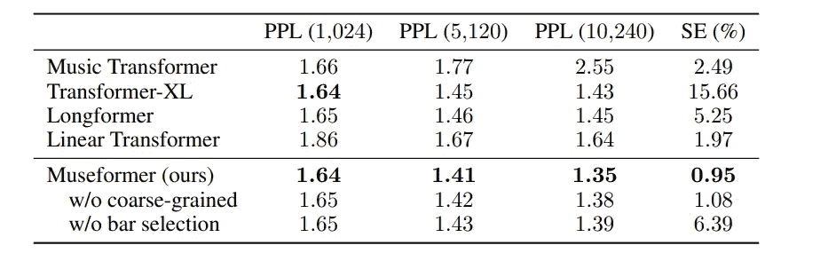
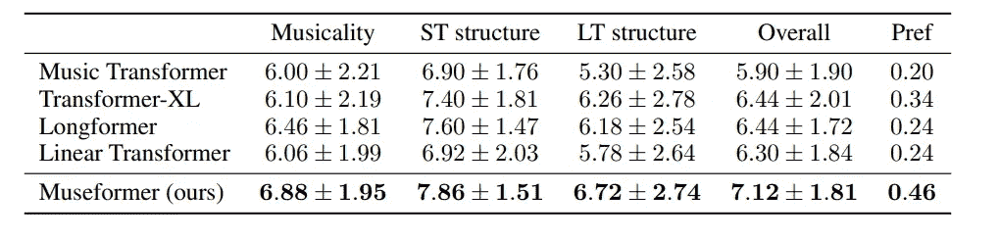
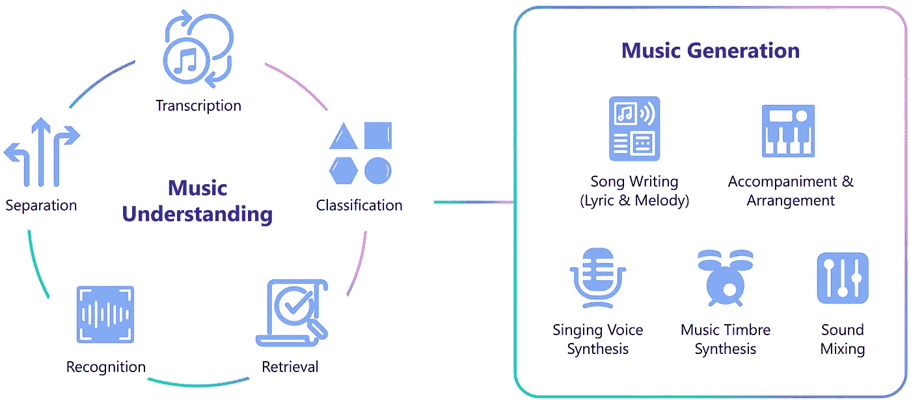

# 微软的 Museformer:人工智能音乐是新的前沿

> 原文：<https://medium.com/mlearning-ai/microsofts-museformer-ai-music-is-the-new-frontier-8dc5cb24459c?source=collection_archive---------3----------------------->

AI 艺术正在爆发，音乐可以是下一个。

Image generated with [OpenAI Dall-E 2](https://openai.com/dall-e-2/)

变形金刚彻底改变了自然语言处理。然而，最近几个月，我们看到了人工智能是如何应用于艺术和图像生成的。日前， [**微软公布了 Museformer**](https://arxiv.org/pdf/2210.10349.pdf) ，音乐一代的典范。

音乐可以表示为一个有组织的、离散的记号序列(毕竟，音乐是由一系列顺序的声音组成的)。事实证明，变形金刚在文本生成方面效率很高，换句话说，变形金刚除了生成一系列文本之外什么也不做。[转换器](https://en.wikipedia.org/wiki/Transformer_(machine_learning_model))的成功在于[自我关注](https://en.wikipedia.org/wiki/Attention_(machine_learning))机制允许在文本中捕获长依赖关系。为了对音乐建模，我们需要能够捕捉音乐序列的各个部分之间的长期依赖性和相关性。这为使用变压器生成音乐奠定了基础。

The music score of Twinkle, Twinkle, Little Star, and its corresponding token representation. from the original article ([here](https://arxiv.org/pdf/2210.10349.pdf))

当然，这并不容易:

*   **长序列建模**:音乐序列很长(尤其是有几个乐器的时候)。这是一个问题，因为注意机制具有二次复杂度，因此计算成本成指数增长。
*   **音乐结构建模:**音乐有自己独特的结构，有确定的模式重复，可以有变化。这些模式有时在序列中长距离重复出现，使其更加复杂。

这不是第一次尝试用变形金刚来处理长序列。主要使用两种方法:

*   **局部聚焦**，如 [Transformer XL](https://arxiv.org/abs/1901.02860) 和 [Longformer](https://arxiv.org/abs/2004.05150) 的情况，其中基本上聚焦仅在输入序列的一部分上，其余部分被丢弃。在音乐的情况下，保留的序列可能不包含音乐结构的重要部分。
*   **全局近似**，由[线性变换器](https://arxiv.org/abs/2006.16236)使用，其中有一个序列压缩，虽然这种压缩降低了复杂性，但它没有捕捉音乐序列的各个部分之间的相关性。

本文的观点是，虽然这两种方法都有不足之处，但可以取其精华。事实上，并不是音乐序列的所有部分都很重要(而且这些信息也不是均匀分布的)。所以我们需要保护和关注这些部分，当创作音乐时，我们关注重要的重复部分。剩下的，那些不太重要的段落可以近似。因此，总的来说，这个想法是专注于重要的部分，但减少复杂性和计算量。

这种机制是通过一种称为精细和粗粒度注意力(FC-Attention)的机制来实施的，这种机制取代了经典的自我注意力模块:

> 总的想法是，考虑到成对完全注意的复杂性高得不可接受，我们不需要以相同的重要性水平关注整个序列，而是我们结合了两种不同的注意方案——针对结构相关的条的细粒度注意，以及针对其他条的粗粒度注意。

The fine- and coarse-grained attention. from the original article ([here](https://arxiv.org/pdf/2210.10349.pdf))

换句话说，有两个步骤:总结和汇总。第一步降低了复杂性，并为序列的一部分创建了一种“摘要标记”，然后信息随后被聚合(如在经典注意力中，这允许信息的上下文化):

> FC-注意力的基本思想是，特定小节的令牌仅直接关注对于生成结构化音乐至关重要的结构相关小节，而对于其他小节，令牌仅关注它们的摘要令牌以获得集中的信息(粗粒度注意力)，而不是直接关注导致二次复杂度的所有令牌。为了实现这一点，我们首先通过汇总步骤汇总每个条形的局部信息，然后通过聚集步骤聚集细粒度和粗粒度的信息。

这些条只是代表序列的一部分。最后一个重要的步骤是找出哪些代表了重要的信息，并且有可能在音乐序列中重复出现。为此，作者通过计算整个序列中两个不同条形之间的相似性，使用了简单的汇总统计。

他们用同样的方法分析不同的风格，发现一些模式在不同的流派和风格中重复出现:

> 我们进一步对不同流派和风格的音乐数据集进行相似性统计。附录 A 中显示的结果有趣地表明，这种模式普遍适用于多样性很大的音乐。我们认为，它可以被视为适用于我们日常生活中大多数音乐的一般规则。

作者指出，这种结构允许模型符合音乐特征，并覆盖结构相关的信息(短期和长期)。此外，与使用稀疏注意力来降低复杂性的模型相反，该模型保留了信息(这会导致丢失大量信息)。

A snippet of a generated song. from the original article ([here](https://arxiv.org/pdf/2210.10349.pdf))

作者们用来训练模型的是 [Lakh MIDI (LMD)数据集](https://colinraffel.com/projects/lmd/)，其中包含多种乐器的音乐，格式为 [MIDI](https://en.wikipedia.org/wiki/MIDI) (他们总共使用了近三万首歌曲或 1700 小时的歌曲，其中包含几种乐器)。

该模型包括具有隐藏尺寸 512 的 4 层、8 个注意力头部和尺寸为 2048 的前馈层。为了评估它，除了使用困惑和相似性误差，他们邀请了 10 个人(包括 7 个有音乐背景的人)来评估 100 首随机生成的音乐作品。人们必须根据几个标准进行评估:音乐性(作品是否令人愉快和有趣)、短期结构、长期结构和整体。

他们还将自己的模型与之前的其他模型进行了比较，结果显示他们的模型更胜一筹:

from the original article ([here](https://arxiv.org/pdf/2210.10349.pdf))

from the original article ([here](https://arxiv.org/pdf/2210.10349.pdf))

尽管这种模式能够生成质量和结构都很好的音乐，但它仍然远非完美。

> 首先，由于 Museformer 在推理过程中采取随机抽样，并且不接受人工控制，它很难确保每个生成的音乐片段都以预期的方式良好地构造。可以进一步探索提高其可靠性和可控性的技术。此外，生成的音乐的音乐性和创造性仍然远远落后于人工音乐，这仍然是所有现有音乐生成模型的问题。

在这里，您可以聆听一些已经创作的音乐范例:

 [## Museformer:关注音乐生成的细粒度和粗粒度转换器

### 通讯作者。符号音乐生成旨在自动生成乐谱。最近的趋势是使用…

ai-muzic.github.io](https://ai-muzic.github.io/museformer/) 

此外，Museformer 还是微软更大项目的一部分。该项目名为 Muzic ( [GitHub repository，此处为](https://github.com/microsoft/muzic))。

image source: [official repository](https://github.com/microsoft/muzic)

该项目旨在理解音乐(识别、发现、转录)，然后在稍后的时间生成音乐。存储库中已经有几个项目可以测试。

image source: [official repository](https://github.com/microsoft/muzic)

微软并不是唯一参与音乐项目的公司。事实上，几天前谷歌还生产了自己的模型，可以在人与人之间继续一首歌或讲话。AI 艺术发生的事情会发生在音乐上吗？你怎么想呢?

# 如果你觉得有趣:

你可以寻找我的其他文章，你也可以 [**订阅**](https://salvatore-raieli.medium.com/subscribe) 在我发表文章时得到通知，你也可以在**[**LinkedIn**](https://www.linkedin.com/in/salvatore-raieli/)**上连接或联系我。**感谢您的支持！**

**这是我的 GitHub 知识库的链接，我计划在这里收集代码和许多与机器学习、人工智能等相关的资源。**

** [## GitHub - SalvatoreRa/tutorial:关于机器学习、人工智能、数据科学的教程…

### 关于机器学习、人工智能、数据科学的教程，包括数学解释和可重复使用的代码(python…

github.com](https://github.com/SalvatoreRa/tutorial) 

或者随意查看我在 Medium 上的其他文章:

 [## 艾重新想象世界上最美丽的 20 个词

### 无法翻译的单词怎么翻译？

medium.com](/mlearning-ai/ai-reimagines-the-worlds-20-most-beautiful-words-cd07090ea59b)  [## 人工智能如何帮助保存艺术品

### 艺术杰作随时都是风险；人工智能和新技术可以助一臂之力

towardsdatascience.com](https://towardsdatascience.com/how-ai-could-help-preserve-art-f40c8376781d)  [## 人工智能如何拯救亚马逊雨林

### 亚马逊正处于危险之中，人工智能可以帮助保护它

towardsdatascience.com](https://towardsdatascience.com/how-artificial-intelligence-could-save-the-amazon-rainforest-688fa505c455)  [## 诺贝尔奖赛博朋克

### 科学发现中人工智能最重要奖项的计算视角

medium.com](/mlearning-ai/nobel-prize-cyberpunk-e1803aa0e087)  [## Mlearning.ai 提交建议

### 如何成为 Mlearning.ai 上的作家

medium.com](/mlearning-ai/mlearning-ai-submission-suggestions-b51e2b130bfb)**