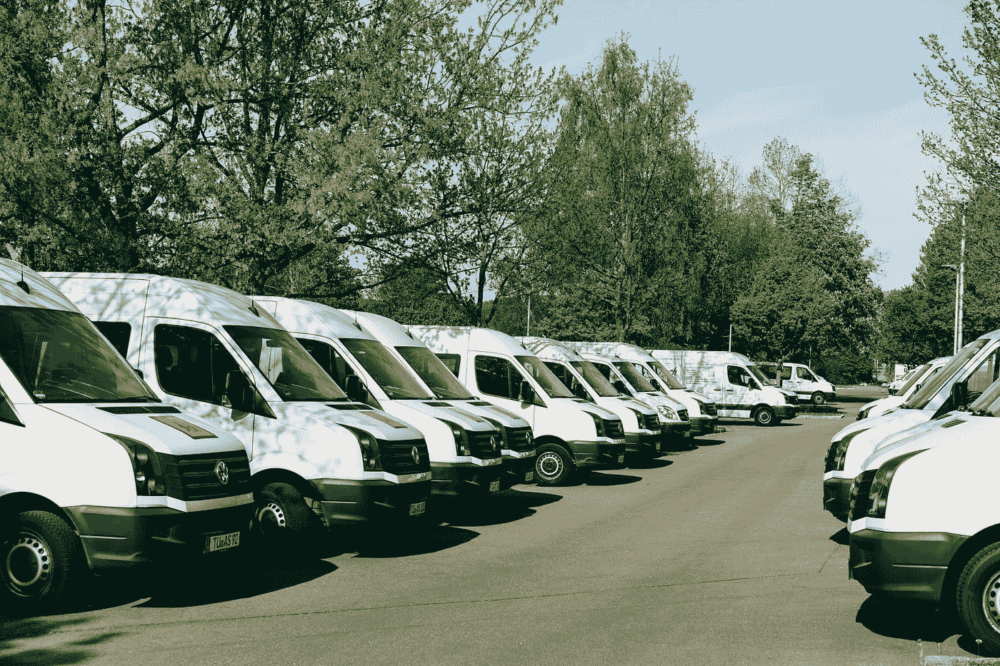

# 用人工智能改造中英里物流

> 原文：<https://medium.com/mlearning-ai/middle-mile-autonomous-delivery-242cb6bdc5e0?source=collection_archive---------7----------------------->

## 真实世界人工智能

## 人工智能正在帮助变革产品交付供应链

Photo by [Markus Winkler](https://unsplash.com/@markuswinkler?utm_source=unsplash&utm_medium=referral&utm_content=creditCopyText) on [Unsplash](https://unsplash.com/s/photos/delivery-van?utm_source=unsplash&utm_medium=referral&utm_content=creditCopyText)

[Gatik](https://gatik.ai/) 是一家总部位于旧金山的公司，通过使用 [**人工智能**](https://highdemandskills.com/what-is-artificial-intelligence/) **(AI)** ，该公司在**中英里自主交付**方面取得了巨大进展。

Gatik 的创新方法认识到了自治系统的挑战，并通过人工智能建立了一个高效运行*的框架。*

加蒂克的方法正在取得商业成功和行业认可——它已被列入 2021 年福布斯人工智能 50 强名单。

在本文中，我们将了解 Gatik 如何通过人工智能推动中英里物流的创新。

# 中间一英里是什么？

在产品运输物流中，**中间环节**是供应链的一部分，位于*产品的原产地和中间物流枢纽*之间，比如一个履行中心。例如，产品的原产地可以是工厂、海港或机场。

中间一英里也可以是两个中间物流枢纽之间的*，比如一个履行和配送中心之间。*

最近几年备受关注的最后一英里是在中间一英里之后的最后一英里，例如从配送中心到客户所在地。

那么，为什么中间一英里很重要呢？

与供应链的其他部分相比，中间环节有很大的提高效率和降低成本的空间。

从历史上看，制造商和经销商在中间一英里(即第一英里和最后一英里)之前关注供应链*，在*之后关注供应链*。这些领域的效率稳步提高。但是中间一英里一直被忽视，直到现在，像 Gatik 这样的公司正在帮助提高中间一英里的效率。*

# 什么是自主交付？

自主交付是指在供应链的部分使用**自动车辆(AVs)进行交付**。

AVs 是使用 AI 自动驾驶的自动驾驶车辆*。*

在 AVs 中有不同程度的自主性，从大量人工辅助到全自动车辆，人工智能技术现在正在使*全自动*成为供应链部分的*可行解决方案*。

根据 [TWI Global](https://www.twi-global.com/who-we-are) 的说法，AVs 的优势包括*提高的安全性*(与人类驾驶员相比更少的路上错误)和*更少依赖人类协助*。

在运输物流中，AVs 还可以帮助显著提高效率和降低成本。

# Gatik 的中英里自主交付方法

Gatik 的重点是零售业的企业对企业(B2B)短途物流。

Gatik 在*城市环境中短距离*移动货物，从一个营业场所(例如，履行中心)到另一个营业场所(例如，零售店或配送中心)。

自 2017 年成立以来，Gatik 迅速发展成为自主中英里交付领域的领导者。

Gatik 每周 7 天、每天 12 小时运行 AVs。*为每个客户确定精心规划的路线*和*固定的上下车地点—* 这有助于**提高效率**。

用于中英里运输的车辆是小型商用*箱式卡车*，它们用途广泛，体积小巧，足以在*城市环境*的*微型配送中心*之间舒适地移动。随着网上购物的增长，这种递送方式有上升趋势，即*更小、更频繁的旅行。*

***Gatik box trucks are used for autonomous AI-powered delivery in urban environments***

每辆车都配备了 **Gatik 的人工智能技术**使其能够自动驾驶。

虽然 Gatik 的车辆是自动驾驶的，但目前每辆卡车都有一名人类安全操作员。

Gatik 计划最终完全自主地运行 AVs*，无需车内人工协助。*

# *加蒂克如何使用自主人工智能*

*Gatik 成功的关键在于其**对自主 AI 技术的创新使用**。这包括:*

**简化*现实世界的技术挑战—*

*   *仅使用*可重复的、预定的*递送路线*
*   **限制自动驾驶汽车可以改变车道的次数**
*   **只允许自动驾驶车辆右转**

*采用混合的、*更易于部署的方法*来构建人工智能系统架构—*

*   *使用*微型神经网络*而不是大规模、整体的深度神经网络*
*   *将微模型的功能限制在*特定的和可解释的任务*(在现代人工智能系统中利用[可解释性的价值](https://highdemandskills.com/explainable-ai/)*
*   *围绕网络架构构建基于规则的回退和验证系统*

*推动*安全和效率*通过—*

*   *通过(有意地)过度拟合预定(已知)路线的模型，使用*少得多的数据*进行训练和验证*
*   *专注于微模型的*超优化*，即。最大限度地利用已知路线的数据*
*   *确保*在整个系统的每一层都有足够的冗余**

*Gatik 的方法被认为是自主人工智能的通用和强大的实现，有助于在保持安全的同时提高效率。*

# *概括起来*

*   ***自主人工智能**是人工智能的一个新兴且具有挑战性的应用——Gatik 是一家通过*创新*方法成功部署*自主人工智能*的公司*
*   *加提克专注于中间环节的交付，这是供应链中有待改进的部分*
*   *通过使用*精心设计的自主系统*，Gatik 可以**提高效率**并显著**降低中间里程的成本***
*   *Gatik 的方法**减少了现实世界的技术挑战**(预定义的路线和自动驾驶汽车的有限机动性)**简化了 AI 部署**(易于训练的微型模型)**提高了系统效率**(低数据要求和微型模型的超优化)*
*   *Gatik 因其对人工智能的创新性使用而获得认可，被列入福布斯人工智能 50 强名单*

**原载于 2021 年 5 月 5 日 https://highdemandskills.com***。***

** [## 最近的帖子- HDS

### 直觉及其在人工智能中的应用

highdemandskills.com](https://highdemandskills.com/blog/)**