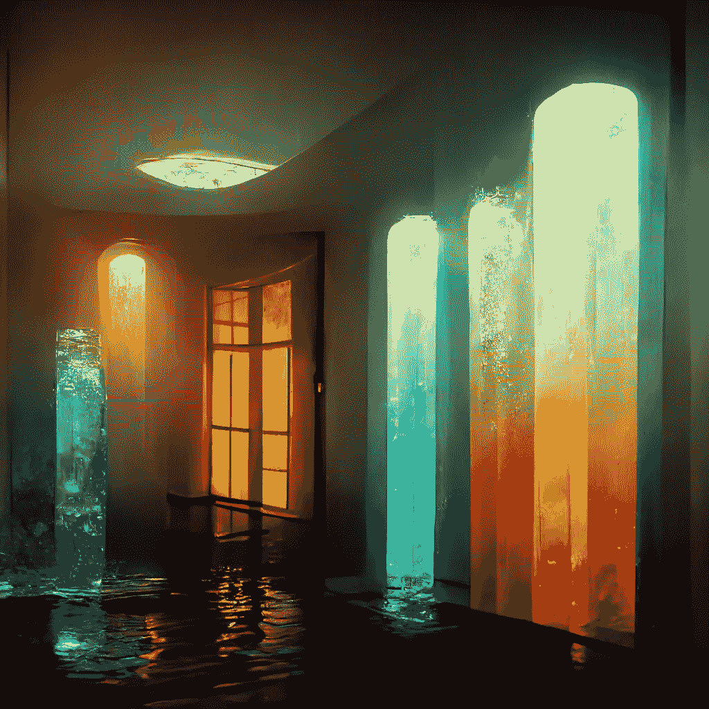
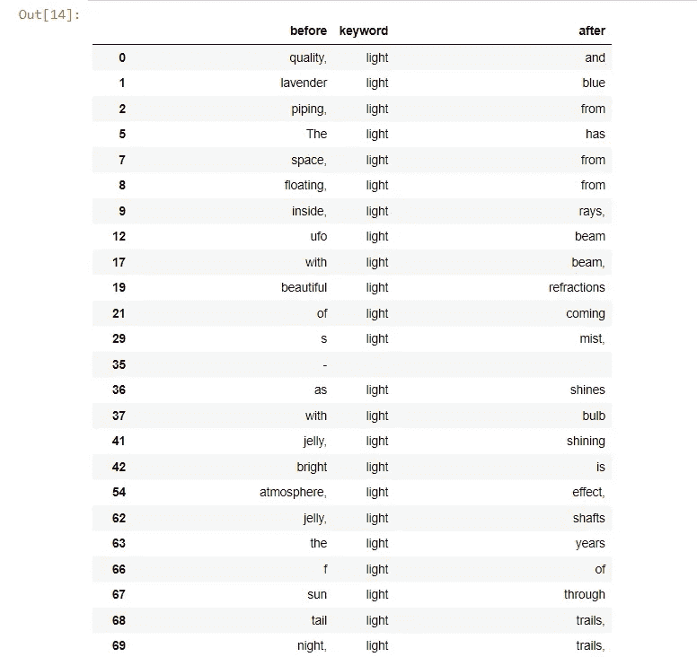
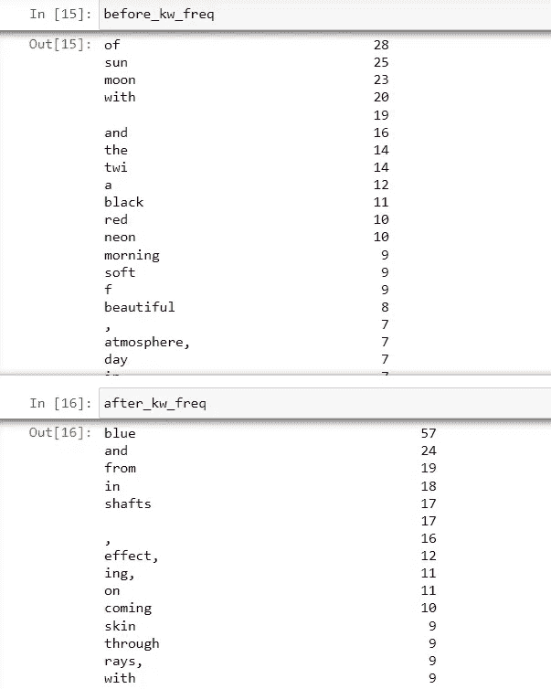
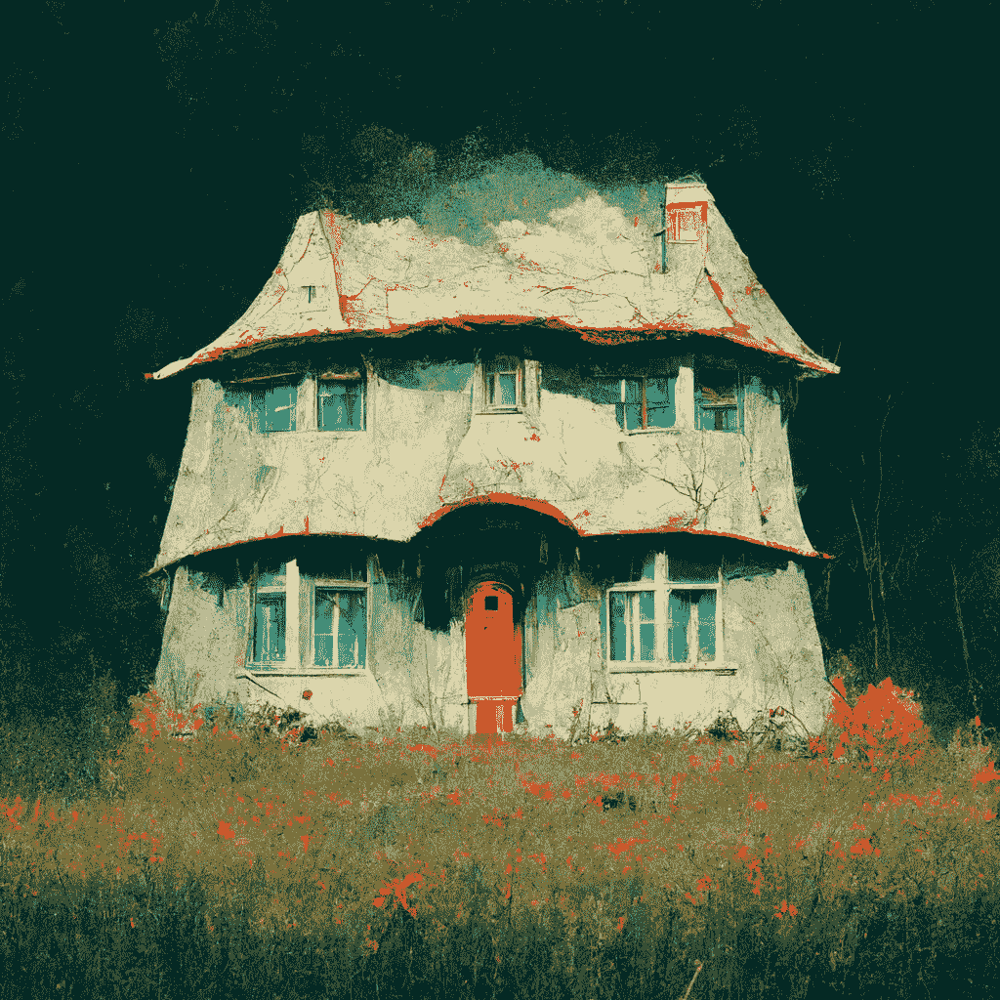
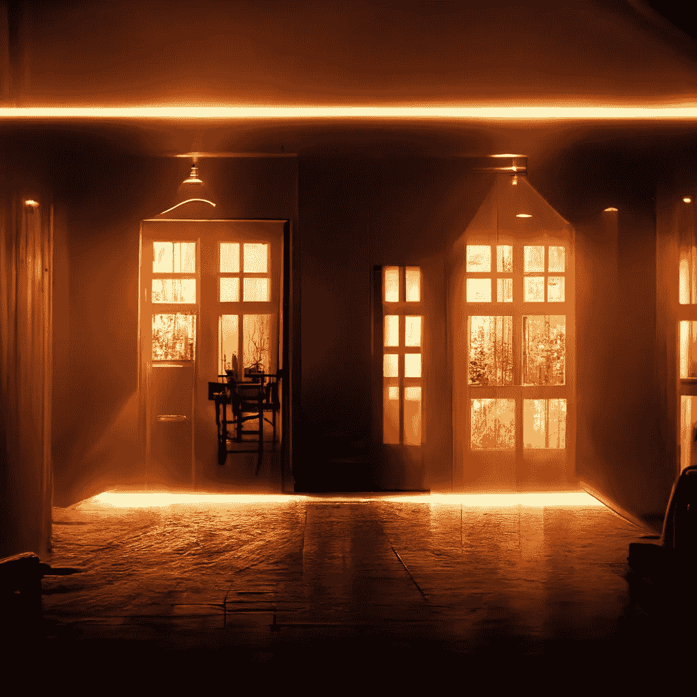
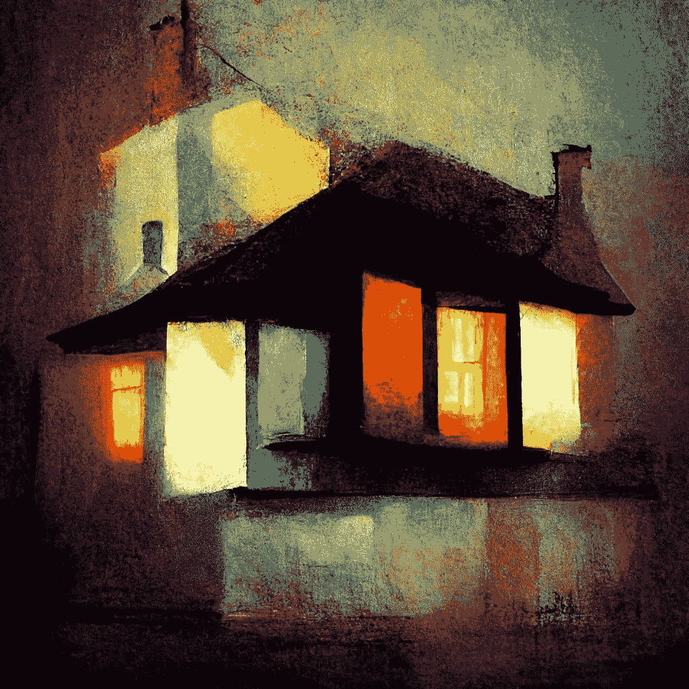
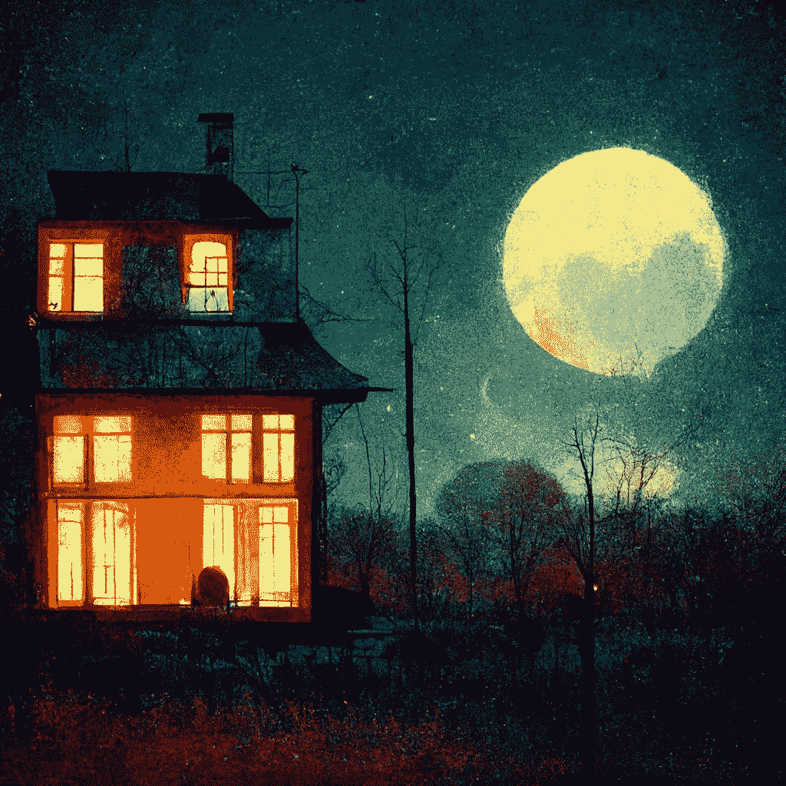
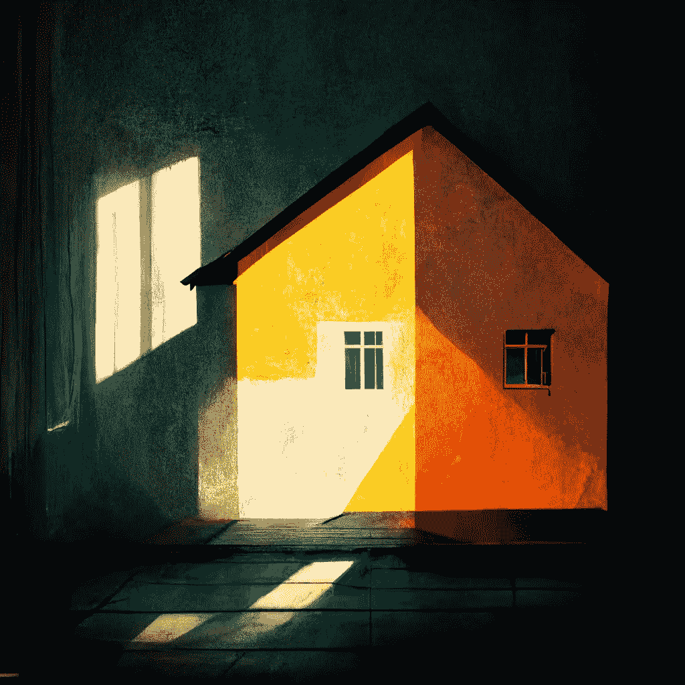

# 中途关键词收割机

> 原文：<https://medium.com/mlearning-ai/midjourney-keyword-harvester-76b2b41255a2?source=collection_archive---------5----------------------->

## 一个低代码的工具来收集社区使用的关键词

All images by MidJourney, directed by the authors.

这篇文章是由 [Ugur Ziya Cifci](https://medium.com/u/affd2737694a?source=post_page-----76b2b41255a2--------------------------------) 和 [Alparslan Mesri](https://medium.com/u/fe99f0a4a612?source=post_page-----76b2b41255a2--------------------------------) 撰写的。

随着人工智能的发展，艺术制作技术也在发生变化。在艺术创作的过程中，新的步骤和技巧不断涌现。Midjourney 平台是人工智能为艺术生产创造的新工具之一。

> Midjourney 是一个独立的研究实验室，其特色是一个生成图像的 Discord 机器人。它接受人类输入(关键字提示)，并利用对大量图片数据进行训练的机器学习算法来生成独特的图像。它被用来制作 2022 年 6 月《经济学人》的封面图片。

Midjourney 用户通过试验不同的关键字组合来创建多个图像，他们试图通过比较这些输出来获得最佳图像。

为了有效地使用这些新的生产技术，选择关键字的重要性日益增加。为了提高产品质量而正确恰当地选择关键词的过程称为**关键词收割**。

## 问题

> 这里的问题是，关键词的选择受限于用户的词汇量、过往经验和想象力。

由于 Midjourney 没有关于关键词收获的指南，并且 Midjourney 平台使用的机器学习系统是不可预测的封闭系统(黑盒)，因此无法提出精确而清晰的关键词收获规则。在这种情况下，在创建数字产品时选择关键字部分取决于用户的灵感和直觉。

> 在本文中，介绍了我们作为解决方案开发的低代码关键词收集工具。由于有了这个工具，用户不仅局限于他/她的个人想象，还受益于中途社区的集体想象(关键词)。

多亏了这个工具，用户既可以看到他们选择的关键词的常用词组合，也可以看到罕见和意想不到的组合。

例如，假设一个用户想要用不同的“照明”技术生成图片，只要“家”的主题保持不变。在这种情况下，用户可以看到社区使用的所有组合(例如，阳光、月光、柔和光线等。)在这个工具里输入“光”。

# 资料组

我们使用的数据集是由简洁的人工智能团队创建的，在为期 28 天的研究中，使用 Discord 机器人从 10 个不同的 Discord 频道收集了总共 268k 条消息。您可以在 [Kaggle](https://www.kaggle.com/datasets/da9b9ba35ffbd86a5f97ccd068d3c74f5742cfe5f34f6aaf1f0f458d7694f55e) 上访问数据集。

# 该工具

在这项研究中，我们通过在 Search_keyword 部分输入“light”来测试该工具，并根据使用频率找到了与该关键字一起使用的其他词组。用户可以通过用自己的关键字替换“Search_keyword”部分来使用该工具。

Words used before and after the searched keyword

# 个案研究

在这项研究中，我们从工具中选取了不同的照明关键字。我们对“房子”主题进行了测试，生成了不同的图像。

## 1.房子

House painting created without any lighting

## **2。**房屋**电影灯光**

## 3.室内柔和灯光

## 4.室内液体灯

我们尝试了“液体”，这是最不常用的关键词之一。

社区使用最多的:月光和阳光。

## 5.房屋月光

## 6.室内阳光

# 结论

> 有时写最常用的词组是合适的，而为了更令人惊讶和更有创造性的结果，用最少使用的词可能更好。

我们开发的低代码工具为专业内容制作者和个人用户提供了重要的好处。

当需要制作主题的不同变体时，内容制作者可以快速访问并“收获”社区以前尝试过的短语。

在中旅平台上，有时高审美价值的作品能从尝试最多的词群中脱颖而出，有时又能从尝试最少、不直观的词群中脱颖而出。

“液体灯”就是一个例子。在这方面，这个工具也为用户提供了在人工智能产生内容的时代保持独特的机会。

你可以在这里访问 [Kaggle 笔记本来试用这个工具并查看源代码。](https://www.kaggle.com/code/ugurzcifci/midjourney-keyword-harvester)

 [## Mlearning.ai 提交建议

### 如何成为 Mlearning.ai 上的作家

medium.com](/mlearning-ai/mlearning-ai-submission-suggestions-b51e2b130bfb)