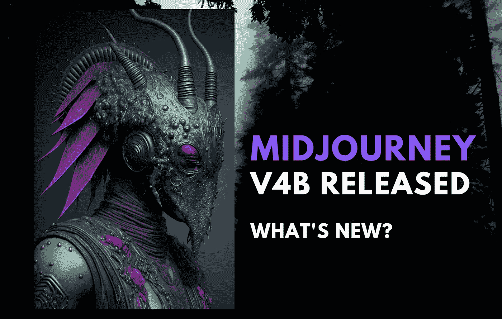

# MidJourney 发布了 V4B 更新以获得更好的 AI 图像

> 原文：<https://medium.com/mlearning-ai/midjourney-released-v4b-updates-for-even-better-ai-images-591bb62bae8c?source=collection_archive---------0----------------------->

Image by [Jim Clyde Monge](https://medium.com/u/819323b399ac?source=post_page-----591bb62bae8c--------------------------------)

H oly 废话， [V4 发布](/geekculture/midjourneys-new-v4-algorithm-is-insane-cc56c95960ca)才四周，现在又来了一个！[中途](https://www.midjourney.com/)人工智能图像生成器的 V4B 更新出来了，它装载了一些微小但令人兴奋的新功能。

如果你错过了，这里是 V4 的新特性。

*   更多的知识(关于生物、地点等等)