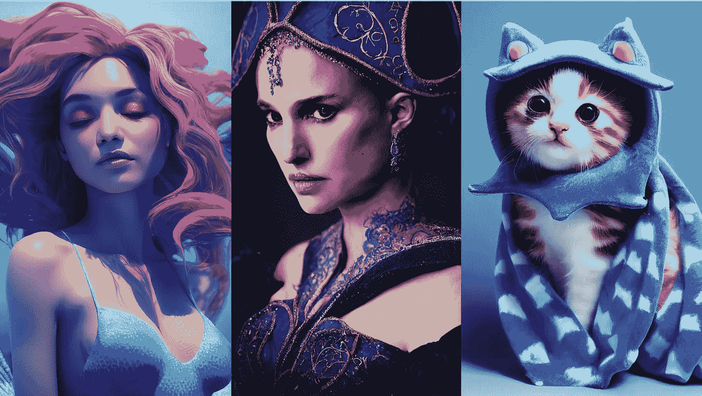

# MidJourney V3 带着 2 个主要更新回来了

> 原文：<https://medium.com/mlearning-ai/midjourney-v3-is-back-with-2-major-updates-8accf775262e?source=collection_archive---------0----------------------->

Image by [Jim Clyde Monge](https://medium.com/u/819323b399ac?source=post_page-----8accf775262e--------------------------------)

流行的文本到图像工具 [MidJourney](/geekculture/midjourneys-major-update-fixes-its-biggest-flaw-86dd0b353126) AI 进步非常非常快。

昨天，AI 工具背后的团队用两种新模式临时重新启用了他们的 V3 模型。

1.  通用艺术模式
2.  照片写实模式

这两种模式之间的区别不言自明。而艺术模式…