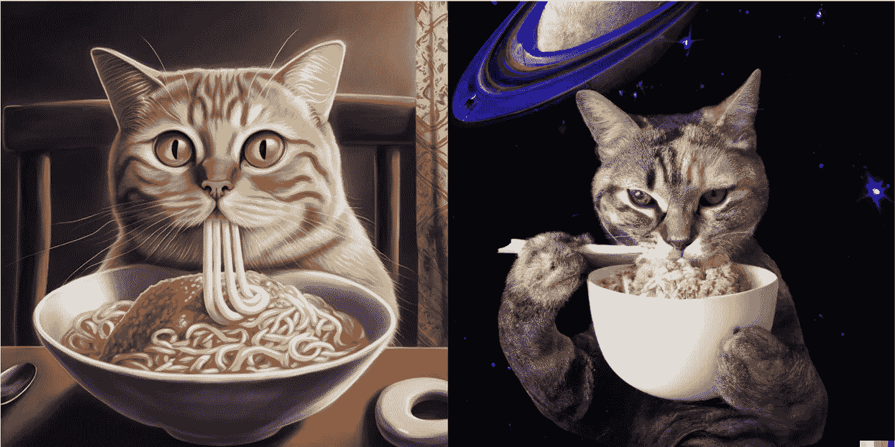

# 中途 V4 与 Dall-E2 —相同的提示，不同的结果

> 原文：<https://medium.com/mlearning-ai/midjourney-v4-vs-dall-e2-same-prompt-different-results-904b2866ce08?source=collection_archive---------2----------------------->

MJ art by [Jim Clyde Monge](https://medium.com/u/819323b399ac?source=post_page-----904b2866ce08--------------------------------). Dall-E2 art by Draconiator

2022 年 11 月 5 日，MidJourney 开始对其最新 V4 模型进行 alpha 测试，目前该模型已在 [Discord](https://discord.com/channels/662267976984297473/952771221915840552) 上向订阅用户开放。这次更新在细节、构图和真实感方面都比上一次有所改进。

但是和 OpenAI 的 Dall-E2 相比如何？