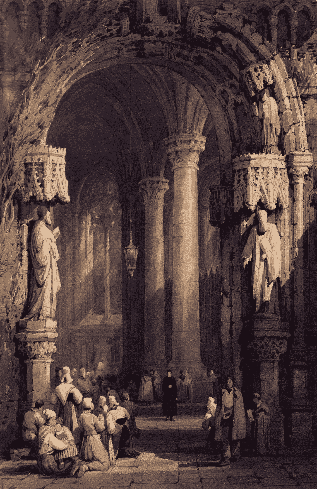

# 中途:你现在可以上传一张图片并重新混合它们

> 原文：<https://medium.com/mlearning-ai/midjourney-you-can-now-upload-an-image-and-remix-them-17ab2a35bc14?source=collection_archive---------1----------------------->

## 中途个性化您的艺术

Photo by [Birmingham Museums Trust](https://unsplash.com/@birminghammuseumstrust?utm_source=medium&utm_medium=referral) on [Unsplash](https://unsplash.com?utm_source=medium&utm_medium=referral)

# 将您的作品上传到 Midjouney

嗯， [Midjourny](https://www.midjourney.com/) ，一个流行的人工智能图像生成器，现在可以让你有一个新的图像上传工作流程。以前，人工智能生成器工具的最大限制之一是，在生成图像时，你不能特别赋予你独特的个人风格。

你可以上传一张你想要的图片——你的艺术作品或任何东西——然后在它后面添加你的提示。你也可以上传两张图片，然后让人工智能将它们重新混合在一起。

[推特上的 Andrew Price](https://twitter.com/andrewpprice/status/1590855232153882624)对此有一个完美的演示。如果你想知道如何做，[他做了一个迷你教程](https://www.loom.com/share/37b950e6682b4f70bb7b4014554e5dda)，所以你可以自己做。

 [## Mlearning.ai 提交建议

### 如何成为 Mlearning.ai 上的作家

medium.com](/mlearning-ai/mlearning-ai-submission-suggestions-b51e2b130bfb)