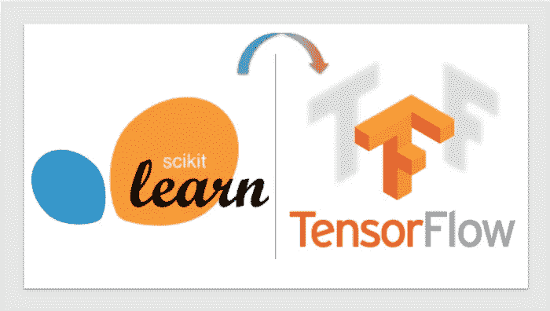
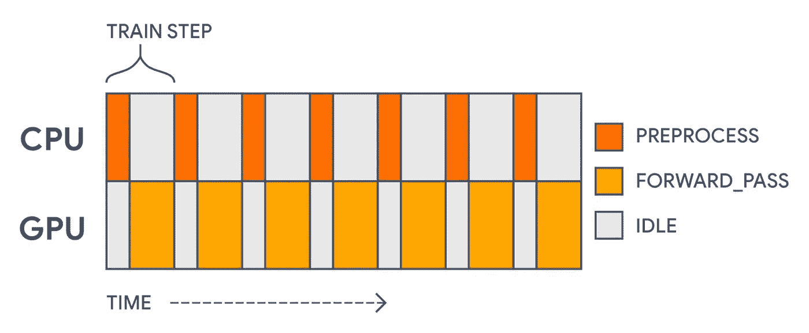

# 将 Sklearn 模型训练管道迁移到 Tensorflow Keras。

> 原文：<https://medium.com/mlearning-ai/migrating-an-sklearn-model-training-pipeline-to-tensorflow-keras-d248754f991d?source=collection_archive---------0----------------------->

Image source: [https://medium.com/towards-data-science/from-scikit-learn-to-tensorflow-part-1-9ee0b96d4c85](/towards-data-science/from-scikit-learn-to-tensorflow-part-1-9ee0b96d4c85)

在本帖中，我们将探讨将 Sklearn 培训管道迁移到 Tensorflow Keras 的方法。从 Sklearn 转到 Tensorflow 可能有几个原因。

## 可能的好处:

*   基本上任何 ML 模型架构的灵活性。
*   利用 GPU 的分布式培训。
*   再培训的灵活性。
*   Tensorflow 服务。
*   等等。

## 目标

*   我们将与 Sklearn 一起实现一个模型训练管道。
*   仅使用 Tensorflow Keras 模块实现相同的管道。这里将使用预处理层。
*   将 **EasyFlow** 用于等效管道，如 Sklearn 的管道和 ColumnTransformer 模块。

可能最常见的用例来自于设计一个 ML 管道，其中预处理在 Sklearn 中实现，模型在 Keras 中实现。我们将有不同的工件的每一部分。有了 Keras 和 EasyFlow 模块，实现一个本地 Keras 解决方案将变得很容易。

对于我们的数据集，我们将使用流行的心脏数据集。它由混合的特征类型组成，如编码为整数和字符串的数字、分类特征。

让我们建立我们的 Sklearn 培训渠道:

上面的管道不是很复杂，很容易实现。这里的想法是展示我们如何在 Tensorflow Keras 中实现一个等价的管道。

# 将 Sklearn 管道迁移到 Tensorflow Keras

让我们在 Keras 中本地创建我们的特征预处理管道。我们将复制 Sklearn 部分中实现的相同管道。Keras 最近增加了预处理层。**标准缩放器**和 **OneHotEncoder** 的 Keras 等效预处理分别为**归一化**和**整数查找**。当我们的分类特征是字符串类型时，我们首先需要应用 StringLookup 预处理层，然后是 IntegerLookup 层。

我们最不需要的是管道和 ColumnTransformer 的 Keras 实现。目前在 Keras 中没有实现，所以我们将使用另一个包来实现:

`EasyFlow`:[https://pypi.org/project/easy-tensorflow/](https://pypi.org/project/easy-tensorflow/)

***pip 安装简易张量流***

**EasyFlow** 利用 Keras 预处理层。在 **EasyFlow** 中的所有高级管道，如 **FeatureUnion** 都包含 tf.keras.layers.Layer 的子类，因此其行为类似于任何其他 keras 层。( **FeatureUnion** 相当于 Sklearn 的 **ColumnTransformer** 。

我们将利用 Keras 功能 API。所以我们首先需要创建一个要素输入层。下面我们有一个数据类型映射字典作为 **FeatureInputLayer 的输入。**接下来我们将使用 EasyFlow 模块中的 **FeatureUnion** 来实现类似于 ColumnTransformer 的预处理管道。我们将通过对我们的数据运行 *adapt* 方法来更新预处理层状态。Keras 预处理层使用*。*[***adap***](https://gist.github.com/fernandonieuwveldt/ebb5a67415f462f1aa09ebd2913eca1a)***t****来更新状态，在这种情况下类似于*。* ***合体*** 。*

*如上所述，EasyFlow 中的 FeatureUnion 和所有其他管道都是 Keras 层，也是可调用的。下面我们设置我们的模型。*

*结果类似于 Sklearn 的结果。*

*就是这样！通过利用预处理层和 EasyFlow 的特征预处理管道，我们成功地将 Sklearn 训练管道移植到 Tensorflow Keras。我们还持久化了模型，并加载它进行推理，以展示它是真正的端到端。该结果与我们的 Sklearn 实现相比较。这里的一个巨大优势是预处理是网络的一部分，并以此方式持续存在。没有 Keras 预处理层和 EasyFlow 的管道实现，我们通常有一个单独的 Sklearn 工件用于预处理。使用 Sklearn 进行预处理，然后将数据提供给 Keras 模型，这曾经是一种常见的设计模式。Tensorflow serving 等服务容器无需安装 python 或 Tensorflow 就可以为我们的模型提供服务，这使得迁移到本机 Tensorflow Keras 实现非常有吸引力。你只需要一个保存的模型。*

*我们可以更进一步提高我们的训练速度。参见下一节。*

# *提高 Keras 训练速度的快速笔记。*

*接下来，我们将通过创建 1)应用预处理步骤的 Keras 模型对象和 2)进行训练以加速过程的 Keras 模型对象，使用通用模式进行训练。当我们从例子中的原始数据开始时。我们需要预处理 CPU 上的所有预处理操作，然后将数据馈送到 GPU。预处理也不是我们训练的内容，它独立于前向传递。这将降低我们的吞吐量，因为 GPU 在等待数据时将处于空闲状态。为了加快速度，我们将预取批量预处理数据。这将确保当我们在 GPU 上处理一批数据时，CPU 正在准备下一批预处理数据。*

**

**Image taken from* [*https://www.tensorflow.org*](https://www.tensorflow.org/)*

*下面我们实现一个预处理模型和一个训练模型:*

*接下来，我们将 Pandas 数据框映射到 tf.data.Dataset 类型。上述预处理模型将被映射到我们的特征数据上:*

*这与我们在上一节中的实现给出了相似的结果，但是速度更快。*

*我们需要最后一步来创建一个可用于推理的模型。因为我们将模型分成了预处理和训练步骤，所以我们不能保存 training_model。我们需要将预处理和训练合并到一个模型中。让我们创建我们的推理模型。*

*总之，我们展示了如何将 Sklearn 培训管道迁移到 Tensorflow 和 Keras。我们首先在 Sklearn 中构建了由预处理步骤组成的训练管道，并使用 LogisticRegression 作为我们的估计器。我们使用相同的 Sklearn 管道，并使用预处理层和 EasyFlow 管道模块将其迁移到 Keras。我们的模型架构是一个简单的线性模型(LogisticRegression equivalent ),没有隐藏层。我们的特征预处理是我们的网络架构的一部分，我们保存并加载模型以应用推理。我们以最后一节结束，这一节讨论了通过分割训练的预处理和建模步骤来提高训练速度。最后，我们将预处理添加回训练模型，以创建我们的推理模型。*

****Google Colab 笔记本*** : [笔记本链接](https://colab.research.google.com/github/fernandonieuwveldt/easyflow/blob/develop/examples/migrating_from_sklearn_to_keras/migrate_sklearn_pipeline.ipynb)*

****参考文献:***[https://pypi.org/project/easy-tensorflow/](https://pypi.org/project/easy-tensorflow/)*

****Github 回购***:[https://github.com/fernandonieuwveldt/easyflow](https://github.com/fernandonieuwveldt/easyflow)*

* [## Mlearning.ai 提交建议

### 如何成为 Mlearning.ai 上的作家

medium.com](/mlearning-ai/mlearning-ai-submission-suggestions-b51e2b130bfb)*