# AO3 矿业研究第二部分:探索性数据分析

> 原文：<https://medium.com/mlearning-ai/mining-fanfics-on-ao3-part-2-exploratory-data-analysis-7260cf35ee8a?source=collection_archive---------3----------------------->

将所有数据收集在一个地方，现在我们可以进行各种探索性数据分析(EDA)。因为我对这个项目没有一个固定的计划，所以我只是试着回答我感兴趣的各种问题。

这种分析有两个不同的部分:第一个是对小说的简介信息及其与“表现”或“反应”统计数据的相互作用的初步探索——更多的数字方面；第二部分涉及大量的文本数据，需要不同的技巧来解开。我们将在第 3 部分继续讨论后者。

我将介绍我在这个过程中尝试过的一些可能性，但它们绝不是详尽无遗的。对于第一部分，由 [Destin Gong](https://medium.com/u/fa1913854e95?source=post_page-----7260cf35ee8a--------------------------------) 编写的这个漂亮的 [EDA 流程布局](https://towardsdatascience.com/semi-automated-exploratory-data-analysis-eda-in-python-7f96042c9809)为我提供了一个关于使用 seaborn 进行可视化的坚实结构和指导。然而，我不想用一种方法论的方式来展示这些发现(Destin 的文章足以说明这一点)，我想让这个流程主要由问题/好奇心驱动。matplotlib/seaborn 和 Tableau 都用于可视化。

此外，我的例子仅限于为某个特定爱好者收集的数据，而探索的问题可能适用于任何爱好者。

下面是依赖性:

```
import pandas as pd
import seaborn as sns 
import matplotlib.pyplot as plt 
import numpy as np 
from pandas.api.types import is_string_dtype, is_numeric_dtype
import scipy.stats
# import matplotlib.font_manager
# from matplotlib.font_manager import FontProperties
```

*最后两个被注释掉了，因为它们没有帮助我解决在 seaborn 图表中打印非英语字符的问题。我以后可能会解决这个问题。欢迎建议。*

首先，对我拥有的不同类型的变量进行总结很有帮助:

```
num_cols = []
str_cols = []
others = []
for col in df.columns:
    if is_numeric_dtype(df[col]):
        num_cols.append(col)
    elif is_string_dtype(df[col]):
        str_cols.append(col)
    else:
        others.append(col)
print(num_cols)
print(str_cols)
print(others) Output:
>>>['Word_count', 'Num_chapters', 'Num_comments', 'Num_kudos', 'Num_bookmarks', 'Num_hits', 'Success'] # numerical columns
>>>['Title', 'Author', 'ID', 'Rating', 'Pairing', 'Warning', 'Complete', 'Language'] # categorical columns # 'ID' were converted to string
>>>['Date_updated', 'Date_published'] # date columns
```

# 分类 X 分类/数值

## 1.评级构成

```
df.Rating.value_counts().plot.pie()
```

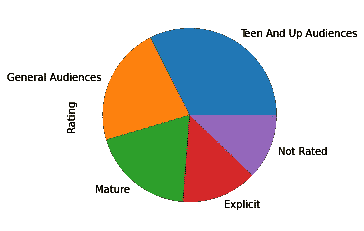

## 2.语言构成

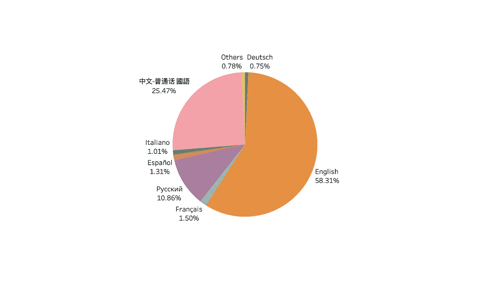

Switched to Tableau due to the character printing issue and also for prettier formatting

很明显，这个粉丝圈子里的大多数粉丝都是用英语写的，而中国作家贡献了另外四分之一。下面的分析将集中在这两种语言上。

## 3.语言与评级的互动

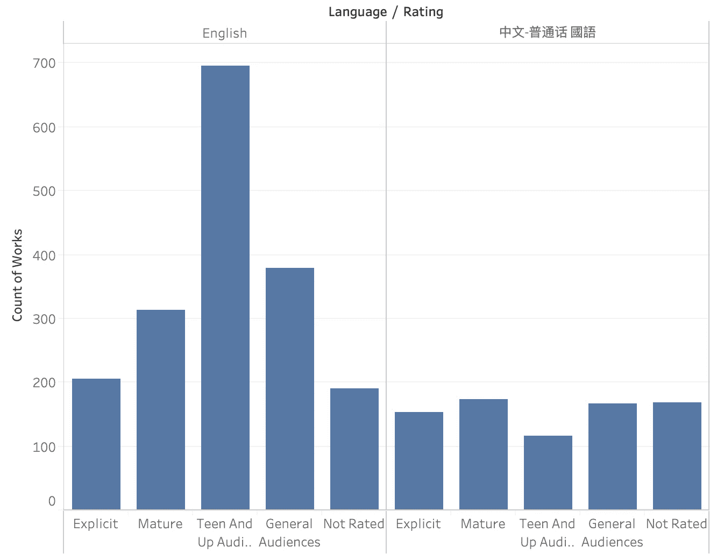

Frequency Distribution

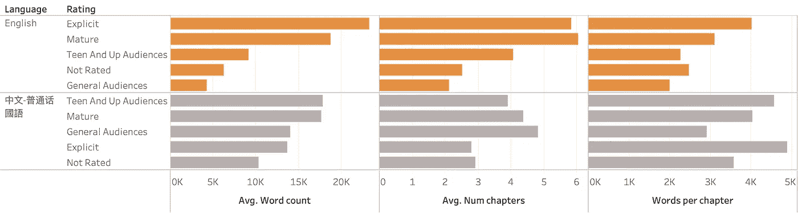

Fiction Length

请注意，“每章字数”是我在 Tableau 中创建的计算字段。我用的是聚合函数 SUM([字数])/SUM([章节数])，而不是先计算每部作品的[字数]/[章节数]，然后取平均值。这实际上得出一个加权平均值，它不会被极端值扭曲。

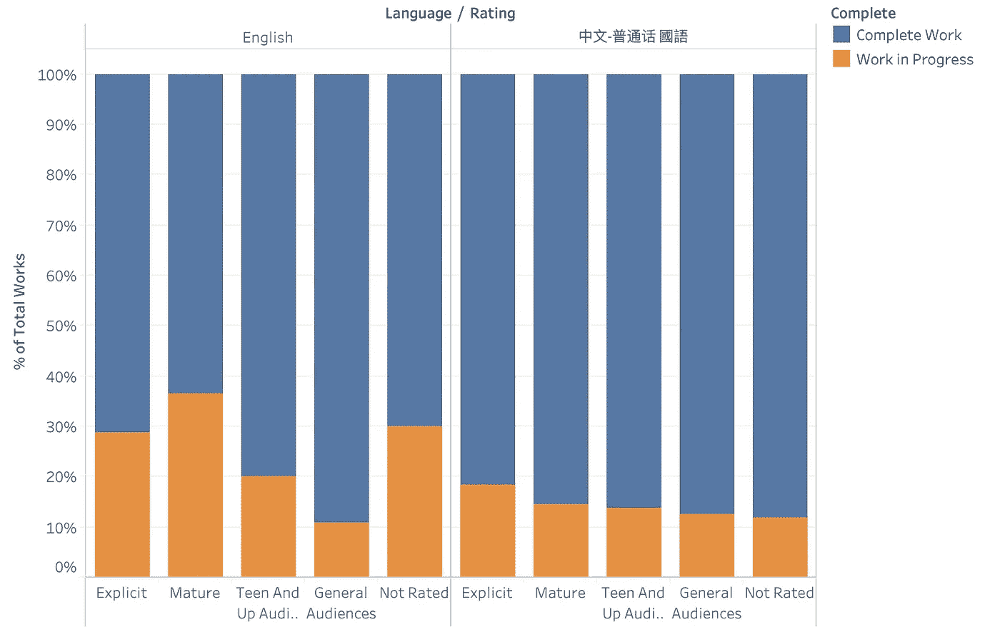

Percentage of WIP

对于那些感兴趣的人，我们可以通过快速表格计算，在 Tableau 中制作这样的百分比堆积条形图。我们将计算限制在“完成”维度，而不是整个表中的百分比

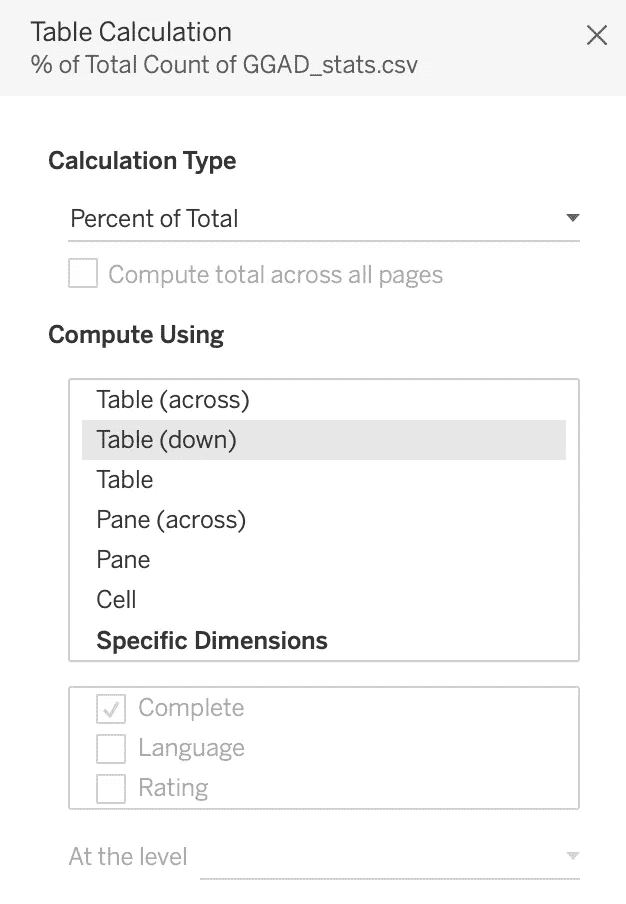

我们可能还会问一些问题，比如评级如何影响读者的反应？比较百分位数可能会给我们一些提示。

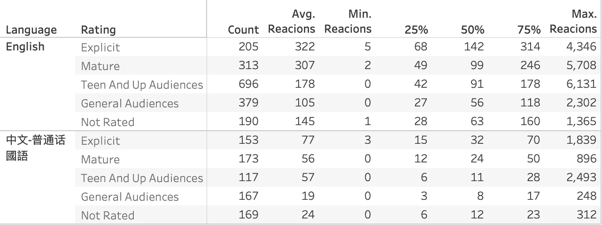

The “Reactions” variable is created using the sum of comments, kudos, and bookmarks.

由于评级本质上是一个顺序变量，如果按照其内在级别而不是字母顺序排序会更好。我使用默认属性>排序，然后手动来实现这一点。

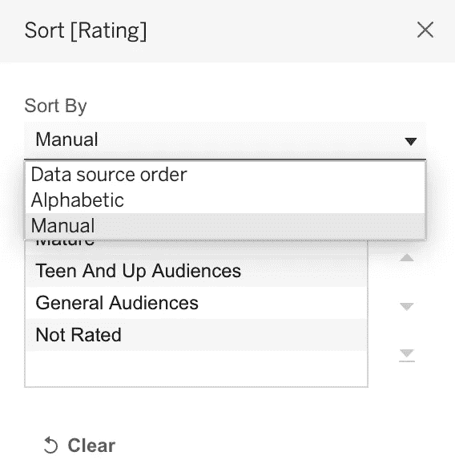

# 数字 X 数字

## 1.与热图的相关性

```
correlation = df.iloc[:,:-1].corr() # eliminate the last 'Success' column which was added for later classification purposes, which is essentially a categorical variablesns.heatmap(correlation, cmap='GnBu', annot=True)
```

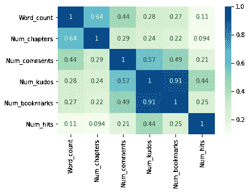

看起来书签的数量和荣誉是高度相关的，而其他的只是稍微正相关。

## 2.散点图的相关性和分布

```
sns.pairplot(df.drop(['ID','Success'], axis=1))
```

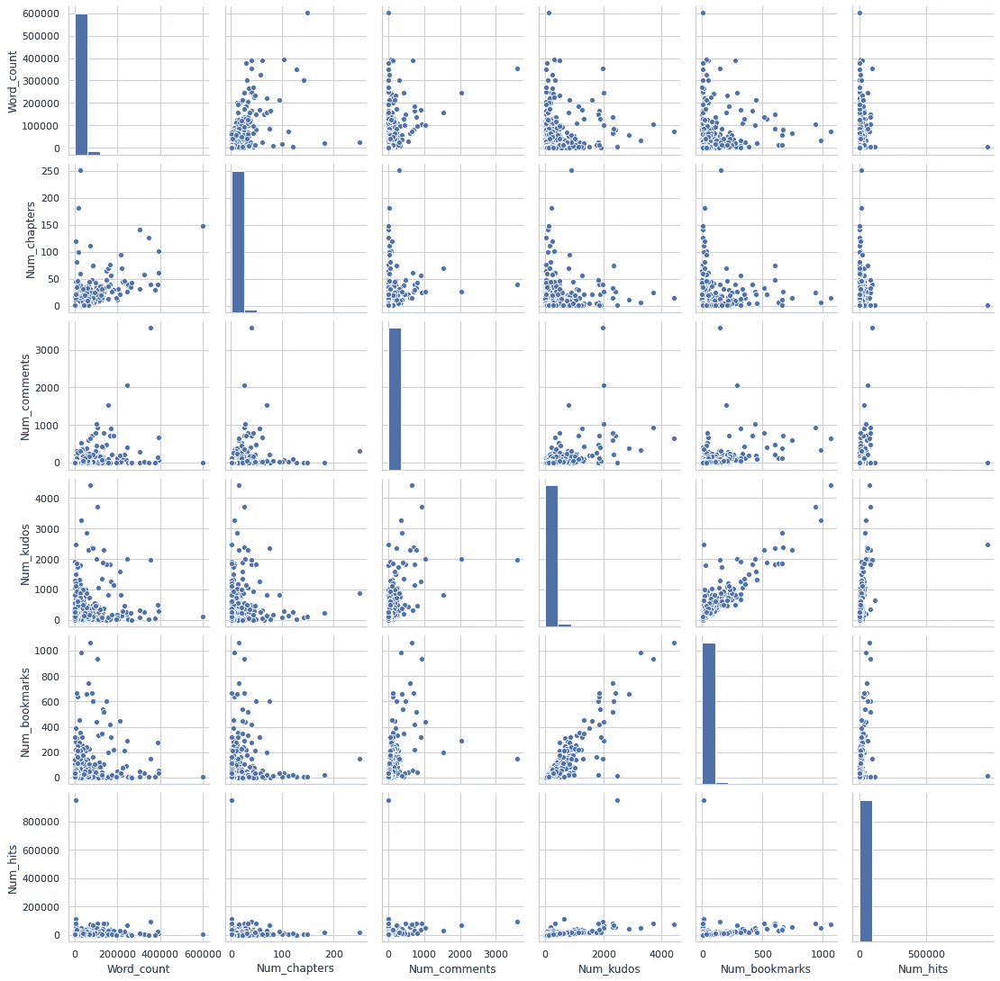

我们也可以加入一个分类变量来观察组间的差异，例如—

```
sns.pairplot(df.drop(['ID','Success'], axis=1), hue = 'Complete')
```

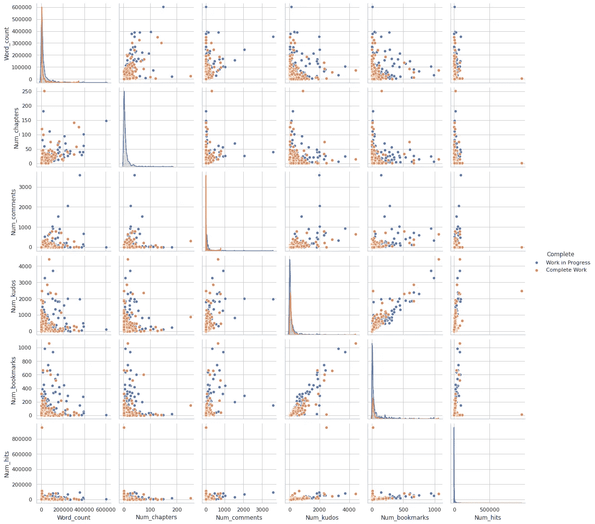

很明显，许多有价值的数字是高度倾斜的。我对这些变量使用了对数变换:

```
dic = {}
for col in df.drop(['ID','Success'], axis=1).columns:
    if is_numeric_dtype(df[col]):
        key = '{}_log'.format(col)
        dic[key] = np.log(df[col].values+1)
    else:
        dic[col] = df[col].valuesdf2 = pd.DataFrame.from_dict(dic)
```

转换后，这种关系变得更加清晰:

```
sns.pairplot(df2, hue = 'Rating', plot_kws={'alpha': 0.3}) # alpha is for transparency since groups overlap severely
```

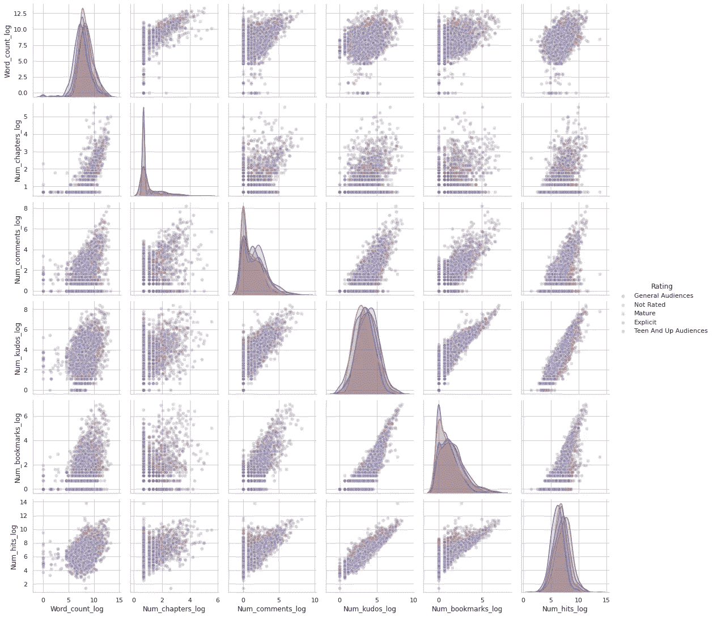

事实上，相关性也变得更强，尤其是对于反应指标:

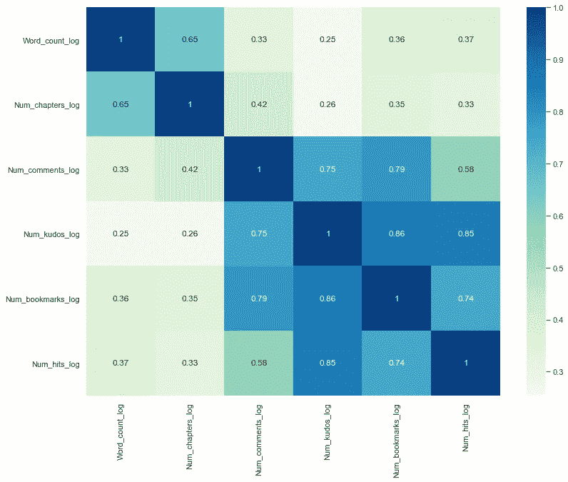

不出所料，点击率、声望、书签之间有很强的相关性。更多的荣誉或书签确实会带来更多的评论，而点击数并不能很好地预测评论。

同样，对于写更长的小说是否会赢得更多的反应这个问题，答案是肯定的“不会”

## 3.斯皮尔曼秩序相关

在这种高度倾斜数据的情况下，Spearman 的等级顺序相关性可能是一个合理的选择，因为等级不会受到异常值的影响。

结果类似于对数变换后的皮尔逊相关矩阵:

```
corr_matrix, p_matrix = scipy.stats.spearmanr(df)
spearman_corr = pd.DataFrame(corr_matrix, columns = list(df.columns), index = list(df.columns))plt.figure(figsize=(13,10))
sns.heatmap(spearman_corr.iloc[9:15,9:15], cmap='GnBu', annot=True)
```

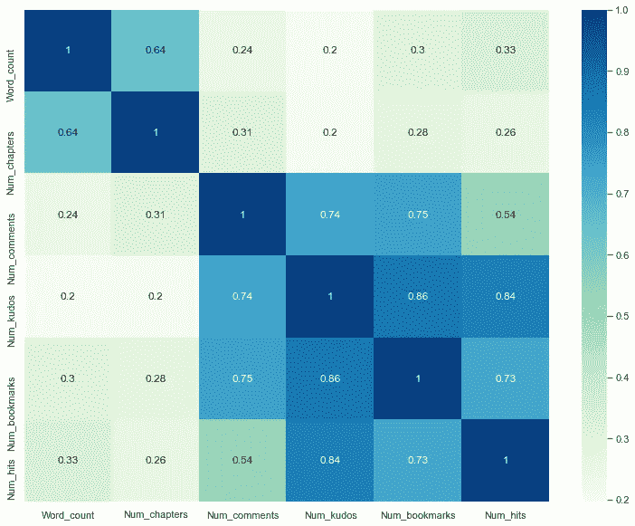

# 时间序列

有了日期变量，我们还可以探索 x 轴上的时间模式。

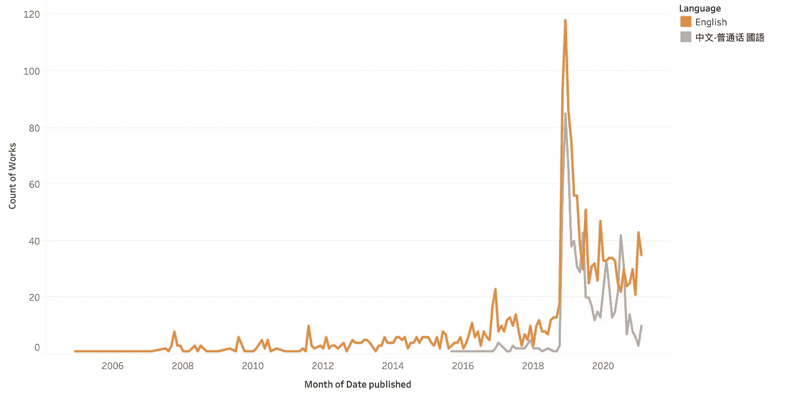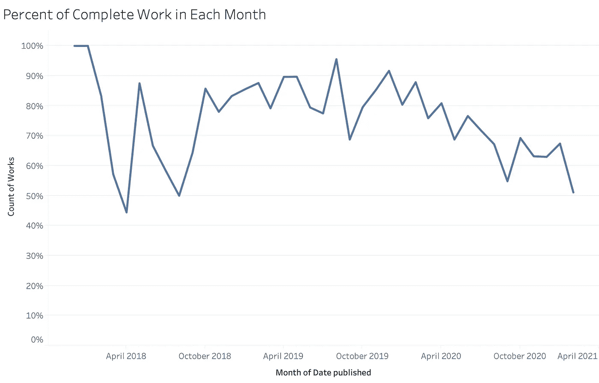

或者，我们可以通过绘制出版日期和最后更新日期之间的时间段来了解写作过程。例如，这可以告诉你谁是最稳定的作者，或者一个作者是否中途放弃了作品。

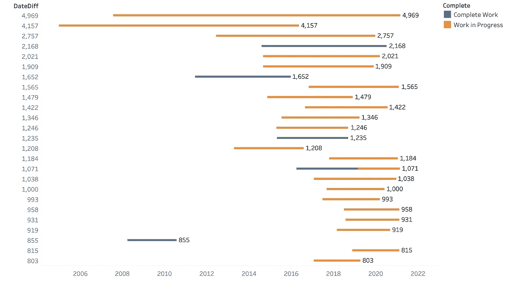

该甘特图包括为这两个日期之间的差异创建一个计算字段，将其用作大小(标签可以更改为小说标题或其他)，并指定 id 或其他唯一标识符作为详细信息。(这个想法来自网上一位好心的投稿人，但我再也找不到那个来源了。)

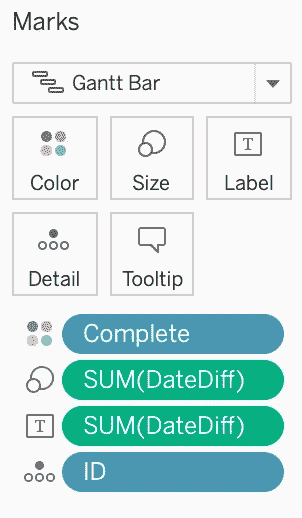

同样，根据项目目标，有无限的可能性。我将在这里结束我的 EDA，并在即将到来的帖子中进行一些文本分析！