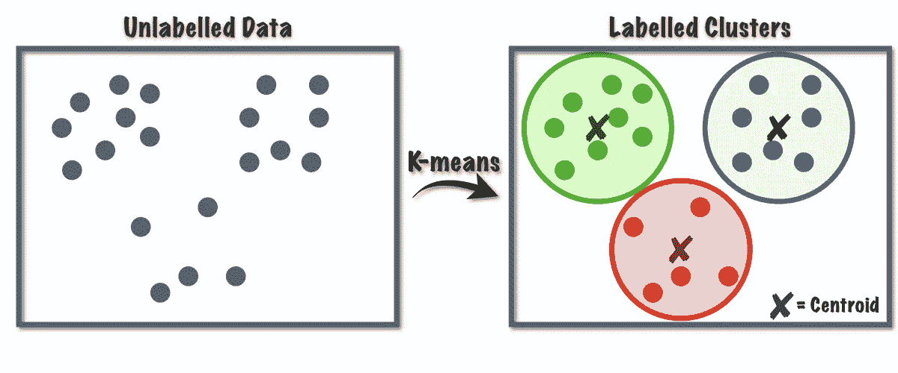
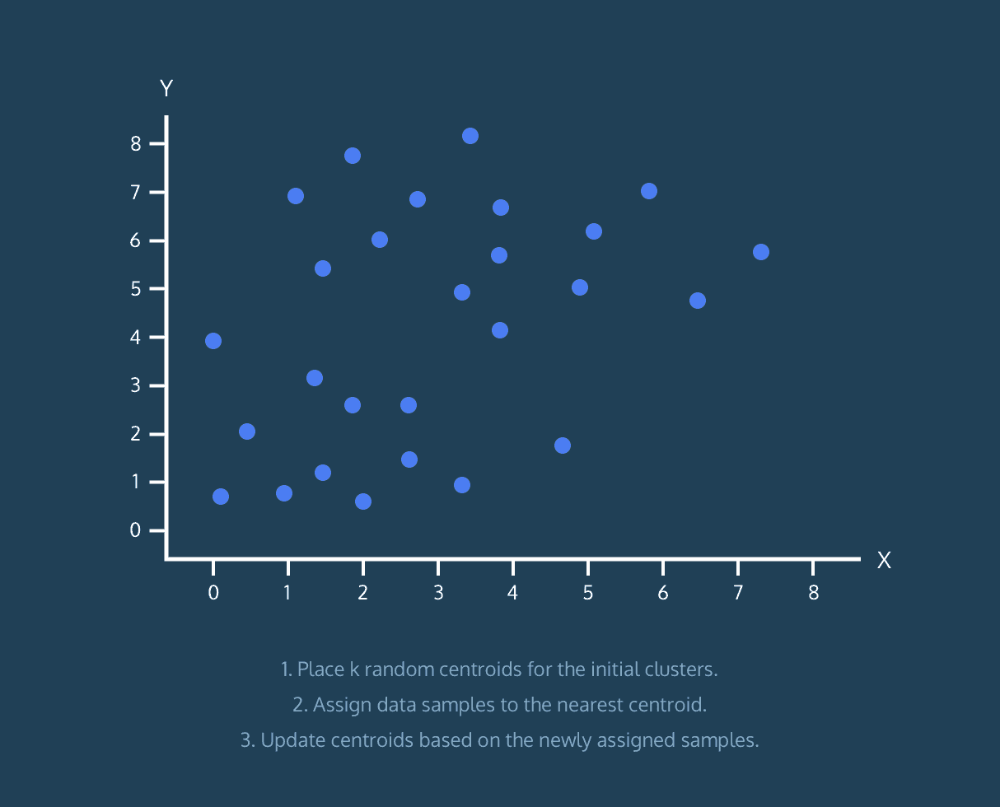
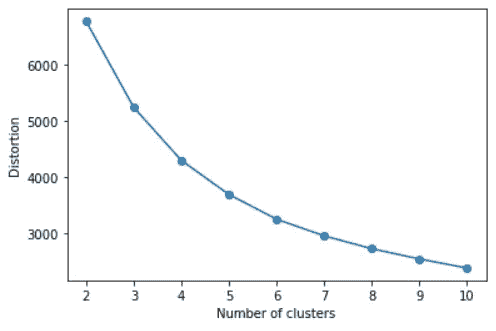
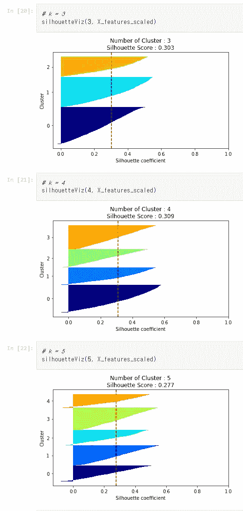

# ML-K-均值聚类

> 原文：<https://medium.com/mlearning-ai/ml-k-means-clustering-5c11c1d2577b?source=collection_archive---------4----------------------->

无监督学习

## 无监督&聚类？

现实生活中数据并不总是有标签的。我们用来在这些数据中寻找模式的方法被称为“无监督学习”。聚类是一种众所周知的无监督学习方法。它将相似的数据分组，以便我们可以找到数据的模式/结构。

## K-means？

“k”是我们想要将数据分组到的簇的数量。“平均值”是样本(数据点)和聚类中心之间的平均距离。我们称星团的中心为“质心”。

## k 均值过程

1.  在数据集中指定 k 个质心。
2.  将数据示例分配给最近的集群。
3.  计算聚类中示例的平均位置，并为每个聚类指定(移动)质心。
4.  重复 2~3，直到质心保持不动。

from [https://eunsukimme.github.io/ml/2019/12/16/K-Means/](https://eunsukimme.github.io/ml/2019/12/16/K-Means/)

第二个过程中的“最近”是指数据示例和质心之间的欧几里德距离。

## 多少 k？

k-means 算法试图最小化失真，失真被定义为每个数据样本向量与其支配质心之间的平方距离之和。这个和可以高也可以低，我们可以画一个曲线图，记录下失真的变化。

这叫做“肘法”。

如果我们找到适当的 k 值，失真会慢慢减小。根据这个规律，我们可以找出合适的 k。

此外，还有另一种方法被称为“剪影分析”。

剪影分析可用于研究所得聚类之间的分离距离。轮廓图显示了一个聚类中的每个点与相邻聚类中的点的接近程度，从而提供了一种可视化评估聚类数量等参数的方法。这个度量的范围是[-1，1]。

接近+1 的轮廓系数(这些值被称为)表示样本远离相邻聚类。值为 0 表示样本位于或非常接近两个相邻聚类之间的判定边界，负值表示这些样本可能被分配到错误的聚类。

K=4 is the most efficient way here

k-means 算法的可视化代码，可以访问我的 [github](https://github.com/ShinyJay2/Uni_3-2_ML/blob/main/%EA%B8%B0%EA%B3%84%ED%95%99%EC%8A%B5%2006/K-means%20Algorithm.ipynb) 。虽然是用韩语写的，但是希望代码能有所帮助。

对了，这是我 ML 系列的结尾。下次我会带着新的系列回来。感谢您的阅读！

 [## Mlearning.ai 提交建议

### 如何成为 Mlearning.ai 上的作家

medium.com](/mlearning-ai/mlearning-ai-submission-suggestions-b51e2b130bfb)