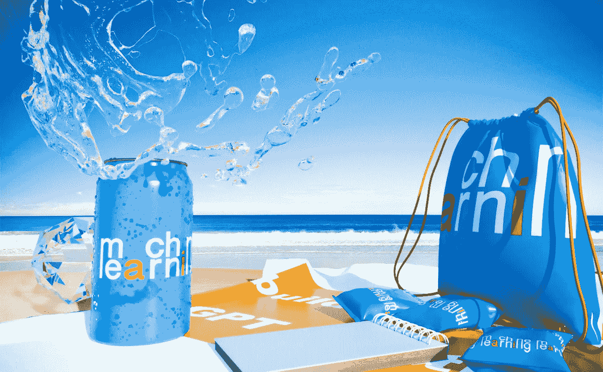

# 🟠ml 2022 年 5 月

> 原文：<https://medium.com/mlearning-ai/ml-may-2022-60c7806b28cf?source=collection_archive---------3----------------------->

## [机器学习艺术](https://mlearning.substack.com)

**机器学习**学科经历了一个奇妙的月份，硬件和建模方面的突破使得一些非常有趣的应用成为可能。

[https://mlearning.substack.com](https://mlearning.substack.com)

## 🔵[5400 亿参数 NLP 模型](/mlearning-ai/540-billion-parameter-nlp-model-43d74a387c0d)

Pathways 语言模型( **PaLM** )是由谷歌研究院开发的拥有 5400 亿个参数的人工智能自然语言处理( **NLP** )模型…