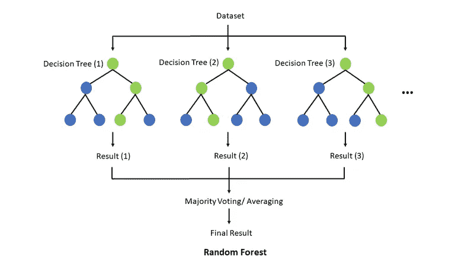

# 神经科学:遗传记忆、生物电、思维——主动/被动和表观遗传学

> 原文：<https://medium.com/mlearning-ai/ml-neuroscience-genetic-memory-thoughts-active-passive-5f0c55d08e62?source=collection_archive---------2----------------------->

Random Forest via [TseKiChun](https://commons.wikimedia.org/w/index.php?title=User:TseKiChun&action=edit&redlink=1)

可以说，生物代代相传的是记忆，至少在宏观层面上是如此。基因信息和细节可以说是微乎其微。这种记忆具有物种分类和亲本的特异性。对植物和动物来说，记忆以思想的形式保存着某些东西。

染色体的工作机制与记忆有关。这个机制的表达是一个思想[或作家]的一面。每个阶段都有负责每个功能的部分。在细胞分裂和染色体复制之前，机制和表达是由记忆和思想形态的功能区域所主导的，包括多能性和全能性。

从受孕开始，随着成长的继续，可以说思想的一种形式就是写出记忆所保存的信息，以符合物种和双亲。这种写作通常在每个阶段都有一个最大值，在怀孕、婴儿期、儿童期、青少年期等等，或对其他物种来说是相当的。

在生物的形成细胞中的某个地方有代表记忆的东西。而在内部，某种东西将微观层面的信息转化为一种思维形式。正是这种思想让记忆贯穿发展的始终。记忆在这个早期阶段运作，就像它通常所做的那样，在那里信息的思想形态被获得和给予。

也正是这种很早就存在的思想和记忆，在生命中继续建立和发展成他们所成为的样子。

有出生缺陷，可以说是某处的不完整，思想没有正确地写出来，或一些错误。也可能是外部因素造成的。也有可能是一些遗传信息没有足够快地转化成可以被书写的信息，从而被忽略了。

思想要么是主动的，要么是被动的。植物——在一生中——拥有一种弱形式的被动思维，足以满足它们的需求..

简单的有机体具有弱形式的主动式思维，并在它们的栖息地中航行。

哺乳动物有活跃的思想，但不像人类那样透彻。

头脑在任何时候都只有一个活跃想法的能力，这可能是几分之一秒。消极的想法很多，但经常会变得积极。积极的思想决定感情。他们通过大脑回路来决定应该感受什么。其他东西可能会变得活跃，并进入另一个回路，改变感觉。

在孤独和空虚的情况下，积极的想法表现得像是消极的，或者积极的想法在一段时间内很少或没有参与，因此只有新的想法才能有所作为。这种状态可能会对应该做什么或如何做造成很多困惑。存在某种麻木的情况，使得某种外部感觉成为被动的思想，而不是主动的。这可能会使应该感觉到的，而不是这样。

每个周期来自内部和受体的信号必须变成活跃的思想。这个周期可能是几个小时、几天等等。生物钟也可以被定义为由记忆引导的主动和被动思维的平衡。它会发生变化，但通常有一个范围。

记忆确保最大限度地减少不允许他人支配的积极想法，这就是为什么焦虑等经常是有问题的。

缺乏从被动到主动的替代会导致身心问题、疾病、衰老和其他问题。

主动和被动的思想有它们的平衡，就像其他的双重性像中枢和外周神经系统、视网膜中央凹和外周视觉、显性和隐性等位基因、轻链和重链抗体等等。

细胞中的记忆宏功能不仅对体型、结构、毛发、颜色等有可能，而且对行为也有可能。这就是特定的变化是如何在几代人之间发生的。

如果种植一种生长并适应不同环境的植物的种子，新的植物将携带一般信息，然后是具体的和更新的信息。

在哺乳动物中，神经可塑性是大脑随着功能而变化。大脑中真正发生变化的部分是记忆，记忆中的变化以思想的形式出现。这些想法的更细微的形式被给予继续制造后代的细胞。

思维形式和记忆是生物的关键因素。虽然对于机器学习来说，这似乎不太可能将[数据]遗传学传递给新设备，如出生，但 ML 系统有可能模拟大脑中的思想传输。

 [## Mlearning.ai 提交建议

### 如何成为 Mlearning.ai 上的作家

medium.com](/mlearning-ai/mlearning-ai-submission-suggestions-b51e2b130bfb)