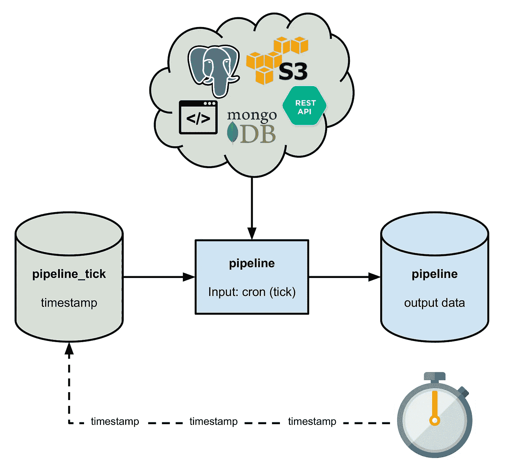
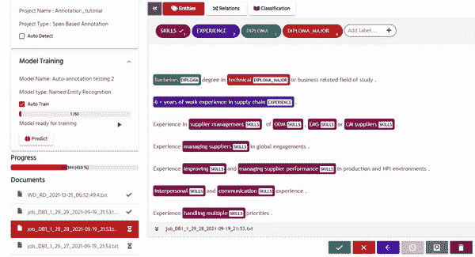
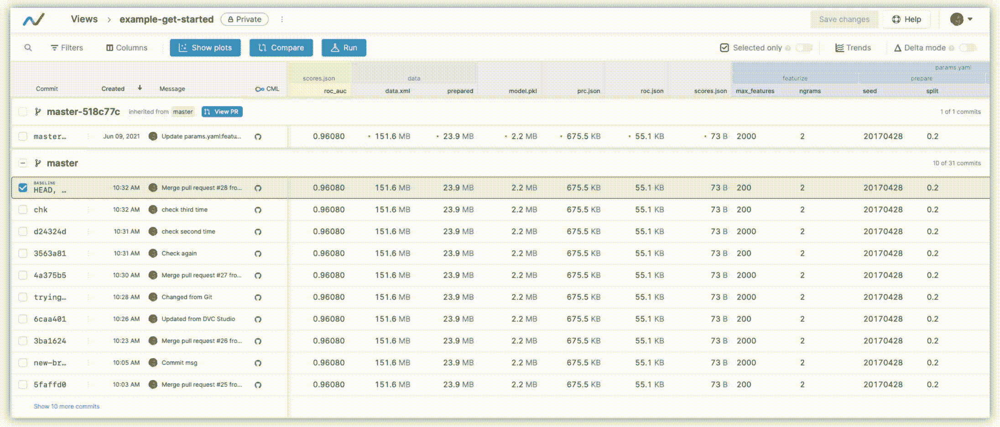
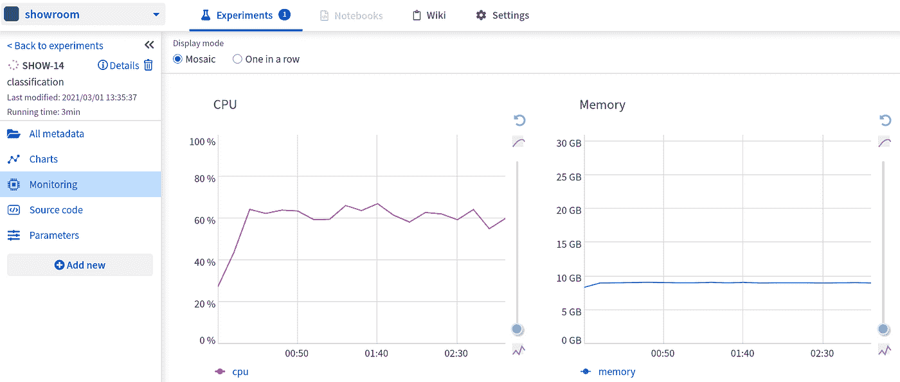

# NLP 的 ML Ops 工具

> 原文：<https://medium.com/mlearning-ai/ml-ops-tools-for-nlp-f836a3fdc30a?source=collection_archive---------2----------------------->

The path to developing and maintaining a successful NLP solution? (Source: [Unsplash](https://unsplash.com/photos/ZJKE4XVlKIA))

在本文中，我们将介绍不同的机器学习生命周期方法，从传统的流水线到高级的 MLOps，在这种情况下，我们将介绍 NLP 项目的一些最佳实践以及应用它们的建议工具。

1.  概述:从传统 ML 到高级 MLOps
2.  NLP 项目中最佳实践的 MLOps 工具

# 概述:从传统 ML 到高级 MLOps

**进行机器学习的典型和最传统的方式**基本上是一种手动方法，数据科学家将进行实验循环(EDA、预处理、训练、验证……)，以获得基于相关和一致的假设和验证指标的具有良好预测性能的模型。一旦我们有了这样一个模型，数据科学家的角色就结束了，工程师们将从这里开始利用 REST API 将该模型部署为预测微服务，这样我们就可以在生产环境中进行预测。

一旦我们在生产环境中部署该模型，就像任何环境一样，它会动态变化，因此关于该环境的数据也会变化，在这里，数据科学家使用的假设和指标与关于该环境的新数据之间会出现偏差，因此，当该模型无法适应现实世界的变化时，它就会崩溃。

我们可以注意到，这种进行 ML 的方式适用于有限且缓慢变化的环境，在这种环境中，要么不要求模型适应新数据，要么要求极不频繁的微调(例如，一年一次)，这将是相同的过程，数据科学家将完成工作，然后工程师将完全部署新模型。

为了解决这一问题以及与此方法相关的其他挑战，如数据采集、模型训练、测试、构建和部署等繁琐的手动任务，MLOps 越来越多地被环境快速变化和大规模应用程序的公司采用。

MLOps 源自 DevOps，因此得名，但是它包含了一些与数据科学家的工作性质相关的独特属性。

首先，让我们从最简单的 MLOps 开始。在传统方法中，我们部署一个经过训练的模型作为生产中的预测服务。但是现在，我们将部署一个完整的训练管道，它以触发的方式自动运行，以提供一个经过训练的模型作为预测服务，响应数据中出现的变化(自动收集的数据)。
这种方法被称为**持续培训**，其中部署的管道由数据科学家定义，他将与数据工程师一起将其转换为可复制的脚本。
因此，这种类型的基本 MLOps 保证了模型在生产中使用新数据自动训练，保证了**模型连续交付**(自动训练的模型部署步骤是自动化的)，保证了实验结果被跟踪，并且保证了训练代码和模型被很好地版本化。

其次，当我们通过部署整个培训管道来自动化模型培训和交付以适应新数据时，您现在可能会想:
如果我们需要更新管道以适应新的业务需求会怎么样？
如果使用新的算法和一组新的参数会产生一个交付更好模型的管道，那会怎么样？
因此，这里的数据科学家将反复尝试新的 ML 算法和技术，这将产生 ML 管道步骤的源代码，然后我们需要构建该源代码并运行与新管道更新相关的各种测试，这被称为**管道持续集成**，产生要在目标环境中部署的管道，这是**管道持续交付**，该步骤的结果是具有新实现的已部署管道。

> 查看这篇微软文章，了解关于 [MLOps 成熟度级别](https://docs.microsoft.com/en-us/azure/architecture/example-scenario/mlops/mlops-maturity-model)的更多信息。

**注意:**我们需要收集模型性能的实时统计数据，以决定我们是否应该运行训练管道或执行新的实验周期来更新管道*(监控)*。

# NLP 项目中最佳实践的 MLOps 工具

现在我们已经对 MLOps 有了一个概述，让我们列出一个 MLOps 工具的列表，这些工具允许我们在进行 NLP 项目时使用最佳实践。

## *确保您能够根据数据变化触发您的管道:

[Pachyderm](https://docs.pachyderm.com/latest/concepts/pipeline-concepts/pipeline/) 拥有自动版本控制和数据驱动的管道，可根据对数据变化的检测自动触发，实现**自动缩放和并行处理 Pb 级的*非结构化数据*** (我们 NLP 案例中的文本)。

The pipeline can be triggered based on data changes but also on time. (Source: [Pachyderm](https://docs.pachyderm.com/latest/concepts/pipeline-concepts/pipeline/cron/))

## *确保根据精心制定的流程进行数据标记:

[UBIAI](https://ubiai.tools/features/r1-auto-labeling) 自动标记工具允许对用于训练 AI 模型的数据集进行注释和标记，该功能使用不同的方法(基于字典、基于 ML、基于规则)，并且它**确保可靠的标记**。

UBIAI labeling tool: User-friendly and based on a variety of approaches. (Source: [UBIAI](https://ubiai.tools/features/r1-auto-labeling))

## *确保跟踪并使实验可重现，版本控制模型和数据:

[DVC](https://dvc.org/doc/studio/user-guide/projects-and-experiments/explore-ml-experiments) 是一个针对 ML 项目的开源**实验管理工具**。它基于 **Git** ，用指向原始数据的小元文件替换大文件。因此，有可能**将这些带有项目源代码的元文件保存在存储库**中，而大文件保存在远程数据存储中。

Experiments tracking. (Source: [DVC](https://dvc.org/doc/studio/user-guide/projects-and-experiments/explore-ml-experiments))

## *确保您有相关的评估指标，并持续监控绩效:

[Neptune](https://docs.neptune.ai/you-should-know/displaying-metadata/smoothing-in-neptune-charts) 是一个用于 MLOps 的元数据存储，允许您构建仪表板，显示生产任务的**性能指标，查看 ML CI/CD 管道**的**元数据，可视化模型更新如何改变性能，以及比较不同的模型*(监控)*。**

Hardware consumption monitoring. (Source: [Neptune](https://dvc.org/doc/studio/user-guide/projects-and-experiments/explore-ml-experiments))

# 结论

在本文中，我们介绍了 MLOps 的概况，以及在 NLP 项目的执行中应用最佳实践的相关工具。下一步，您可以考虑探索建立 MLOps 基础架构的不同选项。无论您选择自行构建、购买完全托管的解决方案，还是采用混合方法。我们已经向您介绍了一些可以使用的工具，剩下的就是根据您的环境做出正确的决定。

 [## Mlearning.ai 提交建议

### 如何成为 Mlearning.ai 上的作家

medium.com](/mlearning-ai/mlearning-ai-submission-suggestions-b51e2b130bfb)