# 主成分分析

> 原文：<https://medium.com/mlearning-ai/ml-principal-component-analysis-200e992b837?source=collection_archive---------8----------------------->

降维

今天，我们将学习 PCA，主成分分析。

## PCA 概念和原因

PCA 的基本概念是降维。当我们有很多数据特征时，数据的维度自然会很高。如果我们已经处理了这些数据，降低维度将是有益的。

它将消除相当不重要的特征，从而降低时间/空间复杂度，并减少数据中的噪声。此外，如果我们用复杂数据训练模型，参数可能会过度拟合。但是如果我们进行降维，这个模型会更一般化，变得更健壮。

有两种方法可以降维。特征选择和特征提取就是这两个。PCA 属于特征提取，由于从来没有被告知使用/提取什么特征，所以属于无监督的特征提取。

## 什么是 PCA？

那么我们如何做到这一点呢？

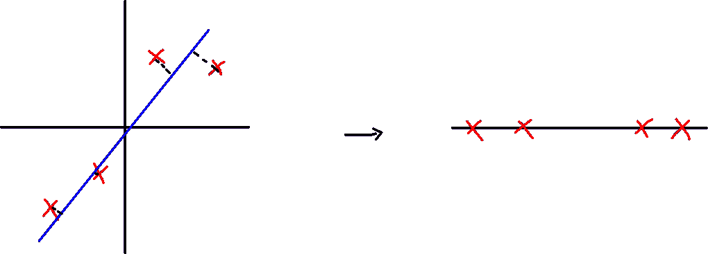

基本思路是这样的。我们希望将我们的数据点投射到一个更低维度的跨度中。这样维度就变低了。

然而，问题总是如何。我们不知道如何选择投射的向量。

PCA 提出了一种方法，我们找到一个彼此正交的新基，同时保持(最大化)数据的方差，将该数据投影到一个新基上。

同样，在新基上的单位向量，在 n 维中有 n 个单位向量，它们也是相互正交的。我们称它们为“主要成分”。

为什么要最大化方差？

直观地看，投影数据时最大化方差最能保留该数据的“特征”。

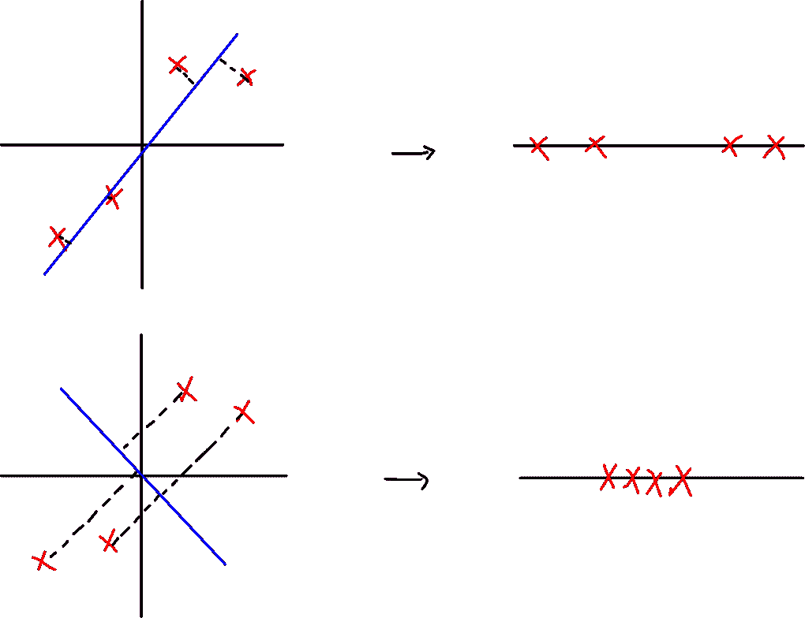

max variance vs min variance

如上图，第一次投影的输出似乎比第二次投影更能代表原始数据。

那么我们怎样才能找到一个最能代表数据的基础，怎样才能最大化方差呢？

## 协方差矩阵和特征向量，特征值

为了找出数据是如何分布的，我们可以使用协方差矩阵。

协方差矩阵如下所示:

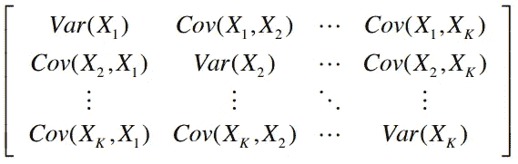

contains the variance and the covariance of the pairs of the examples

协方差矩阵定义为:

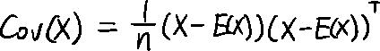

然而，为了使用主成分分析，我们需要集中数据样本。所以 E(X)应该是 0。

那么，协方差矩阵将是:

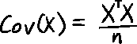

协方差矩阵有什么意义？

协方差矩阵包含关于多变量如何相互关联的信息。因此，我们希望找到最大化方差(最大限度地保留特征)的基础来投影我们的数据，协方差矩阵的特征向量就是该基础。

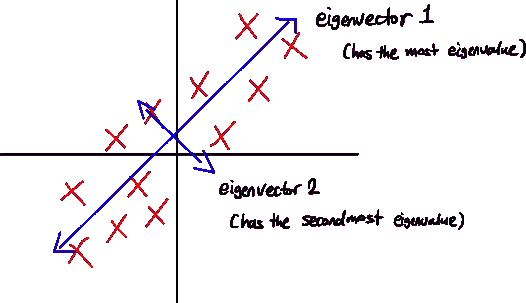

那么，我们现在有了协方差矩阵的特征向量，那么:

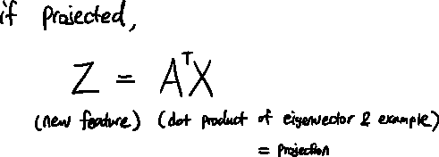

这是我们的新功能。

## PCA 步骤

1.  数据正则化(均值-居中-使均值为 0)
2.  计算现有要素的协方差矩阵
3.  计算协方差矩阵的特征值和特征向量
4.  根据特征值按顺序排列特征向量
5.  将数据投影到特征向量中(使用特征向量作为基础)

## 为什么将数据投影到协方差矩阵的特征向量上会使方差最大化？

因为我们将数据投影到最能代表数据的线上。

然而，也可以使用一些技术从逻辑上证明这一点。

假设我们要将数据投影到的矢量是某个矢量 e，那么投影就是:

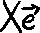

那么方差就是:

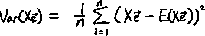

由于我们将数据以平均值为中心，并使平均值为 0，则:

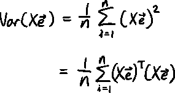

因为我们需要最大化方差，那么:

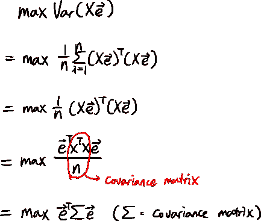

向量 e 是一个单位向量，我们想求出向量 e，所以用拉格朗日乘数法，

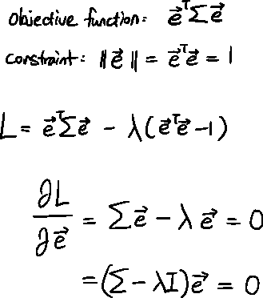

根据特征向量的定义，e 成为协方差矩阵的特征向量，λ成为协方差矩阵的特征值。因此，它证明了协方差矩阵的特征向量最大化投影数据的方差。

 [## Mlearning.ai 提交建议

### 如何成为 Mlearning.ai 上的作家

medium.com](/mlearning-ai/mlearning-ai-submission-suggestions-b51e2b130bfb)