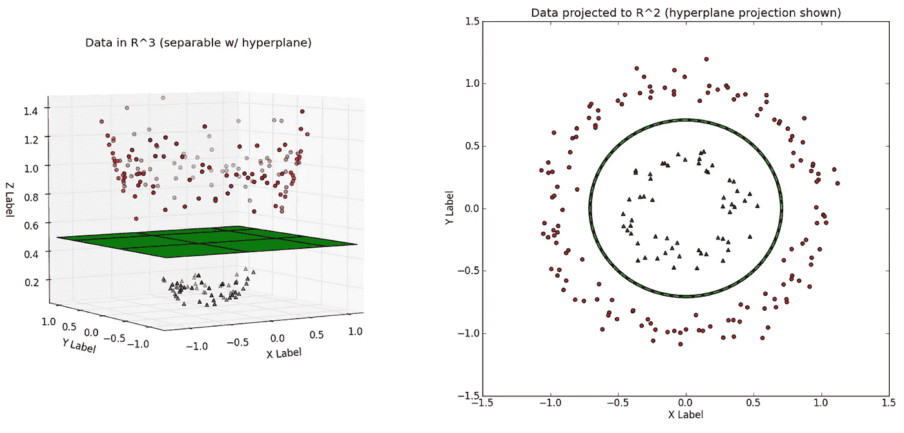
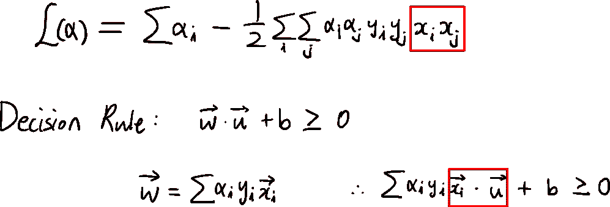
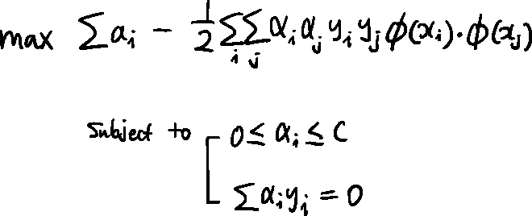
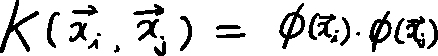
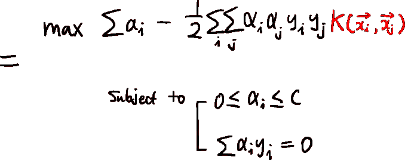

# ML-支持向量机

> 原文：<https://medium.com/mlearning-ai/ml-support-vector-machine-5a1277c195f5?source=collection_archive---------5----------------------->

第二部分

上次，我们浏览了 SVM 的整体概念。在第 2 部分中，我们将回顾一种叫做“内核技巧”的方法。

在第 1 部分中，我已经提到了我们在非线性情况下使用内核技巧。不使用内核技巧，SVM 无法处理非线性的例子。让我们看看。

Using Kernel vs Original state

我们可以看到，我们不能使用线性决策边界来区分这两个类别。基本上，我们在第 1 部分中使用的技巧不能应用于非线性数据样本。为什么？让我们看看这个。

这是我们在第 1 部分中介绍的内容，我们可以看到，当两个示例的点积值改变时，值也会改变。但是当样本是非线性的时，使用点积可能效果不好，因为样本不是线性可分的。

因此，我们将使用的基本概念是，我们将把数据点映射到一个更高维度的空间，在这种情况下，是一个三维空间。所以我们可能需要一个函数来映射我们的数据。现在我们称这个函数为φ(x)。让我们回到我们的目标函数。

但是似乎很难找到函数φ(x ),因为我们不知道用什么函数。然而，如果我们仔细观察，我们不需要找到一个函数并将它们应用到我们的示例中，我们只需要它们的点积。

因此，如果我们选择一个“内核”,它给我们的值与映射示例的点积相同，我们的 SVM 将在非线性情况下工作。

所以目标函数变成了:

有很多核，像线性核，多项式核，高斯核等等。但是，使用内核技巧的一般思路是这样的。

 [## Mlearning.ai 提交建议

### 如何成为 Mlearning.ai 上的作家

medium.com](/mlearning-ai/mlearning-ai-submission-suggestions-b51e2b130bfb)