# ML-支持向量机

> 原文：<https://medium.com/mlearning-ai/ml-support-vector-machine-7e65ac96b985?source=collection_archive---------7----------------------->

第一部分

今天，我将介绍一种非常经典但仍被广泛使用的技术。它被称为“SVM(支持向量机)”。

这将分为两个部分，在第一部分，我将涵盖 SVM 的概念，并做一些数学，在第二部分，我将涵盖内核和其他一些概念。

补充一下，我们使用非线性决策边界的核，所以第 1 部分和第 2 部分基本上是按照这个标准划分的:决策边界是线性还是非线性。

在这个 ML 系列中，我基本上遵循吴恩达的 Coursera ML 的内容，但在这个 SVM 系列中，我将使用麻省理工开放式课程的一些解释，我发现这些解释更容易理解。

我们开始吧！

# 基本概念

## 决策界限和利润

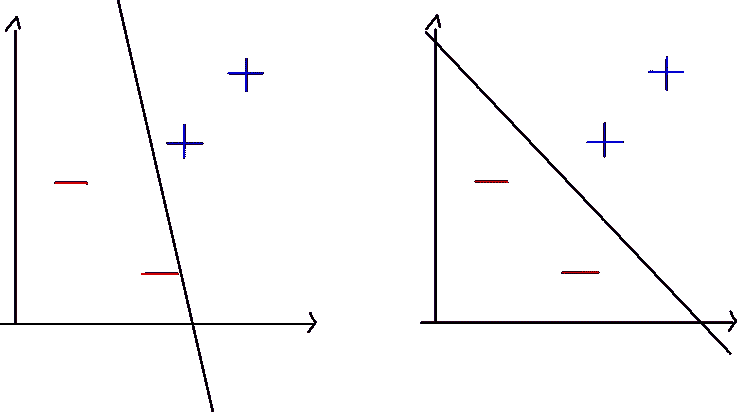

假设我们有一些正面例子和一些负面例子，我们将画一条线来恰当地划分它们，并将这条线称为决策边界。什么是更好的划分？

第二张图更好。但是为什么呢？与第一个相比，为什么那个决策边界恰当地划分了示例？在这种情况下，“适当”是什么意思？

简单来说，第二个边界比第一个边界离示例(数据点)更远。支持向量是接近决策边界的例子。

现在我们来看看保证金的概念。余量是支持向量和决策边界之间的距离。我们来看下图。

from ratsgo’s blog

这是保证金。我们现在知道，最佳决策边界使利润最大化。这被称为“最宽街道方法”。

## 全部的

SVM 想要解决的主要问题是:“我们如何用决策边界划分空间”，答案是:“通过最大化边际”。

现在，有了主要的概念，让我们深入一些详细的解释(数学)。

# 逻辑推理

## 决策规则

首先，我们必须定义决策规则来确定决策边界。

我们想知道的是，未知例子 U 是属于正组还是负组。所以我们可以设置一个垂直于决策边界的向量 w，并将我们的单个未知示例设置为向量 u。

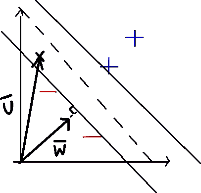

vector w is perpendicular to the decision boundary

所以，我们可以把我们的向量 u 投影到向量 w 上，如果那个投影大于某个常数(判定边界)，我们就知道未知的例子属于正组。所以决策规则如下:

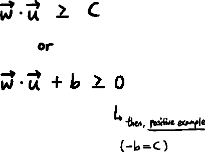

Decision Rule

## 添加附加约束

这是我们的判定规则，来找出未知例子是正的还是负的。然而，我们不知道使用哪个向量 w，因为有许多向量垂直于决策边界，并且我们不知道常数 b 是什么。

为了解决这个问题，我们必须添加一些约束。

所以让我们坚持认为，当给定的例子是正例时，我们的决策规则给出大于 1 的值，当给定负例时，给出小于-1 的值。

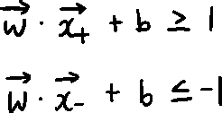

为了数学上的方便，我们将引入一个变量 yᵢ，当例子为正时，它代表+1，当例子为负时，它代表-1。

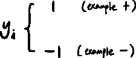

将 yᵢ加入到我们的决策规则中，这将简化我们的决策规则。

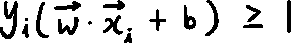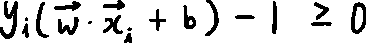

现在，我们将添加另一个约束。当值为 0 时，我们假设这些点在边界上。

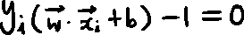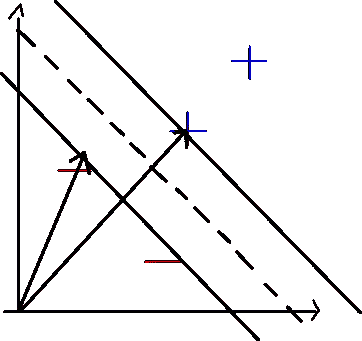

但是我们最初的目标是什么呢？我们想最大化利润。所以边界上的正例与边界上的反例之间的宽度应该最大化。

那么如何才能表达宽度呢？

我们可以用单位向量乘以 x₊和 x₋.的差

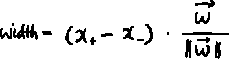

我们可以用这个来表达第一项:

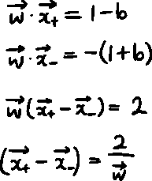

所以，宽度是:

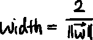

## 最佳化

所以我们需要最大化宽度，或者说:

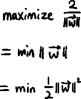

我们可以把这个最小化。这个过程完全是为了数学上的方便。

所以我们有一个目标，和一些约束。

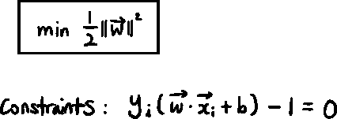

我们有一个约束和一个目标。对于这个问题，我们可以使用拉格朗日乘子法。

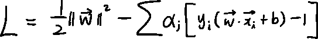

Using alpha as the Lagrange multiplier

Patrick Winston 教授说，除了在边界上(+或-)的例子，所有的阿尔法最终都变成了 0。同样，如果我们想在所有的例子中应用它，我们需要使用不等式作为约束。据说我们需要使用 KKT 条件，但是现在，让我们继续。

我们必须找到导数并把它们设为 0。

衍生产品如下:

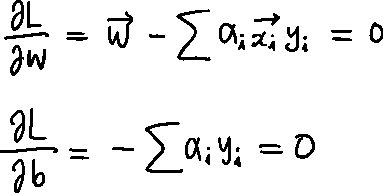

There are two variables, w and b

我们在这里意识到的是:

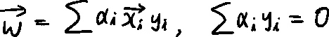

为了找出 w 是什么，我们只需要值α。

如果我们替换拉格朗日函数中的项，

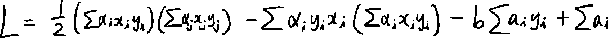

然后，

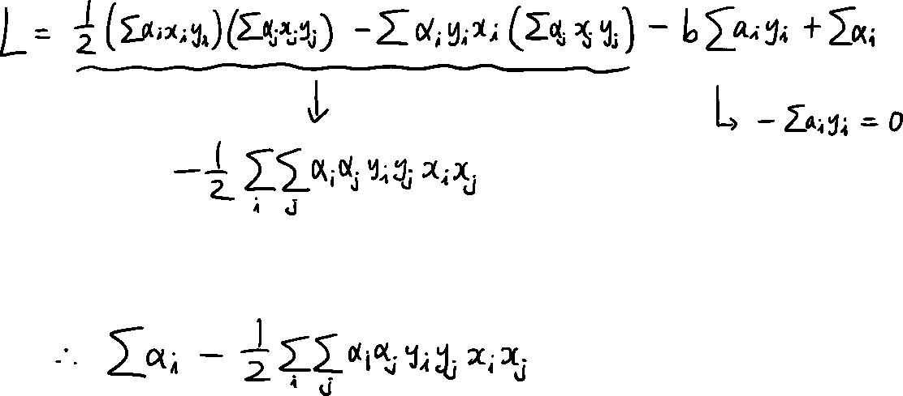

在这里，帕特里克·温斯顿教授说“现在我们可以把这个交给我们的数字分析师了”。

现在这个问题变成了关于α的最大化问题。如果我们找出α，我们就能找出 w 和 b 的值。

同样，当α不为 0 时，如前所述，那么例子在边界上，在 SVM，我们称这些例子为“支持向量”。

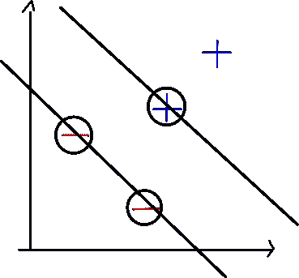

Examples are on the boundary.

此外，已知在 L(a)中，第一项关于α是线性的，第二项是二次项，我们可以应用二次规划技术并找出α。

不管怎样，重点是我们不需要担心陷入局部极小值，它是凸的。

> 所以，在任何情况下，SVM 总是，理论上给我们最优解。

 [## Mlearning.ai 提交建议

### 如何成为 Mlearning.ai 上的作家

medium.com](/mlearning-ai/mlearning-ai-submission-suggestions-b51e2b130bfb)