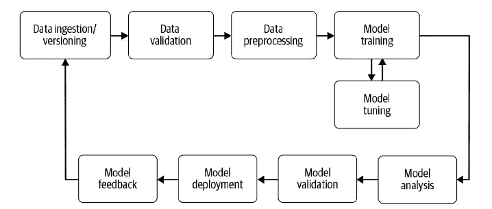

# MLOps:构建 ML 管道第 1 部分

> 原文：<https://medium.com/mlearning-ai/mlops-building-ml-pipeline-part-1-e30783287d0d?source=collection_archive---------2----------------------->

Pic from [https://ml-ops.org/](https://ml-ops.org/)

在学习了 ML/DL 的核心概念并把知识运用到实践中之后，这真的很难，也很有挑战性。下一步是我们如何使 ML/DL 项目更适合生产。因此，为了更多地了解生产流水线，我报名参加了由 DeepLearning 提供的面向生产的机器学习工程(MLOps)专业课程。AI 由[Coursera](https://www.linkedin.com/company/coursera/)&[Google](https://www.linkedin.com/company/google/)编写，它非常直观，并提供了如何制作合适的生产流水线。

通过完成这门课程，我已经通过 O'Reilly 的书《构建机器学习管道》阅读了更多关于 Tensorflow 自动模型生命周期的内容

这一系列文章仅仅是我从这本书中学到的，所以我将一章一章地描述构建 ML 管道的关键概念。

## **什么是机器学习管道？**

> 机器学习管道实现并形式化了加速、重用、管理和部署机器学习模型的过程。

自动化的、可重复的管道减少了部署模型所需的工作。管道应包括以下步骤:

*   有效地将您的数据版本化，并开始新的模型训练
*   验证收到的数据并检查数据漂移
*   为您的模型训练和验证有效地预处理数据
*   有效地训练你的机器学习模型
*   追踪你的模特训练
*   分析和验证您训练和调整的模型
*   部署经验证的模型
*   缩放部署的模型
*   捕获新的培训数据，并利用反馈循环对绩效指标进行建模

# 这个列表忽略了重要的一点:选择模型架构。我假设您已经很好地掌握了这一步的工作知识，这是本系列的先决条件。

目前，有多种框架/工具可以支持 ML 管道，但由于书中提到了 Tensorflow 和 Tensorflow extended，所以我也将遵循相同的方向。

## **TensorFlow 和 tensor flow 为什么要扩展？**

*   在撰写本文时，TensorFlow 生态系统是机器学习最广泛可用的生态系统。它包括多个有用的项目和超出其核心焦点的支持库，如 TensorFlow Privacy 和 TensorFlow Probability。
*   它很受欢迎，广泛应用于各种小型和大型生产环境中，并且有一个活跃的感兴趣的用户社区。
*   支持的用例从学术研究到生产中的机器学习。TFX 与生产用例的核心 TensorFlow 平台紧密集成。
*   TensorFlow 和 TFX 都是开源工具，使用没有限制。

# 机器学习管道的组件

Image from the book

从上面的图片中，可以清楚地看到 ML 管道的生命周期，但是我们将在下一篇文章中进行更多的讨论。

## 数据接收和数据版本控制

> 数据摄取是每个机器学习管道中的第一步，我们只需将数据处理成后续组件可以消化的专用格式。此外，这可以在数据投入生产和新数据到达时处理多个版本的数据。

## 数据有效性

> 在训练新的模型版本之前，这是流水线中非常关键的一步。这意味着，一旦 ML 模型投入生产并且运行良好，几天后管道就会收到新数据，因此在将新数据输入模型之前，我们需要对其进行验证。
> 数据验证的重点是检查新数据的统计数据是否符合预期(例如，范围、类别数量和类别分布)。如果检测到任何异常，它还会提醒数据科学家。例如，如果您正在训练一个二元分类模型，您的训练数据可能包含 50%的 X 类样本和 50%的 Y 类样本。如果这些类之间的划分发生变化，数据验证工具会提供警报，其中新收集的数据可能会在两个类之间按 70/30 的比例进行划分。如果模型正在使用这种不平衡的训练集进行训练，并且数据科学家尚未调整模型的损失函数，或者过采样/欠采样类别 X 或 Y，则模型预测可能会偏向主导类别。
> 如果您有一个带有主导标签的数据集，并且您将该数据集拆分为一个训练集和一个验证集，您需要确保这两个数据集之间的标签拆分大致相同。一旦观察到这种行为，数据科学家或 ML 工程师就可以改变超参数，并启动生命周期来调整新数据。

## 数据预处理

> 这一步发生在模型训练之前，在模型训练中，我们将根据我们的需要操作数据，如 on-multi hot vector 或对于文本数据，将文本转换为标记符。由于仅在模型训练之前需要预处理，而不是在每个训练时期都需要预处理，因此在训练模型之前，在其自己的生命周期步骤中运行预处理是最有意义的。

## 模型训练和调整

> 在这里，我们训练一个模型来获取输入，并以尽可能低的误差预测输出。对于较小的数据集，很容易训练，但对于较大的数据集，模型本身将需要较长的时间来训练，这将是一个难点。
> 模型调优可以显著提高性能，缩短执行时间，这就是为什么在训练之前进行调优非常重要，而且训练和调优可能是一个持续的过程。

## 模型分析

> 一旦模型被训练，我们使用精确度或损失来确定最合适的模型参数。但是一旦我们确定了模型的最终版本，对模型性能进行更深入的分析是非常有用的。这可能包括计算精度、召回率和 AUC(曲线下面积)等其他指标，或者在比训练中使用的验证集更大的数据集上计算性能。

## 模型版本控制

> 模型版本化和验证步骤的目的是跟踪哪个模型、超参数集和数据集被选择作为要部署的下一个版本。

## 模型部署

> 一旦您训练、调整和分析了您的模型，它就准备好了。不幸的是，太多的模型是用一次性实现部署的，这使得更新模型成为一个脆弱的过程。同时托管多个版本(通过像 REST 这样的 API)将允许您在您的模型上运行 A/B 测试，并提供关于您的模型改进的有价值的反馈。
> 模型服务器可以通过重新部署快速更新模型版本，并减少应用程序停机时间。

## 模型反馈

> 我们必须衡量新部署模型的有效性和性能。在这一步中，我们可以捕获关于模型性能的有价值的信息。

希望你会喜欢的内容。请继续关注下一篇文章。请随意发表您的评论或建议

参考—[https://www . oreilly . com/library/view/building-machine-learning/9781492053187/](https://www.oreilly.com/library/view/building-machine-learning/9781492053187/)

 [## Mlearning.ai 提交建议

### 如何成为 Mlearning.ai 上的作家

medium.com](/mlearning-ai/mlearning-ai-submission-suggestions-b51e2b130bfb)