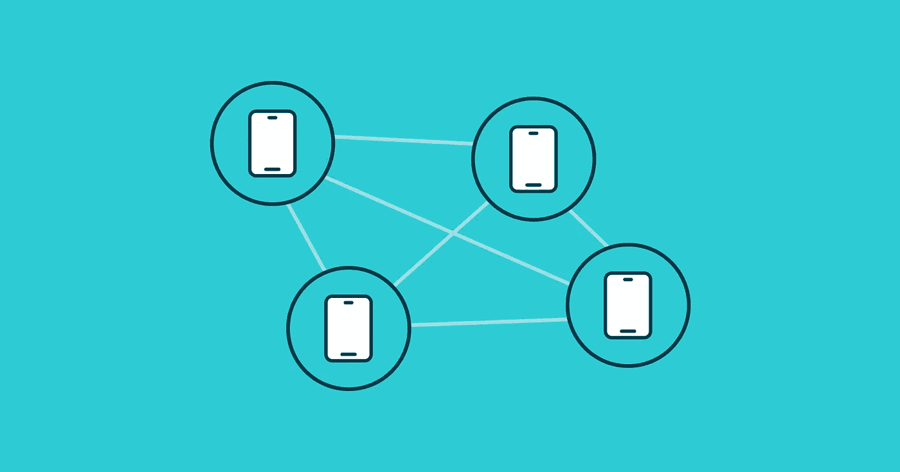

# 面向物联网和边缘的 MLOps

> 原文：<https://medium.com/mlearning-ai/mlops-for-iot-and-edge-ac51289eb79e?source=collection_archive---------4----------------------->

Image by author

机器学习和智能设备的结合带来了新一波自动化浪潮。支持 ML 的设备将对我们的日常生活产生深远的影响，从智能冰箱到无收银结账和无人驾驶汽车。随着用例的复杂性和设备数量的增加，我们将不得不采用新的策略来为用户部署这些 ML 功能并管理它们。

在本文中，我们将探讨在边缘设备上运行推理的优势、主要挑战以及 MLOps 实践如何缓解这些挑战。

# 理解关键概念

在我们深入了解 MLOps 对于物联网和边缘的优势之前，我们需要了解一些基本概念，以确保我们达成共识。只有四个，所以不要害怕。

物联网(IoT)或物联网(Internet of Things)是一个由带有传感器的设备组成的网络，这些设备可以通过互联网或它们之间的任何其他类型的连接来收集、处理和与其他设备交换数据。

**AIoT** ，或人工智能物联网，是人工智能技术与物联网基础设施的结合。它允许更高效的物联网操作、高级数据分析和改进的人机交互。

**边缘计算**是一种“分布式计算框架，使企业应用程序更接近物联网设备或本地边缘服务器等数据源。这导致更快的洞察、更短的响应时间和更好的带宽可用性。”( [IBM](https://www.ibm.com/cloud/what-is-edge-computing) )它也让机器学习算法在 edge 的应用成为可能。

**MLOps** 是一种实践，旨在无缝高效地开发和维护生产机器学习。如果您还不熟悉这个术语，您可以在我们的 MLOps 指南中阅读更多内容。

# 背景概述

随着越来越多的组织采用 ML，对模型管理和运营的需求急剧增加，并催生了 [MLOps](https://valohai.com/mlops/) 。另一方面是物联网的激增。据 Statista 统计，到 2023 年，全球物联网支出预计将达到 1.1 万亿美元。此外，到 2025 年，活跃的物联网设备数量预计将达到 309 亿。

云计算一直有助于促进物联网设备之间的无缝通信，因为它使 API 能够在互联和智能设备之间进行交互。然而，云计算的一个主要缺点是它的延迟，因为它不能实时处理数据。因此，随着世界上活跃的物联网连接设备的数量持续激增，需要更好的技术。

这催生了边缘计算，可用于处理时间敏感数据。对于连接有限或没有连接的偏远地区，这也是一个更好的选择。然而，正如 Emmanuel Raj 在 2020 年的论文中指出的，随着物联网和边缘的潜力不断增长，我们面临着一个重大的计算挑战。

例如，您如何在大规模边缘设备上执行 ML 以管理和监控 ML 模型？如何启用 CI/CD？您如何保护设备以及设备之间的通信？如何保证系统的效率？

面向物联网和边缘的 MLOps 将与更传统的使用情形显著不同，因为没有那么多既定模式。

# 边缘机器学习的好处

大多数 MLOps 文献和解决方案都集中于在线推理。换句话说，在云上运行模型并让终端用户应用程序通过 API 与模型通信。然而，在许多用例中，将算法移近实际终端用户是非常有益的，因此不应忽略边缘推断。

将模型移动到设备，无论是手机还是 NVIDIA Jetson 这样的设备，都可以实现高度的可扩展性、隐私性、可持续性、可负担性和适应性。这些都是很难通过在线推理解决的问题。这一举措还使物联网设备本身更加可靠，因为它们甚至能够在有限的连接中工作，这对于医疗或安全设备等用例来说至关重要。

Image by author

通过边缘推断，模型在该位置的设备上运行，因此规模由设备自身处理。

在设备本身上运行推理的 ML 系统将具有独特的优势:

*   该系统将自动扩展，因为每个新设备都将处理自己的工作负载。这也有助于更好地适应不断变化的环境，更具成本效益。
*   该系统将更容易解决隐私问题，因为数据不必离开最终用户的设备。
*   每个边缘设备都可以在不增加延迟的情况下做出实时决策。
*   每个边缘设备甚至可以在没有连接到中央服务器的情况下做出决定。
*   每个边缘设备甚至可以运行其自己版本的训练模型，以满足环境的特定需求。

依赖于边缘设备的 ML 解决方案可以采取多种形式。例如，它可以是你的手机，运行专门训练来识别你的面部识别模型。或者，它可以是一台本地计算机，连接到现场的所有监控摄像头，并对任何可疑活动发出警报。两者都将从上述要点中受益，但在维护和管理方面会有很大不同，这将我们带到下一个逻辑点:挑战。

# 边缘机器学习的挑战以及 MLOps 如何提供帮助

大多数 MLOps 文献关注在线推理是有逻辑原因的。从管理的角度来看，这很简单。您维护一个模型，该模型转换成可以更新和监控的单个 API 端点。

在 edge ML 中，大多数用例都是独特的雪花，流程会变得非常复杂。但是适当地实现 MLOps 肯定可以使事情变得更容易。让我们来看一些挑战:

*   测试很难。边缘设备有许多不同的形状和尺寸。以 Android 生态系统为例，这些设备的计算能力有很大差异，很难测试你的模型对所有设备都足够有效。然而，一个强大的机器学习管道可以包括各种测试来解决模型性能。
*   **部署艰难。**更新单个端点很简单。更新 1000 台设备要复杂得多。在大多数情况下，您会希望将 ML 管道和模型存储与负责更新边缘设备的其他工具集成在一起。例如，您的[应用程序 CI/CD 将从您的模型存储库](https://valohai.com/cicd-for-machine-learning/)中获取最新的模型。
*   监控很难。使用在线推理，您可以从单个端点收集指标，但使用 edge ML，您需要将每个设备报告回来，并且您可能仍然无法完全了解模型运行的环境。您可能希望将您的监控系统设计为能够接收来自多个来源的数据，而这些来源可能只是偶尔才反馈回来。
*   **数据收集很难。隐私是有代价的，因为与在线推理不同，你实际上无法直接访问“真实世界”的数据。构建连续环路以从边缘设备收集数据可能是一项复杂的设计挑战。您需要考虑在模型失败时允许您收集数据的机制(例如，当对象识别模型不起作用时，用户可以选择发送图片)。然后这些可以被标记并添加到 ML 管道中的训练数据集中。**

面向物联网和边缘的 MLOps 的主要目标是缓解这些挑战。连续循环在边推理领域更难建立。在通常的设置中，您的模型是在云上训练的，然后由 CI/CD 系统拾取并作为应用程序的一部分部署到设备上。该应用程序将在设备上运行推理，并将成批的指标和数据报告回云端，在那里您可以关闭循环，重新训练和改进您的模型。

# 你的解决方案

如前所述，每个 edge ML 案例仍然是非常独特的，没有一个单一的模式适用于所有情况。很可能您的最终解决方案将包含您自己的定制代码和现成的产品。重点应该是绘制出形成一个连续循环所需的所有不同组件，并弄清楚所有不同组件如何相互通信。我们是开放 API 的大力支持者，Valohai MLOps 平台是以 API 为先构建的，因此所有功能都可以通过代码访问，并且工具可以无缝集成。

对我们来说，MLOps 不仅仅是在线使用案例。我们认为构建连续循环并尽可能自动化它们的最佳实践实际上也应该适用于 edge。

*最初发表于*[*【https://valohai.com】*](https://valohai.com/blog/mlops-for-iot-and-edge/)*。*

 [## Mlearning.ai 提交建议

### 如何成为 Mlearning.ai 上的作家

medium.com](/mlearning-ai/mlearning-ai-submission-suggestions-b51e2b130bfb)