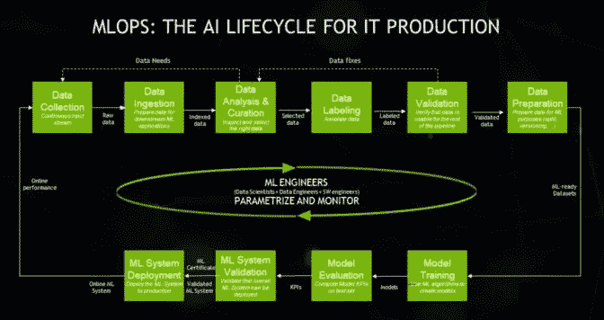
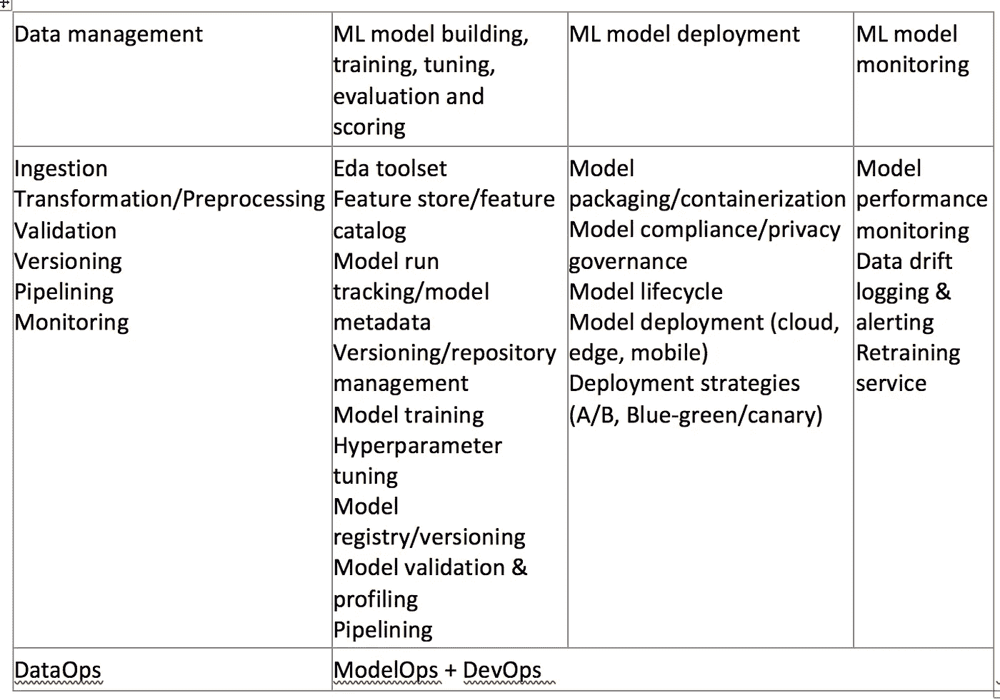
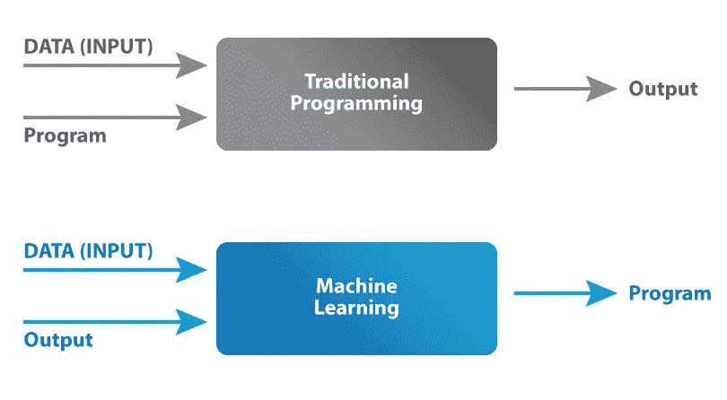

# MLOps 2021 的状态

> 原文：<https://medium.com/mlearning-ai/mlops-state-2021-bd69165e2e71?source=collection_archive---------2----------------------->

[概述](#5bbd)
[MLOps 目标](#5ff6)
[机器学习操作生命周期](#3237)
[机器学习操作能力领域](#0dee)
[数据操作](#d0d4)
[机器学习的模型操作](#7f9c)

[模型构建](#259d)
[模型部署](#3f78)
[模型监控](#bd7c)
[MLOps 基础设施](#eb88)
[顶级挑战](#cb3e)
[参考](#8ff3)

# 概观

MLOps 或 ML Ops 是一套实践，旨在可靠有效地在生产中部署和维护机器学习模型。无论你是否认为这是 DevOps 实践在机器学习开发和操作中的应用，它传达了机器学习操作可以实现用 DevOps 实现的软件开发。

 [## MLOps -维基百科

### MLOps 或 ML Ops 是一套实践，旨在可靠地在生产中部署和维护机器学习模型…

en.wikipedia.org](https://en.wikipedia.org/wiki/MLOps) 

# MLOps 目标

以可重复、自动化的方式将高质量的机器学习解决方案投入生产。它支持:

1.  快速实验
2.  快速部署
3.  质量保证:模型性能、风险、公平性、隐私
4.  跨人员、技术和流程的协作
5.  生命周期中的可重复性

# 机器学习操作生命周期

 [## 什么是 MLOps？

### MLOps 听起来像是一个毛发蓬松的独眼怪物的名字，但它实际上是一个首字母缩写词，表示成功…

blogs.nvidia.com](https://blogs.nvidia.com/blog/2020/09/03/what-is-mlops/) 

基本上，机器学习生命周期有 4 个主要阶段

1.  数据管理
2.  模型开发
3.  模型部署
4.  模型监控

有的公司还把 MLOps = DataOps + ModelOps + DevOps

# 机器学习操作能力领域

# 数据操作

 [## 数据操作-维基百科

### DataOps 是一种自动化、面向过程的方法，由分析和数据团队使用，用于提高质量和…

en.wikipedia.org](https://en.wikipedia.org/wiki/DataOps) 

DataOps 是一种自动化的、面向流程的方法，由分析和数据团队使用，用于提高质量和缩短数据分析的周期时间。

DataOps 实际上是与 MLOps 并行的实践，它对更广泛的数据集进行操作(可能是 BI、报告的数据，而不仅仅是机器学习/AI 的数据)。MLOps 与 DataOps 的关系是，目前数据对机器学习模型很重要。高质量的数据，数据的再现性是机器学习模型高质量和再现性的基础。

## 转换/预处理

ELT/ETL 用于将原始数据转换为可用的分析数据(用于 BI、报告、机器学习或其他分析用例)

可用方案: [dbt](https://www.getdbt.com) 、[阿帕奇 Spark](https://spark.apache.org) 、[阿帕奇 Nifi](https://nifi.apache.org) 、[streams](https://streamsets.com)、[阿帕奇 Beam](https://beam.apache.org) 、 [Azure Data Factory](https://azure.microsoft.com/en-us/services/data-factory/) 、 [AWS Glue](https://aws.amazon.com/glue) 、 [GCP 数据流](https://cloud.google.com/dataflow)

## 确认

数据质量保证:准确性、完整性、一致性、及时性、有效性和唯一性

可用解决方案: [Deequ](https://github.com/awslabs/deequ) ，[阿帕奇格里芬](https://griffin.apache.org)，[远大前程](https://github.com/great-expectations/great_expectations)， [TFX 数据验证](https://www.tensorflow.org/tfx/guide/tfdv)

## 版本控制

这是机器学习特有的，机器学习需要数据才能成功。这确保了版本化代码、配置和数据集的模型再现性。

可用解决方案: [dvc](https://dvc.org) ，[三角洲湖](https://delta.io)，[吉特 LFS](https://git-lfs.github.com) ，[多尔特](https://github.com/dolthub/dolt)，[莱克夫斯](https://lakefs.io)

## 管道铺设

对于具有不同子操作片段的任何操作，流水线技术建立子操作链以形成可重复且健壮的工作流。

可用解决方案:[阿帕奇气流](https://airflow.apache.org)、[府尹](https://www.prefect.io)、 [Azure 数据工厂](https://azure.microsoft.com/en-us/services/data-factory/)、 [AWS 数据管道](https://aws.amazon.com/datapipeline/)、[亚马逊为阿帕奇气流](https://aws.amazon.com/managed-workflows-for-apache-airflow/)、 [GCP 云作曲家](https://cloud.google.com/composer)

## 监视

为数据管道提供监控功能

可用的解决方案:通常与管道工具一起提供

# 机器学习模型

 [## ModelOps -维基百科

### 根据 Gartner 的定义，ModelOps(模型操作)“主要关注治理和生命周期管理…

en.wikipedia.org](https://en.wikipedia.org/wiki/ModelOps) 

ModelOps 主要专注于各种可操作化人工智能(AI)和决策模型的治理和生命周期管理，包括机器学习、知识图、规则、优化、语言和基于代理的模型。在这里，我们将重点放在机器学习模型的操作上。

# 模型结构

## Eda 工具集

在建立机器学习模型之前，此阶段用于初步探索数据，以获得对数据特征的理解。机器学习构建器将使用不同的计算、图表来理解数据分布、关系等。有一些工具可以提供数据的自动分析

可用解决方案: [pandas-profiling](https://github.com/pandas-profiling/pandas-profiling) ，不同的云提供商在其 AutoML 解决方案中提供基本的数据统计。

## 要素存储/要素目录

这是为不同用例重用特性的新趋势，而不是每个团队自己生成特性

可用方案:[盛宴](https://feast.dev)、 [Hopsworks](https://www.hopsworks.ai) 、 [Databricks 特色店](https://docs.databricks.com/applications/machine-learning/feature-store.html)、[亚马逊 Sagemaker 特色店](https://aws.amazon.com/sagemaker/feature-store/)、 [GCP 顶点 AI 特色店](https://cloud.google.com/vertex-ai/docs/featurestore)

## 模型运行跟踪/模型元数据

跟踪机器学习实验的可重复性，包括配置、数据版本、超参数和结果

可用解决方案: [MLFlow](https://mlflow.org) 、 [ModelDB](https://github.com/VertaAI/modeldb) 、[Weights&bias](https://wandb.ai/site)、 [Neptune.ai](https://neptune.ai) 、 [Azure ML](https://docs.microsoft.com/en-us/azure/machine-learning/how-to-use-mlflow) 、 [Sagemaker 工作室实验](https://docs.aws.amazon.com/sagemaker/latest/dg/experiments.html) s、 [GCP 顶点 AI](https://cloud.google.com/vertex-ai/docs/experiments)

## 版本/存储库管理

存储版本化的机器学习脚本

可用的解决方案:业界通常围绕基于 Git 的解决方案: [GitHub](https://github.com) ， [Bitbucket](https://bitbucket.org)

## 模型开发框架

使用哪个模型构建框架从数据构建模型

可用解决方案: [Tensorflow](https://www.tensorflow.org) 、 [Pytorch](https://pytorch.org) 、 [Keras](https://keras.io) 、 [DL4J](https://deeplearning4j.org) 、 [PaddlePaddle](https://github.com/PaddlePaddle/Paddle) 、 [Apache mxnet](https://mxnet.apache.org) 、 [scikit-learn](http://scikit-learn.github.io/stable) 、 [XGBoost](https://github.com/dmlc/xgboost) 、 [H2O](https://github.com/h2oai/h2o-3)

AutoML: [Auto-Keras](http://autokeras.com) 、 [pycaret](https://pycaret.org) 、 [Auto-Sklearn](https://automl.github.io/auto-sklearn/master/) 、 [H2O AutoM](https://www.h2o.ai/products/h2o-automl/) L，各大云提供商也在其机器学习平台中提供 AutoML

## 模特培训服务

提供培训基础设施、分布式培训能力

可用解决方案:Azure ML、亚马逊 SageMaker、 [Kubeflow](https://www.kubeflow.org)

## 超参数调谐

为学习算法选择一组最佳超参数

可用解决方案: [Ray-Tune](https://docs.ray.io/en/latest/tune/index.html) 、 [Optuna](https://optuna.org) 、[hyperpt](http://hyperopt.github.io/hyperopt/)、 [Kubeflow Katib](https://github.com/kubeflow/katib) ，各大云提供商机器学习平台

## 模型注册/版本控制

机器学习模型作为一个工件通常存储在对象存储中，前端跟踪通常提供 API 以便于交互(例如 MLFlow 可以与 S3、Azure Blob 存储、GCP 云存储集成)

可用解决方案: [MLFlow](https://mlflow.org) ， [minio](https://min.io) ，[亚马逊 S3](https://aws.amazon.com/s3/) ， [Azure Blob 存储](https://azure.microsoft.com/en-us/services/storage/blobs/)， [GCP 云存储](https://cloud.google.com/storage)

## 模型验证和分析

像其他软件验证一样，您需要知道创建的机器学习是否满足某些标准以用于生产，区别在于机器学习模型具有不同的标准集，例如，一些简单的验证可能是分类模型的混淆矩阵/F1 得分/AUC，回归模型的 RMSE/MAE

可用解决方案:通常在机器学习模型构建框架中提供

## 管道铺设

编排机器学习工作流的不同部分，具有一些与数据管道重叠的功能，但具有机器学习的额外现成功能，例如发布模型、模型服务(这就是为什么您也可以使用 Airflow 来编排机器学习工作流)

可用方案: [Kubeflow 管道](https://github.com/kubeflow/pipelines)， [Azure 机器学习管道](https://docs.microsoft.com/en-us/azure/machine-learning/concept-ml-pipelines)，[亚马逊 SageMaker 管道](https://aws.amazon.com/sagemaker/pipelines/)， [GCP 顶点 AI 管道](https://cloud.google.com/vertex-ai/docs/pipelines/introduction)

# 模型部署

## 模型包装/集装箱化

可用解决方案: [ONNX](https://onnx.ai) ， [Docker](https://www.docker.com)

## 模型合规性/隐私治理

在验证数据中表现良好的模型，在部署到生产中时，仍然可能给企业带来损害。可解释性、公平性、伦理性、隐私性都可能影响将机器学习模型部署到生产中的决策。这个更多的是业务相关。

 [## 亚马逊废除了显示对女性有偏见的秘密人工智能招聘工具

### Amazon.com 公司的机器学习专家发现了一个大问题:他们新招聘的员工…

www.reuters.com](https://www.reuters.com/article/us-amazon-com-jobs-automation-insight/amazon-scraps-secret-ai-recruiting-tool-that-showed-bias-against-women-idUSKCN1MK08G) 

可用解决方案:[Google model card for model reporting](https://github.com/tensorflow/model-card-toolkit)， [InterpretML](https://github.com/interpretml/interpret) ， [Seldon Alibi Explain](https://github.com/SeldonIO/alibi) ， [SHAP](https://github.com/slundberg/shap) ， [Tensorflow lucid](https://github.com/tensorflow/lucid) ， [Tensorflow 公平性指标](https://www.tensorflow.org/tfx/guide/fairness_indicators)， [Fairlearn](https://fairlearn.org) ， [AIF360](https://github.com/Trusted-AI/AIF360) ， [Tensorflow Privacy](https://github.com/tensorflow/privacy) ， [Pytorch Opacus 【T31](https://github.com/pytorch/opacus)

## 模型生命周期

在模型生命周期中，它可能处于开发、生产和退役状态。有办法在不同的状态下跟踪相同的模型有利于检查和回顾。

可用解决方案: [MLFlow 模型管理器](https://mlflow.org)

## 模型部署(云、边缘)

机器学习模型传统上部署在硬件强大并服务于许多客户端的服务器上，然而，边缘计算最近出现，以解决一些隐私和连接挑战(这要求模型足够小，以在不那么强大的平台上运行，但仍具有高性能)

可用方案:[谢顿](https://www.seldon.io)、 [KFServing](https://github.com/kubeflow/kfserving) 、 [Tensorflow Serving](https://www.tensorflow.org/tfx/guide/serving) 、 [TorchServe](https://pytorch.org/serve/) 、 [BentoML](http://www.bentoml.ai) 、 [Tensorflow Lite](https://www.tensorflow.org/lite) 、 [Pytorch Mobile](https://pytorch.org/mobile/home/) 、Azure ML/ [Azure IoT Edge](https://azure.microsoft.com/en-us/services/iot-edge/) 、Amazon Sagemaker/[Amazon Sagemaker Edge Manager](https://aws.amazon.com/sagemaker/edge-manager/)、GCP Vertex ML Edge manager

## 部署策略(A/B，蓝绿色/淡黄色)

可用解决方案:[塞尔顿](https://www.seldon.io)， [KFServing](https://github.com/kubeflow/kfserving) ，Azure ML，亚马逊 SageMaker

# 模型监控

## 模型性能监控

在模型构建阶段，您评估模型性能以决定它是否是要在生产中部署的好模型，但是在它被部署之后，您仍然需要监视运行时性能(包括软件性能，例如吞吐量/响应时间，模型性能，例如它在真实世界数据上的表现)。对于生产模型性能监控，它需要记录真实的预测负载。

可用方案:[谢顿](https://www.seldon.io)、 [KFServing](https://github.com/kubeflow/kfserving) 、[明明](https://evidentlyai.com)、各大云提供商机器学习平台、 [Arize](https://arize.com) 、[提琴手。AI](https://www.fiddler.ai) ， [Whylogs](https://whylabs.ai/blog/posts/on-model-lifecycle-and-monitoring)

## 数据漂移记录和警报

机器学习模型部署到生产中后，由于环境的变化 [1](https://towardsdatascience.com/how-to-detect-model-drift-in-mlops-monitoring-7a039c22eaf9) 、 [2](https://www.theanalyticslab.nl/model-drift-automatic-retraining-and-how-not-to-ruin-your-models/) ，其预测能力可能会下降。

 [## 理解和处理数据漂移和概念漂移

### 我知道你已经听过无数次了，但是我要再说一次:没有什么是永恒的。青春不是永恒的…

www.explorium.ai](https://www.explorium.ai/blog/understanding-and-handling-data-and-concept-drift/) 

可用解决方案:[谢顿 Alibi-detect](https://github.com/SeldonIO/alibi-detect) ，[July drift detection](https://evidentlyai.com/blog/tutorial-3-historical-data-drift)， [torchdrift](https://github.com/torchdrift/torchdrift) ， [popmon](/broadhorizon-cmotions/monitoring-model-drift-with-python-b9e15ca16b18) ，各大云提供商机器学习平台( [Azure](https://docs.microsoft.com/en-us/azure/machine-learning/how-to-monitor-datasets?tabs=python) ， [AWS](https://github.com/aws-samples/amazon-sagemaker-drift-detection) ， [GCP](https://cloud.google.com/vertex-ai/docs/model-monitoring/using-model-monitoring) )

## 再培训服务

机器学习模型需要重新训练，触发器可以是基于调度的(可以使用调度工具来调度)或基于漂移的(调用机器学习管道来重新训练)

可用解决方案:[气流](https://airflow.apache.org)，任何调度工具

# MLOps 基础设施

[https://www . Intel . com/content/www/us/en/Intel-capital/news/story . html？id=a0F1I00000BNTXPUA5](https://www.intel.com/content/www/us/en/intel-capital/news/story.html?id=a0F1I00000BNTXPUA5)

## 云

[Azure 机器学习](https://azure.microsoft.com/en-us/services/machine-learning/)，[亚马逊 SageMaker](https://aws.amazon.com/sagemaker/) ，[谷歌云顶点 AI](https://cloud.google.com/vertex-ai)

## 云不可知

[Kubeflow](https://www.kubeflow.org) ， [cnvrg.io](https://cnvrg.io)

# 主要挑战

人们总是谈论 MLOps 是应用于机器学习的 DevOps。打个比方，是可以的。然而，如果你深入观察，在传统软件开发中应用 DevOps 有很多挑战。基本上，在传统的软件开发中，你定义的程序会根据一些逻辑接受输入和输出，通常输出是确定的。然而，在机器学习中，你的输出是程序，而程序本质上是概率性的。此外，数据在机器学习中扮演的角色远比传统软件重要。机器学习需要管理比传统软件更多的工件(例如数据、代码、模型与代码)

 [## 机器学习模型

### 在传统编程中，函数或程序读取一组输入数据，处理它们并输出结果…

devopedia.org](https://devopedia.org/machine-learning-model) 

根据[吴恩达](https://medium.com/u/592ce2a67248?source=post_page-----bd69165e2e71--------------------------------)的说法，花时间获取高质量的数据为机器学习做准备比以后花时间在模型上更有益。(这是有意义的，因为当前模型依赖于数据)。

## 质量挑战

1.  数据管理
2.  模型质量、治理、测试的不确定性
3.  模型监控，持续培训

# 参考

## 开发操作、数据操作、多操作

 [## MLOps 与 DevOps

### 本文介绍了 DevOps 和 MLOps 之间的相似性和差异，以及有助于……

towardsdatascience.com](https://towardsdatascience.com/mlops-vs-devops-5c9a4d5a60ba)  [## MLOps vs. DevOps:有什么区别？| phData

### Dataiku 是一个端到端的机器学习平台，管理数据准备、机器学习和运营…

www.phdata.io](https://www.phdata.io/blog/mlops-vs-devops-whats-the-difference/)  [## DataOps 和 MLOps:devo PS 数据分析框架的扩展

### 随着数字化对企业在当今环境中的竞争变得越来越重要，数据和分析正在…

www.scalesology.com](https://www.scalesology.com/post/dataops-and-mlops-an-extension-of-the-devops-framework-for-data-analytics)  [## DataOps、AIOps 和 MLOps 如何相互重叠|解开数据

### 在过去几年中，与 IT 运营领域相关的不同术语激增。不是…

www.unraveldata.com](https://www.unraveldata.com/resources/dataops-aiops-and-mlops/)  [## 机器学习操作

### 扩展机器学习模型

albertocruzgines.medium.com](https://albertocruzgines.medium.com/machine-learning-operations-ded6fbc17ba7)  [## 什么是 MLOps——入门必备的一切

### ML 系统开发生命周期和 MLOps 需求的完整演练

towardsdatascience.com](https://towardsdatascience.com/what-is-mlops-everything-you-must-know-to-get-started-523f2d0b8bd8)  [## MLOps:综合初学者指南

### MLOps、AIOps、DataOps、ModelOps，甚至 DLOps。这些流行语是你的新闻源吗？是或不是，是时候了…

medium.com](/sciforce/mlops-comprehensive-beginners-guide-c235c77f407f)  [## MLOps:特性存储的作用

### 要素存储就像数据科学的数据仓库。他们的主要目标是让数据科学家能够…

towardsdatascience.com](https://towardsdatascience.com/mlops-the-role-of-feature-stores-d30108dedf0)  [## MLOps:建立一个功能商店？以下是需要记住的几件事

### 一个功能商店应该有 3 个主要构件，并提供 10 个主要功能。

towardsdatascience.com](https://towardsdatascience.com/mlops-building-a-feature-store-here-are-the-top-things-to-keep-in-mind-d0f68d9794c6)  [## 介绍 Databricks 机器学习:一个数据原生的、协作的、完整的 ML 生命周期解决方案

### 今天，我们宣布推出 Databricks Machine Learning，这是首个数据原生的企业 ML 解决方案…

databricks.com](https://databricks.com/blog/2021/05/27/introducing-databricks-machine-learning-a-data-native-collaborative-full-ml-lifecycle-solution.html)  [## 2021-2022 年影响业务的 9 大机器学习趋势

### 像当今许多其他革命性技术一样，机器学习曾经是科幻小说。然而，它…

移动视频](https://mobidev.biz/blog/future-machine-learning-trends-impact-business) 

## 供应商 MLOps 平台

AWS [1](https://d1.awsstatic.com/whitepapers/mlops-continuous-delivery-machine-learning-on-aws.pdf) ， [2](https://d1.awsstatic.com/architecture-diagrams/ArchitectureDiagrams/aws-mlops-framework-sol.pdf)

[GCP](https://services.google.com/fh/files/misc/practitioners_guide_to_mlops_whitepaper.pdf)

[天蓝色](https://learn.microsoft.com/en-us/azure/architecture/example-scenario/mlops/mlops-technical-paper)

[数据块](https://files.training.databricks.com/courses/ilt/Machine-Learning-in-Production/ML-Production-2.2.0-IL/any/Slides%20-%20ML%20Production.pdf)

## 其他的

 [## 最好的 MLOps 工具以及如何评估它们- neptune.ai

### 在我们的一篇文章中——机器学习团队实际使用的最好的工具、库、框架和方法论…

海王星. ai](https://neptune.ai/blog/best-mlops-tools)  [## MLOps 工具前景 v2 (+84 个新工具)-2010 年 12 月

### 去年 6 月，我发表了《我从查看 200 个机器学习工具中学到了什么》一文。帖子得到了一些关注…

huyenchip.com](https://huyenchip.com/2020/12/30/mlops-v2.html)  [## 全球 MLOps 和 ML 工具景观| MLReef

### 对于人工智能领域的任何人来说，MLOps 这个术语是解决所有问题的一个神奇的词。它结合了…

about.mlreef.com](https://about.mlreef.com/blog/global-mlops-and-ml-tools-landscape/)  [## MLOps 和 ML 工具前景—1.0 版(2021 年 1 月)

### 全球搜索相关提供商，总共找到 300 多家！

campac.medium.com](https://campac.medium.com/mlops-and-ml-tools-landscape-v-1-0-january-2021-97339c9bdd8b)