# 使用定制 CNN 模型的 MNIST 分类

> 原文：<https://medium.com/mlearning-ai/mnist-classification-using-custom-cnn-model-15202e25cab5?source=collection_archive---------1----------------------->

**MNIST** ( *修改后的国家标准与技术研究院)*数据集是一个手写数字的大型数据库，常用于训练各种手写分类模型。

> ***源代码***

 [## 使用自定义 CNN 的 MNIST 笔迹分类

### 完全由 numpy 从头开始编写|使用 CSV 格式的 MNIST 数据

www.kaggle.com](https://www.kaggle.com/code/javaclll/mnist-handwriting-classification-using-custom-cnn/data) 

这个为 MNIST 笔迹分类设计的定制模型并不基于任何机器学习框架，而是完全使用 numpy 从头开始编写。它遵循卷积神经网络(CNN)深度学习模型的结构，该模型由三个主要部分组成:一个*卷积层*，随后是一个*汇集层*，其结果被馈送到一个*完全连接的* *层*，该层在其输出上使用 Softmax 回归激活函数来将一个 **28x28 像素**输入的手写图像准确地分类到一个 **10 位数**中****

> ***卷积层***

卷积层使用过滤器从输入的 28x28 像素图像中提取显著特征，并将其转换为 26x26 像素特征图。该模型使用的滤波器也称为内核，是一个 3×3 矩阵，如下图 1 所示。

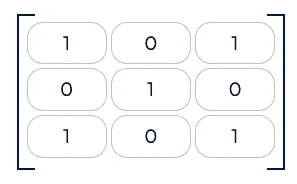

*fig 1 : Kernel / Filter used for Convolution layer*

Convolution Layer Code Snippet

> ***汇集层***

池层用于将输入数据的大小减少为更易于管理和使用的数据，而不会显著损失功能。此模型的池层接受 26x26 像素的图像作为输入，并使用平均池算法输出 13x13 像素的图像。

即使训练或预测模型的输入大小被减少到原始大小的一半，该模型也能很好地工作，因为在回旋层中使用了使用核的特征提取过程。因此，尽管全连接层的输入特征的数量从 784 减少到 169，但是模型的功能仍然依赖于显著特征，从而产生可靠的模型。

Pooling Layer Code Snippet

> ***数据可视化***

原始图像数据*(图 2.1)* 各层产生的输出如图*图 2.2 和图 2.3* 所示。

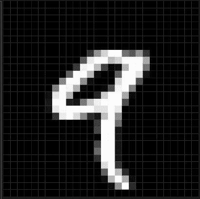

fig 2.1 : 28x28 Pixel Original Data from MNIST Dataset

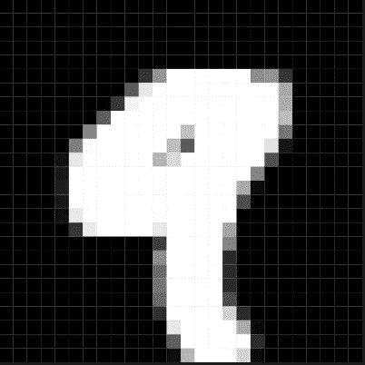

fig 2.2 : 26x26 Pixel Feature Map ( Result of Convolution Layer after Kernel )

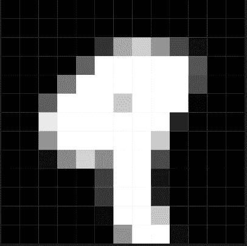

fig 2.3 : 13x13 Pixel Result of Pooling Layer

> ***全连接层***

全连接层接受 13x13 (169)个特征的输入[池层的输出]，具有两个隐藏层，每个隐藏层具有 4 个节点，并且由具有 10 个节点的输出层组成，10 个节点表示 10 个数字中的一个。此外，输出层使用多类逻辑回归算法 *(Softmax 回归激活函数)*，该算法提供了一种预测十个类的离散概率分布的方法。这意味着概率最大的节点是美联储数据最有可能的结果。

然而，两个内部隐藏层使用简单的非线性 sigmoid 函数来激活，因为这有助于模型精确地设计用于分类的非线性边界，同时还降低了对内部层采用多类激活的复杂度(这将类似于已经采用的多个 sigmoid 函数)。

**初始化**

全连接层模型包含一个 ***初始化*** 函数，该函数可用于定制隐藏层(隐藏层的数量和每个层的节点数量)。对于这个项目，这个函数被用来初始化两个隐藏层，每个层有 4 个节点。

此外，该层还便于使用***initialize parameter***函数为前一层中的每个节点随机生成数据，从而为当前层的每个节点分配权重和偏差。

Initialization of Layers and Parameters

**向前传球**

在向前传递期间，权重和偏差用于计算模型的预期结果。为此，输入层随机生成的权重和偏差用于计算第一个隐藏层中每个节点的输出(z)值。该输出通过 sigmoid 激活功能激活。对第一隐藏层重复类似的过程，产生第二隐藏层的激活输出。

但是，对于最终分类的输出图层，该过程略有修改。与之前类似，我们将权重和偏差应用于第二个隐藏层，并为输出层的每个节点找到 10 个类输出。然后，代替 Sigmoid 函数，我们使用多类 Softmax 回归激活函数来生成十个类的概率分布。这将为这些输出节点中的每一个分配成为实际结果的可能性，然后可以将其与目标输出进行比较，以找到模型的差异。

前向过程重复多次，每次都使用后向过程中获得的新调整的参数，以减少模型的差异。

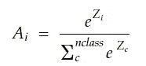

Softmax Regression Activation Function

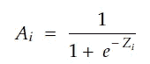

Sigmoid Activation Function

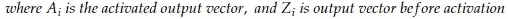

Forward Pass Code Snippet

**向后传球**

对于后向通道，目标是最小化损失函数。为此，计算损失函数相对于权重和偏差的导数。这将导致两个方向向量[一个用于权重，另一个用于偏差]，其中损失函数趋向于最小值。这个过程被称为梯度下降。

由于相关模型有多层计算，梯度下降过程以相反的顺序发生。首先，计算损失函数相对于激活输出的梯度。接着是损失函数相对于未激活输出的梯度，然后是损失函数相对于权重和偏差的梯度计算，如下所示。

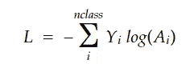

Loss Function for Softmax Regression Function

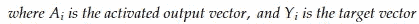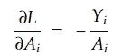

Derivative of the Loss Function w.r.t the Activated Outputs

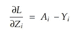

Derivative of the Loss Function w.r.t the Inactivated Outputs

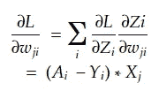

Derivative of the Loss Function w.r.t the weights

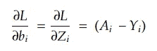

Derivative of the Loss Function w.r.t the weights

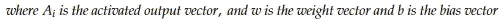

Backward Pass Model Code Snippet

**参数更新**

一旦获得了使损失最小化的权重和偏差的方向，这两个参数就通过在计算的方向上移动某个因子来更新，该因子称为学习率。

Parameter Update Code Snippet

*有了正向和反向模型，就可以导出一个完整的模型。完整的模型在所有训练数据上重复向前和向后传递一定数量的迭代，并调整权重和偏差以降低模型的总成本。*

*训练完成后，该模型将返回最终训练的参数，这些参数已被调整以预测 28×28 像素手写数字图像的结果。*

*Final Model Code Snippet*

> ****结论****

*该模型使用 60，000 个训练数据集来调整权重和偏差参数，并使用 10，000 个测试数据集来测试外部数据的准确性。*

*链接模型被训练 40，000 次迭代，大约 70 分钟，最终成本为 0.569387。在测试数据集上的结果准确率为 83.38%，在训练数据集上的结果准确率为 83.182%。*

*然而，在获得这一结果之前，使用 20，000 次迭代以相同的初始参数对模型进行了 38 分钟的训练，其结果是精度约为 78.31%(训练)和 78.38%(测试)，成本为 0.710538。*

***资源:***

1.  *[http://yann.lecun.com/exdb/mnist/](http://yann.lecun.com/exdb/mnist/)*
2.  *[https://www.ics.uci.edu/~pjsadows/notes.pdf](https://www.ics.uci.edu/~pjsadows/notes.pdf)*
3.  *[https://www . ka ggle . com/code/javaclll/mnist-handscription-class ification-using-custom-CNN/data](https://www.kaggle.com/code/javaclll/mnist-handwriting-classification-using-custom-cnn/data)*

* [## Mlearning.ai 提交建议

### 如何成为 Mlearning.ai 上的作家

medium.com](/mlearning-ai/mlearning-ai-submission-suggestions-b51e2b130bfb)*