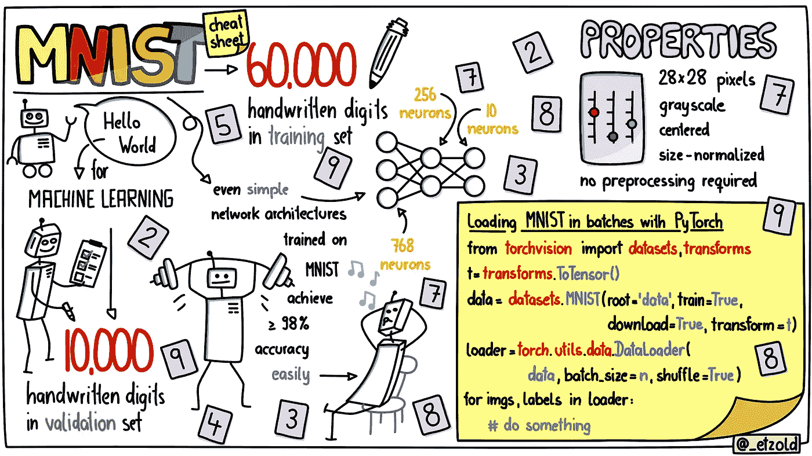

# MNIST——手写数字数据集

> 原文：<https://medium.com/mlearning-ai/mnist-dataset-of-handwritten-digits-f8cf28edafe?source=collection_archive---------0----------------------->

MNIST 是一个广泛使用的手写数字数据集，包含 60，000 个用于训练机器学习模型的手写数字和 10，000 个用于测试模型的手写数字。它于 1998 年推出，现已成为分类任务的标准基准。它也被称为“你好，世界”数据集，因为它非常容易使用。MNIST 来自一个更大的数据集，NIST 特殊数据库 19